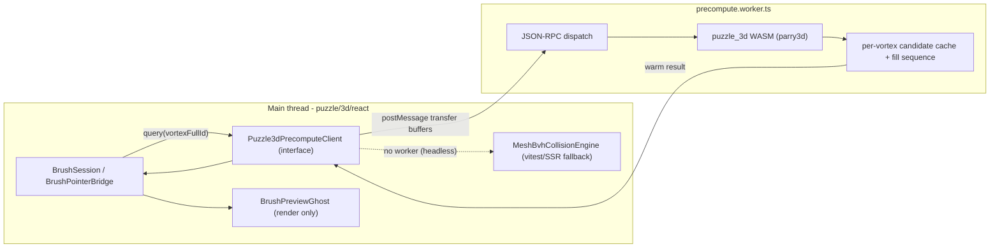

# Puzzle3d Precompute Worker

## Goal

Today brush/fill candidate enumeration + `three-mesh-bvh` Monte-Carlo solid overlap all run synchronously on the main thread in [puzzle/3d/react/index.tsx](puzzle/3d/react/index.tsx) and [infinite/world/r3f/index.tsx](infinite/world/r3f/index.tsx), blocking pointer events on every hover and stuttering during fill. We move this off-thread into a worker backed by a new Rust/WASM engine using `parry3d` for exact solid collision, and precompute results on idle so the UI reads from a warm cache.

## Architecture

## 1. New Rust crate `puzzle/3d/rs` (mirrors `puzzle/2d/rs`)

Create `puzzle/3d/rs/` with `Cargo.toml`, `lib.rs`, `script.ts`, `project.json`, `package.json`, modeled exactly on [puzzle/2d/rs/Cargo.toml](puzzle/2d/rs/Cargo.toml) and [puzzle/2d/rs/script.ts](puzzle/2d/rs/script.ts).

- `Cargo.toml`: `crate-type = ["rlib", "cdylib"]`, `wasm-pack` release profile; deps `parry3d`, `nalgebra`, `serde`/`serde_json`; wasm32 target deps `wasm-bindgen`, `serde-wasm-bindgen`, `js-sys`.
- `script.ts`: `runWasmPackWebBuild({ rsDir, skipEnvVar: "PUZZLE_3D_RS_SKIP_WASM_BUILD", wasmBaseName: "puzzle_3d", pkg: {...} })` (same shape as the 2d script). Emits `pkg/puzzle_3d.js` + `pkg/puzzle_3d_bg.wasm`.

`lib.rs` regions/exports (port logic 1:1, then replace sampling with parry):

- `#region Collision` - build `parry3d::shape::TriMesh` (with `TriMeshFlags::ORIENTED` for solid `contains_point`) per mesh from transferred position/index buffers, baking `GLB_MESH_FRAME_ROTATION_X`. Replaces `collisionBodyFromObject`/`bodiesIntersect`/`solidOverlapVolume` ([infinite/world/r3f/index.tsx](infinite/world/r3f/index.tsx) lines 199-365). Hard reject via `parry3d::query::intersection_test`; keep the volume budget (`DEFAULT_BRUSH_PLACEMENT_OVERLAP_BUDGET = 0.02`) using fast parry point-containment sampling in the AABB intersection.
- `#region Candidates` - port `brushCompatibleCandidates` + ranking + pose math (`computeBrushPlacementPose`, `antiParallelBrushOrientation`) from [puzzle/3d/react/index.tsx](puzzle/3d/react/index.tsx) (~3083-3273).
- `#region Fill` - port the greedy stepper `createBrushFillSequenceStepper` (~3987-4127).
- `#region Session` - `Puzzle3dPrecomputeSession` (wasm-bindgen): `set_scene(json)`, `register_mesh(url, positions, indices)`, `precompute_step(budget)` (returns whether more work remains), `brush_candidates(vortex_full_id) -> json`, `fill_sequence() -> json`. Host-specific brush filters (the Nakagin rules in [puzzle/3d/play/index.ts](puzzle/3d/play/index.ts) lines 264-289) are passed in as serialized rule data, not callbacks.

## 2. Worker `puzzle/3d/react/precompute.worker.ts`

New file mirroring `compose/client/lib/js/kit-store.worker.ts` and its transport. JSON-RPC over `postMessage` (ops: `init`, `setScene`, `registerMesh`, `query`, idle `tick`).

- Loads WASM via `initSync` (fetch `puzzle_3d_bg.wasm`).
- Drives an idle precompute loop (`setTimeout(0)` chunks like the current fill `PUZZLE_3D_FILL_BUILD_CHUNK_BUDGET = 8`) calling `precompute_step` until the cache is fully warm, yielding between chunks so queries are answered promptly.

## 3. Main-thread client + interface boundary (in `puzzle/3d/react/index.tsx`)

Add `//#region 🧵Precompute` with a `Puzzle3dCollisionEngine` interface (rule: external libs/workers behind an interface) and two impls:

- `WasmCollisionEngine` - talks to the worker; `createPuzzle3dPrecomputeWorker()` factory (mirrors `createKitStoreWorker` at [compose/client/lib/js/index.ts](compose/client/lib/js/index.ts) line 233) using `new Worker(new URL("./precompute.worker", import.meta.url), { type: "module" })`.
- `MeshBvhCollisionEngine` - wraps the existing `three-mesh-bvh` functions, used as fallback when no worker (vitest/SSR/headless), so current tests keep passing.

Wiring:

- Mesh transfer: reuse buffers already produced in `registerBrushCollisionGltfScene`; extract `position`+`index` typed arrays and `postMessage` them once per mesh URL as transferables.
- `BrushSession.enterTarget` (~7246-7614) and `BrushPointerBridge` (~7616-7735): query the warm cache first (instant), fall back to sync only on cache miss.
- `BrushPreviewGhost` (~7214-7243): stop running `brushPreviewCollides` in `useLayoutEffect`; consume the precomputed validity flag from the cache instead. Ghost becomes render-only.
- Fill: `preparePuzzle3dFillSession` in [puzzle/3d/play/index.ts](puzzle/3d/play/index.ts) (~420-478) requests `fill_sequence()` from the worker; the slider still slices the precomputed prefix via `applyPuzzle3dFillCount` (unchanged).

## 4. Build / launch / tooling wiring (zero-touch, cross-platform)

- `puzzle/3d/rs/project.json` + `package.json`: `wasm` target calling `bun ./script.ts wasm` (mirror `@semio-tech/puzzle-2d-rs`).
- Register the wasm build + worker debug entries in `launch.json` following the existing puzzle/2d ordering/grouping.
- Vite already bundles `new Worker(new URL(...))`; confirm `puzzle/3d/play/vite.config.ts` resolves the wasm asset (same approach as 2d).

## 5. Tests (extend existing, no new files)

Extend the inline vitest blocks in [puzzle/3d/react/index.tsx](puzzle/3d/react/index.tsx): parity tests asserting `WasmCollisionEngine` and `MeshBvhCollisionEngine` agree on intersect/overlap and candidate ordering for the Nakagin + Concrete-Forest fixtures; assert hover/fill read from the cache. Temporary logs use the `[DEBUG] ` prefix and live in the ticket folder.

## Constraints / notes

- Repo MCP is currently unreachable, so implementation must first `ticket_open` (and read `repo://goals` to associate a goal) before coding; all temp artifacts go in the ticket folder.
- Greenfield: no compatibility layer - the worker becomes the primary path, `three-mesh-bvh` remains only as the headless engine.
- `parry3d` only via the `Puzzle3dCollisionEngine` interface; no direct external-lib leakage into UI code.
