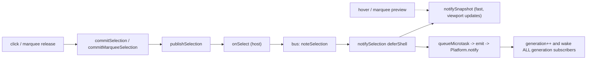

# Fix Puzzle 3D Selection Commit Freeze

## Why it freezes

Hover and live marquee-drag (preview) only touch viewport-local state, so they are fast. A click commit and a marquee release run the same path and both end in a shell generation bump:

- Commit path: [puzzle/3d/react/index.tsx](puzzle/3d/react/index.tsx) `publishSelection` / `commitSelection` (~~L7302-7325), `commitMarqueeSelection` (~~L7420-7438); host wiring [framework/product/playground/renderer/react/index.tsx](framework/product/playground/renderer/react/index.tsx) L1585 `onSelect -> noteSelection`.
- Shell bump: [puzzle/3d/play/index.ts](puzzle/3d/play/index.ts) `notifySelection` (L1038-1045) -> `emit()` -> [framework/core/index.ts](framework/core/index.ts) `Platform.notify()` (L1029-1035).
- `Platform.notify()` itself is cheap (`invalidateResolvedState` only nulls a cache, L910-912). The ~6s is the synchronous React re-render of `runtime.generation` subscribers that fire on the bump: the canvas window body [framework/product/playground/renderer/react/index.tsx](framework/product/playground/renderer/react/index.tsx) `ShellDeclarativeWindowBody` (L675-692), the side panels `DeclarativeSidePanelBody` / `PlaygroundDeclarativeTree` (L443-472, L788-809), and shell chrome.

The canvas scene is already memoized (`Inner.registryScene` does not depend on `selection`: [puzzle/3d/react/index.tsx](puzzle/3d/react/index.tsx) L8373-8472) and the document tree sections are cached by `fixtureRevision` ([puzzle/3d/play/index.ts](puzzle/3d/play/index.ts) `getDocumentPanelTree` L964-977). A prior fix already addressed the Tree rebuild, so the residual cost is a different subscriber in the same generation-bump render pass — most likely a WorldCanvas remount or a still-unmemoized panel/Tree-row pass.

## Step 1 - Confirm the offender (temporary [DEBUG])

Add `[DEBUG]` instrumentation, run the puzzle3d play harness, click one object, and read the console to localize the ~6s and whether the scene remounts:

- Pipeline timing (`performance.now()` spans): around `commitSelection`/`commitMarqueeSelection`, the bus `noteSelection` case ([puzzle/3d/play/index.ts](puzzle/3d/play/index.ts) L1628-1641), and inside `notifySelection` before/after `notifySnapshot` and the microtask `emit`.
- Render vs mount logs: `[DEBUG] render` in `ShellDeclarativeWindowBody`, `Puzzle3dPlayViewportHost`, `PlayCanvas`; `[DEBUG] MOUNT` in a `useEffect(() => {...}, [])` inside `Inner`/`PlayCanvas` to detect a WorldCanvas remount; a render counter in `PlaygroundDeclarativeTree` and the `Tree` row renderer.

This decides between Step 2a (remount) and Step 2b (heavy subscriber), and proves which one is the 6s before changing anything.

## Step 2 - Remove selection from the generation-bump path

Root fix (matches why hover/preview are fast): selection must not bump the shell `generation`. Make selection a snapshot-only update and have the two selection-dependent declarative panels re-render from a controller snapshot subscription instead of `runtime.generation`.

- [puzzle/3d/play/index.ts](puzzle/3d/play/index.ts): change `noteSelection` and `selectAllSelection` (and `setSelection`/`setSelectedId` if confirmed slow) to call `notifySnapshot()` only - drop the `emit()` / `deferShell` generation bump for selection-only changes.
- [framework/product/playground/renderer/react/index.tsx](framework/product/playground/renderer/react/index.tsx): in `DeclarativeSidePanelBody` / `PlaygroundDeclarativeTree`, additionally subscribe to the active puzzle3d controller's `subscribeSnapshot` (alongside `runtime.generation`) so `selectedIds` (document) and the inspector body refresh on selection without a generation bump. The document `sections` stay stable (cached), so only `selectedIds` changes -> only affected Tree rows re-render.

Step 2a (only if Step 1 shows a remount): keep the small generation bump but stabilize the canvas window subtree so a bump cannot remount `WorldCanvas` - memoize the bound host in `renderBoundComponent` ([framework/product/platform/renderer/react/index.tsx](framework/product/platform/renderer/react/index.tsx) L2671-2719) and/or wrap `Puzzle3dPlayViewportHost` in `reactHostPort.memo` keyed on `node.surfaceId`, since the host already self-subscribes to the snapshot.

## Step 3 - Validate and clean up

- Re-run with the Step 1 `[DEBUG]` timers: confirm a single object click and a marquee release each complete in well under ~50ms and that `Inner`/WorldCanvas does NOT remount on selection.
- Confirm the document panel highlights the picked row and the inspector updates (snapshot-driven, no generation bump).
- Remove all `[DEBUG]` logs. Extend existing inline tests in [puzzle/3d/play/index.ts](puzzle/3d/play/index.ts) (~L3000-3210) to assert selection-only commands do not bump `fixtureRevision`/generation and that `selectedIds` still reflects the pick; run the puzzle3d play + framework playground renderer suites via nx and confirm green.

## Process

Per repo rules: read `repo://goals`, then open (or reopen the existing puzzle3d selection-freeze) ticket before editing and close it with a summary + touched files when done. Use regions/subregions; start docstrings with an emoji; keep temporary files inside the ticket folder.

[{"id": "ticket", "content": "Read repo://goals and open/reopen the puzzle3d selection-freeze ticket"}, {"id": "instrument", "content": "Add temporary [DEBUG] pipeline timing + render/mount logs across commit -> noteSelection -> emit and the generation subscribers; run play harness, click an object, capture the ~6s span and any WorldCanvas remount"}, {"id": "fix-snapshot-only", "content": "Make noteSelection/selectAllSelection snapshot-only (no emit) and subscribe the document/inspector panels to the puzzle3d controller snapshot for selectedIds, removing selection from the generation-bump path"}, {"id": "fix-remount-guard", "content": "If Step 1 shows a remount: memoize the bound host / Puzzle3dPlayViewportHost so a generation bump cannot remount WorldCanvas"}, {"id": "verify-clean", "content": "Verify commit is instant and the scene does not remount via [DEBUG] timers, remove debug logs, extend existing tests, run nx suites green, close ticket"}]
