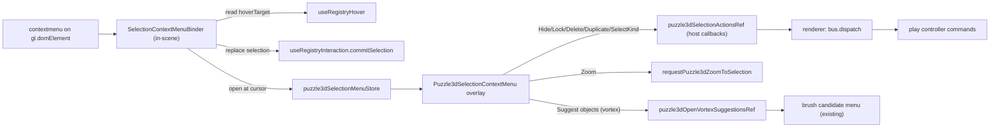

# Puzzle3d Selection Context Menu

## Goal

Right-clicking an entity in the puzzle3d viewport selects it (replace) and opens a context menu acting on the current selection. Reuse existing host operations (`toggleEntityFlag`, `applyDeleteSelection`, `requestPuzzle3dZoomToSelection`) and the brush candidate machinery for the vortex-only "Suggest objects".

## Data flow

## 1. Library: `puzzle/3d/react/index.tsx`

New region `🖱️SelectionContextMenu` placed next to the brush menu (`Puzzle3dBrushCandidateMenu`, ~L8753) and overlay (`<Puzzle3dBrushCandidateMenu />`, ~L8403):

- Import `ContextMenuItem`, `renderContextMenuItems` from `@semio-tech/ui-react` (already importing `glassMenuClass`, `cn`, `SelectionMarquee` from there).
- `puzzle3dSelectionMenuStore`: external store `{ open: boolean; anchor: ScreenPoint | null; target: HoverTarget | null }` (mirror `createBrushUiStore`/`puzzle3dBrushUiStore` at ~L7423).
- `puzzle3dSelectionActionsRef`: module ref holding host callbacks `{ toggleHidden(value); toggleLocked(value); delete(); duplicate(); selectSameKind() }`, published by `PlayCanvas` (same pattern as `puzzle3dBrushMenuSourceRef`).
- `buildPuzzle3dSelectionMenuItems(selection, flags, target)`: pure builder returning `ContextMenuItem[]`:
  - Always (selection non-empty): Hide/Show (`eye`/`eye-off`), Lock/Unlock (`lock`/`lock-open`), separator, Zoom to selection (`crosshair`), separator, Delete (`trash`, `destructive: true`). Label derives from flags: `Hide` when any selected entity is not hidden, else `Show` (same for lock).
  - When selection contains objects: Duplicate (`copy`), Select all of same kind (`layers`).
  - When `target.kind === "vortex"` and selection is a single vortex: prepend `Suggest objects` (`sparkles`).
- `Puzzle3dSelectionContextMenu`: overlay component subscribing to `puzzle3dSelectionMenuStore`; reads live selection via `useLiveSelection` and per-entity hidden/locked from the object store records; renders Radix dropdown via `renderContextMenuItems` inside a `createPortal` fixed at `anchor` (reuse `brushMenuContentClassName`/`glassMenuClass`). Closes on outside pointerdown / Escape (copy effect from `Puzzle3dBrushCandidateMenu`, ~L8759).
- `SelectionContextMenuBinder` (in-scene component mounted in `PlayCanvas` scene children, ~L10282, alongside `PlayTestBridge`): listens `contextmenu` on `gl.domElement`; if a right-drag is active (`puzzle3dRightDragActiveRef`, ~L6528) or no `hoverTarget`, do nothing; else `event.preventDefault()`, `commitSelection(pickFromHoverTarget)` (default mode = replace), then open `puzzle3dSelectionMenuStore` at `{x: clientX, y: clientY}` with the target.
- Add to overlay JSX (~L8403): `<Puzzle3dSelectionContextMenu />`.
- "Suggest objects": add `puzzle3dOpenVortexSuggestionsRef` installed by the brush vortex-pick host (`VortexScreenPick` region ~L8420 / `openMenu` at ~L8476). Expose `openFor(fullId, meta, anchor)` doing `enterTarget` + `openMenu` regardless of `brushActive`, so the candidate list (compatible + collision-free) opens at the click point exactly like brush-click.
- New optional props on `PlayCanvasProps` (~L10236) and threaded `CanvasProps`/`Inner`: `onToggleSelectionHidden?(value)`, `onToggleSelectionLocked?(value)`, `onDeleteSelection?()`, `onDuplicateSelection?()`, `onSelectSameKind?()`; `PlayCanvas` publishes them into `puzzle3dSelectionActionsRef`.
- Extend the in-file vitest block (bottom of file, ~L12632) with `buildPuzzle3dSelectionMenuItems` cases (object vs vortex target, all-hidden vs mixed → Hide/Show label, destructive Delete present).

## 2. Renderer: `framework/product/playground/renderer/react/index.tsx`

At the `<PlayCanvas>` callbacks (~L2092, `Puzzle3dPlayViewportHost`) add:

- `onToggleSelectionHidden={(v) => bus.dispatch(PUZZLE_3D_PLAY_CONTROLLER_ID, "setSelectionFlag", { flag: "hidden", value: v })}`
- `onToggleSelectionLocked={(v) => bus.dispatch(..., "setSelectionFlag", { flag: "locked", value: v })}`
- `onDeleteSelection={() => bus.dispatch(..., "deleteSelection")}` (existing handler, L2490)
- `onDuplicateSelection={() => bus.dispatch(..., "duplicateSelection")}`
- `onSelectSameKind={() => bus.dispatch(..., "selectSameKind")}`

## 3. Play controller: `puzzle/3d/play/index.ts`

Add cases to the `run()` switch (near `deleteSelection`, L2490) and reuse existing fixture helpers:

- `setSelectionFlag`: iterate `this.selection` objects/vortices/attractions, set `{ [flag]: value }` uniformly via `updatePuzzle3dObjectInFixture` / `updatePuzzle3dVortexInFixture` / `updatePuzzle3dAttractionInFixture` in one `patchFixture`, then `notifySelection`. (Generalizes existing per-target `toggleEntityFlag`, L1661.)
- `duplicateSelection` (objects only): clone selected object rows with fresh ids and a small `origin` offset, append via `patchFixture`, set selection to the new ids.
- `selectSameKind` (objects only): from primary selected object's `objectKind`, select all objects with the same kind (respect `selectableKinds`/`visibleKinds`, reuse `filterSelectionByPlaygroundKinds`).
- Extend the play vitest block with `setSelectionFlag` (sets flag across a multi-kind selection), `duplicateSelection`, and `selectSameKind` assertions.

## Conventions

- Add all code into existing files using `#region`/subregions; no new files (per repo rules).
- Start each new docstring with a unique emoji; no comments inside definitions.
- Add `[DEBUG]` logs for the new controller commands and the suggest-open path to confirm runtime behavior, then verify by building the play harness (`vite build`).

## Verification

- Build `puzzle/3d/play` and `framework` renderer; run the puzzle3d/play vitest blocks for the new pure functions/commands.
- Runtime: right-click object → Hide/Lock/Delete/Duplicate/Select-same-kind/Zoom work; right-click vortex → "Suggest objects" opens the same compatible non-colliding candidate list as a brush-click; confirm via `[DEBUG]` logs.

