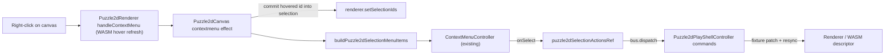

# Puzzle 2D Context Menu Parity with Puzzle 3D

## Reference (puzzle3d)

- Viewport menu: region `🖱️SelectionContextMenu` in [puzzle/3d/react/index.tsx](puzzle/3d/react/index.tsx) (lines ~7746–7938) — store + `puzzle3dSelectionActionsRef` + `buildPuzzle3dSelectionMenuItems` (Hide/Show, Lock/Unlock, Duplicate, Select all of same kind, Zoom to selection, Delete) rendered via `ContextMenuController`, with right-click committing selection first (`SelectionContextMenuBinder`, ~9725).
- Document menu: `puzzle3dPlayDocumentEntityChrome` in [puzzle/3d/play/index.ts](puzzle/3d/play/index.ts) (~1142–1195) — per-row `contextMenu` + inline `actions` (Show/Hide, Lock/Unlock) wired to `toggleEntityFlag`.
- Action wiring: playground renderer dispatches `setSelectionFlag` / `deleteSelection` / `duplicateSelection` / `selectSameKind` to the play controller.

Puzzle2d already has the generic plumbing: canvas `contextmenu` → `surfaceContextMenu` state → `ContextMenuController` in `Puzzle2dCanvas` ([puzzle/2d/react/index.tsx](puzzle/2d/react/index.tsx) ~12955, ~13280). What's missing: selection commit on right-click, the selection menu items, `hidden`/`locked` entity flags, play controller actions, and document row chrome. The "Suggest objects" vortex item has no 2d equivalent and is skipped.

## Data flow

## 1. Hidden/locked flags on fixture and scene ([puzzle/2d/react/index.tsx](puzzle/2d/react/index.tsx))

- Add `hidden?: boolean` and `locked?: boolean` to `Puzzle2dFixtureNode` (circle + rectangle), `Puzzle2dFixtureHandle`, `Puzzle2dFixtureEdge` (~850–936) and parse them in `parsePuzzle2dFixture`.
- Add `locked: boolean` to `Puzzle2dSceneObject` / `Puzzle2dSceneObjectOptions` (alongside existing `visible`) and to declarative marker props (`Puzzle2dNode*Props`, `Puzzle2dHandleProps`, `Puzzle2dEdgeProps`); propagate through descriptor build and host prop-apply regions.
- `hidden` maps to existing `visible: false` descriptor support (WASM already normalizes `hidden` → `visible`); `locked` is a new descriptor field.
- Locked rendering: dim locked entities via the paint/chrome path (analog of 3d's `WORLD_LOCKED_OPACITY_SCALE`), e.g. in `puzzle2dElementInteractionChrome` / theme palette serialization.

## 2. Locked hit-test exclusion in WASM (root fix)

Puzzle2d picking lives in Rust, so locked must be enforced there (the 2d analog of 3d's `worldEntitySelectable`):

- Add `locked` to descriptor JSON structs (`NodeDescJson`, `HandleDescJson`, `EdgeDescJson`, `WireDescJson`) in [mathematical/graph](mathematical/graph/lib.rs) / [mathematical/graph/port/lib.rs](mathematical/graph/port/lib.rs), symmetric to `visible`.
- Skip locked entities in hover hit-test, click select, marquee/lasso preselect, and drag-start in the engine ([mathematical/graph/port/directed/normal/lib.rs](mathematical/graph/port/directed/normal/lib.rs) `sync_descriptor` consumer, plus dag layer if it routes picking).
- Pass-through in [puzzle/2d/rs/lib.rs](puzzle/2d/rs/lib.rs) descriptor normalization; extend existing Rust test region (mirroring the `hidden` blocking tests at ~2131).

## 3. Selection context menu region ([puzzle/2d/react/index.tsx](puzzle/2d/react/index.tsx))

New region `🖱️SelectionContextMenu` mirroring 3d:

- `Puzzle2dSelectionEntityFlags { hidden, locked }`, `puzzle2dSelectionEntityFlagsFromScene(scene, ids)`.
- `Puzzle2dSelectionMenuActions { toggleHidden, toggleLocked, deleteSelection, duplicateSelection, selectSameKind }` + `puzzle2dSelectionActionsRef` (no-operation defaults).
- `buildPuzzle2dSelectionMenuItems(ids, entityFlags, hoveredKind, actions): ContextMenuItem[]` with the same items/order/icons/conditions as 3d (no "Suggest objects"): Hide/Show (`anyNotHidden` semantics), Lock/Unlock, Duplicate (nodes only), Select all of same kind, Zoom to selection, separator, destructive Delete.
- Zoom to selection: compute world bounds of selected scene objects and call `renderer.setCamera(x, y, zoom)` (~5422) to fit with padding.

## 4. Canvas wiring ([puzzle/2d/react/index.tsx](puzzle/2d/react/index.tsx) `Puzzle2dCanvas`)

Extend the existing `contextmenu` effect (~12955):

- When `payload.id` is set: if the id is not already selected, commit `renderer.setSelectionIds([payload.id])` (matching 3d's commit-on-right-click); resolve effective selection ids; skip locked-only behavior consistent with hit-test (locked ids won't be hovered after step 2).
- Build items: declarative per-target `contextMenu` items first (existing behavior preserved), separator, then selection menu items from `buildPuzzle2dSelectionMenuItems` using `puzzle2dSelectionActionsRef.current`.
- Background right-click keeps the existing `contextMenu` prop behavior. Reuses the existing `ContextMenuController` at ~13280 — no new overlay needed.

## 5. Play controller actions ([puzzle/2d/play/index.ts](puzzle/2d/play/index.ts))

New commands on `Puzzle2dPlayShellController` (region `🔖️Controller`, ~742):

- `setSelectionFlag { flag: "hidden" | "locked", value }` — set flag on all selected nodes/handles/edges in the fixture, then resync (mirrors 3d `applySelectionFlag`).
- `deleteSelection` — reuse the existing structural-delete pipeline (~1590–1656).
- `duplicateSelection` — clone selected nodes (+ handles, fresh ids, position offset); select the clones.
- `selectSameKind` — expand selection to all entities sharing the kind ids (`nodeKind`/`handleKind`/`edgeKind`) of the current selection.
- `toggleEntityFlag(graphId, flag)` — per-row toggle for the document menu (mirrors 3d `toggleEntityFlag`).

## 6. Document tree menu ([puzzle/2d/play/index.ts](puzzle/2d/play/index.ts))

- Add `puzzle2dPlayDocumentEntityChrome(flags, graphId, options)` returning `{ isHidden, actions, contextMenu }` (Show/Hide with `eye`/`eye-off`, Lock/Unlock with `lock-open`/`lock`), mirroring 3d ~1142–1195.
- Extend `buildPuzzle2dPlayDocumentSections` options (~324–635) with `onToggleHidden` / `onToggleLocked` and spread the chrome onto node, handle, and edge rows.

## 7. Playground renderer wiring ([framework/product/playground/renderer/react/index.tsx](framework/product/playground/renderer/react/index.tsx))

- For 2d panes: populate `puzzle2dSelectionActionsRef` (or equivalent `Puzzle2dCanvas` props, matching how 3d's `PlayCanvas` does it at ~2273–2277) with `bus.dispatch(PUZZLE_2D_PLAY_CONTROLLER_ID, ...)` calls for the five actions.
- Document panel (~3340–3383): pass `onToggleHidden` / `onToggleLocked` dispatching `toggleEntityFlag`.

## 8. Tests

- Extend existing vitest regions only (no new test files): `buildPuzzle2dSelectionMenuItems` label/condition cases in [puzzle/2d/react/index.tsx](puzzle/2d/react/index.tsx) (mirroring 3d tests at ~13866–13914), controller command tests in [puzzle/2d/play/index.ts](puzzle/2d/play/index.ts), document chrome tests, and Rust locked hit-test tests in the engine crate + [puzzle/2d/rs/lib.rs](puzzle/2d/rs/lib.rs).
- Run via nx: puzzle/2d react + play vitest, cargo tests for the touched crates.

## Process

- Read `repo://goals`, then open a ticket via repo MCP (`ticket_open`) before edits; close it with a summary when done. All temporary artifacts go in the ticket folder.
