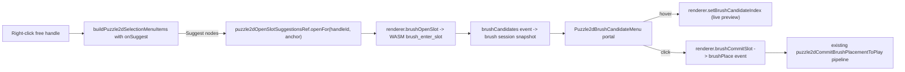

# Puzzle 2D Suggest Nodes Context Menu Parity

## Concept mapping

3D vortex suggestions == 2D free-handle (slot) suggestions. The 2D brush engine already computes compatible node kinds per handle, weighted-orders them, previews, and commits via `brushPlace` — same logic as 3D's BrushSession. Missing pieces: programmatic (non-tool-gated) slot entry, an anchored candidate menu UI, and the context-menu item + ref API.

## 1. WASM engine ([mathematical/graph/port/directed/normal/lib.rs](mathematical/graph/port/directed/normal/lib.rs))

Region with existing brush code (~1840–2390): add three public methods so suggestions work while the select tool is active (preview painting already works tool-independently, line ~4666):

- `brush_open_slot(handle_id)` — wraps private `brush_enter_slot` (validates handle exists)
- `brush_commit_slot()` — `brush_commit_preview()` + `brush_clear_slot()`
- `brush_cancel_slot()` — `brush_clear_slot()`

## 2. WASM exports ([puzzle/2d/rs/lib.rs](puzzle/2d/rs/lib.rs))

Next to existing `brushCycleCandidate` / `brushSetCandidateIndex` exports (~424–432): add `brushOpenSlot`, `brushCommitSlot`, `brushCancelSlot`. Extend the host test region with a suggestions test: open slot in select tool emits `brushCandidates` + `brushPreview`; commit emits `brushPlace`; cancel emits none.

## 3. React renderer + menu ([puzzle/2d/react/index.tsx](puzzle/2d/react/index.tsx))

- `Puzzle2dRenderer` methods `brushOpenSlot(handleId)`, `brushCommitSlot()`, `brushCancelSlot()` (next to `setBrushCandidateIndex`, ~5020).
- In region `🖱️SelectionContextMenu`, mirror the 3D API:
  - `puzzle2dOpenSlotSuggestionsRef: { openFor(handleId, anchor), close }` with no-op defaults (analog of `puzzle3dOpenVortexSuggestionsRef`).
  - Brush menu store `{ menuOpen, menuAnchor, menuHoverIndex }` (analog of `puzzle3dBrushUiStore` subset).
  - `Puzzle2dBrushCandidateMenu` portal component mirroring `Puzzle3dBrushCandidateMenu` (3D ~9763–9832): candidates from `puzzle2dGetBrushSessionSnapshot()` (already mirrors WASM `brushCandidates`), hover row → `setBrushCandidateIndex`, click → commit + close, Escape/outside-pointer → cancel + close, empty state text. Same `glassMenuClass`/`cn` styling from `@semio-tech/ui-react`, `createPortal` as in 3D.
- `buildPuzzle2dSelectionMenuItems(...)`: add optional `onSuggest?: () => void` final param; when provided, prepend `{ id: "suggest", label: "Suggest nodes", icon: "sparkles" }` + separator (icon already registered in `ui/asset`). Mirrors 3D builder signature.
- Canvas `contextmenu` effect (~13175): compute eligibility — `payload.id` is a single selected handle object with no scene edge/wire anchored to it (free slot, matching the engine's slot rule at engine line ~1602). Pass `onSuggest` that closes the surface menu and calls `puzzle2dOpenSlotSuggestionsRef.current.openFor(id, { x: clientX, y: clientY })`.
- In `Puzzle2dCanvas`, an effect publishes the ref implementation for the active renderer: `openFor` → `renderer.brushOpenSlot(handleId)` + open menu store at anchor; `close` → `renderer.brushCancelSlot()` + close store. Render `Puzzle2dBrushCandidateMenu` next to the existing `ContextMenuController` (~13514).

## 4. Placement commit path (no playground changes needed)

`brushCommitSlot` emits `brushPlace`, which flows through the existing renderer `onBrushPlace` → `puzzle2dSetBrushPlaceCommitHandler` → `puzzle2dCommitBrushPlacementToPlay` pipeline already registered by the playground play shell ([framework/product/playground/renderer/react/index.tsx](framework/product/playground/renderer/react/index.tsx) ~5049–5064) — handler is not tool-gated.

## 5. Tests

- Vitest in existing `buildPuzzle2dSelectionMenuItems` describe (~14754): suggest item prepended when `onSuggest` is provided; absent otherwise (mirror 3D test "prepends Suggest objects for a single vortex" at 3d ~13900).
- Rust host test in [puzzle/2d/rs/lib.rs](puzzle/2d/rs/lib.rs) test region per step 2.
- Run `cargo test -p puzzle_2d` and the targeted vitest filters.

## Process

Reopen ticket `26/06/11/PUZZLE-2D-CONTEXT-MENU` via repo MCP `ticket_reopen` (fall back to editing the ticket file if MCP is unavailable, as before), close with updated summary when done.