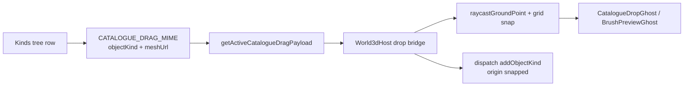

# Puzzle 3D Catalogue Drag-and-Drop Restore

## Diagnosis

Drag **sources** already work. Drop **targets** do not.


| Layer                                                                                  | Status                                                                                    |
| -------------------------------------------------------------------------------------- | ----------------------------------------------------------------------------------------- |
| Catalogue rows (`draggable` + `application/x-semio-catalogue-item`)                    | Wired in `[puzzle/plugin/rs/lib.rs](puzzle/plugin/rs/lib.rs)` `puzzle3d_object_kind_item` |
| `catalogueTreeDragController` + `getActiveCatalogueDragPayload` + `pointerPaletteDrag` | Wired in `[ui/js/react/index.tsx](ui/js/react/index.tsx)`                                 |
| `World3dHost` `onDragOver` / `onDrop` / pointer bridge                                 | **Missing**                                                                               |
| Live ghost preview during drag                                                         | **Missing** (brush ghost exists, unused for catalogue)                                    |
| Commit at cursor                                                                       | **Missing** (`addObjectKind` already accepts `origin`, but nothing passes it from a drop) |


Premigration (`git tag premigration`) had a full pipeline in `puzzle/3d/react` (`FixtureDropPointerBridge` + `FixtureDropPreview` + `resolvePuzzle3dFixtureDrop`). That code was not ported onto declarative `World3dHost`. Selection/tools overhaul did not remove this — it was never migrated.

Do **not** resurrect `application/x-puzzle-3d-fixture`. Stay on the post-migration catalogue MIME (same as Puzzle 2D).




## Ticket / goal

- Goal: **Running Sketchpad** (`🎯r2602🎯runningsketchpad`)
- Open a **new** ticket (selection overhaul ticket is a different task)
- Scope: **Puzzle 3D only** (5D uses `addPartKind` / `partKind` — out of scope unless asked)
- Temporary notes/logs only under the ticket folder

## Approach (clean, CAD/2D-aligned)

Mirror Puzzle 2D’s host-side drop pattern (`[puzzle-2d-board-host.tsx](framework/renderer/react/components/puzzle-2d-board-host.tsx)`), adapted for R3F:

1. **Host owns preview + raycast** (no plugin round-trip per `dragover` frame — matches premigration R3F ghost).
2. **Plugin owns commit** via existing `addObjectKind` with `origin`.
3. **Dual transport**: HTML5 DnD **and** window `pointermove`/`pointerup` while `getActiveCatalogueDragPayload()` is set (needed because `pointerPaletteDrag` does not fire native `dragover`).

### 1. Enrich drag payload (plugin)

In `[puzzle/plugin/rs/lib.rs](puzzle/plugin/rs/lib.rs)` `puzzle3d_object_kind_item`:

```json
{ "objectKind": "<id>", "meshUrl": "<url>" }
```

Keep click action as `addObjectKind` without origin (origin still defaults to `[0,0,0]`).

### 2. World3dHost catalogue drop bridge

In `[framework/renderer/react/components/world-3d-host.tsx](framework/renderer/react/components/world-3d-host.tsx)`:

- Export `parsePuzzle3dCatalogueDragPayload` (objectKind required, meshUrl optional).
- Local preview state: `{ objectKind, meshUrl?, origin }` or `null`.
- Placement: reuse existing `raycastGroundPoint`; when `lod.gridSnapEnabled`, snap with `lod.gridFactor` / `interaction.gridFactor` (same as voxel plane).
- **HTML5**: `onDragOver` / `onDragLeave` / `onDrop` on the host root (accept when MIME present or active payload parses).
- **Pointer palette**: `useEffect` window listeners while `getActiveCatalogueDragPayload()` is non-null — update preview when pointer is over host, clear when not; on `pointerup` over host commit then clear.
- **Commit**: `dispatch("addObjectKind", { objectKind, origin })`.
- **Ghost**: render via existing `BrushPreviewGhost` shape, but load `meshUrl` directly through `GlbInstanceMesh` when the URL is not yet in `meshes` (catalogue kinds often are not in the scene yet). Box fallback if no URL.
- Optional: `data-puzzle3d-fixture-drag-active` / host ring when preview active (premigration affordance).

Do **not** route catalogue preview through `engagementPreviewJson` / program `brushPreviewJson` (those are for brush/engagement tools).

### 3. Controllers / snap / selection

- Grid snap follows live LOD/settings (`gridSnapEnabled` + `gridFactor`) so preview and commit agree.
- After drop, existing `addObjectKind` already selects the new object — keep that.
- Ignore catalogue drops when scene is non-interactive; do not steal events from brush/fill vortex paint (only treat as catalogue drop when an active catalogue payload / MIME is present).

### 4. Tests

Extend existing files only:

- `[framework/renderer/react/index.test.ts](framework/renderer/react/index.test.ts)`: payload parse, snap helper, drop-args shape (`addObjectKind` + origin).
- `[puzzle/plugin/rs/lib.rs](puzzle/plugin/rs/lib.rs)` d3 tests: kinds tree drag_data includes `objectKind` + `meshUrl`; `addObjectKind` with `origin` places at that point.

### 5. Verification

- Run the extended TS + Rust tests.
- Manual: drag object kind from catalogue onto viewport → ghost follows cursor, snaps with grid, drop places object and selects it; pointer-palette path (panel dim) also commits; click-without-drag still adds at origin.

## Primary files

- `[framework/renderer/react/components/world-3d-host.tsx](framework/renderer/react/components/world-3d-host.tsx)` — drop bridge, preview ghost, raycast/snap
- `[puzzle/plugin/rs/lib.rs](puzzle/plugin/rs/lib.rs)` — enrich `drag_data`, tests
- `[framework/renderer/react/index.test.ts](framework/renderer/react/index.test.ts)` — host unit tests
- Ticket folder under `.repo/🎫/…` for notes

## Explicit non-goals

- Puzzle 5D catalogue drop
- Restoring premigration fixture MIME / `puzzle/3d/react` host
- CAD/process/procedural catalogue DnD
- Selection/tools overhaul work (separate open ticket)

