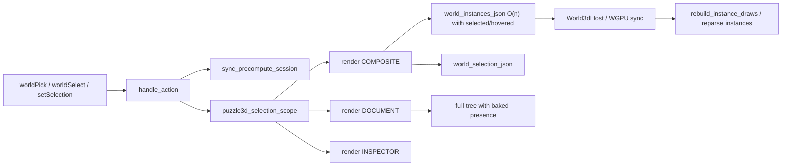
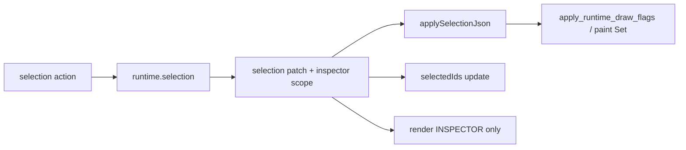

# Fix Puzzle 3D Post-Selection Lag

## Diagnosis

After click/marquee **commit**, selection is already correct in `Puzzle3dRuntime`, but the UI path still does heavy synchronous work:

Prior React-era fix (`2026/06/02/PUZZLE-3D-SELECTION-FREEZE`) is gone with the WASM plugin migration. Current partial scope still re-renders **composite + document + inspector**, and instances bake selection flags so geometry identity always changes.

Hot paths in puzzle 3D UI `lib.rs`:

- `world_instances_json` — bakes `selected` / `hovered` into every instance
- `puzzle3d_selection_scope` — composite + document + inspector
- `build_document_tree` — hand-built tree, per-item `UiPresence::selected`, `selection_change: None`
- `sync_precompute_session` on every action including pure picks

Hot paths in hosts:

- Infinite world `sync_world3d_state` — any `selection_json` / `instances_json` change triggers `rebuild_instance_draws`
- React `World3dHost` — re-parses `instancesJson` when the composite body returns a new scene

R3F already overrides paint from `selection.ids`; WGPU already has `apply_runtime_draw_flags`. Baking flags into instances is redundant and forces the slow path.

## Target architecture

Selection is **runtime chrome**, not geometry and not structural UI:

| Layer                | Geometry / structure                         | Selection chrome                                     |
| -------------------- | -------------------------------------------- | ---------------------------------------------------- |
| Plugin world payload | Stable `instancesJson` (no selected/hovered) | `selectionJson` only                                 |
| WGPU / R3F           | Mesh draws / instance records                | Flag apply / Set lookup                              |
| Document tree        | Cached sections by fixture revision          | Tree `selectedIds` (React) / stamped presence (wgpu) |
| Inspector            | —                                            | Re-render (content depends on selection)             |

## Implementation

### 1. Ticket / process

Repo MCP auth was skipped during planning. On execute: authenticate, read `repo://goals`, **reopen** `2026/06/02/PUZZLE-3D-SELECTION-FREEZE` (same root cause under WASM) or open a successor bound to `puzzle3dplay` / Running Sketchpad. Put `[DEBUG]` timing logs and notes in the ticket folder only.

### 2. Plugin: stop baking selection into geometry

In puzzle 3D UI Rust `lib.rs`:

- Remove `selected` / `hovered` from `world_instances_json` (and any vortex/target-volume geometry blobs that only exist to paint selection if the host already reads `selectionJson`).
- Cache geometry strings (`instancesJson`, meshes catalog) on `Puzzle3dPlayApp` keyed by fixture identity/revision; selection renders reuse the same string identity.
- Keep `world_selection_json` as the single selection/hover/gumball/target channel.

### 3. Framework hosts: selection-only world sync

**WGPU** infinite `world/lib.rs`:

- Split `sync_world3d_state`: if only `selection_json` changed (camera/meshes/instances unchanged) → parse selection + `apply_runtime_draw_flags`; **do not** call `rebuild_instance_draws`.
- Keep full rebuild for geometry/camera/mesh catalog changes.

**React `World3dHost`** (OS renderer `index.tsx`):

- Add an imperative apply path analogous to Board2d `setSelectionIdsJsonSilent`: update local selection without requiring a new `instancesJson` parse.
- Keep deriving instance paint from `selection.ids` / `hoveredId` (already done).

### 4. Framework: selection-patch refresh contract

Extend the existing dirty-scope / host-effect mechanism (prefer extending `UiDirtyScope` / `ActionEmit` rather than a one-off):

- Selection actions may emit a **selection patch** (selection JSON + document selected id list) plus a scope that **omits** the composite window body when geometry is unchanged.
- Host `refreshUi` / `applyHostEffects`:
  - applies patch to all `World3dHost` surfaces for that controller
  - updates document tree `selectedIds` without re-fetching the panel body
  - still requests **inspector** body render (field values require plugin)

Puzzle3d then uses:

- selection scope → inspector (+ selection patch), **not** full composite re-render
- Hover stays on `puzzle3d_viewport_scope` / coalesced dispatcher (already correct)

Do **not** route puzzle picking through `ViewState.selectionJson` (tutorials/presence only).

### 5. Document tree: stable structure + selectedIds

Align with framework Tree + prior freeze fix, under the current WASM schema:

- Cache **structural** document sections by fixture revision (no selection in items).
- Drive highlight via tree-level `**selectedIds**` on the wire for the React host (`uiTreeNodeToTreePanelConfig` already passes them). Reintroduce optional `selected_ids` / `highlighted_ids` on Rust `UiTreeNode` (TS already has them); wgpu continues to stamp presence at paint via `ui_tree_stamp_presence` / builder when needed.
- Switch puzzle3d document build to `PanelTreeBuilder` (same as puzzle2d): `.selected(...)`, `.selection_change(setSelection)`, drop hand-baked per-item presence rebuilds.
- React TreeData memoization must key on **sections identity**, not on selection (verify DeclarativeTreePanel does not rebuild rows when only `selectedIds` change).

### 6. Skip non-selection work on pure picks

In `handle_action`, for `worldPick` / `worldSelect` / `setSelection` / `selectAll` / `clearSelection` (and equivalents that only mutate `runtime.selection`):

- Skip `sync_precompute_session` (mirror fill-tick exclusions).
- Do not touch fixture, fill plan, or suggestion state.

### 7. Instrumentation and verification

Temporary `[DEBUG]` `performance.now()` spans (ticket folder notes):

- action handle → selection patch apply → inspector render → React commit
- Confirm `instancesJson` identity stable across picks
- Confirm WGPU does not call `rebuild_instance_draws` on selection-only
- Confirm document `sections` identity stable; only `selectedIds` / inspector change

Manual: single-object click and marquee release on a large scene should feel immediate for viewport + document highlight; inspector may take a short O(selection) refresh only.

Extend **existing** puzzle3d UI tests in the same `lib.rs` (and existing renderer tests) for: stable instances JSON across selection, selection scope omitting composite when patching, document sections identity + `selectedIds`, precompute not synced on `worldPick`. Run via nx; do not claim green without running.

### 8. Out of scope

- Marquee **drag** hit-test perf (separate; preview already exists)
- Fill / suggestion / precompute freezes (other tickets)
- Mixing other technologies (compose, mit-bestand)

## Primary files

- `✏️s/🔌️plugin/🧩️puzzle/🎛️app/🧊️3d/🔨️module/🖱️ui/⚡️implementation/🦀️rust/📦️lib.rs` — scopes, instances JSON, document tree, action guards
- `🧰️framework/🛍️product/💻️os/🔨️module/♾️infinite/⚡️implementation/🦀️rust/🌍️world/📦️lib.rs` — selection-only sync
- `🧰️framework/🛍️product/💻️os/🔨️module/📺️renderer/🧑️‍🎨️engine/⚛️react/⚡️implementation/🟦️typescript/📦️index.tsx` — World3dHost selection apply + Tree selectedIds memo
- `�️framework/🔨️module/🖱️ui/✊️wgpu/.../📦️lib.rs` — optional `selected_ids` on `UiTreeNode`
- Framework plugin / kernel — `UiDirtyScope` / `ActionEmit` selection patch + host apply

