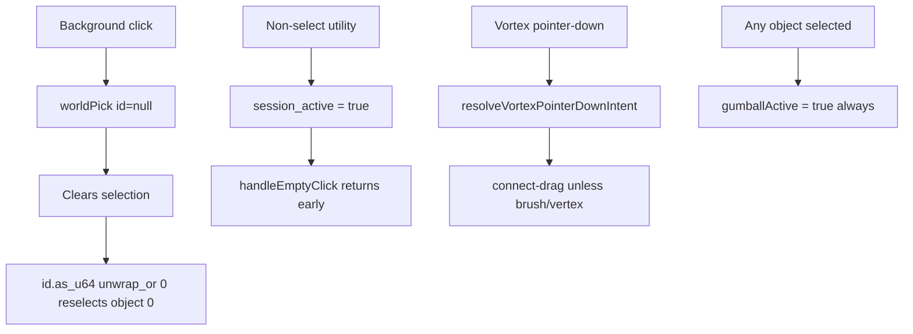

# Puzzle 3D Selection and Tools Overhaul

## Goal / ticket

- Associate with **Running Sketchpad** (`🎯r2602🎯runningsketchpad`).
- Open a **new** ticket (existing `CANONICAL-PLAYGROUND-EXAMPLE-CLEANUP` is unrelated).
- Scope: **Puzzle 3D**, with the **same selection/tool fixes applied to Puzzle 5D** in the same plugin file (identical defects; same technology).

## Root causes (validated)




1. **Background deselect broken** in `[puzzle/plugin/rs/lib.rs](puzzle/plugin/rs/lib.rs)` `worldPick`: clears, then `unwrap_or(0)` re-selects the first object. CAD early-returns after clear (`[cad/plugin/rs/lib.rs](cad/plugin/rs/lib.rs)` ~4722).
2. **Engagement blocks empty clicks**: `session_active: Some(active_utility != "select")` ([~4690](puzzle/plugin/rs/lib.rs)) makes transform/brush/fill mark the session active; `[handleEmptyClick](framework/renderer/react/components/world-3d-host.tsx)` skips `worldPick` when `engagementSessionActive`. Removing the select tool without fixing this would make background deselect worse (default would be `move`).
3. **Vortex click rarely selects**: host always starts connect-drag unless brush / `selectionMode === "vertex"`; Puzzle always emits `selectionMode: "mesh"`.
4. **Gumball always on** when any object is selected ([~3485](puzzle/plugin/rs/lib.rs)); user wants it only for active transform tools.

## Target model (CAD-consistent)


| Concern                | Before                    | After                                                                            |
| ---------------------- | ------------------------- | -------------------------------------------------------------------------------- |
| Select                 | Toolbar utility (default) | Window measures only (`puzzle3d_select_measures_group`)                          |
| Default tool           | `select`                  | `move`                                                                           |
| Picking                | Tied to select tool       | Always available under transform tools; blocked only for brush/fill paint        |
| Gumball                | Any object selection      | Only when active utility is `move` | `rotate` | `scale` **and** objects selected |
| Vortex click           | Connect-drag              | Click = select; drag past threshold = connect                                    |
| Cross-entity selection | Partial / inconsistent    | Replace clears other bags; respect `selectable_kinds`                            |


## Implementation

### 1. Remove Select utility; keep Select as window options

In `pub mod d3` of `[puzzle/plugin/rs/lib.rs](puzzle/plugin/rs/lib.rs)`:

- Delete `.utility(... "select" ...)` and remove `"select"` from `.window_kind_utilities`.
- Set `PUZZLE3D_DEFAULT_UTILITY` to `"move"`.
- Keep / slightly expand `[puzzle3d_select_measures_group](puzzle/plugin/rs/lib.rs)` (already rectangle/lasso + objects/vortices/attractions) as the sole Select chrome; optionally add merge-mode toggles here (wired to `selection_mode_default`) so draw’s framework `SelectionUtilityOptions` (ids `selectLasso` / `selectMarquee`) is never relied on.
- Strip engagement command `"select"`; map abort / fallbacks to `"move"` instead of `"select"`.
- Set engagement `session_active` only for `brush`  `fill`  `worldRelocate` (not for transform tools).

Mirror the same utility/default/engagement changes in `pub mod d5`.

### 2. Selection semantics (plugin)

Add a small helper in the 3D (and 5D) region, e.g. `puzzle3d_clear_selection` / `puzzle3d_replace_entity_selection`:

- `**worldPick` null id**: clear full selection → `return` (CAD pattern). Never fall through to index 0.
- `**worldPick` object id**: if `selectable_kinds.objects`, replace/merge object ids; on replace, clear vortices/attractions/references/volumes.
- `**worldVortexSelect**`: if `selectable_kinds.vortices`, merge vortex ids; on replace, clear objects and other bags (already clears objects; extend to the rest).
- Respect selectable-kind toggles everywhere picking lands.

Gate gumball:

```rust
let gumball_active = !runtime.selection.object_ids.is_empty()
    && matches!(envelope.active_utility.as_str(), "move" | "rotate" | "scale");
```

Keep `puzzle3d_transform_handle` only meaningful when a transform utility is active; non-transform utilities should not imply a move gumball.

### 3. Vortex pointer intent (framework host)

In `[framework/renderer/react/components/world-3d-host.tsx](framework/renderer/react/components/world-3d-host.tsx)`:

- Change vortex interaction to **click-vs-drag**:
  - brush: keep immediate `worldVortexSelect`
  - otherwise: pointer-down arms a pending vortex; if movement stays under a small threshold and pointer-up on same vortex → `worldVortexSelect` (deselects objects via plugin); if drag exceeds threshold → connect-drag (attraction)
- Refactor `resolveVortexPointerDownIntent` (or replace with a clearer helper) and extend existing tests in `[framework/renderer/react/index.test.ts](framework/renderer/react/index.test.ts)` — no new test files.
- Update `worldInstancePickBlocked` tests that still assume a `"select"` utility (still false for move/undefined).

### 4. Cleanup of select leftovers

- Remove localized action/utility labels for `"select"` where they only served the toolbar utility.
- Fix any handlers that hard-set `active_utility = "select"` (engagement abort, engagement submit, utility switch scratch).
- Ensure introduction still anchors on Move (already does).
- Do not invent framework `SelectionUtilityOptions` for puzzle; window measures path only.

### 5. Tests / verification

Extend existing Rust tests in `[puzzle/plugin/rs/lib.rs](puzzle/plugin/rs/lib.rs)` `d3` (and `d5` mirrors):

- `worldPick` null clears and does not reselect index 0
- picking a new object clears vortex selection (replace)
- `worldVortexSelect` clears object selection
- `gumballActive` true only for move/rotate/scale with objects selected; false for brush/fill/relocate
- default utility is `move`; `"select"` absent from window utilities

Extend host unit tests for vortex click-vs-drag intent.

Runtime: confirm with `[DEBUG]` logs only if needed during manual checks; remove or keep in ticket folder notes.

## Primary files

- `[puzzle/plugin/rs/lib.rs](puzzle/plugin/rs/lib.rs)` — `d3` (+ `d5` parity): utilities, defaults, `worldPick` / `worldVortexSelect`, gumball, engagement, select measures, tests
- `[framework/renderer/react/components/world-3d-host.tsx](framework/renderer/react/components/world-3d-host.tsx)` — vortex click-vs-drag, empty-click / engagement interaction
- `[framework/renderer/react/index.test.ts](framework/renderer/react/index.test.ts)` — intent / pick-block tests

## Explicit non-goals

- No Puzzle 2D changes (2D select-as-tool remains appropriate for the board).
- No CAD/procedural gumball changes (their transform-only toolbars already match the desired model).
- No new files outside the ticket folder.

