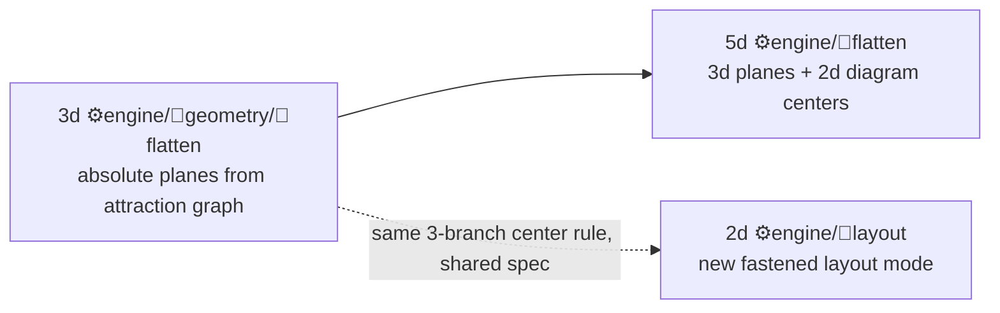

> Models: every subagent runs on `cursor-grok-4.5-high` (design/math/integration) or `composer-2.5` (mechanical breadth). No fast variants.

# Puzzle 5d Design-App Parity

## Findings that shape the plan

- `compose/client/lib/sketchpad/js/index.ts` already delegates its design editor canvases to puzzle 5d (`SketchpadDesignScene` / `SketchpadDesignDiagram` mount app `puzzle5d` with `presentation: "volume" | "flat"`). The missing parity is not UI shell - it is the **domain**: compose owns the pose truth in Rust `geom::flatten` (`compose/client/lib/rs/lib.rs`, lines 1189-1503), and puzzle has no flatten at all.
- `Puzzle5dFastener` / `Puzzle3dAttraction` already carry `gap, shift, rise, rotation, turn, tilt`; `**Puzzle2dEdge` carries none**, and **no dimension carries the diagram offsets** (compose `Connection.u/v`) that drive 2d node placement. Without them capsule-dream node positions are unreproducible.
- Kinds are thin: `Puzzle5dCatalogPart` is `{id, name, label, mesh_url, grips}`; `Puzzle2dMeta.kind_catalogs` is untyped `Option<dsl::DslValue>`. Compose `Type` has tagged multi-LOD representations, connectors with `point/direction/t/mandatory`, and `Port { code, label, order, compatible_with }`.
- No part/object/node has compose's `PieceConnectionKind::{Fixed, Connected}`, which decides whether a BFS root keeps its stored plane.
- Capsule Dream = 2880 pieces / 2864 connections (16 components). Golden flattened poses already exist as the sibling design `flat.design.compose.json` (2880 posed pieces). No puzzle-side capsule-dream asset exists.
- Example asset mechanism is incoherent: `🗣️tower.dsl.semio` is 190 KB while `🎒️tower.pack.semio` / `📡️tower.spr.semio` / `🔧️tower.op.semio` are ~270-byte stubs that only pass a `len() > 64` test.

## Terminology contract (single source of truth for all agents)

Per `✏️s/🔌️plugins/🧩️puzzle/AGENTS.md`, with the compose analogue:

- compose `Piece` -> `Node` (2d) / `Object` (3d) / `Part` (5d)
- compose `Type` -> `NodeKind` / `ObjectKind` / `PartKind`
- compose `Port` -> `HandleKind` / `VortexKind` / `GripKind`
- compose `Connector` -> `Handle` / `Vortex` / `Grip`
- compose `Connection` -> `Edge` / `Attraction` / `Fastener`
- compose `Connection.u/v` -> `x/y` on the edge/attraction/fastener (matching `Puzzle2dNode.x/y`)

## Normative target schema

**Connection analogue (`Puzzle2dEdge`, `Puzzle3dAttraction`, `Puzzle5dFastener`) - identical 8 parameters:**

```rust
pub gap: f64, pub shift: f64, pub rise: f64,
pub rotation: f64, pub turn: f64, pub tilt: f64,   // degrees, exactly as compose
pub x: f64, pub y: f64,                            // diagram offsets (compose u/v)
```

**Node/Object/Part anchor** (compose `PieceConnectionKind`), default `Fixed`:

```rust
pub enum Puzzle5dPartAnchor { Fixed, Derived }
```

**Kinds become types.** Replace the thin catalogs in all three dimensions with (5d names shown):

- `Puzzle5dCatalogPartKind`: `id, name, label, description, icon, image, unit, abstract: bool, base_kinds: Vec<String>, representations: Vec<Puzzle5dRepresentation>, grips: Vec<Puzzle5dGripTemplate>, attributes, authors`
- `Puzzle5dRepresentation`: `id, name, url, mime, tags: Vec<String>, lod: Option<String>, description`
- `Puzzle5dGripTemplate`: `id, name, label, description, icon, grip_kind: Option<String>, point: [f64;3], direction: [f64;3], t: Option<f64>, mandatory: Option<bool>, radius: Option<f64>` (2d template uses `angle` instead of `point/direction`)
- `Puzzle5dCatalogGripKind` (the Port): `id, code, label, order: Option<i32>, compatible_with: Vec<String>, description, icon, color, default_rope_kind`
- `Puzzle5dKindCompatibility` unified across dims: `source, target, bidirectional: bool, important: bool, specificity: Puzzle5dCompatSpecificity`
- 2d `Puzzle2dMeta.kind_catalogs` stops being `Option<dsl::DslValue>` and becomes the typed struct

Out of scope: 3d `target_volumes` / `references` do **not** get 5d twins.

## Flatten solver (byte-exact compose parity)

Transcribe `geom::flatten` from `compose/client/lib/rs/lib.rs` into puzzle, keeping the literal constants `TOLERANCE = 0.01`, `DIAGRAM_RADIUS = 2.697`, `DIAGRAM_VERTICAL_V_EXTRA = 1.0`, `DIAGRAM_HORIZONTAL_SCALE = 3.0633`, and `round_f` at 1e-6.

Acyclic placement (5d already depends on the 3d engine, never the reverse):




- 3d `📐️geometry` gains `flatten`: undirected adjacency from attractions, BFS per component in document order, `Fixed` root keeps stored plane, `Derived` root resets to default XY, child plane via quaternion alignment of the reversed child direction onto the parent direction then `-rotation` about the parent direction, `turn` about parent-rotated Z, `tilt` about parent-rotated X, translation `(shift, gap, rise)` in the parent-rotated basis, plus the parent connector point, composed with the parent plane matrix.
- 5d `⚙️engine/📐️flatten` wraps it and adds the diagram-center rule: parent at origin -> `(RADIUS * sin(angle), RADIUS * cos(angle))` from the parent grip `t`/angle; parent direction mostly vertical (`|z| > 0.5`) -> `parent + (x, y + VERTICAL_EXTRA)`; otherwise `parent + (x, y) * HORIZONTAL_SCALE`.
- 2d `📐️layout` gains the same center rule as a `fastened` layout mode driven by edge parameters and handle angle.

Wave 0 must pin two units questions by reading `🧊️3d/⚙️engine/📐️geometry`: whether existing `rotation/turn/tilt` are degrees or radians (target: degrees, as compose), and the `node.x = center.u`, `node.y = center.v` axis mapping already used by `sketchpadPieceDiagramUv`.

## Mechanisms to extend (not work around)

- **Schema facets**: every new field lands in all five leaves (`🦀️`, `🟦️`, `🔗️`, `🔣️`, `🛰️`) across `🧬️schema`, `📸️snapshot/🧬️schema`, `🔺️diff/🧬️schema`, enforced by `policyArtifactSchemaBreaches` (`📜️script.ts:6259`) and the `catalog-integration` tests in `🧰️framework/🔨️modules/🧬️schema/🦀️component.rs`.
- **Example asset coherence** (new gate): extend `ExamplesScript` (`📜️script.ts:1458`) with `examples emit` that re-derives `.op` / `.pack` / `.spr` from the `.dsl` leaf, and extend `policySemioArtifactExamplesBreaches` so stub assets fail instead of passing a `len() > 64` check. Example unit tests assert `PACK_BYTES == pack::encode(parse_dsl(DSL_TEXT))` and that the SPR op log replays to the same snapshot.
- **Legacy bridge removal**: delete the runtime `importComposeKit` action (`🎮️commands/🛍️example`) and `🗿️artifacts/🖐️5d/⚙️engine/🌉️compose`. Compose fixtures appear only inside the test-only parity harness.
- **Terminology**: every new label gets all four `app_labels!` cells (native/reuse x en/de) in `🗣️terminology/🦀️component.rs`.
- **Registration**: `📦️packages/🦀️rust/📦️glue.rs`, `📦️packages/🟦️typescript/📦️index.ts`, `.vscode/launch.json`, `.storybook/stories/puzzle/`* are serialized single-owner files - never touched by parallel agents.

## Workforce

Hard rules for every subagent: work only inside the ticket folder for scratch output; never run a mutating git command; never touch a file owned by another agent in the same wave; report a `🧪`-prefixed markdown report into the ticket folder; run the scoped test command before reporting.

### Wave 0 - Ticket and normative spec (serial, me)

Open the ticket via repo MCP `ticket_open` under goal `R26-02` (its scope is sketchpad MVP, and puzzle 5d *is* the sketchpad design surface), slug `PUZZLE-DESIGN-PARITY`, due `2026-08-16`. The repo MCP namespace is not currently loaded in this session and must be reconnected first - there is no `ticket` verb in `📜️script.ts`. Then write `📜️normative-spec.md` into the ticket folder containing: the terminology contract, every new field per dimension per leaf, the literal transcribed flatten pseudocode with constants, the units/axis decisions, and the numeric acceptance criteria. Every later agent reads this file first.

### Wave 1 - Schema surgery (3 parallel, disjoint dimension trees)

- `A1-2d` (Grok 4.5) owns `🗿️artifacts/◻2d/**`: the 6 params + `x/y` on `Puzzle2dEdge`, `anchor` on `Puzzle2dNode`, typed kind catalogs replacing `Option<dsl::DslValue>`, unified compatibility, all 15 schema leaves, `🔺️diff`, `🧬️mutations`, `🗣️dsl`, `🔧️op`, `📡️spr`, `📸️snapshot/🎒️pack`, plus inline `#[test]` coverage.
- `A2-3d` (Grok 4.5) owns `🗿️artifacts/🧊️3d/**` (excluding `⚙️engine/📐️geometry`, reserved for Wave 2): `x/y` on `Puzzle3dAttraction`, `anchor` on `Puzzle3dObject`, type-like `Puzzle3dCatalogObjectKind` + port-like `Puzzle3dCatalogVortexKind`, same leaf/mutation/dsl/op/spr/pack sweep.
- `A3-5d` (Grok 4.5) owns `🗿️artifacts/🖐️5d/**` (excluding `⚙️engine/📐️flatten`): `x/y` on `Puzzle5dFastener`, `anchor` on `Puzzle5dPart`, type-like `Puzzle5dCatalogPartKind` with representations and grip templates, port-like `Puzzle5dCatalogGripKind`, unified compatibility, same sweep, and deletion of `⚙️engine/🌉️compose`.

### Wave 1b - Registration and TS facade (serial, 1 agent)

`B1` (Composer 2.5) owns `📦️packages/🦀️rust/📦️glue.rs` and `📦️packages/🟦️typescript/📦️index.ts`: wire the new modules, make the crate compile, run `bun nx test @semio-tech/puzzle-plugin`.

### Wave 2 - Flatten solver (1 then 2 parallel)

- `C1` (Grok 4.5) owns `🗿️artifacts/🧊️3d/⚙️engine/📐️geometry/🦀️component.rs`: add the `flatten` submodule with the exact compose algorithm and constants; unit-test the quaternion alignment, rotation order, and `Fixed`/`Derived` root behaviour against hand-computed cases.
- Then in parallel: `C2` (Grok 4.5) owns the new `🗿️artifacts/🖐️5d/⚙️engine/📐️flatten/` (3d planes + the 3-branch diagram-center rule) and `C3` (Composer 2.5) owns `🗿️artifacts/◻2d/⚙️engine/📐️layout/🦀️component.rs` (the `fastened` layout mode).

### Wave 3 - App parity (6 parallel leaf agents, then serial integrator)

Each leaf agent owns only its own folder under `🎛️apps/🖐️5d/` and returns a registration snippet; nobody edits the 2596-line app root.

- `D1` (Grok 4.5) - new `🎮️commands/🔗️fastener/` (create, delete, retarget, batch-edit the 8 parameters, proximity connect), mirroring 3d's `🔗️attraction`.
- `D2` (Grok 4.5) - `🎮️commands/🧩️part/` + new `🎮️commands/⚓️anchor/`: fix/unfix a part, show/hide/lock parts, fasteners and grips, cluster/expand.
- `D3` (Composer 2.5) - new `🎮️commands/🗣️locale/` and new `🎮️commands/⚙️settings/` + `📌️panels/⚙️settings/` (grid size, proximity distance, port visibility, appearance), mirroring 3d.
- `D4` (Grok 4.5) - `📌️panels/🔍️inspection/`: anchor, plane axes, 2d centre `x/y`, fastener `x/y`, representation/LOD picker, mixed-value handling.
- `D5` (Composer 2.5) - `📌️panels/🛍️catalogue/` + `📌️panels/📄️document/`: type-like kind browsing with representations, drag-place, and design tree over parts/grips/fasteners.
- `D6` (Composer 2.5) - `🗣️terminology/`, `🎚️config/`, `👥️presence/` (+ their 5 schema leaves): every new label in all four cells, hovered grip/fastener presence, settings config keys.
- Then `D7` (Grok 4.5, serial) owns `🎛️apps/🖐️5d/🦀️component.rs` and `🎭️modes/✏️edit/**`: register every new command, panel, utility, option and keybinding; wire history/clipboard via `ActionKind::{History, Clipboard}`; make the flatten result the pose source for both windows.

### Wave 4 - Capsule Dream transfer (1 serial generator, then 3 parallel)

- `E1` (Grok 4.5) writes a **ticket-local** one-off generator (allowed scratch, stays in the ticket folder) that reads `compose/fixture/kit/dev/metabolism/wip/initialKit/{kit,design/capsule-dream.design}.compose.json` and emits `🌙️capsule-dream` DSL text for 5d, 3d and 2d, including the full type-like kind catalog derived from the 50 compose types (representations with tags/LOD, connector templates with `point/direction/t/mandatory`, ports with `compatible_with`), plus the golden flattened asset from `design/flat.design.compose.json`.
- Then in parallel `E2`/`E3`/`E4` (Composer 2.5, one per dimension) create the example units `🗿️artifacts/{◻2d,🧊️3d,🖐️5d}/📚️examples/🌙️capsule-dream/` following the `🏗️nakagin-capsule-tower` shape exactly: `🦀️component.rs`, `🟦️component.ts`, `🖼️assets/{🗣️,🔧️,🎒️,📡️}dream.*.semio`, `🧪️tests/{🦀️test.rs,🟦️test.ts}`.
- `E5` (Grok 4.5, serial, owns `📜️script.ts`) adds `examples emit` and tightens `policySemioArtifactExamplesBreaches` so every example's `.op`/`.pack`/`.spr` must equal the codec output for its `.dsl`; then re-emits nakagin and concrete-forest assets for all three dimensions so the existing stubs become real.

### Wave 5 - Parity harness (2 parallel)

- `F1` (Grok 4.5) - permanent golden assertions inside the new example units' `🧪️tests/🦀️test.rs`: 5d flatten of capsule-dream equals the shipped golden for all 2880 parts (`origin`, `xAxis`, `yAxis`, `center.x/y` to 1e-6); same for nakagin and its slanted/twisted/dancing variants; 3d flatten and the 2d `fastened` layout agree with the 5d projection.
- `F2` (Grok 4.5) - the compose cross-check, gated to `test long`/`exhaustive`: read `compose/fixture/flatten.cases.compose.json` and the sibling `flat*.design.compose.json` goldens and assert the puzzle solver reproduces them case for case. This is the only place compose fixtures are referenced, and only from test code.

### Wave 6 - Consumers and wiring (3 parallel, then serial)

- `G1` (Grok 4.5) owns `compose/client/lib/sketchpad/js/index.ts`: update `sketchpadDesignPuzzle2dFixtureFromDesign`, `sketchpadDesignVolumeFixtureFromDesign` and `sketchpadConnectionTransformParamsFromDto` to the new puzzle schema, feed `u/v` into fastener `x/y`, drop the `flatPosition` pre-flatten in favour of the puzzle solver, and keep the embedded vitest and playwright suites green.
- `G2` (Composer 2.5) owns `.storybook/stories/puzzle/**`: extend the 2d/3d/5d stories with the capsule-dream fixture and the new parameters.
- `G3` (Composer 2.5) owns the react target under `🧰️framework/🛍️products/💻️os/🔨️modules/📺️renderer/.../⚛️react/` for `@semio-tech/puzzle-5d-react` (`compose5d`, `prepareTopologyModel`) so the sketchpad import keeps resolving.
- Then `G4` (Composer 2.5, serial) owns `.vscode/launch.json` and the puzzle `📋️project.json` files: register the new capsule-dream playground and example-emit entries following the existing emoji naming, grouping and order.

### Wave 7 - Gate and close (serial, me)

- `bun ./📜️script.ts verify gate`
- `bun nx test @semio-tech/puzzle-plugin` and `bun nx test @semio-tech/puzzle-js`
- `bun ./📜️script.ts examples verify puzzle`
- `bun ./📜️script.ts test long` for the compose cross-check
- `bun nx test @semio-tech/compose-sketchpad` (embedded vitest) and the sketchpad playwright suite
- `bun ./📜️script.ts dev 5d` with runtime console verification of the capsule-dream load, then `ticket_close` with the file list and summary.

## Definition of done

- `Puzzle2dEdge`, `Puzzle3dAttraction` and `Puzzle5dFastener` expose the identical 8 parameters; kinds are type-like and handle/vortex/grip kinds are port-like in all three dimensions, across all five leaves of all three facets.
- Puzzle 5d reproduces compose's flattened poses for capsule-dream (2880 parts) and nakagin plus variants, to 1e-6, from puzzle-owned assets.
- No runtime compose bridge remains in puzzle; compose fixtures are referenced only from tests.
- Every example unit's binary assets are real codec output, enforced by policy.
- `verify gate` clean, puzzle and sketchpad suites green, launch.json and storybook updated.

