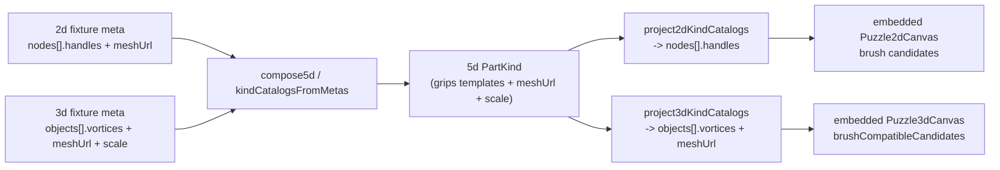

# Puzzle 5d Suggestion Parity

## Root cause

Puzzle 2d and 3d generate brush suggestions from their **kind catalogs**, not from scene instances:

- 3d `brushCompatibleCandidates` ([puzzle/3d/react/index.tsx](puzzle/3d/react/index.tsx) ~3793) skips any object kind where `!kind.meshUrl || !kind.vortices?.length`.
- 2d candidate generation needs `NodeKind.handles` templates ([puzzle/2d/react/index.tsx](puzzle/2d/react/index.tsx) ~122-132).

The standalone 2d/3d concrete-forest fixtures carry full templates for **both** `Left` and `Right` kinds (incl. `meshUrl`, vortex `position`/`direction`, handle `angle`), which is why they suggest parts even with a single instance.

Puzzle 5d loses all of this:

- `PartKind` ([puzzle/5d/react/index.tsx](puzzle/5d/react/index.tsx) ~2230) has no `meshUrl` and no grip templates.
- `partKindFrom2dNode`/`partKindFrom3dObject` (~2303, ~2345) drop `handles`/`vortices`/`meshUrl`.
- `kindCatalogsFromMetas` (~2513) picks the 2d meta **or** the 3d meta, never merging both (so 3d position/direction never survives even if templates were kept).
- `project2dKindCatalogs`/`project3dKindCatalogs` (~2403, ~2448) emit no `handles`/`vortices`/`meshUrl`.

So the embedded canvases receive catalogs with empty templates -> `brushCompatibleCandidates` returns `[]` -> no suggestions. This affects **both** 5d fixtures (concrete forest and nakagin), confirmed by inspecting [puzzle/5d/fixture/nakagin-capsule-tower.5d.json](puzzle/5d/fixture/nakagin-capsule-tower.5d.json) (part kinds only have `id`/`name`/`label`).

## Data flow



## Terminology guardrail

All new 5d code/types use **5d terms only** (`Part`, `Grip`, `gripKind`, `2d`/`3d` aspects). 2d (`node`/`handle`) and 3d (`object`/`vortex`) terms appear only inside the existing boundary mappers (`*From2d`*, `*From3d*`, `project2d*`, `project3d\*`), exactly like the current pattern. No 5d term leaks into 2d/3d and vice versa.

## Changes

### 1. Enrich the unified `PartKind` ([puzzle/5d/react/index.tsx](puzzle/5d/react/index.tsx), `KindMeta` region)

- Add a template type reusing existing aspect shapes:

```ts
export interface PartKindGrip {
 readonly gripKind: string;
 readonly "2d"?: Grip2dAspect;
 readonly "3d"?: Grip3dAspect;
}
```

- Extend `PartKind` with `meshUrl?: string`, `scale?: number | readonly [number, number, number]`, and `grips?: readonly PartKindGrip[]`.

### 2. Carry templates through the boundary mappers

- `partKindFrom3dObject` (~2345): map `row.vortices` -> `grips[].["3d"]` (position/direction/radius, `gripKind` from `vortexKind`), plus `row.meshUrl`, `row.scale`.
- `partKindFrom2dNode` (~2303): map `row.handles` -> `grips[].["2d"]` (angle/radius, `gripKind` from `handleKind`), plus `row.meshUrl` if present.

### 3. Merge both metas in `kindCatalogsFromMetas` (~2513)

Replace the "2d else 3d" pick with a merge: build part kinds from 3d objects and from 2d nodes, then unify by `id` so each part kind has grip templates with **both** `2d` and `3d` aspects (index-aligned; concrete forest has 11 grips in matching order). Grips/fasteners/ropes deduped by `id`. Keep `kindCompatibilityFromMetas` as-is.

### 4. Project templates back out

- `project3dKindCatalogs` (~2448): emit `objects[].vortices` from `part.grips[].["3d"]`, plus `meshUrl` and `scale`.
- `project2dKindCatalogs` (~2403): emit `nodes[].handles` from `part.grips[].["2d"]`.

### 5. Regenerate both 5d fixtures

Run the existing regenerate mechanism (no hand-migration), which now composes enriched catalogs:

- `regenerate-concrete-forest-fixture` and `regenerate-fixture` in [puzzle/5d/play/script.ts](puzzle/5d/play/script.ts).
- Updates [puzzle/5d/fixture/concrete-forest.5d.json](puzzle/5d/fixture/concrete-forest.5d.json) and [puzzle/5d/fixture/nakagin-capsule-tower.5d.json](puzzle/5d/fixture/nakagin-capsule-tower.5d.json) so `kindCatalogs.parts` carry `grips` templates + `meshUrl`. `normalizeKindCatalogBundle` already passes through `parts`/`grips` keys unchanged, so loaded fixtures keep the templates.

### 6. Extend existing tests (no new files)

In the 5d react/play in-file test suites, add coverage that `project3dKindCatalogs` emits `vortices`+`meshUrl`, `project2dKindCatalogs` emits `handles`, `kindCatalogsFromMetas` merges both aspects, and that `brushCompatibleCandidates` for the concrete-forest catalog is non-empty.

### 7. Runtime verification

Start the 5d play dev server and confirm (via console/DEBUG logs of candidate counts and visually) that hovering/right-clicking a grip on the single concrete-forest part now lists compatible parts, matching 2d/3d.

## Ticket

Open a new repo-mcp ticket (suggestion parity is distinct from the closed `Puzzle 5d Concrete Forest Fixture` ticket) under the most appropriate `puzzle/5d` goal; close it with a summary and the touched files when done.
