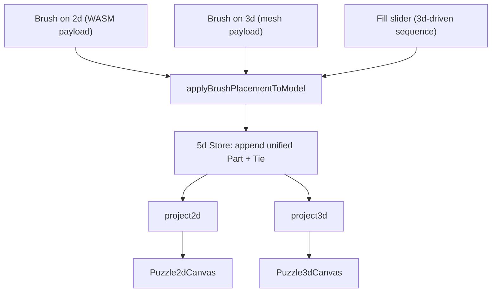

# Puzzle 5d Unified Tools

## Goal

A single brush/fill action grows the shared `V1` model with **unified parts** (each with both `puzzle2d` + `puzzle3d` aspects), so both surfaces fill at once. Full toolbar parity: 2d selection/create/redraw + 3d gumball relocate + brush/fill, all in the 5d shell.

## Core design

- Originating surface's native engine gives precise geometry for its own aspect; the **companion aspect is synthesized analytically** from the shared anchors (no second heavy engine pass, no meshes needed):
  - 2d aspect: place new node at `sourceNode.center + (gap) * dir(sourceHandle.angle)`, handles from the part-kind catalog default.
  - 3d aspect: pose new part so its mating vortex sits at the source vortex position with mirrored `direction` (vector math from `puzzle3d.position`/`direction`).
- Fill uses the **3d engine as spatial authority** (reuses `buildBrushFillSequence`/`puzzle3dFillSessionRef`), synthesizing the 2d aspect per placement → guarantees 1:1 unified parts. Slider applies a prefix.
- All mutations go through the unified `Store`; `project2d`/`project3d` already re-render both surfaces.

## Phase 1 - Unified placement core (`puzzle/5d/react/index.tsx`)

New `//#region 🔖Brush` in [puzzle/5d/react/index.tsx](puzzle/5d/react/index.tsx):

- `Puzzle5dBrushPlacement` type: `{ partId, partKind, sourceAnchorFullId, aspect2d?: Puzzle2dBrushPlacePayload, aspect3d?: BrushPlacePayload }`.
- `synthesizeFlatAspect(model, sourceAnchorFullId, partKind, catalogs)` and `synthesizeVolumeAspect(...)` - build the companion `NodeAspect`/`Puzzle3dPartAspect` + anchors analytically from the source part's shared anchors and the part-kind catalog.
- `applyBrushPlacementToModel(model, placement)` - append ONE `PartV1` (both aspects, anchors with both aspects) + ONE `TieV1` (source anchor -> new mating anchor). Reuse the originating payload for its native aspect, synthesize the other.
- `buildPuzzle5dFillSequence(model, opts)` - project3d, run the existing 3d `buildBrushFillSequence`, map each `BrushPlacePayload` -> `Puzzle5dBrushPlacement` (synthesize 2d), return ordered list.
- `Store` additions: `applyBrushPlacement(placement)`, and a cached fill session (`prepareFill()`, `applyFillCount(n)`, `clearFill()`) mirroring the 3d play session pattern but at model level.
- Extend the `import.meta.vitest` block: placement adds a part with both aspects; fill prefix of N adds N parts each with both `puzzle2d` and `puzzle3d`.

## Phase 2 - 5d controller tool state (`puzzle/5d/play/index.ts`)

In [puzzle/5d/play/index.ts](puzzle/5d/play/index.ts) `Puzzle5dPlayShellController`:

- Add `activeTool: "select" | "brush" | "fill"`, brush settings (2d flush distance, 3d overlap budget, kind weights), `fillCount`, brush engagement possibles, and a `Puzzle5dPlayHostBridge` ref (`setHostBridge`).
- `rebuildShellMode`: merge toolbar tools = 2d toolbar (selection method/mode/targets, create circle/rect, redraw) via the 2d builders + existing `PUZZLE_3D_GUMBALL_GROUPS` + brush/fill measures (flush distance, overlap budget, kind-weight distribution).
- Window engagement: build tool ring (select/brush/fill), brush candidate possibles, and the fill-count slider for both windows (mirror `buildPuzzle3dPlayEngagement` shape).
- New commands in `run`: `setActiveTool`, `addBrushPart`, `setFillCount`, `setBrushFlushDistance`, `setBrushOverlapBudget`, `setKindWeight`, `pickBrushCandidate`, plus 2d toolbar commands (selection/create/redraw) and brush/fill engagement plumbing; forward host-dependent ones via `hostBridge.runHostCommand`. Create commands append a unified part with catalog-default aspects.
- Extend `getSnapshot()` with `activeTool`, brush settings, `fillCount`, engagement state. Extend the `import.meta.vitest` block (activate brush/fill via engagement submit; `addBrushPart` grows store parts; fill count grows parts).

## Phase 3 - Host bridge + React surface hosts (`framework/product/playground/renderer/react/index.tsx`)

In [framework/product/playground/renderer/react/index.tsx](framework/product/playground/renderer/react/index.tsx):

- Add a 5d chrome layer (analogous to `Puzzle2dPlayInner` + `Puzzle3dPlayEngagementPublisher`) that installs `Puzzle5dPlayHostBridge`, holds brush-renderer hooks + fill-session prep, and converts native brush/fill payloads into `store.applyBrushPlacement` / `store.applyFillCount`.
- `Puzzle5d2dSurfaceHost`: pass `activeTool`, brush settings, `onBrushCandidates`, `onBrushPlace` into `FiveD` (2d). On 2d `onBrushPlace`, build `Puzzle5dBrushPlacement{aspect2d}` and apply.
- `Puzzle5d3dSurfaceHost`: pass `brushActive`/`fillActive`/`onBrushPlace`/`onFillMeshesReady` + missing `onSelect` into `FiveD` (3d). On 3d `onBrushPlace`, build `Puzzle5dBrushPlacement{aspect3d}` and apply.
- Extend `FiveDProps` and `FiveD2d`/`FiveD3d` in `puzzle/5d/react` to accept + forward brush/fill props to the underlying `Puzzle2dCanvas`/`Puzzle3dCanvas` (`installPuzzle3dPlayBrushHost` for 3d).

## Phase 4 - Build slicing + verification

- Confirm `stripPlaygroundRendererForPuzzleKind` in [ui/styling/vite-elements-assets.ts](ui/styling/vite-elements-assets.ts) keeps BOTH 2d and 3d brush/fill host regions in the 5d slice (5d needs both); adjust the slice rules if they strip 2d/3d host code for the `5d` entry.
- Run the 5d play harness (via existing `launch.json` config) and confirm at runtime (console-log verified) that one fill grows both surfaces and brush from either surface creates a unified part visible in both.
- Run `nx` test targets for `puzzle/5d/react`, `puzzle/5d/play` and affected `framework` projects.

## Workflow

- Open/reopen the repo-mcp ticket and read `repo://goals` first; keep temp artifacts inside the ticket folder; close with a summary at the end.
- Use regions/subregions; extend existing files only (no new files); no migrations/adapters; external libs stay behind interfaces.
