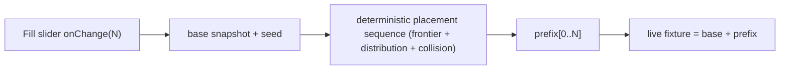

## Puzzle Fill Engagement (2D + 3D)

### Confirmed behavior
- New engagement Fill (a tool alongside Brush/Select). When active, the engagement `control` is an `EngagementSliderControl` (`kind:"slider"`, min `0`, max `1000`, step `1`); the chrome already renders it (`ui/react/index.tsx:12239`).
- Interactive build-while-dragging: on each slider `onChange(N)` the fixture becomes `baseSnapshot + sequence[0..N]`. Ramp down removes the tail, ramp up re-adds. The sequence is deterministic (seeded) so dragging is stable.
- Frontier growth: start from currently-free handles/vortices; each placed item exposes new free slots that are also fillable. Stop at `N` or when no collision-free slot remains.
- Same distribution as brush (existing kind-weight maps) and real collision; newly placed items participate in collision for subsequent placements.

### Shared model (no change needed)
`EngagementSliderControl` and its chrome rendering already exist. Each puzzle's `activeTool` union gains `"fill"`.

### Puzzle 2D (geometry lives in WASM)
- [puzzle/2d/rs/lib.rs](puzzle/2d/rs/lib.rs): in the `#region Brush` area, add a fill routine `brush_fill_json_wasm(count, seed) -> String` that, against the currently-synced scene, repeatedly: enumerates free handles (`handle_has_incident_edge` at `:5111`), picks frontier handle, builds preview (`brush_build_preview` `:2220`), orders compatible node kinds by weights (`brush_weighted_order_strings` `:2155`), rejects placements whose `node_world_bounds` (`:5687`) overlaps any existing or already-accumulated node via `world_boxes_overlap`, then accumulates the node+edge (mirroring `brush_place_json` `:2283`). Returns the ordered list `[{node, edge}, ...]`. This also introduces the collision check that brush placement currently lacks. Expose via a new `#[wasm_bindgen] pub fn brush_fill_json_wasm` near the other `*_wasm` exports (`:6228+`). Extend existing `#[cfg(test)]` tests (e.g. near `:8533`) to cover fill count, collision rejection, and determinism.
- [puzzle/2d/play/index.ts](puzzle/2d/play/index.ts): extend `Puzzle2dActiveTool` with `"fill"`; add `PUZZLE_2D_ENGAGEMENT_TOOL_FILL_ID = "puzzle2d.tool.fill"`; in `windowEngagementForPane` (`:692`) add the Fill possible and, when `activeTool==="fill"`, return `control: { kind:"slider", min:0, max:1000, step:1, value:fillCount, onChange: puzzle2dPlayCmd("setFillCount", {pane}) }`; handle the fill token in `applyEngagementCommand` (`:872`) via `setPlayActiveTool("fill")`; add a `setFillCount` command in the controller's command switch that forwards to the host bridge.
- [framework/product/playground/renderer/react/index.tsx](framework/product/playground/renderer/react/index.tsx): in the 2D `runHostCommand` switch (`:4679`) add `setActiveTool` handling for `"fill"` (snapshot `baseFixture` + new `seed` on entering fill, restore base on leaving) and a `setFillCount` case that calls the WASM `brush_fill_json_wasm(N, seed)` and patches `fixture = base + parsed placements` via the existing `patchFixture`.

### Puzzle 3D (geometry/collision live in the React renderer)
- [puzzle/3d/play/index.ts](puzzle/3d/play/index.ts): extend the active-tool union with `"fill"`; add `PUZZLE_3D_ENGAGEMENT_TOOL_FILL_ID = "puzzle3d.tool.fill"`; handle it in `applyEngagementToolCommand` (`:1347`). Fill count and base-snapshot logic run in the renderer (it owns meshes + collision), so the shell only tracks `activeTool==="fill"`.
- [puzzle/3d/react/index.tsx](puzzle/3d/react/index.tsx): add `applyBrushFillToFixture`/a fill sequence builder next to `applyBrushPlacementToFixture` (`:3477`) that enumerates free vortices, frontier-grows, orders candidates with `weightedOrderBrushCompatibleCandidates`, and rejects collisions using `brushCandidateCollidesAtPose`/`brushPreviewCollides` (`:3340`) against an in-memory accumulator of placed-object AABBs (mesh roots are already loaded for candidates), seeded for determinism. In `buildPuzzle3dPlayEngagement` (`:5958`), when `activeTool==="fill"` return a slider `control` (0-1000) wired to a new `onFillCount` input callback; thread `onFillCount` through `Puzzle3dPlayHostBridge`/publisher (`framework/.../index.tsx:1573`).
- [framework/product/playground/renderer/react/index.tsx](framework/product/playground/renderer/react/index.tsx): wire `onFillCount(N)` in the 3D viewport block (near `onBrushPlace` `:1784`): on entering fill capture `baseFixture` + seed; on `onFillCount` dispatch fixture = `base + sequence[0..N]` (single `patchFixture`); restore base on leaving fill.

### Tests / build
- Extend existing test files only: 2D Rust tests in `puzzle/2d/rs/lib.rs`; 3D fill-sequence + collision/determinism tests in the existing `puzzle/3d/react` test file; 2D/3D shell engagement tests in `puzzle/2d/play/index.ts` / `puzzle/3d/play/index.ts` (`:3005` pattern).
- Rebuild the 2D WASM `pkg` via the existing nx/script target (run through `script.ts`, no new script files), then run the relevant nx test targets. Validate runtime with `[DEBUG]` logs (fill count, placements, rejected collisions) before declaring done.

### Repo process
- Per repo rules: read `repo://goals`, then `ticket_open` (or `ticket_reopen`) a Fill ticket, keep any temp logs inside the ticket folder, register nothing new in `launch.json` (no new executable), structure all additions with `//#region` blocks, and `ticket_close` with the file list when done.
</plan>
<todos>[{"id": "2d-wasm-fill", "content": "Add brush_fill_json_wasm + AABB collision (world_boxes_overlap on node_world_bounds) + frontier free-handle enumeration in puzzle/2d/rs/lib.rs; extend Rust tests; rebuild pkg."}, {"id": "2d-shell", "content": "Add Fill tool/activeTool + slider control (0-1000) + setFillCount command in puzzle/2d/play/index.ts."}, {"id": "2d-host", "content": "Wire 2D fill in playground renderer: base snapshot + seed on fill enter, call brush_fill_json_wasm on setFillCount, patch fixture = base + prefix."}, {"id": "3d-react-fill", "content": "Add fill sequence builder (frontier + weighted distribution + collision accumulator, seeded) and slider control in buildPuzzle3dPlayEngagement in puzzle/3d/react/index.tsx; thread onFillCount."}, {"id": "3d-shell", "content": "Add Fill tool/activeTool + handle it in applyEngagementToolCommand in puzzle/3d/play/index.ts."}, {"id": "3d-host", "content": "Wire 3D onFillCount in playground renderer: base snapshot + seed on fill enter, patch fixture = base + prefix(N), restore base on leave."}, {"id": "tests", "content": "Extend existing 2D/3D shell + 3D react test files for fill count, collision rejection, determinism, ramp up/down; run nx test targets."}]