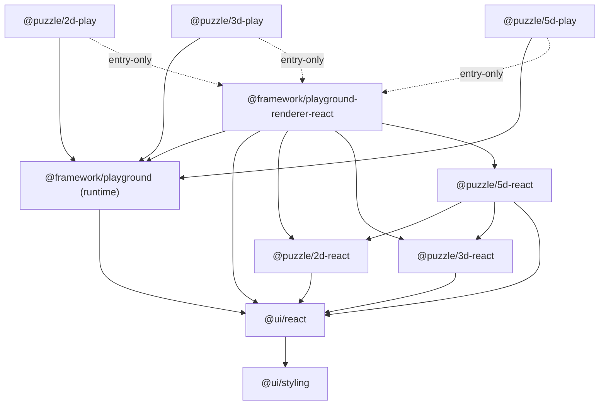

# Puzzle + Playground Re-layering

## Confirmed decisions

- Rename renderers to dimension scopes and split play into standalone packages (`rename_and_split`).
- `@framework/playground-renderer-react` aggregates all three puzzle renderers (2d + 3d + 5d).
- Two playground packages (`entry_two`): `@framework/playground` is the renderer-neutral runtime; the single renderer wiring line lives in each play's `main.ts` entry (renderer is entry-only/dev, not a play-logic dependency).

## Target dependency graph

## Name map (folders already in place)

- `@puzzle/board` -> `@puzzle/2d-react` (`puzzle/2d/react`)
- `@puzzle/scene` -> `@puzzle/3d-react` (`puzzle/3d/react`)
- `@puzzle/topology` -> `@puzzle/5d-react` (`puzzle/5d/react`)
- new `@puzzle/2d-play` (`puzzle/2d/play`), `@puzzle/3d-play` (`puzzle/3d/play`), `@puzzle/5d-play` (`puzzle/5d/play`)
- `@puzzle/board-wasm` -> `@puzzle/2d-wasm` (`puzzle/2d/rs/pkg`)
- `@framework/playground-react` -> `@framework/playground-renderer-react` (`framework/playground/renderer/react`)
- `@framework/playground` keeps its name (now the renderer-neutral runtime)

## 1. Pure puzzle renderers (depend only on @ui/react)

- [puzzle/2d/react/package.json](puzzle/2d/react/package.json): name `@puzzle/2d-react`, drop `@framework/playground` dep, `repository.directory` -> `puzzle/2d/react`, script ids `@puzzle/2d-react:*`.
- [puzzle/2d/react/index.tsx](puzzle/2d/react/index.tsx): remove the `@framework/playground` (line 26) and `@framework/playground-react` (lines 27-37) imports; the board canvas becomes prop-driven, importing only from `@ui/react`. Any `ProductRuntime`/`FooterItem`/`Expertise` usage moves to the play package or is passed in via props.
- [puzzle/3d/react/package.json](puzzle/3d/react/package.json) + [index.tsx](puzzle/3d/react/index.tsx): name `@puzzle/3d-react`, drop `@framework/playground`, keep `@ui/react` + three/r3f.
- [puzzle/5d/react/package.json](puzzle/5d/react/package.json) + [index.tsx](puzzle/5d/react/index.tsx): name `@puzzle/5d-react`, deps `@puzzle/2d-react` + `@puzzle/3d-react` + `@ui/react`, drop `@framework/playground`.
- Each `react/project.json` ([2d](puzzle/2d/react/project.json), [3d](puzzle/3d/react/project.json), [5d](puzzle/5d/react/project.json)): rename `name`, set `cwd` to `puzzle/<dim>/react`, reduce `test` target to a pure vitest run (no play port / playwright). Update each `react/vitest.config.ts` alias block to drop playground aliases.
- [puzzle/2d/rs/pkg/package.json](puzzle/2d/rs/pkg/package.json) + [build-wasm.script.ts](puzzle/2d/rs/scripts/build-wasm.script.ts): emit `@puzzle/2d-wasm`.

## 2. framework/playground renderer aggregates puzzle renderers

- [framework/playground/renderer/react/package.json](framework/playground/renderer/react/package.json): name `@framework/playground-renderer-react`; add deps `@puzzle/2d-react`, `@puzzle/3d-react`, `@puzzle/5d-react`.
- [framework/playground/renderer/react/index.tsx](framework/playground/renderer/react/index.tsx): import the puzzle canvases and register them inside the existing surface-host machinery (`registerUiBoardSurfaceHost` line 242, `registerUiScene3DSurfaceHost` line 237, called from `registerSurfaceHosts()` line 982). Keep exporting `renderPlayground`.
- `framework/playground/renderer/react/{project.json,vitest.config.ts}`: rename project to `@framework/playground-renderer-react`, add the puzzle-react aliases.

## 3. framework/playground stays the neutral runtime

- [framework/playground/core/index.ts](framework/playground/core/index.ts): absorb the react-free helpers that play currently pulls from the renderer (notably `playgroundTreePanelRootItems`, used in [puzzle/2d/play/index.ts](puzzle/2d/play/index.ts) line 24) so play imports them from `@framework/playground`. No React/puzzle imports added here.

## 4. New standalone play packages (logic depends only on @framework/playground)

For each of `puzzle/{2d,3d,5d}/play`:

- New `package.json`: `@puzzle/<dim>-play`, dependency `@framework/playground` only; `@framework/playground-renderer-react` + react/vite as devDependencies (entry-only). 2d also depends on `@puzzle/2d-wasm` build.
- New `project.json`: `dev`/`build`/`test` via the play `vite.config.ts`, `cwd` `puzzle/<dim>/play`, carrying the existing `*_PLAY_PORT` envs; 2d build first runs the rs wasm build.
- `play/index.ts`: imports only from `@framework/playground` (declarative bodies, tools, measures - no React, no `@ui/react`, no renderer).
- `play/main.ts`: the single renderer line, e.g. `import { renderPlayground } from "@framework/playground-renderer-react"; renderPlayground(boardPlay);`.
- Update each `play/vite.config.ts` alias block to the new scope names.
- Split/retire `puzzle/<dim>/script.ts` so the react project no longer orchestrates the play server.

## 5. Root wiring

- [package.json](package.json) `workspaces` (lines 13-15): replace `puzzle/2d`, `puzzle/3d`, `puzzle/combined` with `puzzle/2d/react`, `puzzle/2d/play`, `puzzle/3d/react`, `puzzle/3d/play`, `puzzle/5d/react`, `puzzle/5d/play` (`framework/playground/renderer/react` already listed).
- [script.ts](script.ts) dev mapping (`board`/`scene`/`cad` branches) and [package.json](package.json) `dev:*` scripts: point at `@puzzle/2d-play:dev`, `@puzzle/3d-play:dev`, `@puzzle/5d-play:dev`.
- [.vscode/launch.json](.vscode/launch.json): `@puzzle/board:dev` -> `@puzzle/2d-play:dev`, `@puzzle/scene:dev` -> `@puzzle/3d-play:dev`, add 5d.
- [.storybook/main.ts](.storybook/main.ts): alias `@puzzle/board` -> `@puzzle/2d-react`, `@framework/playground-react` -> `@framework/playground-renderer-react`; update optimizeDeps excludes.
- `bun install` to regenerate `bun.lock`; sanity-check `nx.json` / `eslint.config.mjs` / `Monorepo.sln`.

## 6. Verify

- Grep shows no remaining `@puzzle/board|@puzzle/scene|@puzzle/topology|@framework/playground-react` in `ui/`, `framework/`, `puzzle/`.
- Confirm no play `index.ts` imports `@ui/react` or any renderer package (layering check).
- `bun nx test` for `@ui/react`, `@puzzle/2d-react`, `@puzzle/3d-react`, `@puzzle/5d-react`, `@framework/playground`, `@framework/playground-renderer-react`, and each `@puzzle/*-play`.
- `bun run dev:cad` plus one puzzle play (`@puzzle/2d-play:dev`) start without module-resolution errors.

## Out of scope / flags

- `@framework/platform-react` is left as-is (rename to `-renderer-react` only if you later want symmetry).
- `@framework/playground` keeps its current `@ui/react` dependency; making the runtime fully React-free is a possible follow-up (play already satisfies "no direct React dep" since it only imports `@framework/playground`).

