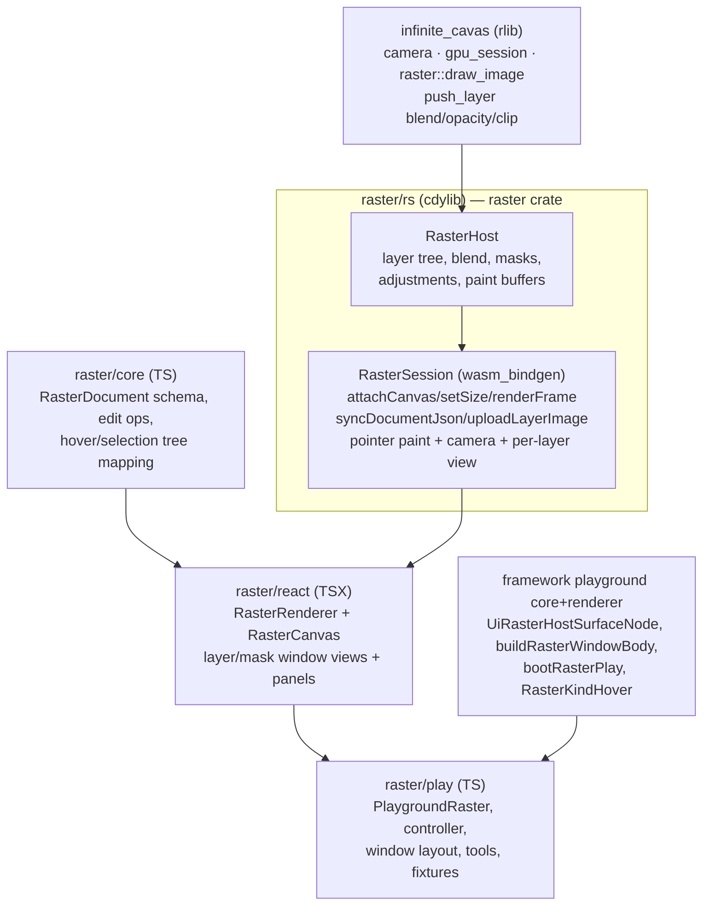

# Raster Technology

A new top-level technology `raster/` for GIMP-style non-destructive image editing: a layer/group tree with blend modes, opacity, layer masks, adjustment layers, painting, and filters, rendered on an infinite canvas via the existing `infinite_cavas` Rust/WASM/Vello engine, with each layer/mask viewable in its own shell window and full bidirectional/transitive hover + selection across canvas, windows, and side-panel trees.

## Architecture

The JSON `RasterDocument` (parsed/edited in `raster/core`) is the single source of truth; it is synced into `RasterSession` (`syncDocumentJson`) which composites the layer stack each frame. Pixel buffers (imported images, paint strokes, adjustment/filter outputs) live in the Rust host and are uploaded as Vello `ImageData`.

## Layering on infinite_cavas (key insight)

Vello natively supports per-layer compositing via `scene.push_layer(BlendMode, alpha, transform, clip_shape)` / `pop_layer`. The compositor walks the layer tree depth-first and, per node, pushes a layer with its blend `Mix` mode + opacity, draws its bitmap (`cavas::raster::draw_image`) or child group, applies its mask as an alpha clip layer, then pops. This reuses `infinite_cavas` as-is for camera, `gpu_session`, and `raster::draw_image`/`RasterImageCache`. Adjustment layers and filters that Vello can't express as blend modes are computed as derived RGBA buffers in Rust (CPU via the `image` crate behind an interface, or a custom wgpu pass) and drawn like any other layer.

## New packages (mirror forms/ + gis/map/ conventions)

- `[raster/core](raster/core)` (TS, `@semio-tech/raster-core`): `RasterDocument` schema `raster.document/v1` (layer tree: `RasterLayer` | `GroupLayer` | `AdjustmentLayer` with `LayerMask`, `BlendMode`, opacity, visibility, transform/anchor on infinite canvas), `parseRasterDocument`/`rasterDocumentToJson`, `RasterEditOp` union + `applyRasterEditOp`, id factories, and hover/selection mapping helpers (stable row ids + transitive `RasterKindHover`). Single `index.ts` with `#region` blocks + co-located `🧪Tests`; `package.json`/`project.json`/`script.ts`/`vitest.config.ts` copied from `[forms/core](forms/core)`.
- `[raster/rs](raster/rs)` (Rust crate `raster`, `crate-type = ["rlib","cdylib"]`, path-dep on `infinite_cavas`): `RasterHost` (document state, layer compositing into a Vello `Scene`, paint buffers, adjustment/filter evaluation, hit-testing) implementing `cavas::canvas_content::CanvasContent`; `RasterSession` wasm_bindgen mirroring `MapSession`: `attach_canvas`, `setSize`, `renderFrame`, `setCamera`/`wheelScreen`/`cameraJson`, `syncDocumentJson`, `uploadLayerImage`, `pointerDownScreen`/`Move`/`Up` (paint/transform/marquee), `setActiveTool`, `setHoveredIdSilent`/`setHoveredKindSilent`, `setSelectionIdsJson`, `renderLayerFrame(layerId)`/`renderMaskFrame(maskId)` for isolated per-window views. Built via `runWasmPackWebBuild` in `script.ts` (copy `[puzzle/2d/rs/script.ts](puzzle/2d/rs/script.ts)`); add crate to the root Cargo workspace members.
- `[raster/react](raster/react)` (TSX, `@semio-tech/raster-react`): loads `../rs/pkg/raster.js`, exports `RasterSession`; `RasterRenderer` (owns one session, JSON document sync, RAF + `renderFrame`, event drain) + `RasterCanvas` (controlled props: camera, `selectedIds`, `hoveredId`, `kindHover`, `activeTool`, callbacks `onHover`/`onSelect`/`onPaint`); plus isolated `RasterLayerView`/`RasterMaskView` canvases for per-layer/mask windows. Deps `@semio-tech/raster-core`, `@semio-tech/ui-react`, `@semio-tech/infinite-cavas-react-renderer`.
- `[raster/play](raster/play)` (TS, `@semio-tech/raster-play`): `PlaygroundRaster` + `RasterPlayController` (extends `Controller`, implements `PlaygroundFixtureHost`); multi-window `WindowLayout` (main canvas + Layers/Mask/Navigator windows, with dynamic per-layer/per-mask window kinds parameterized by id); ribbon tool tree via `toolCollection` (Selection: marquee/lasso/wand · Paint: brush/eraser/clone · Transform: move/scale/rotate · Adjust: brightness/levels/hue/curves · Filter: blur/sharpen); side panels (Layers tree, Channels/Masks, Properties/Inspection) registered via `registerSidePanelBody` returning `UiTreeNode` with `onPointerEnter`/`onPointerLeave` + `command`; fixtures via `import.meta.glob("../fixture/*.raster.json")` + `fixture-slugs.ts`. Copy structure from `[procedural/2d/play/index.ts](procedural/2d/play/index.ts)` and `[gis/map/play/index.ts](gis/map/play/index.ts)`.
- `[raster/fixture](raster/fixture)`: `default.raster.json` (a few layers + a mask + one adjustment), `photo-edit.raster.json` (richer, groups + blend modes), `paint.raster.json` (empty paintable layers).

## Framework + monorepo wiring

- `[framework/core/index.ts](framework/core/index.ts)`: add `#region 🔖RasterPlayHover` with `RasterKindHoverDomain` (`layer`|`group`|`mask`|`adjustment`) + `RasterKindHover` (parallel to `Puzzle2dKindHover` at lines ~851-890).
- `[framework/product/playground/core/index.ts](framework/product/playground/core/index.ts)`: add `UiRasterHostSurfaceNode` to the `UiNode` union and re-export `buildRasterWindowBody`; add per-layer/per-mask surface node variants carrying a `layerId`/`maskId`.
- `[framework/product/platform/core/index.ts](framework/product/platform/core/index.ts)`: add `buildRasterWindowBody` builder.
- `[framework/product/playground/renderer/react/index.tsx](framework/product/playground/renderer/react/index.tsx)`: `RasterPlayPaneSurfaceHost` (reads `useShellWindowInstance()` for the canvas/layer/mask window kind + id), `registerRasterPlaySurfaceHosts`, `bootRasterPlay`, augment Layers/Masks/Properties panels with `CallbackTreePanelDefinition` for live transitive highlights; mirror the `Puzzle2dPlay*` shell hover plumbing (`applyHoverFocus`, kind→instances expansion).
- `[framework/product/platform/renderer/react/index.tsx](framework/product/platform/renderer/react/index.tsx)`: register `registerUiRasterSurfaceHost`.
- `[framework/product/playground/renderer/react/package.json](framework/product/playground/renderer/react/package.json)`: add `"./raster"` export + workspace deps on raster-core/react.
- `[ui/styling/vite-elements-assets.ts](ui/styling/vite-elements-assets.ts)`: add `"raster"` to the play-entry kind union + boot subpath map.
- `[repo/lib/js/src/index.ts](repo/lib/js/src/index.ts)`: add `raster` host to `PLAYGROUND_PORTS` (e.g. dev `6060`, test `6061` — confirm next free pair).
- Root `package.json`: add `raster/core`, `raster/react`, `raster/play` workspaces + `dev:raster`/`build:raster`/`test:raster` scripts; root `script.ts`: route `raster` → `@semio-tech/raster-play:dev`.
- `[.vscode/launch.json](.vscode/launch.json)`: register the raster dev launch config following existing grouping/order.

## Hover/selection + multi-window integration

- Stable tree row ids: `raster-play-layers.layer.{id}`, `.group.{id}`, `.mask.{id}`, `.adjustment.{id}`. Mapping functions in `raster/core`: `hoverFocus → highlightedIds[]` (direct for instance hover, transitive for `RasterKindHover` so hovering a blend-mode/kind row highlights all matching layers), `selection → selectedIds[]`.
- Controller holds shared `hoveredId`/`hoveredKind` + `selectedIds`; canvas, every layer/mask window, and all side-panel trees consume controlled props and feed `onHover`/`onSelect` back (bidirectional), matching the puzzle 2d pattern.
- Multi-window: each layer/mask opens as its own shell window (window kind parameterized by `layerId`/`maskId`); `RasterSession.renderLayerFrame(layerId)`/`renderMaskFrame(maskId)` render the isolated content; a "Open in window" command on layer tree rows adds the window to `ShellModeCanvas`.

## Scope phasing (within one ticket, full GIMP-like target)

1. Document model + Rust compositor: layer/group tree, blend modes, opacity, visibility, layer masks, infinite-canvas transforms; image import (`uploadLayerImage`).
2. UI integration: Layers/Masks/Properties side-panel trees, ribbon tool tree, bidirectional+transitive hover/selection, multi-window per layer/mask, navigator.
3. Painting: brush/eraser/clone into per-layer RGBA buffers; marquee/lasso/wand selections (reuse `selectionMergeIds`/`SelectionMarquee` from ui-react).
4. Non-destructive adjustment layers (brightness/contrast/levels/hue/curves) + clipping masks.
5. Filters (blur/sharpen/etc.) as non-destructive filter entries computed in Rust.

## Validation

- `bun nx run @semio-tech/raster-core:test` and `:react:test` (vitest); build raster WASM via `script.ts wasm`.
- `bun nx run @semio-tech/raster-play:dev` (port from `PLAYGROUND_PORTS`); confirm runtime via `[DEBUG]` console logs (canvas attaches, document syncs, layers composite with blend modes, hover mirrors across canvas/windows/trees, per-layer windows render). Do not declare working until confirmed at runtime per repo rules.

## Repo process

- Open a ticket via repo MCP `ticket_open` (title "Raster Technology"), associate with goal `🎯r2603` (closest open release goal; matches the forms-technology precedent). Keep all temp files/scripts/logs inside the ticket folder; structure code with `#region` blocks; extend existing test files only; `script.ts`/`project.json`/`package.json` per repo conventions. Close with `ticket_close` and the file list when done.