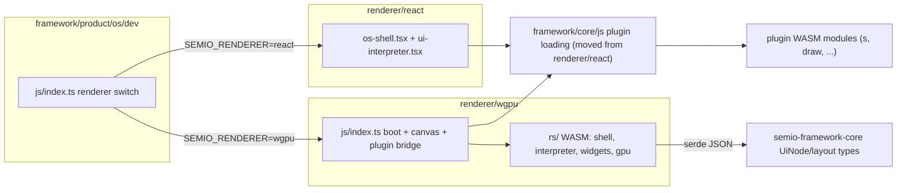

# Raw wgpu Renderer for the Framework

## Goal

Add `framework/renderer/wgpu` — a renderer implemented only in Rust on raw wgpu — as a peer of [framework/renderer/react](framework/renderer/react/index.tsx). Both renderers interpret the same `UiNode` tree that plugins return (defined in [framework/core/rs/ui.rs](framework/core/rs/ui.rs), mirrored in [framework/wit/world.wit](framework/wit/world.wit)). The os-dev host gains a renderer switch, and the launch config `🛠️dev🖥️s` splits into `🛠️dev🖥️s⚛️react` (current behavior) and `🛠️dev🖥️s🧊wgpu` (new).

Decisions already made: the wgpu renderer runs in the browser (wasm32 + wasm-bindgen, fullscreen `<canvas>`, WebGPU surface via `wgpu::SurfaceTarget::Canvas` like [infinite/cavas/rs/lib.rs](infinite/cavas/rs/lib.rs)); the GPU stack is strictly raw wgpu — hand-written WGSL shaders, own glyph atlas, own vector tessellation. No Vello, glyphon, lyon, egui, or winit. CPU-side font parsing/rasterization uses `ttf-parser` + `fontdue` (pixels in, our atlas and shaders out); everything GPU-side is hand-rolled.

## Architecture

Plugins stay separate wasm-bindgen modules (unchanged). The wgpu renderer WASM receives a small JS bridge (manifest/createApp/handleCommand/render as `js_sys::Function`s returning JSON strings) and deserializes straight into `semio_framework_core::UiNode` via serde — one shared source of truth, no TS mirror.

## New code: `framework/renderer/wgpu/`

- `rs/Cargo.toml` — crate `semio-framework-renderer-wgpu`, deps: `wgpu`, `wasm-bindgen`, `wasm-bindgen-futures`, `web-sys`, `js-sys`, `serde`/`serde_json`, `ttf-parser`, `fontdue`, `semio-framework-core`. Added to workspace `Cargo.toml`.
- `rs/lib.rs` — wasm-bindgen entry `semio_renderer_boot(canvas, bridge, options)`; module tree via `pub mod` regions:
  - `gpu` — device/queue/surface setup, resize/DPI, frame loop driven by `requestAnimationFrame`.
  - `draw` — retained draw list lowered to two hand-rolled pipelines: (1) instanced UI quads with SDF rounded rects/borders, glyph atlas sampling, texture sampling, scissor clipping; (2) vector fill/stroke with own stroke expansion and ear-clipping tessellation. WGSL shaders embedded as consts.
  - `text` — font loading (bundle the UI font already shipped by `@semio-tech/ui-asset`), fontdue rasterization into an R8 atlas with shelf packing, shaping-lite (kerning via ttf-parser), line breaking and measurement.
  - `input` — DOM listeners (pointer, wheel, keyboard, IME-lite for inputs) via web-sys; hit testing against the widget tree; focus/hover state.
  - `widgets` — immediate-per-frame widget layer: stack layout, text, button, separator, input, select, toggle, vec3, key-value, slider, number-stepper, ring, icon-select, field, section, tree — one widget per `UiNode` variant, emitting commands identical to what [framework/renderer/react/ui-interpreter.tsx](framework/renderer/react/ui-interpreter.tsx) emits.
  - `shell` — OS chrome parity with [framework/renderer/react/os-shell.tsx](framework/renderer/react/os-shell.tsx): plugin manifests, session lifecycle (createApp/handleCommand/render round-trips), studio mode (`plugin == "s"`), navbar, panel tabs, window layouts and engagement from [framework/core/rs/layout.rs](framework/core/rs/layout.rs).
  - `scenes` — `componentScene` hosts rendered natively: `raster` (texture quad), `table`, `canvas-2d` (interpret the scene payload from `build_canvas_2d_scene`), `node-graph`, `flow-canvas`, `virtualFileSystem`, `text-editor` (read/edit-basic), `world-3d` (own 3D mesh pipeline: depth buffer, orbit camera, flat/lambert shading).
- `js/index.ts` — `bootFrameworkOsWgpu(options)`: create fullscreen canvas, load renderer WASM module (built to `framework/product/os/dev/public/renderer-modules/wgpu/`), load plugin modules via the shared loader, hand the bridge to Rust.
- `package.json` (`@semio-tech/framework-renderer-wgpu`), `project.json` (tags `scope:framework`, `type:renderer`, targets via script), `script.ts` (test + wasm build helpers), `index.test.ts` extending the existing test pattern of [framework/renderer/react/index.test.ts](framework/renderer/react/index.test.ts).

## Refactor: shared plugin loading

Move the plugin module loader from [framework/renderer/react/plugin-runtime.ts](framework/renderer/react/plugin-runtime.ts) into [framework/core/js/index.ts](framework/core/js/index.ts) (region `PluginRuntime`), since both renderers need identical wasm-bindgen plugin loading. `renderer/react` re-exports it to keep its public API (`loadPluginWasm`, `PluginWasmHandle`).

## Dev host wiring: `framework/product/os/dev`

- [script.ts](framework/product/os/dev/script.ts): add a `RendererBuildScript` that cargo-builds `semio-framework-renderer-wgpu` for `wasm32-unknown-unknown` and runs wasm-bindgen into `public/renderer-modules/wgpu/` (same pattern as `buildPlugin`). `DevScript` reads `SEMIO_RENDERER` (default `react`), builds the wgpu renderer only when needed, and passes it through to Vite.
- [js/vite.config.ts](framework/product/os/dev/js/vite.config.ts): define `VITE_SEMIO_RENDERER`, add alias for `@semio-tech/framework-renderer-wgpu`.
- [js/index.ts](framework/product/os/dev/js/index.ts): branch on renderer — `react` boots `bootFrameworkOs` as today; `wgpu` boots `bootFrameworkOsWgpu` (dynamic import so the React bundle isn't pulled in for wgpu mode).

## launch.json

In [.vscode/launch.json](.vscode/launch.json), following existing order/grouping/naming:

- Rename `🛠️dev🖥️s` (line 947) to `🛠️dev🖥️s⚛️react` — unchanged command, `S_OS_PORT=6066`, `SEMIO_PLUGIN=s`, plus explicit `SEMIO_RENDERER=react`.
- Add `🛠️dev🖥️s🧊wgpu` — same nx target, `S_OS_PORT=6067`, `SEMIO_PLUGIN=s`, `SEMIO_RENDERER=wgpu` (distinct port so both renderers can run side by side).

## Delivery order (all inside one ticket via repo MCP)

Phased so the renderer is bootable early and gains parity incrementally; each phase is verified at runtime in the dev host with `[DEBUG]` logs before moving on.

1. Scaffold + wiring: crate, npm package, dev-host renderer switch, launch entries; wgpu surface clears the canvas.
2. GPU foundation: quad/SDF pipeline, glyph atlas text, textures, scissor clipping, DPI/resize.
3. UiNode interpreter + all control widgets with input handling and command emission.
4. Shell chrome parity: sessions, manifest-driven navbar/panels/layouts, studio mode.
5. componentScene hosts, easiest first: raster, table, canvas-2d, node-graph, flow-canvas, virtualFileSystem, text-editor, world-3d.
6. Tests (extend existing test files; cargo unit tests for tessellation/atlas/layout in `rs/`) and end-to-end verification of `s` studio mode plus a single-plugin mode (e.g. `draw`) under the wgpu renderer.

## Scope notes

- This is a very large build (a UI toolkit from scratch); the phases above are ordered so `dev s wgpu` is runnable from phase 1 and each later phase only widens coverage.
- Rich-text editing (`text-editor`) and full `world-3d` parity with the R3F host are the two hardest hosts; they land last and start with faithful read/basic-interaction rendering, then deepen.
- CPU font rasterization uses `fontdue` (pure Rust, not a wgpu wrapper). If you want glyph rasterization hand-rolled too, that adds a substantial extra effort — flag it and I'll extend the plan.
