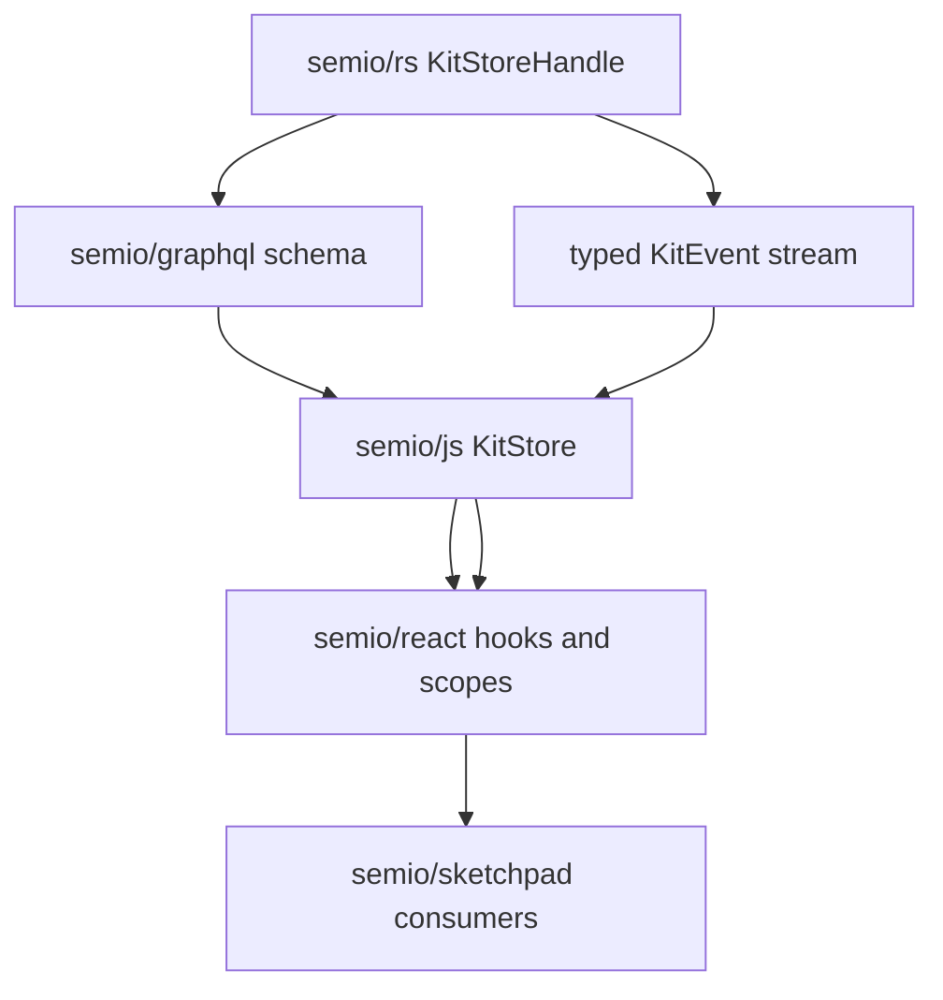

# Semio React Hook And Scope Refactor

## Scope

- Continue under the existing open store/read-scope work rather than creating a separate architecture track: `Scoped Kit Read Refactor`, `Single Async Kitstore Export In semio/js`, and the active Rust control-plane plan in [.cursor/plans/rust-control-plane-refactor_e1a81d8a.plan.md](.cursor/plans/rust-control-plane-refactor_e1a81d8a.plan.md).
- Main implementation files: [semio/react/index.tsx](semio/react/index.tsx), [semio/js/index.ts](semio/js/index.ts), [semio/graphql/schema.graphql](semio/graphql/schema.graphql), [semio/rs/lib.rs](semio/rs/lib.rs), and only the necessary consumer updates in [semio/sketchpad/index.tsx](semio/sketchpad/index.tsx).

## Target Architecture

- `semio/rs` remains the source of truth for kit data, scoped reads, semantic change commands, inverse changes, GraphQL schema, and kit events.
- `semio/js` exposes one typed async `KitStore` facade: GraphQL read batches, scoped write batches, event subscriptions, and store entity handles. It should not leak old shell wording, JSON-ish command shortcuts, or duplicate read helpers.
- `semio/react` becomes only React integration: providers, scopes, `useSyncExternalStore` live reads, command hooks, and write status. It should not scan DTO snapshots for authoritative reads or construct business mutations beyond typed `@semio/js` command helpers.
- `semio/sketchpad` uses `@semio/react` hooks/scopes only. No direct DTO diffing, manual kit patching, or store authority bypasses.

## Implementation Plan

1. Stabilize the Rust/GraphQL control plane first.
   - Finish the existing Rust helper work so all `ChangeKitCommand` apply, inverse, batch result, and event emission paths share one implementation in [semio/rs/lib.rs](semio/rs/lib.rs).
   - Regenerate or update [semio/graphql/schema.graphql](semio/graphql/schema.graphql) only when Rust SDL changes.

2. Collapse `semio/js` to one store API.
   - Keep `KitStore.read(scope, batch)`, `KitStore.subscribe`, scoped transaction batch APIs, and entity handle factories as the public boundary.
   - Remove or replace old shell/lifecycle naming and duplicate convenience paths where they bypass the unified batch/read/event path.
   - Make event invalidation helpers precise and reusable by React hooks.

3. Refactor React scopes.
   - Replace the split mental model between `KitDataScopeContext`, `KitShellScopeContext`, `SchemaScopeContext`, `kitReadScope`, and `kitWriteScope` with a small explicit scope model: kit id, read scope, optional write scope, and entity scope.
   - Keep compatibility aliases only when they are true aliases in the same file, not parallel behavior.
   - Ensure `KitScope` creates or receives exactly one `KitStoreClient`/`KitStore` bridge and does not maintain a second authoritative DTO graph.

4. Refactor React hooks.
   - Convert full-snapshot hooks like `useTypesFull`, `useDesignsFull`, `useFilesFull`, and generated schema field hooks onto `KitStore.read` or entity-store methods where Rust already supports the read.
   - Keep `useSyncExternalStore` for all live reads and use typed `KitEvent` filters as invalidation, not whole-store snapshot subscriptions.
   - Deduplicate repeated command-hook boilerplate with one command hook factory that handles readonly, pending, errors, and `pushSetRejection` consistently.
   - Remove smelly legacy paths: DTO scanning as source of truth, `any`-heavy generated hooks where a typed read exists, direct `KitHostStore` writes except host file/blob persistence, and old “classicWritable” fallbacks after Rust-backed commands cover the field.

5. Update sketchpad consumers narrowly.
   - Replace any remaining direct/general kit hooks with the new scoped React hooks.
   - Keep app UI state separate from kit data; kit reads and mutations go through the scoped React surface only.
   - Preserve existing test structure and add regression coverage in existing React/sketchpad test sections.

## Verification

- Run `npm run test` and `npm run build` in [semio/react](semio/react).
- Run the relevant [semio/js](semio/js) tests/build after store API changes.
- Run `cargo fmt`, `cargo test --lib`, and SDL/schema checks in [semio/rs](semio/rs) when Rust changes.
- Run targeted [semio/sketchpad](semio/sketchpad) Playwright slices for the consumers touched, then broaden if the hook boundary changes affect shared app flows.
