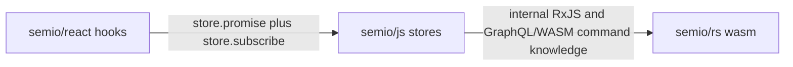

# React JS Store Boundary Refactor

## Scope

This continues the existing strict layering work in [`.cursor/plans/strict_semio_layering_refactor_205dc73c.plan.md`](.cursor/plans/strict_semio_layering_refactor_205dc73c.plan.md), specifically the in-progress `react_thin` and pending `js_stores` items.

Primary files:

- [`semio/js/index.ts`](semio/js/index.ts): make this the only owner of command wire shapes, `LiveKitRoot`, read stores, RxJS subjects, and promise-based store operations.
- [`semio/react/index.tsx`](semio/react/index.tsx): remove command wire construction and direct read command access; consume only JS stores through `Promise` methods plus `subscribe`.
- [`semio/react/package.json`](semio/react/package.json): remove unused direct dependencies after React no longer imports RxJS/Zod-backed command/schema internals directly.
- [`semio/react/tsconfig.json`](semio/react/tsconfig.json) and [`semio/react/vite.config.ts`](semio/react/vite.config.ts): remove direct `@semio/rs-wasm` aliases from React once no longer needed.

Target flow:

## Implementation Plan

1. Start execution by using the repo MCP workflow: inspect tickets with `search`, associate this with the strict layering/running sketchpad goal, reopen an existing matching ticket if present, otherwise open a ticket titled `React JS Store Boundary Refactor`. Close it after validation with touched files and summary.

2. In [`semio/js/index.ts`](semio/js/index.ts), introduce or finish a clean public store API that React can consume without wire knowledge:
   - Keep RxJS private inside `KitStore` and expose only `(handler) => Unsubscribe` subscriptions.
   - Make `KitStoreClient.subscribe` pass the actual typed kit event instead of `undefined` so React never needs a mirrored lifecycle guard.
   - Add JS-owned helpers/methods for schema field/object updates, add/remove entity operations, design/piece/connection mutations, and live reads currently built in React.
   - Move `buildSchemaEntityChangeCommands`, `piecePatchToWireCommands`, `connectionPatchToWireCommands`, and add/remove command construction into JS-owned store methods.
   - Expose read APIs such as `pieceFlatPlane`, `pieceFlatCenter`, `pieceParentConnection`, included designs, clusterable groups, quality sums, and best representation as store promise methods; keep `LiveKitRoot` internal to JS.

3. In [`semio/react/index.tsx`](semio/react/index.tsx), thin the runtime context and hooks:
   - Remove imports/re-exports of command wires, `KitCommandFacade`, `KitTypedShellCommand`, `executeSemioKitCommand`, `LiveKitRoot`, `kitEventAffects*`, and JS read-store classes.
   - Replace `submitChangeKitCommands` and local command builders with calls to JS store/client methods.
   - Replace `new LiveKitRoot(c.kitGraphql())...` reads with JS promise methods wrapped by the existing `useSyncExternalStore` pattern.
   - Keep React responsibilities to scopes, context, hook status, `useSyncExternalStore`, `useCallback`, and JSX-safe ergonomics.

4. Normalize subscriptions in JS so React hooks subscribe to store keys or store handles, not command/event internals:
   - Current `SemioKitViewStore`, `SemioKitDesignReadStore`, and shallow stores broadly invalidate on every event. Preserve correctness first, then narrow invalidation where event data already provides enough scope.
   - Ensure every read snapshot has stable versioning or stable references so `useSyncExternalStore` updates predictably.

5. Update existing embedded tests only, without creating new test files:
   - Extend [`semio/js/index.ts`](semio/js/index.ts) tests for private RxJS/public callback API, typed event delivery through `KitStoreClient.subscribe`, moved command builders, and store promise methods.
   - Extend [`semio/react/index.tsx`](semio/react/index.tsx) tests to assert React no longer imports/exposes command wire helpers or `LiveKitRoot`, and hooks call store methods plus subscribe methods rather than constructing command wires.

6. Run validation after implementation:
   - `npm run build --workspace @semio/js`
   - `npm run test --workspace @semio/js`
   - `npm run build --workspace @semio/react`
   - `npm run test --workspace @semio/react`
   - Add a workspace-level layer/import check if one is already available in scripts; otherwise report that no such script was found.

## Notes

- This plan intentionally does not preserve legacy React command APIs where they leak `semio/rs` command vocabulary. Existing sketchpad consumers will be updated only as needed to compile against the thinner React API.
- The repo currently has unrelated modified files. During execution, edits will be limited to the files required for this boundary and will not revert unrelated user or agent work.
