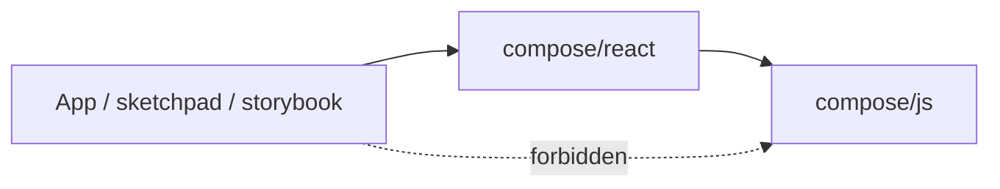
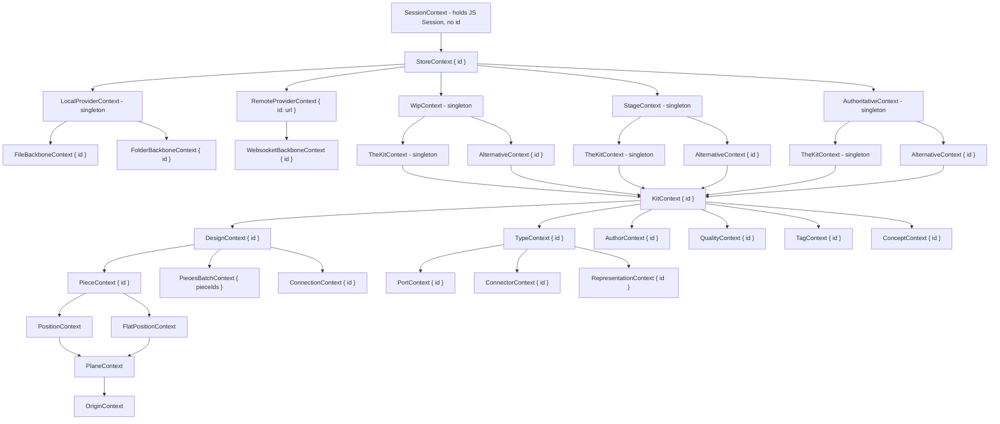

## Goal

Rewrite [compose/client/lib/react/index.tsx](compose/client/lib/react/index.tsx) so that it is the **only** way React consumers touch compose data. The file:

- mirrors `schema.golden.graphql` entity tree 1:1,
- exposes one context per entity carrying only `{ id }`,
- exposes one `useX(id?: string)` per strong entity (at most one optional argument — **that entity's id only**; parents come from context),
- exposes one hook per field (`useDesignName`, `usePiecePosition`, …) and one hook per mutation (`useRenameDesign`, `useMovePiece`, …), each with the same rule: optional `id` is only the owning/receiver entity,
- **never** leaks a `compose/js` class to consumers (no `Kit`, `Design`, `Piece`, `Position`, `Plane` _instance methods_ on the React surface — only the plain value types pass through).

## Sealed surface



Consumers import **only** `@semio-tech/compose-react`. compose/js is an implementation detail.

## Context tree (mirrors schema)



The three graph-tier contexts (`WipContext`, `StageContext`, `AuthoritativeContext`) are mutually exclusive siblings under `StoreContext` — exactly one is mounted at a time. The two workspace-tier contexts (`TheKitContext`, `AlternativeContext`) are mutually exclusive siblings under whichever graph tier is mounted. The three backbone-tier contexts (`FileBackboneContext`, `FolderBackboneContext`, `WebsocketBackboneContext`) are mutually exclusive siblings under whichever provider tier is mounted — `FileBackboneContext` and `FolderBackboneContext` are legal children of `LocalProviderContext`; `WebsocketBackboneContext` is the legal child of `RemoteProviderContext`. Internally each resolves to the matching `compose/js` graph / workspace / backbone handle (`store.wip()`, `store.stage()`, `store.authoritative()`; `graph.theKit()`, `graph.alternative(id)`; `localProvider.fileBackbone(id)`, `localProvider.folderBackbone(id)`, `remoteProvider.websocketBackbone(id)`).

`PiecesBatchContext` is optional under `DesignContext` — it carries `{ pieceIds: readonly string[] }` so `useDragPieces` / `useMovePieces` / `useFixPieces` / `useChangePiecesBlueprint` need **no** hook parameters beyond the mutation args (design scope comes from `DesignContext`).

`Position`, `FlatPosition`, `Plane`, `Origin` are weak entities (no id); their contexts are markers — `usePosition() / useFlatPosition() / usePlane() / useOrigin()` resolve through `usePiece()`.

## Public types

```ts
export type FieldReadState<T> = Readonly<{
 value: T | undefined;
 loading: boolean;
 error: unknown;
 refresh: () => Promise<void>;
}>;

export type EntityReadState = FieldReadState<Readonly<{ id: string }>>;

export type OperationStatus = { readonly kind: "idle" } | { readonly kind: "pending" } | { readonly kind: "settled"; readonly result: SetResult };
```

`EntityReadState` has the **same shape** as `FieldReadState<T>` — it is just `FieldReadState` specialized to `{ id: string }`. Every entity hook returns `{ value: { id } | undefined, loading, error, refresh }`. A single `EntityReadState` is shared by every entity hook return — no per-entity aliases.

List rows are plain `Readonly<{ id: string }>` payloads (not nested `EntityReadState`); the list itself is the `FieldReadState<readonly { id: string }[]>` carrying loading/error/refresh for the whole list.

Plain data passthroughs (`Attribute`, `Benchmark`, `Coordinate`, `Plane`, `Point`, `Vector`, `Position`, `Offset`, `Place`, `Side`, `PositionInput`, `OffsetInput`, `SetResult`, `SetError`, `GraphRootKind`, `PieceBlueprint`, `ConnectionSide`, `KitReadPoint`) are re-exported — these are data types, not entity classes.

## Public hooks

Every hook below is exported. **Optional hook parameters:** at most one `id?: string`, and it is **always** that hook's own entity id (e.g. `useConnection(id?)` — never `designId`; parent `Design` comes from `DesignContext`). Parent scope is **only** from composed providers. `useRemoteProvider(id?)` uses the RemoteProvider identity (`url` in the schema) as that single `id` string.

### Entity hooks (one per entity, returns `EntityReadState`)

```ts
useSession(): EntityReadState;                                         // marker only
useStore(id?: string): EntityReadState;
// graph tier — three sibling hooks, mutually exclusive (one of their contexts must be mounted)
useWip(): EntityReadState;                                             // marker only
useStage(): EntityReadState;                                           // marker only
useAuthoritative(): EntityReadState;                                   // marker only
// workspace tier — two sibling hooks, mutually exclusive
useTheKit(): EntityReadState;                                          // marker only (singleton)
useAlternative(id?: string): EntityReadState;
useKit(id?: string): EntityReadState;
useDesign(id?: string): EntityReadState;
useType(id?: string): EntityReadState;
useAuthor(id?: string): EntityReadState;
useQuality(id?: string): EntityReadState;
useTag(id?: string): EntityReadState;
useConcept(id?: string): EntityReadState;
usePiece(id?: string): EntityReadState;                               // Design from DesignContext only
useConnection(id?: string): EntityReadState;                           // Design from DesignContext only
usePort(id?: string): EntityReadState;                                 // Type from TypeContext only
useConnector(id?: string): EntityReadState;
useRepresentation(id?: string): EntityReadState;
useLocalProvider(): EntityReadState;
useRemoteProvider(id?: string): EntityReadState;                      // id is the provider url (schema RemoteProvider.url)
// backbone tier — three sibling hooks, mutually exclusive under their provider tier
useFileBackbone(id?: string): EntityReadState;
useFolderBackbone(id?: string): EntityReadState;
useWebsocketBackbone(id?: string): EntityReadState;
// weak entities (no GraphQL id) — no optional id; resolve only through PieceContext + marker contexts
usePosition(): FieldReadState<Position>;
useFlatPosition(): FieldReadState<Position>;
usePlane(): FieldReadState<Plane | null>;
useOrigin(): FieldReadState<Point | null>;
```

### Field hooks (one per (entity, field), returns `FieldReadState<T>`)

Examples — one per schema field. Each takes at most `id?: string` for **that field's owning entity** only:

```ts
useKitName(id?: string): FieldReadState<string>;
useKitDescription(id?: string): FieldReadState<string>;
useKitIcon(id?: string): FieldReadState<string>;
useKitImage(id?: string): FieldReadState<string>;
useDesignName(id?: string): FieldReadState<string>;
useDesignDescription(id?: string): FieldReadState<string>;
useDesignQualitySum(id?: string): FieldReadState<number>;
usePieceName(id?: string): FieldReadState<string>;
usePieceScale(id?: string): FieldReadState<number | null>;
usePieceBlueprint(id?: string): FieldReadState<PieceBlueprint | null>;
useConnectionGap(id?: string): FieldReadState<number | null>;
// …full per-field roster expanded to match every field on every entity in the schema
```

### Operation hooks (one per (entity, mutation), returns `[run, status]`)

```ts
useRenameKit(): readonly [(name: string) => Promise<SetResult>, OperationStatus];
useChangeKitDescription(): readonly [(d: string) => Promise<SetResult>, OperationStatus];
useCreateDesign(): readonly [(name: string, …opts) => Promise<SetResult>, OperationStatus];
useDeleteDesign(): readonly [(id: string) => Promise<SetResult>, OperationStatus];
useRenameDesign(id?: string): readonly [(name: string) => Promise<SetResult>, OperationStatus];
useFlattenDesign(id?: string): readonly [() => Promise<SetResult>, OperationStatus];
useAddFixedPiece(id?: string): readonly [(blueprintId, pos, name?, desc?) => Promise<SetResult>, OperationStatus>;
useDragPiece(id?: string): readonly [(offset: OffsetInput) => Promise<SetResult>, OperationStatus];
useMovePiece(id?: string): readonly [(pos: PositionInput) => Promise<SetResult>, OperationStatus];
useFixPiece(id?: string): readonly [() => Promise<SetResult>, OperationStatus];
useDeletePiece(id?: string): readonly [() => Promise<SetResult>, OperationStatus];
useDragPieces(): readonly [(offset: OffsetInput) => Promise<SetResult>, OperationStatus];   // pieceIds from PiecesBatchContext
useMovePieces(): readonly [(offset: OffsetInput) => Promise<SetResult>, OperationStatus];
// …full per-mutation roster covering Tag, Concept, Quality, Type, Port, Connector, Representation, Author, Piece, Connection, Backbone, Session, Provider …
```

### List hooks (id-list-stable, plain rows only)

```ts
type IdRow = Readonly<{ id: string }>;

useKitDesigns(id?: string): FieldReadState<readonly IdRow[]>;
useKitTypes(id?: string): FieldReadState<readonly IdRow[]>;
useKitAuthors(id?: string): FieldReadState<readonly IdRow[]>;
useKitQualities(id?: string): FieldReadState<readonly IdRow[]>;
useKitTags(id?: string): FieldReadState<readonly IdRow[]>;
useKitConcepts(id?: string): FieldReadState<readonly IdRow[]>;
useDesignPieces(id?: string): FieldReadState<readonly IdRow[]>;
useDesignConnections(id?: string): FieldReadState<readonly IdRow[]>;
useTypePorts(id?: string): FieldReadState<readonly IdRow[]>;
useTypeConnectors(id?: string): FieldReadState<readonly IdRow[]>;
useTypeRepresentations(id?: string): FieldReadState<readonly IdRow[]>;
usePieceChildPieces(id?: string): FieldReadState<readonly IdRow[]>;
usePieceChildConnections(id?: string): FieldReadState<readonly IdRow[]>;
```

Consumers iterate the rows under the matching `<XContextProvider id={row.id}>`.

## Composition example

The full chain — `SessionContext -> StoreContext (+ optional LocalProviderContext / BackboneContext siblings) -> WipContext | StageContext | AuthoritativeContext -> TheKitContext | AlternativeContext -> KitContext -> DesignContext | ... -> PieceContext | ... -> PositionContext | FlatPositionContext -> PlaneContext -> OriginContext -> useX()` — rendered with the new surface:

```tsx
import {
 SessionContextProvider,
 StoreContextProvider,
 LocalProviderContextProvider, // optional sibling
 FileBackboneContextProvider, // optional — OR FolderBackboneContextProvider under LocalProvider; OR WebsocketBackboneContextProvider under RemoteProvider
 WipContextProvider, // OR StageContextProvider, OR AuthoritativeContextProvider
 TheKitContextProvider, // OR AlternativeContextProvider
 KitContextProvider,
 DesignContextProvider,
 PieceContextProvider,
 PositionContextProvider, // OR FlatPositionContextProvider
 PlaneContextProvider,
 OriginContextProvider,
 useOrigin,
 type EntityReadState,
} from "@semio-tech/compose-react";

function App({ session, storeId, kitId, designId, pieceId }: { session: Session; storeId: string; kitId: string; designId: string; pieceId: string }) {
 return (
  <SessionContextProvider session={session}>
   <StoreContextProvider id={storeId}>
    <LocalProviderContextProvider>
     {" "}
     {/* optional */}
     <FileBackboneContextProvider id="file:default">
      {" "}
      {/* optional — pick exactly one backbone kind */}
      <WipContextProvider>
       <TheKitContextProvider>
        <KitContextProvider id={kitId}>
         <DesignContextProvider id={designId}>
          <PieceContextProvider id={pieceId}>
           <PositionContextProvider>
            <PlaneContextProvider>
             <OriginContextProvider>
              <PieceOriginReadout />
             </OriginContextProvider>
            </PlaneContextProvider>
           </PositionContextProvider>
          </PieceContextProvider>
         </DesignContextProvider>
        </KitContextProvider>
       </TheKitContextProvider>
      </WipContextProvider>
     </FileBackboneContextProvider>
    </LocalProviderContextProvider>
   </StoreContextProvider>
  </SessionContextProvider>
 );
}

// Swapping the graph tier — same tree, three valid mounts:
//   <WipContextProvider>            … </WipContextProvider>
//   <StageContextProvider>          … </StageContextProvider>
//   <AuthoritativeContextProvider>  … </AuthoritativeContextProvider>
// Swapping the workspace tier — same tree, two valid mounts:
//   <TheKitContextProvider>                 … </TheKitContextProvider>
//   <AlternativeContextProvider id={altId}> … </AlternativeContextProvider>
// Swapping the backbone tier — same tree, three valid mounts (pick the one matching the provider tier above):
//   <FileBackboneContextProvider      id={id}> … </FileBackboneContextProvider>      {/* under <LocalProviderContextProvider>  */}
//   <FolderBackboneContextProvider    id={id}> … </FolderBackboneContextProvider>    {/* under <LocalProviderContextProvider>  */}
//   <WebsocketBackboneContextProvider id={id}> … </WebsocketBackboneContextProvider> {/* under <RemoteProviderContextProvider> */}

function PieceOriginReadout() {
 const origin = useOrigin(); // resolves through every provider above
 return <span>{origin.value ? `${origin.value.x}, ${origin.value.y}, ${origin.value.z}` : "—"}</span>;
}
```

### Two equivalent ways to read

```tsx
// (a) via the matching context — preferred for tree-driven UIs
function NameInContext() {
 const piece: EntityReadState = usePiece(); // { value: { id } | undefined, loading, error, refresh }
 const { value: name } = usePieceName(); // walks PieceContext + DesignContext
 return (
  <span>
   {piece.value?.id}: {name}
  </span>
 );
}

// (b) same read without mounting PieceContext — wrap Design + pass only the piece id
function NameByPieceId({ pieceId }: { pieceId: string }) {
 const { value } = usePieceName(pieceId); // optional id is the Piece id only; Design still from DesignContext
 return <span>{value}</span>;
}
```

### Iterating list rows back into the tree

```tsx
function DesignPiecesList() {
 const { value: pieces } = useDesignPieces(); // FieldReadState<readonly { id: string }[]>
 return (
  <ul>
   {pieces?.map((p) => (
    <li key={p.id}>
     <PieceContextProvider id={p.id}>
      <PieceRow />
     </PieceContextProvider>
    </li>
   ))}
  </ul>
 );
}

function PieceRow() {
 const { value: name } = usePieceName();
 const [movePiece, status] = useMovePiece(); // resolves the piece via PieceContext
 return (
  <button disabled={status.kind === "pending"} onClick={() => void movePiece({ x: 0, y: 0 })}>
   {name}
  </button>
 );
}
```

In every example above the consumer never imports anything from `@semio-tech/compose-js` — the only handles in scope are `EntityReadState` rows, `FieldReadState` reads, and operation tuples.

## Private internals (NOT exported)

- `useJsSession(): Session` — reads the SessionContext; only callable inside this file.
- `useEntityField<E, T>(getEntity: () => E | null, read: (e: E) => Promise<T>, eventKind?: string): FieldReadState<T>` — the only place that touches compose/js entity instance methods. Subscribes to the entity's `on<Field>Changed` callback when available; otherwise falls back to bus-kind tick + refetch.
- `useEntityOperation<E, A>(getEntity: () => E | null, impl: (e: E, ...args: A) => Promise<SetResult>): [run, OperationStatus]` — same constraint.
- Per-entity resolver helpers (`resolveStore`, `resolveDesign`, `resolvePiece`, …) which compose **one** optional `id` for the target entity → context chain → JS handle (never multiple optional parent ids on the public hook surface).

## What gets deleted from the current file

- All public `bindFieldToReact*` / `bindOperationToReact*` / `bindStoreOperationToReact` / `bindPiecesOperationsOperationToReact` exports (they live on as private internals named `useEntityField` / `useEntityOperation`).
- `mapTooLong`, `FieldBindOptions`, `DefinedFieldBindOptions`, `KitFieldBindOptions`, `StoreFieldBindOptions` types — replaced by the private helpers.
- ShellHost block: `ActiveKitTab*`, `KitWasmMountProvider`, `KitWasmHostContext`, `useKitWasmHost`, `KitAlternativeSelectionProvider`, `useKitAlternativeSelection`, `useKitAlternatives`, `SketchpadKitStoreFactory`, `SketchpadKitKindAvailability` — sketchpad host concerns, removed.
- Context-row helpers (`useDesignContextRow`, `useHasDesignContext`, `useResolvedDesign`, `useResolvedType`, `usePieceContextRead`, `useTypeContextRead`, `useQualityContextRead`) and selection-helper providers (`PieceUnderActiveDesignProvider`, `ConnectionUnderActiveDesignProvider`) — superseded by the unified id-arg pattern.
- Bundle hooks `useDesigns`/`useTypes`/`usePieces` returning `{ designs }`/`{ types }`/`Piece[]` — replaced by `useKitDesigns`/`useKitTypes`/`useDesignPieces` returning `FieldReadState<readonly IdRow[]>`.
- Re-exports of compose/js **entity** classes (`Kit`, `Store`, `Graph`, `TheKit`, `Session`, `Design`, `Type`, `Piece`, `Connection`, `Port`, `Connector`, `Representation`, `Quality`, `Tag`, `Concept`, `Author`, `Backbone`, `Family`, `File`, `Folder`, `Layer`, `Group`, `Stat`, `Prop`, `Edit`, `Checkpoint`, `Change`, `Conflict`, `Alternative`, `PiecesOperations`, `EventBus`, `Store`, `createKitStoreWorker`, `openStore`, `theKitReadPoint`, `kitReadPointKey`, `defineField`, `defineFields`, `defineOperation`, `defineOperations`, `KIT_EVENT_STREAM_SUBSCRIPTION`). Of these, the only re-exports that survive are plain data classes/types: `Attribute`, `Benchmark`, `Coordinate`, `Plane`, `Point`, `Vector`, `Position`, `Offset`, `Place`, `Side`, plus the input/result types listed under "Public types".

## Acceptance

- No `compose/js` entity class is reachable from `@semio-tech/compose-react` (tested via banned-substring check on the file's export list).
- Every entity in the schema has a context, a provider, a `useX(id?)` hook, plus the matching field + operation hooks.
- Every hook accepts at most **one** optional `id` — always **that hook's own entity id**; parent scope is **only** from context (plus `PiecesBatchContext` for batch piece operations). Without `id`, hooks read the matching `XContext`.
- `bun nx run @semio-tech/compose-react:lint` + `tsc --noEmit` on `compose/react` pass in isolation.
- Embedded Vitest banned-substring scan and the new "no JS entity class exported" scan pass.

## Out of scope (follow-up tickets)

- Adding `on<Field>Changed` callbacks for every field on every `compose/js` entity class (only `Design.onDescriptionChanged` exists today). Until then the private `useEntityField` keeps the existing bus-tick refetch fallback.
- Migrating `compose/client/lib/sketchpad/index.tsx`, storybook stories, `client/ui/desktop`, `client/ui/3dm`, `client/ui/vscode`, `site/play` off the deleted shell-host helpers and onto the new context tree — explicitly out of scope per the confirmed `react-only` choice.
