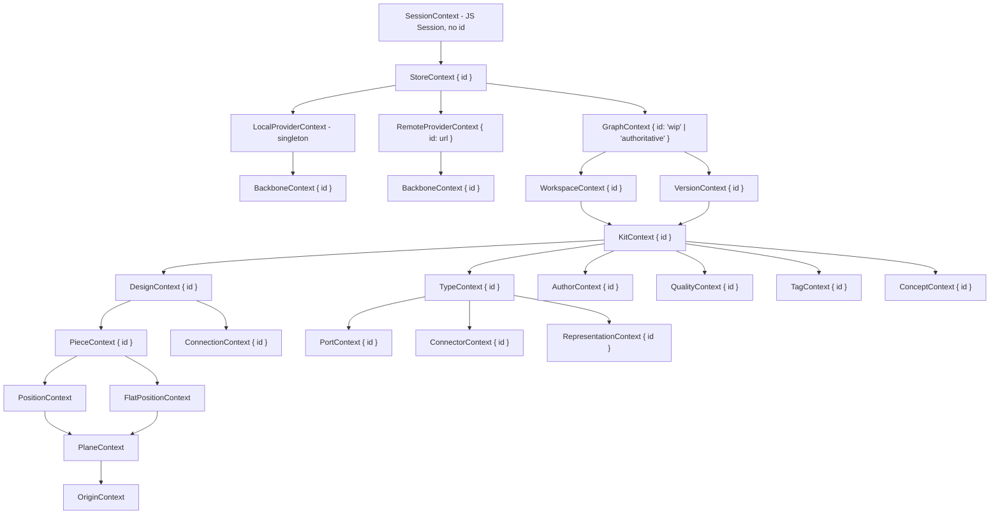

## Goal

Strip [semio/client/lib/react/index.tsx](semio/client/lib/react/index.tsx) (2278 lines) down to a thin composable layer that mirrors `schema.golden.graphql` 1:1. Every context value is `Readonly<{ id: string }>` (or empty for singletons). Every entity has exactly one `useX()` hook that returns the live `semio/js` entity by walking parent contexts. No per-field hooks, no per-operation hooks, no bundle hooks, no host shims live in this file.

## Context tree (mirrors schema)




`Position`, `FlatPosition`, `Plane`, `Origin` are weak entities (no GraphQL id); their contexts are markers — `usePosition()/usePlane()/useOrigin()` resolve through the parent `Piece` handle.

## File shape (final, ~250 lines)

Single region per concept; nothing else lives here.

- `// #region 🧷JsReexports` — re-export every `semio/js` value/type the React file consumes (`Session`, `Store`, `Graph`, `TheKit`, `Alternative`, `Kit`, `Design`, `Type`, `Piece`, `Connection`, `Port`, `Connector`, `Representation`, `Quality`, `Tag`, `Concept`, `Author`, `Position`, `Plane`, `Point`, `Vector`, `Coordinate`, …).
- `// #region 🪪Ids` — one `Readonly<{ id: string }>` typed context per entity:

```ts
export type StoreId = Readonly<{ id: string }>;
export const StoreContext = React.createContext<StoreId | null>(null);
// repeated for every entity in the diagram above
```

- `// #region 🎭Providers` — one `<XContextProvider id={…}>` per entity. Each provider only memoizes `{ id }` and renders `Context.Provider`. Workspace / Version / Graph providers accept their discriminating string (`"wip"|"authoritative"` for graph; workspace id for `TheKit`/`Alternative`).
- `// #region 📡SessionRoot` — `SessionContextProvider({ session })` and `useSession(): Session` (mandatory root, throws if absent). `SessionContext` is the only context whose value is the JS `Session` itself (the schema's top-level singleton has no id).
- `// #region 🪝Hooks` — exactly one hook per entity:

```ts
export function useStore(): Store {
  const session = useSession();
  const ctx = React.useContext(StoreContext);
  if (ctx == null) throw new Error("semio/react: useStore requires <StoreContextProvider id>");
  return React.useMemo(() => session.store(ctx.id), [session, ctx.id]);
}

export function useGraph(): Graph {
  const store = useStore();
  const ctx = React.useContext(GraphContext);
  if (ctx == null) throw new Error('semio/react: useGraph requires <GraphContextProvider id="wip"|"authoritative">');
  return React.useMemo(() => (ctx.id === "wip" ? store.wip() : store.authoritative()), [store, ctx.id]);
}

export function useKit(): Kit {
  const store = useStore();
  const wsCtx = React.useContext(WorkspaceContext);
  const verCtx = React.useContext(VersionContext);
  const kitCtx = React.useContext(KitContext);
  if (kitCtx == null) throw new Error("semio/react: useKit requires <KitContextProvider id>");
  return React.useMemo(() => new Kit(store.session, kitCtx.id, store.id), [store, kitCtx.id]);
}

export function useDesign(): Design { /* useStore().design(useContext(DesignContext).id) */ }
export function useType(): Type { /* … */ }
export function usePiece(): Piece { /* useDesign().piece(useContext(PieceContext).id) */ }
export function useConnection(): Connection { /* useDesign().connection(...) */ }
export function usePort(): Port { /* useType().port(...) */ }
export function useConnector(): Connector { /* useType().connector(...) */ }
export function useRepresentation(): Representation { /* useType().representation(...) */ }
export function useAuthor(): Author { /* useStore().author(...) */ }
export function useQuality(): Quality { /* useStore().quality(...) */ }
export function useTag(): Tag { /* useStore().tag(...) */ }
export function useConcept(): Concept { /* useStore().concept(...) */ }
// usePosition / useFlatPosition / usePlane / useOrigin return Position / Plane / Point handles via usePiece()
```

Every hook is pure context plumbing — no fetches, no `useState`, no `useEffect`, no parsing, no event-bus wiring. Field reads and mutations are exposed by `semio/js` entity methods and (future) `onXChanged` callbacks; React does not wrap them here.

- `// #region 🧪Vitest` — keep an `import.meta.vitest` block that asserts: (a) banned substrings remain absent (existing list), and (b) every provider/hook is exported. Drop the `mapTooLong` test (covered elsewhere).

## What gets deleted

- All `bindFieldToReact`, `bindDefinedFieldToReact`, `bindKitFieldToReact`, `bindStoreFieldToReact`, `bindOperationToReact`, `bindStoreOperationToReact`, `bindPiecesOperationsOperationToReact`.
- Every named per-field hook (`useKitName`, `useKitDescription`, `useDesignName`, `useDesignDescription`, `useTypeName`, `usePortCode`, `useConnectionGap`, `useRepresentationUrl`, etc. — ~80 hooks).
- Every named per-operation hook (`useRenameKit`, `useChangeKitDescription`, `useCreateType`, `useDeleteDesign`, `useRenameDesign`, `useFlattenDesign`, `useAddFixedPiece`, `useAddChildPieceWithParentConnection`, `useDeletePort`, `useDragPieces`, `useMovePieces`, etc. — ~60 hooks).
- Bundle/list hooks (`useKitDesigns`, `useKitTypes`, `useKitAuthors`, `useKitQualities`, `useKitTags`, `useKitConcepts`, `useDesignPieces`, `useDesignConnections`, `useDesigns`, `useTypes`, `usePieces`).
- Context-row / context-presence helpers (`useDesignContextRow`, `useHasDesignContext`, `useResolvedDesign`, `useResolvedType`, `usePieceContextRead`, `useTypeContextRead`, `useQualityContextRead`).
- Selection-helper providers (`PieceUnderActiveDesignProvider`, `ConnectionUnderActiveDesignProvider`).
- ShellHost block (`ActiveKitTab*`, `KitWasmMountProvider`, `KitWasmHostContext`, `useKitWasmHost`, `KitAlternativeSelectionProvider`, `useKitAlternativeSelection`, `useKitAlternatives`, `SketchpadKitStoreFactory`, `SketchpadKitKindAvailability`) — these are sketchpad host concerns. They are out of scope here; sketchpad will own them in its follow-up migration.
- `useWipGraph`, `useWipVersion`, `useWipKit`, `useAuthoritativeGraph`, `useSession()` returning a JS-Session field — replaced by the `Graph` / `Workspace` / `Kit` providers + hooks above (the new `useSession()` returns the JS transport `Session`).
- `mapTooLong`, `OperationStatus`, `FieldReadState`, `FieldBindOptions`, `DefinedFieldBindOptions`, `KitFieldBindOptions`, `StoreFieldBindOptions` — all gone.

## Acceptance

- File is ≤ ~300 lines.
- `bun run lint` and `tsc --noEmit` on `semio/react` pass in isolation. (Consumers in `semio/client/lib/sketchpad`, storybook stories, `client/ui/desktop`, `client/ui/3dm`, `client/ui/vscode`, `site/play` will break — out of scope per the user's confirmed `react-only` decision; their migration is a follow-up.)
- Embedded Vitest banned-substring scan passes; new test asserts every documented provider+hook is exported.
- No mention of `useDesignName`/`useRenameDesign`/etc.; no `bindFieldToReact`; no GraphQL selection strings; no `useState` / `useEffect` / `useSyncExternalStore` in the hooks.

## Out of scope (follow-up tickets)

- Adding `on<Field>Changed` callbacks for every field on every `semio/js` entity class (right now only `Design.onDescriptionChanged` exists). Without these, React consumers cannot observe field changes reactively — but per your scope decision this React-only ticket only sets up the surface that those callbacks will plug into.
- Migrating `semio/client/lib/sketchpad/index.tsx`, storybook stories, and other consumers off the deleted hooks.

