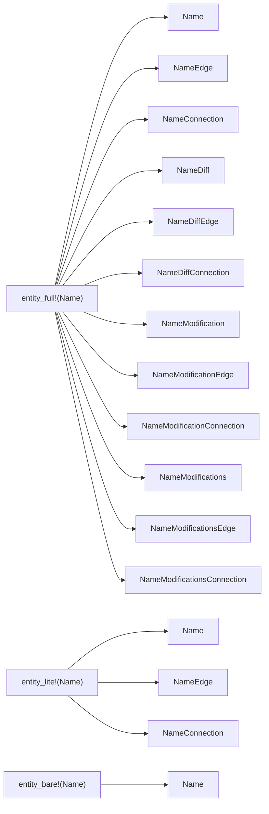

# Refactor lib.rs to golden schema

## Goal

Every declaration in [compose/schema/graphql/schema.golden.graphql](compose/schema/graphql/schema.golden.graphql) (985 declarations) gets exactly one Rust definition in [compose/client/lib/rs/lib.rs](compose/client/lib/rs/lib.rs):

- GraphQL `type` -> Rust `struct` with `#[Object]` or `#[derive(SimpleObject)]`
- GraphQL `interface` -> Rust enum with `#[derive(Interface)]`
- GraphQL `union` -> Rust enum with `#[derive(Union)]`
- GraphQL `input` -> Rust struct with `#[derive(InputObject)]`
- GraphQL `enum` -> Rust enum with `#[derive(Enum)]`
- GraphQL `scalar` -> Rust struct with `#[Scalar]`

The existing runtime (`kit_backbone`, `worker`, `event`, `kit_graph_engine`, `wasm_bridge`) is preserved and rewired to the new types with full resolver logic ported. Every Rust identifier (type names, field names via `#[graphql(name)]`) MUST match the GraphQL identifiers; non-GraphQL terms are forbidden in the public surface.

The test `schema_matches_target_graphql_file` (currently soft-warning) becomes the hard gate; the run is finished only when `cargo test -p compose --lib` passes with `COMPOSE_GOLDEN_STRICT=1`.

## Macro DSL (single source of truth)

All 985 declarations are produced by a small set of macros that live at the top of `lib.rs`. The golden schema uses **three different ladder shapes**, not one — the macros mirror that asymmetry.



### Ladder catalog (verified against [schema.golden.graphql](compose/schema/graphql/schema.golden.graphql))

- **Full 12-ladder (30 entities, 360 types):**
  - Geom (7): `Vector`, `Point`, `Coordinate`, `Offset`, `Plane`, `Position`, `Location`
  - Meta (12): `Attribute`, `Place`, `Family`, `Folder`, `File`, `Author`, `Prop`, `Benchmark`, `Quality`, `Tag`, `Concept`, `Stat`
  - Type domain (4): `Port`, `Connector`, `Representation`, `Type`
  - Design (4): `Side`, `Piece`, `Connection`, `Design`
  - Layers/Groups (2): `Layer`, `Group`
  - Kit (1): `Kit`
- **Lite 3-ladder (`Name` + `NameEdge` + `NameConnection`, no Diff/Modification):**
  - VCS rows: `Edit`, `Change`, `Checkpoint`, `TheKit`, `Alternative`, `Graph`, `Conflict`, `Session`
  - Composites: `Store`, `Version`, `Clump` (Clump has NO diff/modification ladder)
  - Backbones/Providers (concrete impls): `FileBackbone`, `WebsocketBackbone`, `RemoteProvider`
  - Domain operation aggregators (10): `KitOperation`, `QualityOperation`, `TagOperation`, `ConceptOperation`, `PortOperation`, `TypeOperation`, `ConnectorOperation`, `PieceOperation`, `PiecesOperation`, `DesignOperation`
  - Commands (10): `AlternativeCommand`, `UnsavedChangeCommand`, `VersionCommand`, `StoreCommand`, `FileBackboneCommand`, `LocalProviderCommand`, `WebsocketBackboneCommand`, `RemoteProviderCommand`, `SessionCommand` (+ `BackboneCommandConnection`/`ProviderCommandConnection` shells from interfaces)
  - Concrete `Operation` impls (~74): `CreatedQuality`, `RenamedQuality`, … all operation type names
  - Concrete `Input` impls (~60): `CreatedQualityInput`, `RenamedQualityInput`, … (operations whose input is empty — `DeletedQuality`, `RemovedAttributeFromQuality`, etc. — get NO matching `Input` type)
  - Special: `PageInfo` (the `*Edge`/`*Connection` shells live with the interfaces section), `Blueprint` union with `BlueprintEdge`/`BlueprintConnection`
- **Bare (just the type, no Edge/Connection):**
  - `LocalProvider` — verified: golden has no `LocalProviderEdge`/`LocalProviderConnection`
  - `Query`, `Mutation`, `Subscription`

### Macros

- `entity_full! { kind = (Weak|Strong|Rich|Artifact|Document), Name { fields } }` — emits `Name` + the 12-ladder. The `kind` modifier injects the right interface trait fields (Weak hashes its id; Strong uses uuidv7; Rich/Artifact/Document add the rich/artifact/document field set).
- `entity_lite! { Name { fields } }` — emits `Name` + `NameEdge` + `NameConnection` only.
- `entity_bare! { Name { fields } }` — emits `Name` only (used for `LocalProvider` and Query/Mutation/Subscription roots).
- `operation_with_input! { Name, scope = ScopeEntity, input = NameInput { fields }, output = { fields } }` — emits `Name` (Operation impl, lite-ladder), `NameInput` (Input impl, lite-ladder). 6 types per call.
- `operation_no_input! { Name, scope = ScopeEntity, output = { fields } }` — emits `Name` only (lite-ladder). 3 types per call. Used by `DeletedQuality`, `RemovedAttributeFromQuality`, `FlattenedDesign`, etc.
- `interface! { Name : Parents { fields } => [Variants] }` — emits the `#[derive(Interface)]` enum.
- `union! { Name = [Variants] }` — emits the `#[derive(Union)]` enum (e.g. `Blueprint = Type | Design`).
- `enum_gql! { Name { Variants } }` — emits a `#[derive(Enum)]` (`BackboneStatus`, `PieceConnectionKind`, `VersionKind`). Named `enum_gql!` to avoid the Rust `enum` keyword.
- `scalar_gql! { Name }` — emits the scalar wrapper (used by `Timestamp`, `Color`).

A single internal helper `_ladder_relay_full!` emits the Diff/Modification/Modifications layers; `_ladder_relay_lite!` emits just Edge + Connection. The public entity macros expand to one of the two helpers + the per-shape `Name` body.

## Module layout inside lib.rs

```
lib.rs
  region scalars        Id, Timestamp, Color
  region macros         entity!/operation!/command!/interface!/union!/enum!
  region general        Node, Entity, EntityEdge, EntityConnection,
                        WeakEntity, StrongEntity, RichStrongEntity, Artifact,
                        Document, Event, Workspace, Input, Diff, Modification,
                        Modifications, Operation, Backbone, BackboneCommand,
                        Provider, ProviderCommand, PageInfo + ladders
  region geom           Vector, Point, Coordinate, Offset, Plane, Position,
                        Location  (+ inputs + 12-ladder each)
  region attribute      Attribute (+ 12-ladder)
  region kit_entities   Place, Family, Folder, File, Author, Prop, Benchmark,
                        Quality, Tag, Concept, Stat (+ 12-ladder each)
  region type_entities  Port, Connector, Representation, Type (+ 12-ladder)
  region design         Side, Piece, Connection, Design (+ 12-ladder),
                        Clump (3-ladder only)
  region layers_groups  Layer, Group (+ 12-ladder)
  region kit            Kit (+ 12-ladder)
  region operations     ~74 operation_with_input!/operation_no_input! invocations
                        + ~10 *Operation aggregator types (KitOperation,
                        QualityOperation, …) all 3-ladder only
  region vcs            Edit, Change, Checkpoint, TheKit, Alternative, Version,
                        Graph, Conflict, Session — all 3-ladder only
  region store_backbone Store, FileBackbone, WebsocketBackbone, RemoteProvider
                        (3-ladder), LocalProvider (bare, no Edge/Connection)
                        + every command type (3-ladder)
  region schema         Query, Mutation, Subscription
  region runtime        kit_graph_engine, kit_backbone, worker, event,
                        wasm_bridge (rewired to new struct names, full logic)
  region tests          schema_matches_target_graphql_file (strict),
                        kit_store_bundle_round_trip, worker guards, ...
```

## Execution: phased, with parallel subagents per phase

Each phase is a `ticket_open`/`ticket_close` cycle on its own ticket. Phases are sequential because they all touch `lib.rs`; within a phase, when independent regions can be edited disjointly, sub-tasks may be delegated to `generalPurpose` subagents in parallel.

- Phase 0 — Ticket + scaffold: open the umbrella ticket under goal `🎯runningsketchpad`; freeze macro DSL; gut `lib.rs` to scalars + macros + empty regions; existing runtime moved out into `tmp_legacy_runtime.rs.txt` inside the ticket folder for porting reference.
- Phase 1 — Foundation: scalars (`Timestamp`, `Color`), the three ladder macros (`entity_full!`, `entity_lite!`, `entity_bare!`) plus operation/union/enum/interface helpers, all general interfaces (`Node`, `Entity`, …, `Operation`, `Backbone`, `BackboneCommand`, `Provider`, `ProviderCommand`) and `PageInfo` + their Edge/Connection (lite-ladder).
- Phase 2 — Geom: Vector/Point/Coordinate/Offset/Plane/Position/Location with **full 12-ladders** + GraphQL inputs.
- Phase 3 — Meta: Attribute + Place/Family/Folder/File/Author/Prop/Benchmark/Quality/Tag/Concept/Stat with **full 12-ladders**. (parallel: subagent A = Attribute+Place+Family+Folder+File+Author; subagent B = Prop+Benchmark+Quality+Tag+Concept+Stat).
- Phase 4 — Type domain: Port, Connector, Representation, Type with **full 12-ladders**.
- Phase 5 — Design domain: Side/Piece/Connection/Design with **full 12-ladders**; **Clump with lite 3-ladder only**; Layer/Group with full 12-ladders; Blueprint union (+ BlueprintEdge/BlueprintConnection) + PieceConnectionKind enum.
- Phase 6 — Kit: Kit (full 12-ladder) + KitOperation aggregator (lite-ladder) + full KitDiff/KitModification body matching golden.
- Phase 7 — Operations: ~74 `operation_with_input!`/`operation_no_input!` invocations (lite-ladder; no diff/modification) (parallel: one subagent per operation domain — quality, tag, concept, port, type, connector, piece, design, kit). The 10 `*Operation` aggregator types (`QualityOperation`, …) emit lite-ladder only.
- Phase 8 — VCS: Edit, Change, Checkpoint, TheKit, Alternative, Version, Graph, Conflict, Session — all **lite 3-ladder only**, plus the `Workspace` interface enum.
- Phase 9 — Store + Backbones + Providers: Store, FileBackbone, WebsocketBackbone, RemoteProvider (lite 3-ladder), **LocalProvider (bare — no Edge/Connection)**, plus every Command type (lite 3-ladder).
- Phase 10 — Query/Mutation/Subscription: wire `node`, `entity`, `session`, `Mutation.session`, `Subscription.session`, `Subscription.operation` to runtime.
- Phase 11 — Runtime port: rewire `kit_graph_engine`, `kit_backbone`, `worker`, `event`, `wasm_bridge` to the new struct names. Preserve every behaviour; rename internal symbols where they collide with GraphQL names.
- Phase 12 — Strict golden gate: enable `COMPOSE_GOLDEN_STRICT=1` test. Fix every remaining drift. Run `cargo test -p compose --lib` and `bun scripts/export-schema.ts`. Confirm `bun nx run compose:build` succeeds.

## Naming rules (must)

- No `Type`, `Port`, `Prop`, `Stat`, `Layer`, `Model` etc. used as Rust identifiers in non-schema senses; the `kind` rule still applies (e.g. `BackboneKind`, never `BackboneType`).
- Internal helper structs that don't appear in the schema (e.g. previously `EntityOwnerWeak`, `GqlNode`, `ParentStore`) are renamed/removed:
  - `EntityOwnerWeak` -> deleted; runtime stores `Weak<...>` of the concrete `Entity` enum variant payload.
  - `GqlNode` -> deleted; runtime uses the golden `NodeInterface` enum.
  - `ParentStore` / `ChildStore` -> renamed to types that don't shadow GraphQL names (e.g. moved into `runtime` mod with non-schema prefixes such as `WipStoreRuntime`).
  - `AppSchema`, `EmptyEntityConnection`, `EntityInterface`, `NodeInterface`, etc. align with golden names.
- Every `#[graphql(name = ...)]` matches the golden identifier exactly (camelCase fields, PascalCase types, SCREAMING_SNAKE_CASE enum values).

## Validation

- `cargo test -p compose --lib --features COMPOSE_GOLDEN_STRICT` (or env var) — passes.
- `bun scripts/export-schema.ts` — produces `compose/schema/graphql/schema.graphql` byte-equal modulo whitespace to `schema.golden.graphql`.
- `bun nx run compose/client:build` and `:test` — green.
- `rg -n "FixMe|TODO|todo!\\(|unimplemented!\\(|placeholder" compose/client/lib/rs/lib.rs` — empty.
- The catalog count check: generated SDL contains exactly the 985 declarations enumerated in `c:/git/compose/.repo/all_type_names.txt`, no more, no less.

