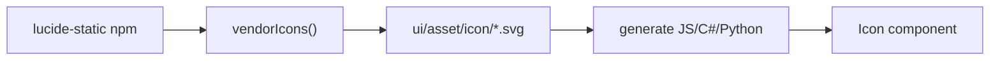
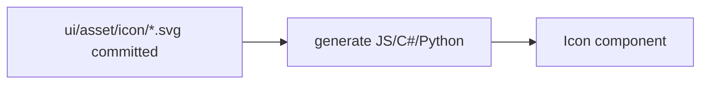

# Remove Icon Dependencies

Icons are already in-repo as SVGs (`ui/asset/icon/*.svg`, plus domain icons under `asset/icon/`). The only remaining icon packages are build-time Lucide vendors that re-copy those SVGs from `node_modules`. Runtime rendering already uses the in-house `Icon` component and committed assets — no `lucide-react` / `react-icons` / etc.

## Current state

Target:

## Approach

Drive the catalog **only from committed SVG files**. Adding/removing an icon is editing `ui/asset/icon/{id}.svg` and running generate — no npm package, no parallel ID list.

### 1. Drop packages

In [package.json](package.json), remove from `devDependencies`:

- `lucide`
- `lucide-static`

Refresh [bun.lock](bun.lock) with `bun install` so those packages leave the lockfile.

### 2. Make codegen self-contained

In [ui/asset/script.ts](ui/asset/script.ts):

- Delete `LUCIDE_VERSION`, `VENDORED_ICON_IDS`, `lucideStaticRoot`, and `vendorIcons`.
- Codegen entrypoints (`runGenerate` / `runGenerateAll`) only call `readVendoredSvgs(iconDir)` (rename to `readCatalogSvgs` for clarity).
- Keep SVG normalization (rename `normalizeLucideSvg` → `normalizeCatalogSvg`) so regenerate still strips root width/height and enforces `stroke="currentColor"`.
- Catalog ids = basenames of `ui/asset/icon/*.svg` (sorted). Fail if the folder is empty.
- `writeVendoredReadme` lists ids from disk and documents that chrome icons are **in-repo SVGs** (historical Lucide ISC attribution only — no package name, no “do not edit by hand / change VENDORED_ICON_IDS” instruction). New workflow: edit or add SVGs under `icon/`, then run `bun ./script.ts generate all`.

Update the module docstring and vitest cases to match the rename.

### 3. Stale references

- [coda/client/ui/desktop/js/vite.renderer.config.ts](coda/client/ui/desktop/js/vite.renderer.config.ts): remove `"lucide-react"` from `optimizeDeps.include`.
- [repo/client/cli/go/main.go](repo/client/cli/go/main.go): remove `"lucide-react"` from the two dependency allowlist strings (lines ~19924 and ~20336).

### 4. Verify

- Run `bun ./script.ts generate all` in `ui/asset` (must succeed without `node_modules/lucide-static`).
- Confirm generated bindings still match the 154 committed icons.
- Confirm no remaining `lucide` / `lucide-static` / `lucide-react` dependency declarations or imports outside historical attribution text.

## Out of scope

- Domain SVGs under `asset/icon/` and `asset/metabolism/icon/` are already local files — no package work.
- Icon wire formats (`url:`, emoji, etc.) and the `Icon` component API stay unchanged.
- Gemoji shortcode fetch (network, not an icon package) stays as-is.

## Ticket / goal

Associate with **Design App** (`designapp` / parent running sketchpad apps). Open ticket `REMOVE-ICON-DEPENDENCIES` on implementation.