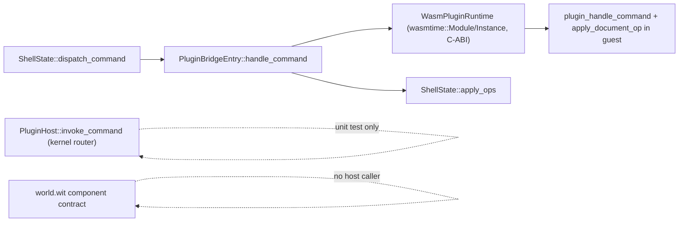

# Remove Plugin ABI Legacy — Finish the Command-Kernel Migration

## Current state (confirmed by audit)

No `framework/**` crate has a Cargo/TS dependency on a domain plugin crate today (`forms/rs` is a shared library, not a plugin — legitimate). The violation is not compile-time coupling, it's that the **previous refactor scaffolded the new kernel/component architecture next to the old one instead of replacing it**, so the old path is what actually runs:

Plus framework code hardcodes specific plugin identities, which also violates "framework has no dependency on any plugin" in spirit even though it's not a `Cargo.toml` edge:

- `load_wasm_plugins` hardcodes the full 21-plugin ID list at [framework/renderer/wgpu/rs/lib.rs:4812-4816](framework/renderer/wgpu/rs/lib.rs)
- `OS_RESOURCE_KIND_IDS` hardcodes domain resource kinds like `"3d.lowpoly"` at [framework/product/os/core/rs/lib.rs:4169-4196](framework/product/os/core/rs/lib.rs)
- Studio/dev defaults hardcode plugin id `"s"` in `framework/renderer/wgpu/rs/bin.rs` and `framework/product/os/dev/script.ts`
- `cargo test -p s-plugin` is special-cased in the verify step of `framework/product/os/dev/script.ts:504`

This plan deletes the dead/duplicate code, makes the component model the only transport (native via `wasmtime::component`, browser via `jco`), wires the kernel router into live dispatch, unifies the capability model, and makes framework code plugin-agnostic (driven by the generated registry / runtime manifests, never hardcoded IDs).

## Phase 1 — Delete the C-ABI/wasm-bindgen guest export path

In [framework/plugin/rs/lib.rs](framework/plugin/rs/lib.rs):

- Delete `wasm_plugin_exports!` (lines ~1193-1275, already dead — no `wasm_bindgen` dep).
- Delete `native_plugin_exports!` (lines ~1277-1430) and its `semio_plugin_alloc`/CString marshaling helpers.
- Delete the duplicate `apply_document_op`/`merge_json` guest-side helpers (lines ~1153-1191); document mutation moves entirely to the host via kernel `KernelOperation`s applied through `vcs`.
- Collapse `plugin_exports!` to be a direct alias for the WIT component export path (no `cfg(target_env = "p2")` branch, no fallback) — every plugin always exports the `semio:framework/plugin` world.
- Change `PluginApp::handle_command` to return the kernel `CommandResult`/`Vec<KernelOperation>` shape instead of `Vec<String>` JSON ops, so `component_plugin_exports!`'s `handle_command` no longer needs to synthesize `{"operations": ops}`.
- Remove the `wit-bindgen` `target_env = "p2"` cfg gate in `Cargo.toml` — it's the only target now.

Update all 21 plugin crates' `PluginApp::handle_command` implementations to return `KernelOperation`s directly (each currently returns `Vec<String>` patch ops).

## Phase 2 — Rebuild the host runtime on `wasmtime::component`

Rewrite [framework/plugin/host/rs/lib.rs](framework/plugin/host/rs/lib.rs):

- Replace the classic `wasmtime::{Module, Instance, Linker}` + manual C-string marshaling `WasmPluginRuntime` with `wasmtime::component::{Component, Linker, bindgen!}` generated from `framework/wit/world.wit`.
- Implement the `host` interface (`log`, `now-ms`, `read-model`, `write-model`, `open-window`, `invoke-command`, `read-asset`, `network-fetch`, `backbone-read`, `backbone-write`) as capability-gated host functions, checking against the kernel `Capability`/`CapabilityGrant` model (not the old `ManifestCapability::LocalBackboneStorage` single-variant check at line ~279).
- Use `ResourceTable` for `model-handle`/`window-handle`/`app-handle`/`window-controller`, minted only when the plugin's declared `CapabilityRequirement`s are satisfied.
- Keep fuel/epoch interruption and `StoreLimits` (already added), now on `Store<HostState>` for the component `Store`.

Delete `ManifestCapability` from [framework/core/rs/lib.rs](framework/core/rs/lib.rs) (lines ~2947-2961) entirely. Migrate `PluginManifest.capabilities` to `Vec<kernel::CapabilityRequirement>` (the object-capability model already defined at lines ~3096-3145), and update:

- `s/plugin/rs/lib.rs` manifest declaration
- `framework/plugin/host/rs/lib.rs` capability gating
- `framework/plugin/rs/lib.rs` `PluginBundle::capability`
- `framework/product/os/dev/script.ts` capability lint (currently checks for the `ManifestCapability` enum name in source)

## Phase 3 — Wire the kernel router into live dispatch, delete the JSON-patch path

In [framework/renderer/wgpu/rs/lib.rs](framework/renderer/wgpu/rs/lib.rs):

- Replace `dispatch_command` (lines ~7927-7984) so it builds a `CommandInvocation`, calls `PluginHost::invoke_command`, and applies the returned `CommandResult`'s `KernelOperation`s — not `plugin.handle_command(&command_json) -> apply_ops(&ops)`.
- Delete `PluginBridgeEntry::handle_command`'s raw JSON-ops signature; the bridge now exchanges `CommandInvocation`/`CommandResponseJson` per the WIT contract.

In [framework/product/os/core/rs/lib.rs](framework/product/os/core/rs/lib.rs):

- Delete the legacy `apply_ops`/`apply_document_op`/`merge_json` JSON-patch pipeline (lines ~236-247, ~611-649).
- `commit_command_result` (lines ~310-331) applies `KernelOperation` diffs directly through `vcs`'s `Operation`/`OperationDiff`/merge-strategy machinery (from Phase 3 of the prior refactor) as the single source of truth for document mutation — no generic JSON merge left anywhere.
- `invoke_command` becomes the only entry point a plugin command goes through; delete the now-redundant unit test that exercised it in isolation with synthetic patch ops, replacing it with an integration test that round-trips a real command through a loaded component.

## Phase 4 — WASI P2 is the only build target

In [framework/product/os/dev/script.ts](framework/product/os/dev/script.ts):

- Delete `pluginWasmTarget()`/`pluginUsesWasmBindgen()` (lines ~28-34) and the `wasm32-unknown-unknown` branch (lines ~249-260). Every plugin always builds `--target wasm32-wasip2`.
- Delete the `wasm-bindgen`-generated JS C-ABI wrapper generation entirely (lines ~36-125).
- Remove the `SEMIO_PLUGIN_WASIP2` env toggle — there is only one path now.
- Remove the `s-plugin`-specific test special-case (line ~504); the verify step runs `cargo test` across every plugin crate discovered via the registry.

## Phase 5 — Browser transport via `jco`, Worker isolation is the only path

- Add `@bytecodealliance/jco` as a devDependency (root `package.json` / relevant workspace package per `bun`/`nx` conventions).
- In `framework/product/os/dev/script.ts`, after building each plugin's `.wasm` component, invoke `jco transpile` to emit browser ES modules (replacing the deleted wasm-bindgen step from Phase 4).
- In [framework/renderer/wgpu/js/boot.ts](framework/renderer/wgpu/js/boot.ts): delete the direct-`import()` fallback and the `window.SEMIO_PLUGIN_WORKERS` toggle (lines ~274-278) — every plugin always loads inside a Web Worker via the jco-transpiled ES module. Update the worker protocol (`manifest`, `createApp`, `handleCommand`, `instantiateWindow`, `updateWindow`, `migrateModel`) to match the WIT contract's shape, with host-import calls bridged back to the main thread over `postMessage`.
- Update the `plugin-worker.js` template generator in `framework/product/os/dev/script.ts` to import the jco-transpiled module instead of the old wasm-bindgen wrapper.

## Phase 6 — Make framework code plugin-blind

- `load_wasm_plugins` in [framework/renderer/wgpu/rs/lib.rs:4810](framework/renderer/wgpu/rs/lib.rs): stop hardcoding the plugin-id list; discover components by scanning `modules_root` directory entries (already does this per-id) or reading `framework/plugin/registry/generated/plugins.json` — never a literal array of plugin names in framework source.
- `OS_RESOURCE_KIND_IDS` in [framework/product/os/core/rs/lib.rs:4169](framework/product/os/core/rs/lib.rs): remove the static array; assemble the resource-kind catalog at runtime from loaded plugin manifests (each manifest already declares its resource/app kinds).
- Remove hardcoded `"s"` defaults in `framework/renderer/wgpu/rs/bin.rs` and `framework/product/os/dev/script.ts` dev defaults — default plugin filter comes from the registry's declared default (or empty/studio-mode with no single hardcoded id).

## Phase 7 — Verification

- `cargo build --workspace` / `cargo test --workspace` — confirm the new component-model host and all 21 migrated plugins compile and pass.
- `bun run dev:lowpoly` end-to-end through the jco/Worker browser path (no wasm-bindgen artifacts produced or loaded).
- Boot studio mode with multiple plugins loaded purely from the registry (no hardcoded id list).
- Grep the repo for `wasm_bindgen`, `ManifestCapability`, `native_plugin_exports`, `wasm32-unknown-unknown` (plugin builds), and `SEMIO_PLUGIN_WORKERS`/`SEMIO_PLUGIN_WASIP2` to confirm zero remaining references.
- Reopen ticket `2026/07/08/COMMAND-KERNEL` (or open a follow-up ticket per repo MCP rules), close with a summary listing every legacy surface removed.
