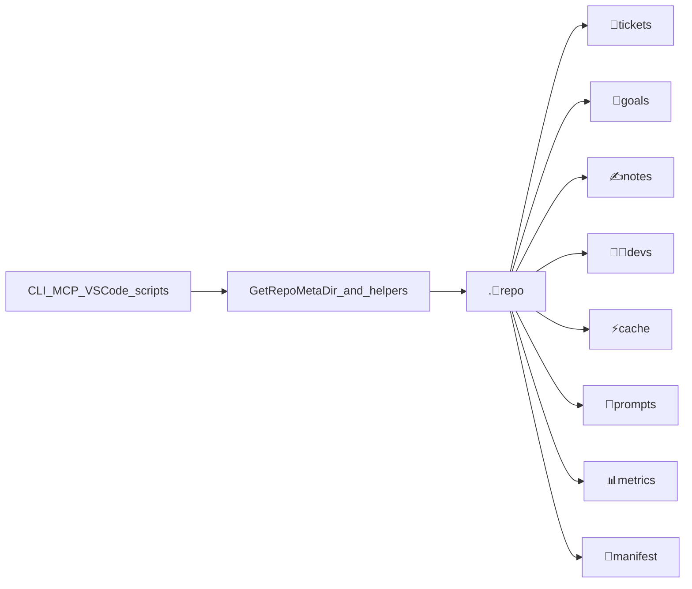

# Finish Emoji+Name Path Consistency for Repo Binary

## Problem

Canonical meta layout (from closed ticket `26/07/31/EMOJI-PREFIX-ALL-RENAMABLE-FILENAMES`) is:

| Old              | New                                   |
| ---------------- | ------------------------------------- |
| `.repo`          | `.🦑️repo`                             |
| `🎫️`             | `🎫️tickets`                           |
| `🎯️`             | `🎯️goals`                             |
| `✍️`             | `✍️notes`                             |
| `🧑️‍💻️`          | `🧑️‍💻️devs`                           |
| `⚡️` / `cache`    | `⚡️cache`                              |
| `🛂️`             | `🛂️manifest`                          |
| `📊️`             | `📊️metrics`                           |
| `💬️` / `prompts` | `💬️prompts` (and `💬️chat` if present) |

Disk already uses the new layout. The remnant `[.repo/🎫️/26/07/31/PUSH-IMPLEMENTATION-LEAF-TO-LAST-LEVEL](.repo/🎫️/26/07/31/PUSH-IMPLEMENTATION-LEAF-TO-LAST-LEVEL)` is evidence of the old ticket root. The built binary at `[💻️client/client](🧰️framework/🛍️products/🦑️repo/🔨️modules/💻️client/client)` still embeds `.repo` / bare `🎫️` and **zero** `.🦑️repo` / `🎫️tickets` — it was not rebuilt after the partial source rewrite. Several Go helpers and callers were also never updated.

Goal to bind: `AI-OPTIMIZED-REPO/REPO-CLIENT/REPO-BINARY`.

Ticket: reopen `26/07/31/EMOJI-PREFIX-ALL-RENAMABLE-FILENAMES` (same unfinished task). Relocate remnant `.repo/🎫️/...` into `.🦑️repo/🎫️tickets/...`. Repo MCP is currently broken (`needs auth` / discovery error); authenticate or rebuild the client as part of verification.

## Canonical map to enforce

Entity emoji constants (`EmojiTicket = "🎫️"`, etc.) stay bare — they identify entity kinds, not folders.

## Implementation

### 1. Finish Go CLI meta helpers

In `[main.go](🧰️framework/🛍️products/🦑️repo/🔨️modules/💻️client/⌨️cli/⚡️implementations/🐹️go/main.go)`:

- `GetDraftsPath`: `✍️` → `✍️notes`
- Contributor helpers (`GetContributor*`, list/create): `🧑️‍💻️` → `🧑️‍💻️devs`
- `getCacheDir`: `"cache"` → `"⚡️cache"` (and stop using leftover `.🦑️repo/cache`)
- `renderPromptTemplate`: `💬️/📋️/...` → under `💬️prompts` (match on-disk layout)
- `writeBenchmarkReport`: bare `📊️` → `.🦑️repo/📊️metrics/...`
- Audit remaining `filepath.Join(... meta ...)` / string literals for bare emoji folder segments; leave entity emoji constants alone
- Fix comment in `[.🦑️repo/📋️config.toml](.🦑️repo/📋️config.toml)` that still says `.repo/⚡️/🤖️`

### 2. Align tests with new layout

Update `[main_test.go](🧰️framework/🛍️products/🦑️repo/🔨️modules/💻️client/⌨️cli/⚡️implementations/🐹️go/main_test.go)` fixtures/expectations from `.repo` + bare `🎫️`/`🎯️`/`⚡️`/`🧑️‍💻️`/`💬️` to `.🦑️repo` + full names. Extend existing tests only (no new test files).

### 3. Fix binary build / resolve paths (product tree)

`repo/` no longer exists; go.work already points at the emoji tree. Update:

- `[defaultCliBin` / shell resolver](🧰️framework/🛍️products/🦑️repo/🔨️modules/📚️lib/⚡️implementations/🟦️typescript/📦️index.ts) → output under `🧰️framework/🛍️products/🦑️repo/🔨️modules/💻️client/client` (win: `client.exe`)
- Client `[📜️script.ts](🧰️framework/🛍️products/🦑️repo/🔨️modules/💻️client/⌨️cli/⚡️implementations/🟦️typescript/📜️script.ts)` `build`/`dev`/`test` packages → `./🧰️framework/🛍️products/🦑️repo/🔨️modules/💻️client/🔌️mcp/⚡️implementations/🐹️go` and `.../⌨️cli/⚡️implementations/🐹️go`
- `[.mcp.json](.mcp.json)`, `[.vscode/mcp.json](.vscode/mcp.json)`, and matching `[.vscode/launch.json](.vscode/launch.json)` repo-client entries

### 4. Fix remaining callers still on old meta paths

- VSCode `[🟦️extension.ts](🧰️framework/🛍️products/🦑️repo/🔨️modules/💻️client/🧩️vscode/⚡️implementations/🟦️typescript/🟦️extension.ts)`: `.repo/🎫️|🎯️|✍️` → `.🦑️repo/🎫️tickets|🎯️goals|✍️notes`; ignore-set `.repo` → `.🦑️repo`
- Root `[📜️script.ts](📜️script.ts)`: `.repo/cache|coverage|🛂️` → `.🦑️repo/⚡️cache|📊️metrics/coverage|🛂️manifest`
- Bootstrap `[⌨️script.ps1](🧰️framework/🛍️products/🦑️repo/🔨️modules/🔩️native/🥾️bootstrap/⌨️script.ps1)` to match the already-updated shell bootstrap

Do **not** edit `AGENTS.md` (repo rule).

### 5. Filesystem cleanup

- Move `.repo/🎫️/26/07/31/PUSH-IMPLEMENTATION-LEAF-TO-LAST-LEVEL` → `.🦑️repo/🎫️tickets/26/07/31/PUSH-IMPLEMENTATION-LEAF-TO-LAST-LEVEL`
- Remove empty remnant `.repo/` and plain `.🦑️repo/cache/` if superseded by `⚡️cache`

### 6. Rebuild and verify

- Rebuild client via updated build path
- Confirm UTF-8 embeds: `.🦑️repo`, `🎫️tickets`, `🎯️goals`, `🧑️‍💻️devs`, `⚡️cache` present; bare meta roots absent
- Run short Go tests for path helpers / ticket-dir construction
- Smoke: ticket path resolution writes under `.🦑️repo/🎫️tickets/...` (log with `[DEBUG]` if needed)
- Restore repo MCP once the binary path in mcp config points at the rebuilt client

## Out of scope

- PUSH-IMPLEMENTATION leaf crate moves (`moves-v3.json`) — separate layout task; only relocating that ticket folder out of `.repo/🎫️`
- Opening/closing goals
- Editing `AGENTS.md`

