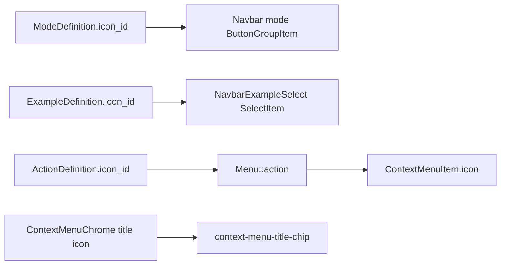

# Require Icons on Modes, Examples, and Context Menus

## Rule (locked)

Every labeled chrome entry shows a leading catalog icon. Same meaning may share one glyph; different meanings must not. Separators stay icon-less. No hidden `` stubs to satisfy `Button`’s required `icon`.

Matches prior work: [window_kind_icons_acc26d72.plan.md](.cursor/plans/window_kind_icons_acc26d72.plan.md), [unique_specific_icons_dc2838cb.plan.md](.cursor/plans/unique_specific_icons_dc2838cb.plan.md).

## Gaps today

| Surface                          | Schema                                                                                                       | UI today                                                                                                                                                                                            |
| -------------------------------- | ------------------------------------------------------------------------------------------------------------ | --------------------------------------------------------------------------------------------------------------------------------------------------------------------------------------------------- |
| Modes (~48 `.mode(` sites)       | `[ModeDefinition](🧰️framework/⚡️implementation/🦀️rust/📦️lib.rs)` — id/label only                          | OS navbar uses `icon={}` ([os react index ~7749](🧰️framework/🛍️product/💻️os/🔨️module/📺️renderer/🧑️‍🎨️engine/⚛️react/⚡️implementation/🟦️typescript/📦️index.tsx)) |
| Examples (~64 `.example(` sites) | `[ExampleDefinition](🧰️framework/⚡️implementation/🦀️rust/📦️lib.rs)` — id/label/json only                  | `[NavbarExampleOption](�onnaisframework/🔨️module/🖱️ui/⚛️react/⚡️implementation/🟦️typescript/📦️index.tsx)` label-only `SelectItem`s                                                              |
| Context menu title chip          | none                                                                                                         | `[ContextMenuChrome](�onnaisframework/🔨️module/🖱️ui/⚛️react/⚡️implementation/�🟦typescript/📦️index.tsx)` title text only in `data-slot="context-menu-title-chip"`                                |
| Context menu rows                | `icon?` optional; `[ActionDefinition.icon_id](�framework/⚡️implementation/🦀️rust/📦️lib.rs)` still `Option` | `Menu::action` copies optional icon; many hand-rolled rows omit                                                                                                                                     |

## 1. Schema + builders (required `IconName`)

In `[ModeDefinition` / `ExampleDefinition](�framework/⚡️implementation/🦀️rust/📦️lib.rs)` and plugin `[ModeSpec` / `AppBuilder](�framework/🛍️product/💻️os/🔨️module/🔌️plugin/⚡️implementation/🦀️rust/📦️lib.rs)`:

- Add `icon_id: IconName` (required, always serialized).
- Change APIs:
  - `.mode(id, label, icon_id)`
  - `.example(id, label, document_json, icon_id)`
- Assert non-empty at build (same discipline as `window_kind`).
- Make `ActionDefinition.icon_id: IconName` required; extend `ActionDefinition::new(..., icon_id)` and every `view_action` / `shell_action` / `history_action_definitions` / fixtures.
- Make `CommandDefinition.icon_id: IconName` required (footer commands already render icons).
- Regenerate TS types via existing typegen.

## 2. Populate every call site

Hand-assign catalog icons across `✏️s/🔌️plugin/**` (and framework harnesses):

- Modes: `edit` → `pencil` / `square-pen`; `paint` → `paintbrush`; `generate` → `sparkles`; `explore` → `compass`; `review`/`report` → distinct review/report glyphs; etc.
- Examples: content-specific when distinct (e.g. capsule vs forest); shared meaning (generic “Demo”/“Default”) may share one glyph (e.g. `file-text`).
- Actions/commands lacking icons: assign at declaration so `Menu::action` / `Menu::command` always emit icons.
- `Menu::submenu(id, label, icon, build)` — require icon on submenu rows.
- OS hand-rolled menus (map/suggestions/etc.): supply `icon` on every non-separator `ContextMenuItemSpec`.

## 3. React chrome wiring

In `[ui/js react index](�framework/🔨️module/🖱️ui/⚛️react/⚡️implementation/�🟦typescript/📦️index.tsx)` and OS renderer:

- **Modes**: thread `mode.iconId` into `ButtonGroupItem icon={mode.iconId}`; delete hidden stub.
- **Examples**: `NavbarExampleOption.icon: IconName`; render leading `<Icon>` inside each `SelectItem` (and trigger value). “No example” uses a fixed catalog id (e.g. `circle-off`).
- **Context menu title chip**: `ContextMenuChrome({ title, icon, ... })` — render `<Icon icon={icon} size="small" />` before truncated title (same pattern as dock tabs). Call sites that open menus pass a fitting icon (`menu` / domain verb).
- **Context menu items**: treat `icon` as required when `!separator`; always reserve leading icon slot (no empty collapse). Keep separators icon-less.
- Remove other chrome stubs that fake required icons where a real glyph belongs (e.g. tutorial rate control gets a real icon, not a hidden span).

## 4. wgpu parity

Mirror mode/example/menu title+item icons in `[ui/wgpu](�framework/🔨️module/🖱️ui/🎊️wgpu/⚡️implementation/🦀️rust/📦️lib.rs)` / OS wgpu renderer wherever those chrome surfaces already paint labels, using existing `push_icon` / atlas paths.

## 5. Tests + ticket

- Extend existing vitest/rust suites only: builder rejects missing mode/example/action icons; mode switcher renders real icons; example select rows carry icons; context menu title chip and item rows show icons.
- On execute: auth/use repo MCP, read `repo://goals`, open/reopen ticket, put logs under the ticket folder, close with summary when done.

## Out of scope

New SVG assets only if no fitting catalog id exists. Uniqueness harness growth only for new concepts introduced here. No legacy optional fallbacks.