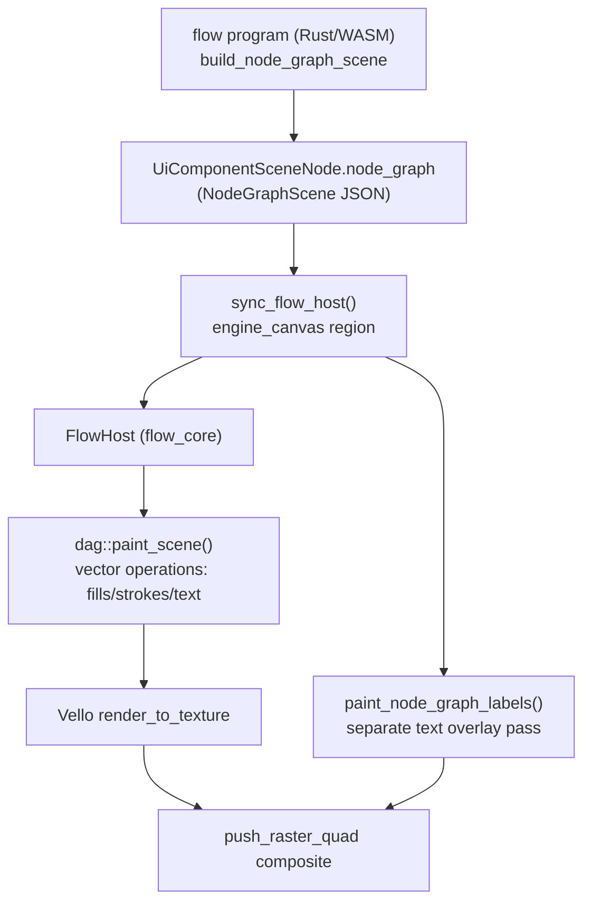

## Background

At the `premigration` git tag, "flow" was rendered by [flow/react/index.tsx](flow/react/index.tsx) (5.8k lines) — a DOM/canvas React renderer with full node-graph chrome. The WGPU-WINIT-TRUNK-MIGRATION effort deleted that renderer and replaced it with a native/WASM renderer (`framework/renderer/wgpu`, `ui/wgpu`) that composites the same underlying Rust drawing engines into a texture quad inside a winit+wgpu shell.

Critically, the actual drawing logic is **shared and unchanged**:

- [flow/core/rs/lib.rs](flow/core/rs/lib.rs) `FlowHost::paint_scene` just delegates to `dag.paint_scene`.
- [mathematical/graph/port/directed/dag/rs/lib.rs](mathematical/graph/port/directed/dag/rs/lib.rs) `paint_scene` (6905 lines) is **byte-identical** to `premigration` (`git diff --stat premigration -- mathematical/graph/port/directed/dag/rs/lib.rs` is empty) — this already draws node bodies, edges, port handles, and LOD-tiered content as vector paths into a `canvas::Scene`.

So the regression is in the **wiring** around this engine inside [framework/renderer/wgpu/rs/lib.rs](framework/renderer/wgpu/rs/lib.rs) `//#region NodeGraph` (`paint_node_graph`, `render_node_graph`, `paint_node_graph_labels`, `sync_flow_host`), not in the paint algorithm itself.

A prior ticket (`.repo/🎫️/26/07/05/FLOW-WGPU-RICH-PARITY`) already diagnosed this exact symptom as a canvas-theme-sync regression (new renderer never pushed dark/light `CanvasThemePalette` into `FlowHost`/`GraphHost`, so strokes rendered in colors invisible against the canvas background) and landed a fix (`set_canvas_theme_dark` on `FlowHost`/`GraphHost`, `sync_canvas_theme_dark` call in `paint_node_graph`). That fix is present in current `HEAD`, **but the ticket's own "after fix" screenshot already shows an empty canvas again**, and the user confirms the bug persists today after a full day of further concurrent changes to the very same file (window-chrome rails, OS shell session bootstrap, 3D world hover/select work) — some of it still uncommitted locally. So either the original fix regressed, or a second independent bug compounds it.

## Investigation scope (must happen live, in Agent mode)

Local cargo builds are currently lock-contended by many concurrent WIP sessions, so this diagnosis has to be finished with a live rebuild + browser screenshot pass rather than static reading alone. Concretely:

1. Rebuild wgpu WASM and boot the `flow` program (`SEMIO_RENDERER=wgpu SEMIO_PLUGIN=flow`), screenshot at default zoom, zoomed-in (higher LOD), with a node selected, and mid area-select drag.
2. Compare against the `premigration` tag's behavior. Since `flow/react/index.tsx` no longer exists, use a `git worktree`/`git show` checkout of `premigration` (read-only reference, not touching the working tree) or fall back to a still-working DAG-based playground (e.g. puzzle board) under the current wgpu renderer as a cross-check for whether the bug is Flow-specific or shared-engine-wide.
3. Pinpoint exactly which stage breaks by instrumenting/inspecting in order: `NodeGraphScene` JSON population (is `fixture_json` non-empty and does it actually contain widgets/synapses?) → `sync_flow_host` field sync (`fixture_json`, `selection_json`, `lod_json`, `viewport_json`, catalogue/operators) → `theme_is_dark`/`sync_canvas_theme_dark` correctness → `dag.paint_scene` output (path/fill/stroke count via `canvas::Scene::path_count()`) → Vello texture render → `push_raster_quad`/`register_engine_texture` compositing → `paint_node_graph_labels` overlay pass → pointer hit-testing for selection rectangle (`node_graph_pointer_down/move/up`, marquee drawing inside `paint_scene`).

## Likely fix areas (confirm before editing)

- [framework/renderer/wgpu/rs/lib.rs](framework/renderer/wgpu/rs/lib.rs) `//#region NodeGraph` (`sync_flow_host`, `paint_node_graph`, `paint_node_graph_labels`, `theme_is_dark`, `is_flow_graph`): re-verify theme sync actually reaches the palette fields `dag.paint_scene` reads, and that today's window-chrome rail changes (`render_window_content` reordering, `content` rect no longer mutated by measures/engagement rail reserve width) didn't shrink the node-graph surface to zero or pass a stale/empty rect into `render_node_graph`.
- Session/window bootstrap changes in the same file (`ActiveSession.view_state.active_mode_id` now defaulting instead of `None`, `window_ui`/`panel_ui` clear-and-rebuild reordering) — confirm the Flow app's "edit" mode window (`FLOW_PLAY_WINDOW_MAIN`) still renders its `node_graph` body and isn't skipped by a mode-filtering regression.
- [flow/plugin/rs/lib.rs](flow/plugin/rs/lib.rs) `render_main_graph`: confirm `fixture_json`/`selection_json`/`lod_json` are still being serialized into the `NodeGraphScene` sent to the renderer (no field renamed/dropped in a recent shared-type change in `framework/plugin/rs` or `framework/core/rs`).
- Marquee/selection-rectangle drawing: confirm it's actually part of `dag.paint_scene`'s output (not a separate draw call that got dropped during the migration) — premigration's `mathematical/graph/port/directed/dag/react/index.tsx` marquee code is the reference if it needs porting.

## Fix + verify

1. Apply the minimal correct fix(es) for whichever stage(s) are actually broken (likely a mix of: theme sync not sticking after the chrome-rail refactor, and/or the content rect passed to `render_node_graph` being degenerate).
2. Add/extend Rust unit tests in the same files (per repo convention: extend existing test modules, no new test files) covering the previously-regressed behavior (e.g. `set_canvas_theme_dark_applies_board_dark_strokes` in `flow/core/rs/lib.rs` already exists — extend with a wgpu-side equivalent asserting `paint_scene` path/text counts are non-zero for a populated fixture).
3. Rebuild wgpu WASM, reload the flow playground, and screenshot the same four states (default zoom, zoomed LOD, selected node, area-select drag) to confirm edges, handles, channel labels, node labels, and the selection rectangle are all visible and match premigration's visual intent.
4. Spot-check one non-flow DAG-based playground under wgpu to confirm no regression in the shared engine path.
5. Work inside a ticket per repo convention (reopen `.repo/🎫️/26/07/05/FLOW-WGPU-RICH-PARITY` since it covers the identical regression, or open a new ticket if reopening doesn't fit) and close it with a summary and full file list once verified.
