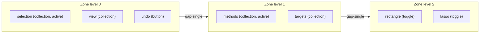

# Ribbon Tool Tree

## Goal

Generalize the toolbar from `AppTools = Partial<Record<AppToolCategory, ToolItem[]>>` into a recursive tree. Every node is a leaf (`button` / `toggle` / `separator`) or a `collection` (has `children`). The footer ribbon renders the active path left-to-right: each document level is its own glass `ToolbarZone` separated by a small gap; among sibling collections only one is active (single-select); activating a different sibling collection replaces every zone downstream (to the right). Collection labels stay i18n-keyed; a default path auto-opens the first collection at each level.

## Concept

Activating `view` in zone 0 discards zones 1 and 2 and renders `view`'s children as the new zone 1.

## 1. Data model — `framework/core/index.ts` (`#region Toolbar`)

Replace `AppToolCategory`, `APP_TOOL_CATEGORY_ORDER`, `ToolItem`, `AppTools`, `mergeAppTools`, `countAppTools`, `hasAppToolCategoryItems`, `listPopulatedToolCategories` with:

- `ToolNode` union: `separator | button | toggle | collection`. `button`/`toggle` keep current fields (`iconId`, `label`, `text`, `title`, `order`, `disabled`, `controllerId`, `command`, `args`, plus `pressed` for toggle). `collection` adds `{ kind: "collection"; iconId; label?; text?; title?; order?; disabled?; children: readonly ToolNode[] }`.
- `AppTools = readonly ToolNode[]` (root is an ordered sibling list).
- Helper `toolCollection(id, iconId, children, order?)` so builders construct collections cleanly.
- `mergeAppTools(base, extension)`: merge sibling lists by `id`; when both siblings are collections with the same id, merge their `children` recursively (preserves the per-app extension-append semantics).
- `countAppTools` / `listToolCollections(nodes)` / `hasInteractiveToolNodes(nodes)`: recursive equivalents.
- `resolveDefaultToolPath(nodes)`: walk into the first non-disabled collection (by `order`) at each level, returning the auto-open `string[]` path.

## 2. View model + converter — `framework/product/platform/renderer/react/index.tsx` (`#region UIToolbar`)

- Replace `UIToolbarItem` / `ToolbarViewTools` with recursive `UIToolNode` (collection carries resolved `icon`, label key id, and `children: UIToolNode[]`).
- Make `shellToolToToolbarItem` recursive (`shellToolToToolNode`): collections recurse over `children`; leaves unchanged (`bus.dispatch`).
- Rewrite `declareToolsToViewTools` ([line 4150](framework/product/platform/renderer/react/index.tsx)) to map the root `ToolNode[]` recursively instead of iterating `APP_TOOL_CATEGORY_ORDER`.
- Delete `resolveAppToolCategoryIcon` (category->icon map); icons now come from each node's `iconId` via `resolveToolItemIcon`.

## 3. Ribbon rendering — rewrite `UIToolbar` ([lines 2428-2493](framework/product/platform/renderer/react/index.tsx))

- State `activePath: string[]` of active collection ids per level; initialize from `resolveDefaultToolPath`; reconcile on tools change (keep the longest still-valid prefix, then auto-open downward).
- Render one `ToolbarZone` per level (root + each active collection):
  - Leaf children -> reuse existing `UIToolbarItems` run-batching (consecutive buttons -> `ButtonGroup`, toggles -> `ToggleGroup kind="multiple"`, separators -> `ToolbarDivider`).
  - Collection children -> single-select `ToggleGroup kind="single"` whose `value` is the active collection id at that level; `onValueChange` truncates `activePath` to this level and sets the new id (replace-downstream). Collection toggle id = `ui.toolbar.group.${collectionId}` so `resolveControlLabelId` resolves the i18n label.
- Zones laid out with `gap-single` (the "small gap between hierarchies"); each zone keeps the glass pill styling. Drop the bespoke `showCategoryNav` branch in favor of the uniform per-level zone loop.

## 4. i18n keying — `ui/react/index.tsx`

- `resolveControlLabelId` already maps `ui.toolbar.group.*` (line 1977); keep it.
- Loosen the toolbar-parent typing: `UiToolbarParentKey` / `UiToolbarParentCategory` ([~line 2110](ui/react/index.tsx)) becomes open-ended (`ui.toolbar.parent.${string}`) so free-form collection ids type-check, while keeping the existing 13 default entries (`hand`, `selection`, `filter`, `view`, `save`, `transfer`, `transform`, `create`, `actions`, `settings`, ...) as the shared UI bundle.
- Update the label tests in the `#region` test block ([~lines 23937-24108](ui/react/index.tsx)) to assert recursive collection-id resolution.

## 5. Migration of producers (1:1, then nest where natural)

Each builder currently returns category-keyed `AppTools`; convert each populated category into a top-level `toolCollection(categoryId, iconId, items)` so existing i18n keys keep working, then introduce real nesting where the app already has sub-groups.

- `framework/product/playground/core/index.ts`: `buildPlaygroundBrowseSelectionTools` / `buildPlaygroundBrowseFilterTools` return child `ToolNode[]`; `PlaygroundController.rebuildBrowseModeTools` ([~line 766](framework/product/playground/core/index.ts)) wraps them in `selection` / `filter` collections.
- `framework/product/playground/renderer/react/index.tsx`: replace `listPopulatedToolbarViewCategories` / `countToolbarViewTools` usage ([~1238-1279](framework/product/playground/renderer/react/index.tsx)) with the new recursive helpers.
- `puzzle/2d/play/index.ts` (`buildPuzzle2dPlayToolbarTools`, [~line 1342](puzzle/2d/play/index.ts)) — nest selection methods/targets/mode as sub-collections to demonstrate depth.
- `puzzle/3d/play/index.ts`, `puzzle/5d/play/index.ts`, `procedural/2d/play/index.ts`, `procedural/3d/play/index.ts`, `gis/map/play/index.ts`, `shooting/play/index.ts`, `framework/product/presentation/play/index.ts`, `cad/js/renderer/play/index.tsx` — convert their `AppTools` builders to the tree shape.
- `compose/client/lib/sketchpad/js/index.ts`: keep `sketchpadResolveControlLabelId` ([~line 10250](compose/client/lib/sketchpad/js/index.ts)); loosen the `compose.sketchpad.toolbar.parent.${...}` key union to free-form and keep existing entries.

## 6. Platform core + sketchpad re-exports — `framework/product/platform/core/index.ts`

Update re-exports / merge call sites to the new `AppTools`/`mergeAppTools` shape (recursive merge).

## 7. Stories & tests

- Update `.storybook/stories/ui/Toolbar.stories.tsx` (and `Navbar.stories.tsx` if it feeds `UIToolbar`) to the tree shape; low-level `ToolbarZone`/`ToggleGroup` primitives are unchanged.
- Extend (do not add) existing in-file vitest blocks in `framework/core/index.ts`, `framework/product/platform/renderer/react/index.tsx`, and `ui/react/index.tsx` covering: recursive merge, default-path resolution, replace-downstream on sibling activation, and i18n label resolution for nested collections.

## Constraints / notes

- Per repo rules: begin by reading `repo://goals` and opening (or reopening) a ticket; keep all temp artifacts inside the ticket folder; structure new code with regions; extend existing files/tests rather than creating new ones.
- This is a clean break (no compat layer, no `AppToolCategory` enum left behind), consistent with the greenfield rule set.
- Watch i18n compile enforcement (`I18N-COMPILE-ENFORCEMENT`): every collection id used must resolve to a real translation entry in both `en` and `de`.
- Verify at runtime in at least one playground (puzzle 2d) and sketchpad that drill-down, replace-downstream, gaps, and auto-open behave as specified before closing the ticket.
