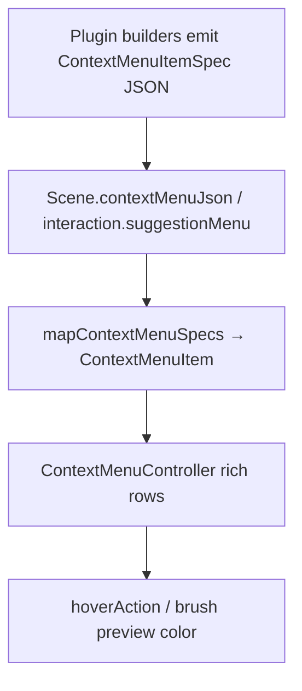

# Rich Context Menus Across Apps

## Diagnosis

Menus are declarative JSON (`contextMenuJson`) from Rust plugins, rendered by framework hosts via `ContextMenuController`. The UI already supports icons, checked, destructive, separators, and submenus in [`ui/js/react/index.tsx`](ui/js/react/index.tsx), but almost everything above the UI is incomplete:

| Layer | Problem |
| --- | --- |
| Wire types (`WorldContextMenuItem`, `GraphContextMenuItem`, `Puzzle2dSelectionMenuItem`) | Only `id` / `label` / `action` / `args` (sometimes `destructive`) — no `icon`, `color`, `checked`, `separator`, `children`, `hoverAction` |
| Host mapping | Strips fields: maps only `id`/`label`/`onSelect` ([`framework/renderer/react/index.tsx`](framework/renderer/react/index.tsx) ~13028, ~13744, ~15059) |
| Plugin emitters | Flow / procedural / trinity / sequence / dag emit only `delete-selection`. Puzzle3d emits actions without icons; vortex selection is only `"Suggest objects"` |
| Suggestions | Separate ad-hoc `WorldSuggestionMenu` (text only). Hover updates `brushCandidateIndex`, but React `BrushPreviewGhost` uses `palette.highlighted` and WGPU uses hardcoded cyan — neither uses per-kind color |
| `ContextMenuController` | No submenu / hover-row support (Radix path has children; controller used by hosts does not) |
| Flow preview | `previewOffJson` + `flow/core` `togglePreview`/`selectAll` exist, but plugin has no `preview_off` runtime, no menu items, and `FlowWasmSession` types omit `togglePreview` |
| Puzzle3d gaps | Multi-vortex and reference selections yield empty menus; vortex is suggestions-only |
| Duplicated builders | Puzzle2d menu built in React and again in wgpu; tiled map builds locally while `TiledMapScene.contextMenuJson` is unused |
| Native wgpu shell | Separate minimal `{id,label,action}` struct and text-only `render_context_menu` — must share the same wire schema |

User examples map directly:

- **Flow missing Hide/Show**: only delete is emitted; no preview-off toggle (engine already supports it).
- **Puzzle3d only suggestion objects without icon**: vortex menu is a single bare label; candidate list has no icons/swatches.
- **Hover wrong preview color**: React highlight palette + WGPU cyan, not object-kind catalog color.



## Approach

One shared **declarative menu protocol** end-to-end. Hosts never invent per-app item shapes. Plugins emit full rich specs. Suggestions are normal menu items with `hoverAction`, not a second menu system.

### 1. Shared wire schema (framework + UI)

Add `ContextMenuItemSpec` in [`framework/core/js/index.ts`](framework/core/js/index.ts) and mirror in [`ui/wgpu/rs/lib.rs`](ui/wgpu/rs/lib.rs) / plugin builders:

```ts
type ContextMenuItemSpec = {
  id: string;
  label?: string;
  icon?: string;           // lucide id
  color?: string;          // leading swatch / ghost tint
  shortcut?: string;
  disabled?: boolean;
  separator?: boolean;
  checked?: boolean;
  destructive?: boolean;
  action?: string;
  args?: Record<string, unknown>;
  hoverAction?: string;
  hoverArgs?: Record<string, unknown>;
  children?: ContextMenuItemSpec[];
};
```

Extend UI `ContextMenuItem` with `color?: string` and `onHover` / `onHoverEnd`. Render a small color swatch before the icon in both `renderContextMenuItems` and `renderFixedContextMenuItems`. Add **submenu + hover** support to `ContextMenuController` (portals, recursive children, pointerenter/leave).

Add one host helper (same file region as hosts):

```ts
mapContextMenuSpecs(specs, dispatch): ContextMenuItem[]
```

Wire `onSelect` → `dispatch(action, args)`, `onHover` → `dispatch(hoverAction, hoverArgs)`. Use it in World3d, all NodeGraph hosts, Board2d, TiledMap, and any other surface menu.

### 2. Unify suggestion candidates into the menu protocol

Remove the bespoke `WorldSuggestionMenu` DOM (or reduce it to a thin wrapper).

In puzzle3d:

- Candidate rows become `ContextMenuItemSpec`s with `icon: "box"` (or catalog icon), `color` from object-kind catalog (same lookup pattern as `vortex_color`), `action: "acceptSuggestion"`, `hoverAction: "hoverSuggestion"`, `args`/`hoverArgs: { index }`. Prefer vortex-kind name over hardcoded `"vortex {n}"` labels.
- Drive one `ContextMenuController` from `interaction.suggestionMenu` position + candidates-as-items.
- Include `color` (and keep `objectKindId` / `meshUrl`) on `brushPreviewJson` / `BrushPreviewState`.
- React `BrushPreviewGhost` uses `preview.color` when present; WGPU brush preview (`infinite/world`) uses the same color instead of hardcoded cyan.

Ensure `hoverSuggestion` re-renders `brushPreviewJson` (already keyed by `brush_candidate_index`; today color is the missing piece). Utility-panel placement picker stays, but can share the same candidate label/color/icon helpers.

### 3. Rich per-app builders (plugins own content)

Shared Rust helpers in [`framework/plugin/rs/lib.rs`](framework/plugin/rs/lib.rs) (e.g. `context_menu_item`, `context_menu_separator`, `context_menu_json`) so every plugin emits the same shape with icons.

**Flow** ([`flow/plugin/rs/lib.rs`](flow/plugin/rs/lib.rs)):

- Runtime: track `preview_off_node_ids`; emit `previewOffJson` on the graph scene; wire `togglePreview` through `FlowWasmSession` if still missing.
- Dynamic menu via `contextMenuAt` (same pattern as puzzle3d): right-click selects hovered node, then menu reflects selection.
- Items (icons in parentheses):
  - Background: Add node (`plus`) → opens spotlight, Select all (`maximize-2`), Reorganize (`layout-grid`)
  - Selection: Hide/Show preview (`eye` / `eye-off`, `checked` from `preview_off`), Clear selection, Delete (`trash`, destructive, **disabled when selection empty**)
  - Image widget when applicable: Replace image (`image`)
- Implement ops: `setPreviewOff`, `selectAll`, `clearSelection` (engine already has `selectAll` / `togglePreview` / `setPreviewOff` in `flow/core`). Host already applies `previewOffJson` to the session.

**Procedural 2d/3d, trinity, sequence, infinite dag**: share one `build_node_graph_context_menu_json` helper (delete-only today). Procedural adds preview-specific items where the 3d preview surface cares about `previewOff` / isolate.

**Puzzle3d** ([`puzzle/plugin/rs/lib.rs`](puzzle/plugin/rs/lib.rs) `puzzle3d_context_menu_json`):

- Every action item gets an icon (`copy`, `layers`, `eye`/`eye-off`, `lock`/`lock-open`, `crosshair`, `trash`, `sparkles`).
- Delete is `destructive: true`.
- Vortex selection: Zoom / applicable selection actions **plus** Suggest objects (`sparkles`) — not suggestions alone.
- Multi-vortex: shared actions (zoom/delete if supported), not an empty menu.
- Reference selection: at least Zoom/Delete — `contextMenuAt` already accepts `"reference"` but menu builder has no branch.
- Object / target-volume / attraction menus keep current actions with icons/separators.
- Suggestion candidates as above.

**Puzzle2d**: move menu ownership to the plugin (`Board2dScene.contextMenuJson` + `contextMenuAt`) so React and wgpu stop duplicating `buildPuzzle2dSelectionMenuItems` / `build_puzzle2d_selection_menu_items`. Emit icons on every item (`eye`, `lock`, `copy`, `layers`, `crosshair`, `trash`, `maximize-2`).

**Puzzle5d**: add Hide/Show, Lock/Unlock where flags exist; icons on all items.

**S studio**: already richer item set; add icons/separators/destructive.

**Tiled map**: wire through `TiledMapScene.contextMenuJson` (field exists, unused) or keep host builder but use `mapContextMenuSpecs` with icons — no dead field.

**Text editor**: already rich client-side; leave as-is.

### 4. Host interaction patterns

- **World3d**: map full specs; suggestion menu via controller; brush ghost color; fix open flash by opening only when menu items match post-`contextMenuAt` selection (pending anchor until items update).
- **NodeGraph / FlowGraphCanvasHost**: on right-click dispatch `contextMenuAt` with hovered widget id (or background), then show menu from updated `contextMenuJson` (mirror world3d). Pass through icons/checked/destructive/disabled.
- **Board2d / TiledMap**: consume plugin or shared specs via the same mapper.
- **Native wgpu shell**: extend `ContextMenuItem` and `render_context_menu` for icon (glyph atlas) + color swatch + destructive; pushers read the same JSON fields as React.

### 5. Tests and validation

Extend existing tests only (no new files):

- UI: icon + color swatch render; hover fires; submenu in controller.
- Framework renderer: `mapContextMenuSpecs` preserves fields; world/graph/board hosts pass icons.
- Puzzle plugin: vortex menu includes icons and non-suggest actions; multi-vortex and reference non-empty; candidates include `color`; `brushPreviewJson` includes `color`.
- Flow plugin: menu includes Hide/Show preview; delete disabled when empty; ops mutate `preview_off` / selection.
- Run nx vitest for `@semio-tech/ui-react`, `@semio-tech/framework-renderer-react`, and cargo tests for touched plugins.

Runtime confirmation with `[DEBUG]` logs on menu open (item ids/icons) and hoverSuggestion (index + color).

## Ticket / goal

- Goal: `🎯r2602` (Running Sketchpad).
- Open ticket e.g. `RICH-CONTEXT-MENUS` via repo MCP before implementation; temp artifacts only in the ticket folder; close with summary and file list.

## Out of scope

- Native OS menus.
- Changing non-menu chrome (utility bars, document tree row actions already have icons).
- Kit / type / home / design apps (no canvas context menus today).
- CAD's local Three.js `onContextMenu` (outside shared mechanism unless it already uses scene JSON).
- Backwards-compatible adapters for old `{id,label,action}` only — all emitters updated in one pass.
