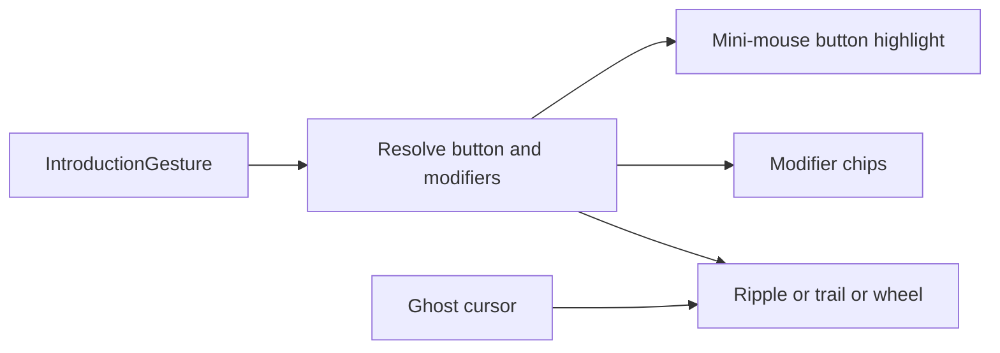

# Richer Introduction Click Previews

## Problem

`[IntroductionDemonstrationOverlay](ui/js/react/index.tsx)` currently plays the same pointer glyph + circular ripple for `leftClick`, `rightClick`, and `doubleClick`. Drag/orbit do not declare which button or modifiers they use, so middle-click pan and Alt+right orbit only differ by cursor glyph / curved path — not by teachable input identity.

Product bindings (from the closed Explicit Introduction Step Key Bindings ticket):

- Zoom → mouse wheel
- Pan → middle drag
- Orbit → Alt + right drag
- Context → right click
- UI actions → left click / left drag

## Approach

Handcraft first-class input identity in the core gesture types, then render a **floating mini-mouse + modifier chips** beside the ghost cursor so every authored combo is visually unique. No compatibility shims — update all authoring sites in one pass.




## 1. Extend the gesture contract

In `[framework/core/rs/lib.rs](framework/core/rs/lib.rs)` (`🔖️Introduction`):

- Add `IntroductionPointerButton` (`left` | `middle` | `right`)
- Add `IntroductionKeyModifier` (`alt` | `shift` | `control` | `meta`)
- Enrich drag-like gestures:

```rust
Drag {
  from, to,
  button: IntroductionPointerButton,           // default: left
  modifiers: Vec<IntroductionKeyModifier>,     // default: []
}
Orbit {
  from, to,
  button: IntroductionPointerButton,           // default: right
  modifiers: Vec<IntroductionKeyModifier>,       // default: [alt]
}
```

- Keep `LeftClick` / `RightClick` / `DoubleClick` / `Scroll` as distinct kinds (button is implicit: left / right / left / wheel).
- Add constructors / regenerate TS via existing typegen path; extend Rust round-trip tests next to the existing gesture serde tests (~L6004).

Defaults make Aggregator’s orbit demo correct without repeating `alt`/`right` everywhere; middle pan becomes explicit `button: "middle"`.

## 2. Unique visual language (overlay + CSS + asset)

Update `[IntroductionDemonstrationOverlay](ui/js/react/index.tsx)` and `[ui/styling/js/ui.css](ui/styling/js/ui.css)`:


| Gesture                       | Mini-mouse               | Chips      | Press / motion                            |
| ----------------------------- | ------------------------ | ---------- | ----------------------------------------- |
| `leftClick`                   | LMB lit (primary)        | —          | solid primary ripple                      |
| `rightClick`                  | RMB lit (secondary/warn) | —          | diamond/square secondary ripple           |
| `doubleClick`                 | LMB double-pulse         | `2×` chip  | two staggered primary ripples             |
| `drag` left                   | LMB held                 | —          | straight primary trail                    |
| `drag` middle                 | MMB held                 | —          | straight tertiary trail                   |
| `drag` right (+optional mods) | RMB held                 | chips      | straight secondary trail                  |
| `scroll`                      | wheel segment animated   | —          | vertical chevrons + bob (no click ripple) |
| `orbit` (default Alt+right)   | RMB held                 | `Alt` chip | curved secondary trail                    |


Implementation details:

- Handcraft one SVG under `[ui/asset/](ui/asset/)` (e.g. `introduction/mouse.svg`) with selectable LMB/MMB/RMB/wheel regions via CSS classes / `data-button`.
- Overlay hosts: ghost cursor (existing) + callout cluster (`data-slot="introduction-demonstration-callout"`) that tracks the tip with a fixed offset, plus an SVG trail path for drag/orbit.
- Resolve button/modifiers once per demo tick from gesture kind + fields; press/release phases toggle `data-pressed` on the lit button.
- Distinct CSS keyframes per feedback family (solid ripple, diamond ripple, double stagger, wheel notches, trail dash draw) — not one shared animation recolored.
- Honor `prefers-reduced-motion` (callout static; no trail/ripple motion).

## 3. Authoring + Storybook

- `[mit-bestand/aggregator/brand.ts](mit-bestand/aggregator/brand.ts)` viewport demos: middle-button drag for pan; orbit keeps defaults (Alt+right); leave left-click steps as-is.
- Extend `[.storybook/stories/ui/UIIntroduction.stories.tsx](.storybook/stories/ui/UIIntroduction.stories.tsx)` with a fullscreen story that cycles one demo per kind (left / right / double / left-drag / middle-drag / scroll / alt+right orbit) so uniqueness is reviewable without the full Aggregator shell.

## 4. Tests

Extend existing suites (no new test files):

- Rust: serde defaults for `Drag.button` / `Orbit.modifiers`, round-trip of enriched fields.
- Vitest in `[ui/js/react/index.tsx](ui/js/react/index.tsx)`: after idle, assert callout mounts with correct `data-button` / modifier chips for leftClick, rightClick, middle drag, and orbit; assert distinct ripple/trail class names where feasible under fake timers.

## 5. Ticket workflow (on execute)

- Associate with goal `🎯️r2602/🎯️runningsketchpad/🎯️runningsketchpadapps/🎯️designapp` (same as recent introduction tickets).
- Open a new ticket (no existing open ticket covers richer click previews).
- Put scratch notes/logs under the ticket folder only.
- Close with summary + touched files when done.

## Out of scope

- Changing real input bindings in `[infinite/world/r3f](infinite/world/r3f/index.tsx)`.
- wgpu chrome demo overlay (still absent).
- Shift+right as an alternate pan demo unless authored later via `modifiers: ["shift"]` on a right drag.

