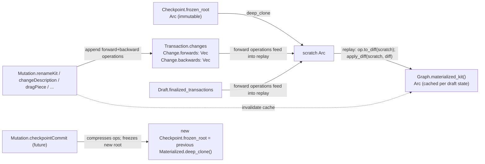

# Refactor `semio/rs` Kit Store Read/Write to Pure Materialization

## Problem (current state)

In [semio/rs/lib.rs](semio/rs/lib.rs):

- `Graph.the_kit: Arc<Kit>` is a single live mutable instance.
- `Checkpoint.root` stores the **same** `Arc<Kit>` (see `ensure_default_seed_state` at line 3618: `root: RwLock::new(Some(self.the_kit.clone()))`), so root and live state are aliased.
- `worker::ChildRuntime::apply` (lines 6097–6206) mutates `the_kit` directly for every command (e.g. `*self.graph.the_kit.name.write().await = name.clone();` at line 6129).
- `Change.forwards` / `Change.backwards` (lines 3110–3111), `Transaction.changes`, `Draft.transactions` exist but the worker never appends to them.

Result: opening a dev kit and renaming it visibly mutates `Checkpoint.root.name` — the bug the user reported.

## Target architecture

Two-stage pipeline: **operations are intent data**, **diffs are state-transition descriptions**, and **a single central `Kit::apply_diff` is the only thing that mutates a Kit**. Operations themselves never touch a `Kit`.




Pipeline per replay step:

1. `let diff: KitDiff = op.to_diff(&kit).await?;` — pure function on the operation; reads pre-state to resolve indices/ids; never mutates.
2. `kit.apply_diff(&diff).await?;` — the **single** central mutation entry point. All structural edits (set field, add/remove vec entry, update map, …) flow through here.

Invariants:

- `Checkpoint.frozen_root` is set **once** at checkpoint creation from a deep clone and is never written to again.
- `Graph` no longer owns a live `the_kit`; it owns the active draft and the parent checkpoint of that draft.
- `Graph.materialized_kit()` = `parent_checkpoint.frozen_root.deep_clone()` then for every operation in every finalized transaction and the open transaction (in order): `kit.apply_diff(&op.to_diff(&kit).await?).await?`.
- Caches: per-`Checkpoint` `frozen_root` is itself the cache; per-`Draft` materialization caches an `Arc<Kit>` keyed by a monotonic `change_seq` bumped on every transaction mutation and reset on commit/abort.
- **Only** `Kit::apply_diff` mutates a `Kit`. Operations, the worker, resolvers, and replay logic never reach into `Kit` fields directly.

## Affected regions in [semio/rs/lib.rs](semio/rs/lib.rs)

- `📦 kit` (lines 1148–2833):
  - Add `Kit::deep_clone()` walking every sub-entity (Type, Representation, Connector, Design, Piece, Tag, Concept, Quality, Author, File, Folder, Prop, Attribute, Stat, plus all `*_by_id` weak maps re-pointing into the cloned graph).
  - Add **the single central mutation entry point** `Kit::apply_diff(&self, diff: &KitDiff) -> Result<(), SemioError>`. This is the only public mutator on `Kit`. Internally it walks the canonical `KitDiff` (sparse scalar overrides + `removed` / `updated` / `added` triples on every collection) and writes the corresponding `RwLock<…>` slot (or pushes/removes from `Vec`/`HashMap`). Every direct field-mutation in the file that currently reaches into `kit.name.write().await`, `kit.description.write().await`, `kit.tags.write().await.push(...)`, `design.pieces.write().await.push(...)`, etc., is collapsed into this one method.
  - All existing per-field mutator helpers on `Kit` (e.g. `create_and_register_tag`, `delete_tag_by_id`, `register_tag`, `register_concept`, `register_quality`) are removed; their behaviour is expressed as `KitDiff` fragments produced from operations and applied centrally.
  - Strip `bump_touch_epoch` from `Kit` (now done at `Graph` level on materialization invalidation).
- `🌿 vcs` (lines 3089–4156):
  - Replace `Graph.the_kit: Arc<Kit>` with: `parent_root_for_active_draft: RwLock<Arc<Kit>>` (clone of the seed checkpoint's `frozen_root`) and `materialized_cache: RwLock<Option<MaterializedSlot>>` where `MaterializedSlot { change_seq: u64, kit: Arc<Kit> }`.
  - Add `Graph::materialized_kit(&self) -> Arc<Kit>` (deep-clones parent root and replays draft ops; reuses cache when `change_seq` matches).
  - Add `Graph::active_draft()` accessor and `Graph::record_op_in_open_transaction(forward: KitOperation, backward: KitOperation)` that appends to the current `Change`, bumps `Draft.change_seq`, and invalidates the materialization cache.
  - `Checkpoint.root` → `Checkpoint.frozen_root: Arc<Kit>` (no `RwLock`, no `Option`); fixed at construction.
  - `Draft` gains `change_seq: AtomicU64`.
  - Remove the in-place `the_kit` mutation paths: `Graph::apply_create_fixed_piece`*, `Graph::apply_drag_piece_in_design`, `Graph::apply_drag_pieces_in_design`. Their logic moves into the operation's `to_diff` (see below); structural mutation only happens in `Kit::apply_diff`.
- `⚙️ operation` (lines 4488–5146):
  - Introduce a **strictly one-way** semantic op enum. **Every variant has the same uniform shape: `{ scope, input }`** — `scope` carries every `Id` the operation references (entities it reads, mutates, deletes, or creates), `input` carries the non-id payload (values, embedded `TagInput` / `ConceptInput` / `Position` / `Offset` / `String` / …). No variant carries undo state. Both `scope` and `input` are dedicated structs per variant so the shape is grep-uniform.
    ```rust
    pub enum KitOperation {
        RenameKit          { scope: RenameKitScope,          input: RenameKitInput },
        ChangeDescription  { scope: EntityScope,             input: ChangeDescriptionInput },
        ChangeIcon         { scope: EntityScope,             input: ChangeIconInput },
        ChangeImage        { scope: EntityScope,             input: ChangeImageInput },
        CreateTag          { scope: CreateTagScope,          input: TagInput },
        CreateTags         { scope: CreateTagsScope,         input: CreateTagsInput },
        DeleteTag          { scope: TagScope,                input: NoInput },
        DeleteTags         { scope: TagsScope,               input: NoInput },
        RenameTag          { scope: TagScope,                input: RenameTagInput },
        CreateConcept      { scope: CreateConceptScope,      input: ConceptInput },
        CreateQuality      { scope: CreateQualityScope,      input: QualityInput },
        CreateFixedPiece   { scope: CreateFixedPieceScope,   input: CreateFixedPieceInput },
        DeletePieceInDesign{ scope: PieceInDesignScope,      input: NoInput },
        DragPieceInDesign  { scope: PieceInDesignScope,      input: DragPieceInput },
        DragPiecesInDesign { scope: PiecesInDesignScope,     input: DragPieceInput },
        FixPieceInDesign   { scope: PieceInDesignScope,      input: NoInput },
        // ...one variant per existing Command, all pure forward, all { scope, input }.
    }

    // Scopes — every id the op references lives here. Ids the worker mints at record time
    // (creations) sit alongside ids the worker reads from existing state (targets, owners).
    pub struct RenameKitScope;                                                              // kit is implicit
    pub struct EntityScope          { pub entity_id: Id }
    pub struct TagScope             { pub tag_id: Id }
    pub struct TagsScope            { pub tag_ids: Vec<Id> }
    pub struct CreateTagScope       { pub owner_id: Id, pub tag_id: Id,           pub attribute_ids: Vec<Id> }   // tag_id + attribute_ids minted
    pub struct CreateTagsScope      { pub owner_id: Id, pub tag_ids: Vec<Id>,     pub attribute_ids: Vec<Vec<Id>> }
    pub struct CreateConceptScope   { pub owner_id: Id, pub concept_id: Id,       pub attribute_ids: Vec<Id> }
    pub struct CreateQualityScope   { pub owner_id: Id, pub quality_id: Id,       pub attribute_ids: Vec<Id>, pub benchmark_ids: Vec<Id> }
    pub struct CreateFixedPieceScope{ pub design_id: Id, pub piece_id: Id,        pub blueprint_id: Id, pub attribute_ids: Vec<Id> }
    pub struct PieceInDesignScope   { pub design_id: Id, pub piece_id: Id }
    pub struct PiecesInDesignScope  { pub design_id: Id, pub piece_ids: Vec<Id> }

    // Inputs — non-id payload only.
    pub struct NoInput;
    pub struct RenameKitInput          { pub name: String }
    pub struct RenameTagInput          { pub name: String }
    pub struct ChangeDescriptionInput  { pub description: Option<String> }
    pub struct ChangeIconInput         { pub icon: Option<String> }
    pub struct ChangeImageInput        { pub image: Option<String> }
    pub struct CreateTagsInput         { pub tags: Vec<TagInput> }
    pub struct CreateFixedPieceInput   { pub position: Position, pub name: Option<String>, pub description: Option<String> }
    pub struct DragPieceInput          { pub offset: Offset }

    impl KitOperation {
        /// Pure: read pre-state, produce a structural `KitDiff`. Uses ids from `scope`
        /// (worker-minted for creations) to populate `KitDiff.added[*].id`. Never mutates `kit`.
        pub async fn to_diff(&self, kit: &Arc<Kit>) -> Result<KitDiff, SemioError>;

        /// Pure: read pre-state, return the ordered list of one-way `KitOperation`s
        /// that, applied in order through the same op → diff → `apply_diff` pipeline,
        /// undo this operation. For Creations the backward `Delete*` op references the
        /// ids in `scope`. For Deletions the backward Creation op constructs a fresh
        /// `scope` re-using the prior ids from `pre`. Never mutates `kit`.
        pub async fn to_backwards(&self, kit: &Arc<Kit>) -> Result<Vec<KitOperation>, SemioError>;
    }
    ```
  - Adopt the **canonical `KitDiff`** schema already defined for the semio kit format. It is a partial mirror of `Kit` where:
    - Every scalar field on `Kit` (`name`, `description`, `icon`, `image`, `preview`, `version`, `remote`, `homepage`, `license`, `createdAt`, `updatedAt`, plus `id`) is `Option<…>`; `Some` means "set to this value", `None` means "untouched". Serde uses `skip_serializing_if = Option::is_none` to keep the JSON representation sparse.
    - Every collection field on `Kit` (`types`, `designs`, `tags`, `files`, `folders`, `ports`, `authors`, `attributes`, `concepts`) becomes a `*Diff` container with the canonical triple shape:
      ```rust
      pub struct TypesDiff {
          pub removed: Vec<TypeId>,
          pub updated: Vec<TypeDiffUpdate>,
          pub added:   Vec<Type>,
      }
      pub struct TypeDiffUpdate { pub r#type: TypeId, pub diff: TypeDiff }
      ```
      and identically for `DesignsDiff` / `TagsDiff` / `FilesDiff` / `FoldersDiff` / `PortsDiff` / `AuthorsDiff` / `AttributesDiff` / `ConceptsDiff`.
    - Each per-entity `*Diff` (e.g. `TypeDiff`, `DesignDiff`, `RepresentationDiff`, `ConnectorDiff`, `PieceDiff`, `ConnectionDiff`, `TagDiff`, `ConceptDiff`, `FileDiff`, `FolderDiff`, `AuthorDiff`, `AttributeDiff`) recursively follows the same pattern (sparse scalar fields + nested `*Diff` containers for its own collections; e.g. `TypeDiff.representations: Option<RepresentationsDiff>`, `TypeDiff.connectors: Option<ConnectorsDiff>`, `DesignDiff.pieces: Option<PiecesDiff>`, `DesignDiff.connections: Option<ConnectionsDiff>`, `RepresentationDiff.tags: Option<TagsDiff>`, etc.).
    - The id-only references inside `removed[]` / `updated[*].<entity>` are dedicated `*Id` newtype structs (`TypeId`, `DesignId`, `PieceId`, `ConnectionId`, `RepresentationId`, `ConnectorId`, `TagId`, `ConceptId`, `FileId`, `FolderId`, `AuthorId`, `AttributeId`) so the on-wire JSON looks like `{ "id": "..." }` (matching the canonical example).
    - Reference shape: [semio/assets/semio/metabolism.kit.diff.semio.json](semio/assets/semio/metabolism.kit.diff.semio.json) is the authoritative on-disk sample; the Rust types must serde to / deserialize from exactly that JSON shape (camelCase field names, `id` for entity references, `diff` for nested updates, `removed` / `updated` / `added` keys).
  - All these types live in the `operation` region of [semio/rs/lib.rs](semio/rs/lib.rs) next to `KitOperation`.
  - `Kit::apply_diff(&self, diff: &KitDiff)` is the **single central mutation entry point**. Internally it walks the sparse `KitDiff` tree, applies scalar overrides, removes entities by id, applies per-entity `*Diff` updates (recursively re-using `apply_diff` on the same pattern for sub-entities), and appends `added` entities. No other `Kit`-mutating call exists.
  - Each existing `OperationKind` (`RenamedKit`, `CreatedFixedPiece`, `DraggedPiece`, `ChangedDescription`, `FixedPiece`) is constructed from the corresponding `KitOperation` + post-apply materialized kit so the GraphQL operation event stream stays unchanged.
- **System mints all new ids; user input never carries an id for a created entity.** Existing GraphQL mutation arguments stay id-free for creations (`createTag(ownerId, tag: TagInput)`, `createConcept(ownerId, concept: ConceptInput)`, `addFixedPieceToDesign(draftId, transactionId, designId, blueprintId, position)`, ...). At command acceptance the worker calls `Id::new().await` once per entity that will be created (entity itself + any nested attributes / benchmarks the input carries) and packs the resulting ids into the operation's `scope` (creation `scope` structs include the freshly-minted entity id alongside any owner / target ids the operation also references). Replay (`to_diff`) reads ids from `scope` to populate `KitDiff.added[*].id`, so persisted op logs replay deterministically without re-minting.
- **Inverse computation lives on the operation itself via `KitOperation::to_backwards`.** Every variant knows how to read pre-state and produce the ordered list of forward-intent `KitOperation`s that undo it. The list lets one forward op fan out to multiple backward ops where the structural change is non-atomic (e.g. deleting a piece may recreate the piece + recreate any dependent connections; a batch `DeleteTags` returns one creation op per id). For Creations the backward `Delete*` op references the ids in `self.scope`; for Deletions the backward Creation op constructs a fresh `scope` re-using the prior ids from `pre` so undo restores the same identity. Examples (illustrative — every variant must implement its own):
  - forward `RenameKit { scope: {}, input: { name: "Bar" } }` → backwards `[ RenameKit { scope: {}, input: { name: <pre.name> } } ]`
  - forward `DeleteTag { scope: { tag_id }, input: NoInput }` → backwards `[ CreateTag { scope: { owner_id: <pre.tag.owner>, tag_id, attribute_ids: <pre.tag attribute ids> }, input: <pre.tag input snapshot> } ]`
  - forward `CreateTag { scope: { owner_id, tag_id, attribute_ids }, input }` → backwards `[ DeleteTag { scope: { tag_id }, input: NoInput } ]`
  - forward `DragPieceInDesign { scope: { design_id, piece_id }, input: { offset } }` → backwards `[ DragPieceInDesign { scope: { design_id, piece_id }, input: { offset: -offset } } ]`
  - forward `CreateFixedPiece { scope: { design_id, piece_id, blueprint_id, attribute_ids }, input }` → backwards `[ DeletePieceInDesign { scope: { design_id, piece_id }, input: NoInput } ]`
  - forward `DeletePieceInDesign { scope: { design_id, piece_id }, input: NoInput }` → backwards `[ CreateFixedPiece { scope: { design_id, piece_id, blueprint_id: <pre.blueprint>, attribute_ids: <pre.attrs> }, input: <pre piece input snapshot> }, /* one connection-recreating op per connection that referenced the piece, scope reusing prior connection ids */ ]`
  - forward `DeleteTags { scope: { tag_ids }, input: NoInput }` → backwards = ordered `Vec` of `CreateTag` ops (one per id, oldest first), each with `scope.tag_id` set to the original id from `pre`.
  `KitOperation` stays a flat data type with no undo state inside variants; `to_backwards` is a pure read on `kit` returning a fresh `Vec`. `Change.forwards: Vec<KitOperation>` / `Change.backwards: Vec<KitOperation>` are symmetric — both are just lists of one-way ops that go through the same op → diff → `apply_diff` pipeline at replay time. There is no separate `operation::inverse_for` helper; the logic is on the variants of `KitOperation` itself.
- `🧵 worker` (lines 5887–6211): `ChildRuntime::apply` becomes a flat dispatcher per `Command` that:
  1. Captures `before_kit = self.graph.materialized_kit().await` (used by `to_backwards` to derive the inverse ops, e.g. previous name / previous tag input snapshot).
  2. For every entity the command will create, mints fresh ids via the system id generator (`Id::new().await`); these ids go directly into the operation's `scope` struct (alongside any owner / target ids the user did supply).
  3. Builds the forward `KitOperation { scope, input }` from `scope` (with minted ids in place) and `input` (user payload, no ids).
  4. Computes `backwards: Vec<KitOperation> = forward.to_backwards(&before_kit).await?`.
  5. Calls `self.graph.record_op_in_open_transaction(draft_id, transaction_id, forward.clone(), backwards).await?` which (a) ensures the open transaction exists, (b) extends the current `Change.forwards` with `forward` and the current `Change.backwards` with `backwards` (kept in their natural order; replay during undo iterates the change's `backwards` in reverse), (c) bumps `draft.change_seq`, (d) invalidates `materialized_cache`. The worker itself never calls `to_diff` or `apply_diff` — those run lazily inside `materialized_kit()` so cancelled (aborted) ops never touch a kit.
  6. Re-materializes via `self.graph.materialized_kit().await` (which, internally, deep-clones root then for each recorded forward op runs `op.to_diff(&kit) → kit.apply_diff(diff)`).
  7. Builds the existing `OperationKind` (e.g. `RenamedKit { kit: materialized_kit, … }`) and pushes to `op_history` + emits on the bus, exactly as today.
  - `Graph::abort_transaction` simply drops the open transaction's `Change` list and invalidates the materialization cache; the next `materialized_kit()` deep-clones root and replays only the surviving (finalized) ops, automatically yielding the pre-transaction state — no manual undo execution needed. `Change.backwards` is preserved on disk for explicit undo/redo flows (future).
- `🌐 gql` (lines 6213–6638): every resolver that calls `graph.the_kit.`* (`Graph::the_kit`, `Graph::projection_fingerprint`, `Graph::root_snapshot_hash`, `Query::node`, `Query::piece_in_design`, `Query::kit_store_bundle_json`, `Mutation::kit_store_bundle_hydrate`, `Mutation::kit_store_initialize_defaults`) switches to `let kit = graph.materialized_kit().await;`.
- `🗄️ kit_backbone` (lines 5241–5830):
  - `KitStoreBundleFile::from_graph` serializes from `graph.materialized_kit()` for `wip.root` and from each `Checkpoint.frozen_root.kit_full_snapshot_value()` for the checkpoint list.
  - `KitStoreBundleFile::hydrate_into_graph` materializes a fresh `Arc<Kit>` from the bundle JSON, freezes it as the seed `Checkpoint.frozen_root`, and points `Graph.parent_root_for_active_draft` at a clone of it.
  - `clear_piece_projections_for_backbone_replay` (line 5699) is removed; replay just re-hydrates a fresh checkpoint root.
- `🧪 tests` (lines 6783–7492): update `g.the_kit` references in tests (lines 7239, 7240, 7265, 7292, 7330, 7185–7186, 7217, 4262–4264) to `g.materialized_kit().await`. Extend `kit_store_bundle_serialize_hydrate_round_trip_via_graphql` (line 6850) with assertions:
  - After `renameKit` to "Hello Bundle", `wip.checkpoints.edges[0].node.frozenRoot.name` == previous name (root unchanged).
  - `wip.theKit.name` == "Hello Bundle" (materialized changed).
  - After `transactionAbort` of the rename transaction, `wip.theKit.name` reverts to the previous name.

## Implementation order (single ticket, no sub-delegation needed since this is one cohesive refactor)

1. Canonical `KitDiff` family of types (`KitDiff`, `TypesDiff` / `TypeDiff` / `TypeDiffUpdate`, `DesignsDiff` / `DesignDiff` / `DesignDiffUpdate`, `RepresentationsDiff` / `RepresentationDiff` / `…Update`, `ConnectorsDiff` / `ConnectorDiff` / `…Update`, `PiecesDiff` / `PieceDiff` / `…Update`, `ConnectionsDiff` / `ConnectionDiff` / `…Update`, `TagsDiff` / `TagDiff` / `…Update`, `ConceptsDiff` / `ConceptDiff` / `…Update`, `FilesDiff` / `FileDiff` / `…Update`, `FoldersDiff` / `FolderDiff` / `…Update`, `AuthorsDiff` / `AuthorDiff` / `…Update`, `AttributesDiff` / `AttributeDiff` / `…Update`, `PortsDiff` / `PortDiff` / `…Update`, plus the corresponding `*Id` newtype refs) + serde camelCase config matching [semio/assets/semio/metabolism.kit.diff.semio.json](semio/assets/semio/metabolism.kit.diff.semio.json), and `Kit::apply_diff` walking that tree as the single central mutation entry point; deletion of all per-field mutators on `Kit`.
2. `Kit::deep_clone()` walking every sub-entity and rebuilding `*_by_id` weak maps.
3. `KitOperation` enum (one-way) covering the existing 15 `Command` variants, every variant uniformly shaped as `{ scope, input }` with a dedicated `*Scope` and `*Input` struct per variant. `*Scope` holds every `Id` the operation references (target / owner / minted-on-creation); `*Input` holds the non-id payload only. Two pure read methods per variant: `to_diff(&Arc<Kit>) -> KitDiff` and `to_backwards(&Arc<Kit>) -> Vec<KitOperation>`.
4. `Checkpoint.frozen_root: Arc<Kit>`, `Draft.change_seq`, `Graph.parent_root_for_active_draft` + `materialized_kit` (deep-clone + replay via op → diff → `apply_diff`) + `record_op_in_open_transaction`.
5. Remove `Graph.the_kit`; rewrite `worker::ChildRuntime::apply` to record ops only (no mutation; mutation happens inside `materialized_kit()`).
6. Switch every resolver / backbone path to `materialized_kit()`.
7. Update `kit_full_snapshot_value` consumers and tests.

## Validation

- `cargo test -p semio` (covers golden fingerprint, bundle round-trip, transaction lifecycle, alternative-from-tip, tag CRUD).
- New `KitDiff` JSON round-trip test that loads [semio/assets/semio/metabolism.kit.diff.semio.json](semio/assets/semio/metabolism.kit.diff.semio.json), deserializes it into the new `KitDiff` type, re-serializes it, and asserts JSON equivalence.
- New assertions on root immutability + abort-restores-state in `kit_store_bundle_serialize_hydrate_round_trip_via_graphql`.
- `npm run build` for `semio/rs/pkg` (wasm32 target).
- `semio/js` + `semio/react` test suites unchanged (GraphQL surface is preserved; only internal Rust storage changes).

## Ticketing

Open a new MCP ticket "Refactor RS Kit Store To Materialized Reads" under the kit-store goal; close with summary listing `semio/rs/lib.rs` as the only touched file.