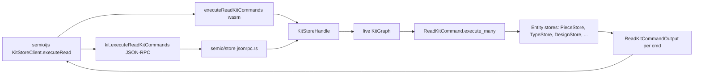

# Semio/rs Read Command Overhaul

## Design principles

- Every stored property and every computed property of every entity is reachable by a dedicated read command. No shorthand, no `Other`, no `#[serde(other)]`, no `any` escape.
- All variants end in `...Command`. Nested variants take a typed `id` and `commands: Vec<Read<Child>Command>`.
- All commands execute against the live `KitGraph` (drop snapshot-based execution). Each `execute` takes a typed `&KitGraph` plus the owning store ref where applicable, so computed properties (`flatCenter`, `flatPlane`, `path`, `parentPiece`, `parentConnection`, `parentDesign`, `alternatives`, `flattenMap`, `portByFamily`, …) are native first-class reads.
- Outputs reuse existing DTOs (`PieceFullDto`, `PieceMetadataDto`, `PoseFullDto`, `Coordinate`, `Plane`, …). New `InputDto` / `OutputDto` types are introduced only when they carry stronger invariants than a stored DTO (e.g. `FixedPieceOutputDto` guarantees pose + no parents, `ConnectedPieceOutputDto` guarantees parent piece + parent connection + flat pose, no pose).
- One source of truth in Rust. TypeScript hand-mirror in `semio/js` with serde parity.
- No backcompat: delete the legacy `read_command` module, legacy tests, legacy wasm wiring, legacy storybook presets. Greenfield.

## Entity coverage

One command enum per entity. All variants suffixed `...Command`. Each entity gets `Full` / `Shallow` / `Metadata` / `Id` + one variant per stored scalar + one variant per child collection + one nested `Read<Child>Commands { id, commands }` per child entity. Computed properties are first-class leaves (no child commands unless they dereference to another entity).

Entities covered exhaustively:

- `Kit` (stored: id, name, description, icon, image, preview, remote, homepage, license, uri, created, updated; children: types, designs, files, folders, locations, families, ports, authors, concepts, tags, qualities, props, attributes)
- `Type` (stored: id, name, description, icon, image, stock, virtual, unit, location, created, updated; children: families, connectors, representations, authors, concepts, tags, qualities, props, attributes; computed: `ports`, `connectorForPortId`)
- `Design` (stored: id, name, description, icon, image, location, unit, created, updated, kit; children: families, pieces, connections, layers, groups, authors, concepts, tags, qualities, props, attributes, stats; computed: `flattenMap`)
- `Piece` (stored: id, name, description, plane, center, scale, mirrorPlane, hidden, locked, color, type, design, props, attributes; computed: `flatPlane`, `flatCenter`, `path`, `parentPiece`, `parentConnection`, `parentDesign`, `alternatives`, `alternativeTypes`, `alternativeDesigns`)
- `Connection` (stored: id, connected, connecting, gap, shift, rise, rotation, turn, tilt, u, v, description, attributes; computed: `childPlaneMatrix`, `flatSides`)
- `Side` (promoted to first-class: id, piece, port, designPiece, connector)
- `Port` (stored: id, name, description, icon, mandatory, t, point, direction, compatibleFamilies, compatiblePorts, qualities, attributes)
- `Connector` (stored: id, code, description, port, qualities, attributes)
- `Representation` (stored: id, url, description, file, tags, qualities, attributes)
- `Family` (stored: id, name, description, icon, ports, attributes)
- `File` (stored: id, url, mime, size, hash, description, created, updated)
- `Folder` (stored: id, path, description)
- `Location` (stored: id, longitude, latitude, altitude, attributes)
- `Layer` (stored: id, name, description, color, order, visible, locked)
- `Group` (stored: id, name, description, color, icon, pieces)
- `Author` (stored: id, name, email, role, rank)
- `Concept` (stored: id, name, description, order)
- `Tag` (stored: id, name, order)
- `Quality` (stored: id, key, value, unit, definition, description, benchmarks)
- `Benchmark` (stored: id, name, min, max, minExcluded, maxExcluded)
- `Prop` (stored: id, key, value, unit, quality)
- `Attribute` (stored: id, key, value, definition)
- `Stat` (stored: id, key, value, unit, description)

Full per-entity variant list (generated mechanically from the above) lives inline in the new `pub mod read` module of `[semio/rs/lib.rs](semio/rs/lib.rs)`.

## Narrow output DTOs

Introduced alongside reused DTOs:

- `FixedPieceOutputDto` — guarantees `pose: PoseFullDto`, disallows `parentPiece` / `parentConnection`.
- `ConnectedPieceOutputDto` — guarantees `parentPiece: PieceIdDto` + `parentConnection: ConnectionIdDto` + `flatPose: PoseFullDto`, disallows `pose`.
- `ReadPieceFixedCommand` / `ReadPieceConnectedCommand` variants return those respective narrow DTOs (error if the piece does not satisfy the invariant).
- Additional narrow output DTOs introduced only when an invariant exists (none currently identified for other entities; will be added on demand during implementation).

## Execution model

```rust
// sketch, inside pub mod read
pub trait ReadCommandOn<'a, Ctx> {
    type Output;
    fn execute(&self, ctx: Ctx) -> Result<Self::Output>;
}

impl ReadKitCommand     { pub fn execute(&self, kit: &KitGraph)                         -> Result<ReadKitCommandOutput> }
impl ReadTypeCommand    { pub fn execute(&self, typ: &TypeStoreRef, kit: &KitGraph)     -> Result<ReadTypeCommandOutput> }
impl ReadDesignCommand  { pub fn execute(&self, des: &DesignStoreRef, kit: &KitGraph)   -> Result<ReadDesignCommandOutput> }
impl ReadPieceCommand   { pub fn execute(&self, p: &PieceStoreRef,   kit: &KitGraph)    -> Result<ReadPieceCommandOutput> }
// ... one execute impl per entity
```

`executeMany` helper on `ReadKitCommand` preserved, still `Vec<ReadKitCommand> -> Vec<ReadKitCommandOutput>`.

## Implementation todos

Each todo lands fully within the same change set (no staged migration).

## Downstream alignment (same change set)

- `[semio/rs/lib.rs](semio/rs/lib.rs)` `pub mod wasm`: `executeReadKitCommands` now resolves against the live `KitGraph` (drop the `to_full_dto()` detour). JS name preserved.
- `[semio/rs/lib.rs](semio/rs/lib.rs)` `pub mod kit_store_command`: `KitStoreCommand::ReadKitCommands { commands }` inner list points at new `ReadKitCommand`.
- `[semio/store/jsonrpc.rs](semio/store/jsonrpc.rs)`: `kit.executeReadKitCommands` `{ cmds, results }` serde types swap to the new enums. No method rename.
- `[semio/js/index.ts](semio/js/index.ts)` + `[semio/js/worker.ts](semio/js/worker.ts)`: hand-authored exhaustive TS discriminated-union mirror (`ReadKitCommand`, `ReadKitCommandOutput`, `ReadTypeCommand`, `ReadTypeCommandOutput`, … for every entity) in place of today's `unknown[]`. `KitStoreClient.executeRead` typed `Promise<ReadKitCommandOutput[]>`.
- `[semio/algorithms/.storybook/stories/kit-store/commandSchema.ts](semio/algorithms/.storybook/stories/kit-store/commandSchema.ts)` + `CommandForm.tsx` + `HistoryControls.tsx` + `useKitStore.ts` + `[semio/algorithms/.storybook/stories/KitStore.stories.tsx](semio/algorithms/.storybook/stories/KitStore.stories.tsx)`: regenerate presets, type suggestions and default JSONs from the new schema.
- Tests: rewrite `vcs_command_tests::{read_type_name, read_command_nested_type, read_command_tree_returns_nested_results}` and any `wasm_handle_tests` exercising reads, against the new variants. Add coverage for every computed-property command (`readPieceFlatCenterCommand`, `readDesignFlattenMapCommand`, `readPieceParentPieceCommand`, `readPieceFixedCommand`, `readPieceConnectedCommand`, `readTypePortsCommand`).
- Docs: `[semio/rs/AGENTS.md](semio/rs/AGENTS.md)` gets a new "Read command surface" section; `[semio/js/AGENTS.md](semio/js/AGENTS.md)` documents the TS mirror; `[semio/store/AGENTS.md](semio/store/AGENTS.md)` documents the wire schema; `[semio/AGENTS.md](semio/AGENTS.md)` glossary entry updated.
- Delete: the entire existing `pub mod read_command` block (lines 4–338 of `[semio/rs/lib.rs](semio/rs/lib.rs)`), its `#[serde(other)]` escapes, the old `Other` variants, any `unknown[]` / `any` typings on the JS side, and any preset JSON referring to old variant names.

## Mermaid: execution flow


