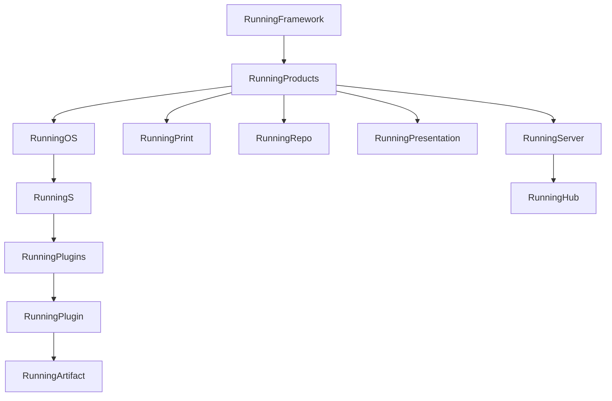

# Running Goal Tree

Existing goals stay open and untouched. A later pass will migrate them; this pass only adds the new tree and records where the old goals belong.

The repo MCP namespace is currently in error, so the first step is to reconnect it. Goals are created only through `goal_open` (parent before children). That writes [`.🧬semio/🦑️repo/🎯️goals`](.🧬semio/🦑️repo/🎯️goals), the emoji parent id, and the GitHub milestone (root) or issue (every child). Hand-written `🎯️goal.json` files are not a substitute.

Shared fields for every new goal: due `2026-12-31`, client `cursor-chat`, llm `grok-4`. Titles are titleized (`Running Framework`, not a slug). Each prompt states the runnable outcome for that node, not a placeholder.

## Shape

Hub is the server that runs. It sits under Running Server, not under OS.

144 goals: 10 stack nodes, 34 plugin nodes, 100 artifact nodes. One artifact directory under [`✏️s/🔌️plugins/*/🗿️artifacts`](✏️s/🔌️plugins) is one goal. Standards, packages, tests, and fixtures inside an artifact are not separate goals.

Layer prompts:

- **Running Framework** — [`🧰️framework`](🧰️framework) packages and module tests run.
- **Running Products** — each product under [`🧰️framework/🛍️products`](🧰️framework/🛍️products) boots from its own entry.
- **Running OS** — the os shell, plugin registry, and app host run. `s` is one instance of that shell.
- **Running S** — the design instance hosts its plugins.
- **Running Plugins** — every plugin under `s` loads in that instance.
- **Running Print / Repo / Presentation** — that product runs on its own.
- **Running Server** — the server product at [`🧰️framework/🛍️products/🖥️server`](🧰️framework/🛍️products/🖥️server) runs.
- **Running Hub** — `os-hub` is that running server. It boots on the development topology and passes the production gate in [`🌎️hub/README.md`](🌎️hub/README.md).
- **Each plugin** — that plugin loads in `s` and exposes its artifacts.
- **Each artifact** — that artifact’s engine and surface run inside its plugin.

Plugin titles are `Running {Name}` from the plugin directory. Artifact titles are `Running {Label}` from the artifact directory. Bare `2d` / `3d` / `5d` folders take the plugin name in front (`Running Puzzle 3d`). Norm codes split into family and number (`Running EN 1990`). Format stems are uppercased (`Running HTML`). Compounds split on the dimension or word boundary (`Running Generation 2d`, `Running GIS Map`, `Running Grid 2d`). When a plugin and its only artifact share a stem, both goals use that same title at different depths.

No goals for framework modules, os modules, server modules, or `s` modules. Platform and Playground are named in the products agents file and have no directories, so they get no goals.

## Stack

- Running Framework
  - Running Products
    - Running OS
      - Running S
        - Running Plugins
          - the plugin and artifact list below
    - Running Print
    - Running Repo
    - Running Presentation
    - Running Server
      - Running Hub

## Plugins and artifacts

- Running Animate
  - Running Presentation
- Running Architect
  - Running Program
- Running Block
  - Running Block 2d
  - Running Block 3d
  - Running Block 5d
- Running CAD
  - Running CAD
- Running DAG
  - Running DAG
- Running Demonstrator
  - Running Playground
- Running Draw
  - Running Drawing
- Running Energy
  - Running Model
- Running FEM
  - Running FEM 2d
  - Running FEM 3d
- Running Flow
  - Running Flow
- Running Forms
  - Running Forms
- Running GIS
  - Running GIS Map
  - Running GIS Terrain
- Running Imperative
  - Running Procedure
- Running Layout
  - Running Layout
- Running Lowpoly
  - Running Lowpoly
- Running Mathematical
  - Running Equation
- Running Norm
  - Running DIN 16798
  - Running DIN 18599
  - Running DIN 4108
  - Running EN 1990
  - Running EN 1991
  - Running EN 1992
  - Running EN 1993
  - Running EN 1994
  - Running EN 1995
  - Running EN 1996
  - Running EN 1997
  - Running EN 1998
  - Running EN 1999
  - Running ISO 16757
  - Running VDI 3805
- Running Note
  - Running Note
- Running Playbook
  - Running Playbook
- Running Procedural
  - Running Generation 2d
  - Running Generation 3d
- Running Process
  - Running Process 3d
- Running Puzzle
  - Running Puzzle 2d
  - Running Puzzle 3d
  - Running Puzzle 5d
- Running Raster
  - Running Raster
- Running Reasoning
  - Running Wires
- Running Remodel
  - Running Remodeling
- Running Sequence
  - Running Sequence
- Running Shooting
  - Running Shooting
- Running Sourcing
  - Running Curation
- Running Space
  - Running Home
  - Running Space
- Running Stdio
  - Running AVI
  - Running BCF
  - Running Binary
  - Running BMP
  - Running Commands
  - Running Contract
  - Running CSV
  - Running Deflate
  - Running DOCX
  - Running DWG
  - Running DXF
  - Running EPW
  - Running GIF
  - Running glTF
  - Running Graph
  - Running HTML
  - Running IFC
  - Running Inventory
  - Running JPG
  - Running JSON
  - Running LAS
  - Running MD
  - Running MP3
  - Running MP4
  - Running OBJ
  - Running PDF
  - Running PLY
  - Running PNG
  - Running PPTX
  - Running Semio
  - Running STEP
  - Running STL
  - Running SVG
  - Running TIFF
  - Running TSV
  - Running TXT
  - Running WAV
  - Running XLSX
  - Running XML
  - Running ZIP
- Running Trinity
  - Running Jack
  - Running Rewriting
- Running VCS
  - Running VCS
- Running WFC
  - Running WFC 2d
  - Running WFC 3d
  - Running Bitmap
  - Running Grid 2d
  - Running Grid 3d
- Running Writer
  - Running Writer

## Migration map, not a migration

After `Running Framework` exists, open a ticket on that goal and write the map as markdown in the ticket. Do not close, reopen, retarget, or edit any existing `🎯️goal.json` or ticket `goal` field.

Later mapping, recorded only:

- `ANIMATE`, `ENERGY`, `NORM`, `ARCHITECT` land on Running Animate, Energy, Norm, and Architect. The open Norm artifacts ticket stays on `🎯norm` until that later retarget. Norm’s fifteen artifact goals are the later homes for the per-standard work.
- `AI-OPTIMIZED-REPO` and its children land on Running Repo. The mechanism children (CLI, MCP, tickets, goals, and the rest) are not recreated.
- `R26-02` / Running Sketchpad and its apps are superseded by Running S. Home, Design, Type, Kit, and Docs apps are not recreated.
- `R26-02` / Updated Docs has no node in this tree.
- `R26-03` / Running .NET and Grasshopper have no current product and are not recreated.

The goals codec fixture is a frozen sample of existing documents. New goals do not require regenerating [`🎯️goal-documents.json`](🧰️framework/🛍️products/🦑️repo/🔨️modules/🎯️goals/🧫️fixtures/🎯️goal-documents.json).
