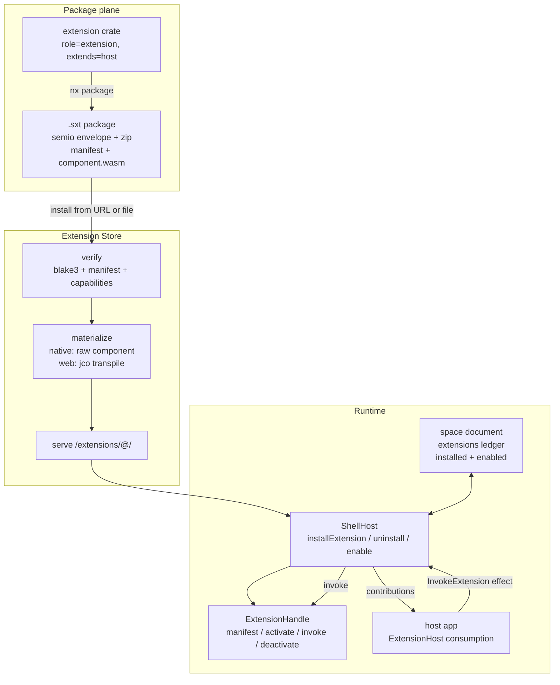

-# Runtime Installable Extensions

## Why this is a refactor, not an addition

The OS already has a real WASM Component Model plugin system: WIT world `plugin-world` (`manifest` / `instantiate-app` / `exchange` / `migrate-document` / `clear-instance-guard` exported, a 16-function `host` interface imported), built to `wasm32-wasip2`, transpiled with `jco`, served from `/plugin-modules`, and installed/reloaded/uninstalled in-session from a Settings tree. "Extension" is bolted onto it in five inconsistent ways, and the one path that is supposed to execute extension work does not run at all.

Concretely, the things that must change:

- `🧩️extensions/` means three incompatible things: packaged WASM components (sourcing, playbook, flow-bim), compile-time `rlib` modules (imperative, and the framework's own 8 flow built-ins), and TypeScript workspace packages (cad).
- There is no host relationship. `PluginRegistryEntry` in [registry/script.ts](🧰️framework/🛍️products/💻️os/🔨️modules/🔌️plugin/📦️packages/🟦️typescript/📇️registry/📜️script.ts) has only a soft `contributes`/`consumes` topic graph — no `role`, no `extends`. Only 2 of 39 plugin crates even declare `contributes`.
- Contributed work never executes. `ContributedExtensionStub` in [flow core](🧰️framework/🛍️products/💻️os/🔨️modules/🌊️flow/🫀️core/🦀️component.rs) (line 1390) always returns `EvalError::PendingExtension`, and the host bridge meant to finish it is broken: `requestPluginExchange` in [ShellHost](🧰️framework/🛍️products/💻️os/🔨️modules/📺️renderer/🧑️‍🎨️engine/🧱️elements/ShellHost/🟦️component.tsx) (lines 1981-1998) references an undefined `pluginEntry` and hardcodes `await import("@semio-tech/flow-module-bim")` — which only "works" because BIM carries a second, parallel wasm-pack `standalone-wasm` build. There is no WIT verb for a host to call an extension.
- `install_flow_extension` (flow core line 1433) builds a throwaway `Registry` and discards it. `register_contributed_manifest` drops the manifest's schemas.
- Nothing is durable. `loadedPlugins` is in-memory; [space](🧰️framework/🛍️products/💻️os/🔨️modules/🪐️space/🦀️component.rs) stores only `programs: Vec<String>` of plugin ids; flow's `extension_enabled_json` config actually toggles two unrelated UI automations (`auto-layout`, `auto-evaluate`) squatting on the word "extension".
- Of five hosts, only procedural3d and forms consume `contributionsJson` at all, and `setContributions` is pushed solely to the active session's plugin. `ProgramContributionEntry` is duplicated in six places. TS `PluginContribution` is missing `flowExtension` and `processMachines`. `forms.questionKind` has no enum variant and reuses `PlaybookBlockKind`.

## Target architecture




Four load-bearing decisions, each forced by something found in the code:

1. **A second WIT world, not a reused `plugin-world`.** Extensions are not apps; `instantiate-app` is the wrong shape and today's extension crates fake it. Add an `extension` interface with `manifest` / `activate` / `deactivate` / `invoke(capability, request) -> result`. `invoke` is the generic host-mediated call that finally lets contributed operators actually run, and it deletes the `standalone-wasm` dual build outright.
2. **The package carries the raw component `.wasm`; target adaptation happens at install.** The native wasmtime host already loads arbitrary bytes (`Component::from_binary` in [plugin host](🧰️framework/🛍️products/💻️os/🔨️modules/🔌️plugin/🖥️host/🦀️component.rs) line 372-381, path is `impl AsRef<Path>`, not hardcoded). The browser cannot: a jco tree is a directory with `import.meta.url`-relative siblings (`./<name>_component.js`, `./<name>_component.core.wasm`, `./🟨️host-shim.js`, `../_vendor/@bytecodealliance/preview2-shim/*.js`, `./🟨️plugin-worker.js`), so a single blob URL is impossible. So the Extension Store transpiles at install time and serves a real directory.
3. **Serve installed extensions over a real HTTP route.** There is no OPFS, no service worker, and ESLint forbids `indexedDB` outside OS APIs, so browser-side materialization has nowhere to live. Reuse `staticDirVitePlugin` (already how `/plugin-modules` is served, [vite.config.ts](🧰️framework/🛍️products/💻️os/🔨️modules/🧑️‍💻️dev/📦️packages/🟦️typescript/⚙️vite.config.ts) lines 113-125) for `/extensions`, and mirror the route in the hub for production. `PluginSource` was explicitly designed for a second implementation — its docstring names a future `HubPluginSource`.
4. **Kernels stay, operator layers move.** `📐️brep` (2364 lines, 86 operators, depends on `semio-s-3d`) and `🖍️draw` (1321 lines, 19 operators, depends on `semio-s-2d`) also export side APIs used outside the operator registry — `tessellate_geometry`, `export_solid_json`, `retain_geometry_handles` (procedural3d, playbook), `render_scene_json` (procedural2d). Those side APIs move to the kernel module surface; only the flow operator layer becomes an extension.

## Ticket and coordination

Repo MCP is not available in this session (no matching namespace; prior tickets carry `mcp-unavailable.txt`). Create the ticket folder and JSON by hand following the observed schema, at `.🦑️repo/🎫️tickets/🎆️26/🌙️08/☀️07/RUNTIME-INSTALLABLE-EXTENSIONS/🎫️ticket.json`, with `goal` set to the closest existing goal, `R26-02/RUNNING-SKETCHPAD` (do not open a new goal without instruction). All scratch scripts, probe output, logs, and screenshots go in that folder and stay there.

Every agent below is `cursor-grok-4.5-high` or `composer-2.5` (regular speed, never `-fast`). Grok handles the Rust/WIT/ABI and migration-with-blast-radius work; Composer handles TypeScript, build/dev tooling, and the mechanical per-extension ports.

Because many agents touch the same large files, ownership is by `#region`, and no agent may reformat outside its region. Contended files and their owners:

- [🔌️plugin/🦀️component.rs](🧰️framework/🛍️products/💻️os/🔨️modules/🔌️plugin/🦀️component.rs): W0 owns a new `#region 🧩️Extension`; nobody else edits it.
- [🧩core/🧩️ui/🦀️component.rs](🧰️framework/🔨️modules/🧩core/🧩️ui/🦀️component.rs) `Contribution` + `PluginManifest`: W0 only.
- [🧩core/🧩️ui/🧠️kernel/🦀️component.rs](🧰️framework/🔨️modules/🧩core/🧩️ui/🧠️kernel/🦀️component.rs) `HostEffect`: W0 only.
- [🧩core/🟦️component.ts](🧰️framework/🔨️modules/🧩core/🟦️component.ts): W0 owns the `PluginContribution` / `HostEffect` unions; W1.C owns `#region 🔌️PluginSource`.
- [ShellHost/🟦️component.tsx](🧰️framework/🛍️products/💻️os/🔨️modules/📺️renderer/🧑️‍🎨️engine/🧱️elements/ShellHost/🟦️component.tsx): W1.D owns `#region 🔌️PluginRuntime` and the `applyHostEffects` invoke branch.
- [flow core](🧰️framework/🛍️products/💻️os/🔨️modules/🌊️flow/🫀️core/🦀️component.rs) `#region 🔖️ExtensionRegistry`: W2-flow, then W3-flow.
- Root `Cargo.toml`, `.vscode/launch.json`, root `package.json` workspaces, `nx.json`: W4 only, batched once at the end.

## Wave 0 - Foundation (one agent, grok, blocks everything)

Single serial agent because all four items are edits to the same three files.

- Extend [world.wit](🧰️framework/🛍️products/💻️os/🔨️modules/🔌️plugin/📦️packages/🦀️rust/📜️wit/📜️world.wit): add `interface extension` and `world extension-world { import host; export extension; }`. A component may export both `extension` and `plugin` when it also contributes UI slots (playbook's procedural module needs this, since `ui_external_slot(plugin_id, app_id, body_key, payload)` requires an app).

```wit
interface extension {
  use types.{plugin-error};
  manifest: func() -> list<u8>;
  activate: func() -> result<_, plugin-error>;
  deactivate: func();
  invoke: func(capability: string, request: list<u8>) -> result<list<u8>, plugin-error>;
}
```

- Add `ExtensionBundle` + `extension_exports!` to `🔌️plugin/🦀️component.rs` in a new `#region 🧩️Extension`, mirroring `PluginBundle` (lines 4936-5007) and `plugin_exports!` (5932-5954), including the wasip2 export anchor that stops DCE from dropping `export!`. Builder surface: `new(extension_id, label, version)`, `extends(host_plugin_id)`, `capability(CapabilityRequirement)`, `contributes(Contribution)`, `handler(capability, fn)`.
- Complete `Contribution` in `🧩core/🧩️ui/🦀️component.rs` (currently 4 variants, lines 2682-2741): add `FormsQuestionKind` (stop reusing `PlaybookBlockKind` for forms), `CadComputer`, `ImperativeModule`. Move `ProgramContributionEntry` here as the single definition plus a `parse_contributions(json)` helper, and delete the six duplicates in [os component.rs](🧰️framework/🛍️products/💻️os/🦀️component.rs), [os host](🧰️framework/🛍️products/💻️os/🖥️host/🦀️component.rs), [forms app](✏️s/🔌️plugins/📋️forms/🎛️apps/📋️forms/🦀️component.rs), [procedural3d engine](✏️s/🔌️plugins/🌀️procedural/🗿️artifacts/🧊️procedural3d/⚙️engine/🦀️component.rs), and [native Shell](🧰️framework/🛍️products/💻️os/🔨️modules/📺️renderer/🧑️‍🎨️engine/🧱️elements/Shell/🧊️component.rs).
- Replace `HostEffect::RequestPluginExchange` with `HostEffect::InvokeExtension { extension_id, capability, request_json, response_action }` in the kernel enum, and mirror the full union in TS (also add the two variants TS is missing today, `clipboardWrite` and `replayShellCommand`).
- Mirror all `Contribution` variants in the TS `PluginContribution` union in `🧩core/🟦️component.ts` (lines 2173-2192), which currently omits `flowExtension` and `processMachines`.

Gate: `cargo build` workspace-wide, `cargo clippy --all-targets -- -D warnings`, TS typecheck. Nothing downstream starts until this is green.

## Wave 1 - Package, store, catalog, lifecycle (four agents in parallel)

**W1.A Package format (grok).** New framework module `🧰️framework/🛍️products/💻️os/🔨️modules/🧩️extension/`. The container is a deterministic deflate zip wrapped in a `.semio` envelope, exactly mirroring the space collection zip ([space](🧰️framework/🛍️products/💻️os/🔨️modules/🪐️space/🦀️component.rs) lines 1193-1304) and the `SemioEnvelope` in [semio format](🧰️framework/🛍️products/💻️os/🔨️modules/🧬️semio/🦀️component.rs). Contents: `🛂️manifest.semio` (pack-encoded `ExtensionManifest`), `component.wasm` (raw wasip2 component), optional `assets/`. Blake3 content hash via `framework_hash::hash_bytes`, matching `BlobStore::put` dedup semantics. API: `pack`, `unpack`, `verify`, `content_hash`. Do not overload `.spk` — that is a typed artifact document format with its own magic and footer, not an installer.

**W1.B Extension Store (composer).** TS service in `🔌️plugin/📦️packages/🟦️typescript/🏪️store/`, with one implementation and two materializers so nothing is duplicated: native materializer is a no-op (the wasmtime host reads the raw component directly), web materializer runs `jco transpile` with `--map semio:framework/host=./🟨️host-shim.js` plus the `_vendor` preview2-shim rewrite, reusing `pluginComponentBridgeSource`, `pluginWorkerSource`, `hostShimSource`, and `rewritePreview2ShimImports` from [dev script.ts](🧰️framework/🛍️products/💻️os/🔨️modules/🧑️‍💻️dev/📦️packages/🟦️typescript/📜️script.ts) (lines 649-793, 840-848, 905-910, 940+) rather than reimplementing them. Mount `staticDirVitePlugin({ route: "/extensions", root: installedExtensionsDir })` next to the existing `/plugin-modules` registration, add an install endpoint accepting a package URL or uploaded bytes, and an SSE watch mirroring `semioPluginHotSwapVitePlugin`. Mirror the route in the hub router ([hub bin.rs](🌎️hub/📦️packages/🦀️rust/📦️bin.rs) lines 590-597) so production is the same code path. Also add `WasmPluginRuntime::load_bytes` next to `load` so the native host installs from package bytes without a temp-file dance.

**W1.C Catalog and source (composer).** Extend `PluginRegistryEntry` (registry script lines 25-33) with `role: "plugin" | "extension"`, `extends?: string`, and `capabilities: readonly string[]`, parsed from `[package.metadata.semio]` (`role`, `extends`, `contributes`). Emit a separate `EXTENSION_TARGETS` alongside `PLUGIN_BUILD_TARGETS`. Add `createExtensionSource` implementing the existing `PluginSource` contract (`🧩core/🟦️component.ts` lines 3403-3466) against `/extensions`, and multiplex sources in ShellHost where `createDevPluginSource` is currently the sole `useMemo` (line 840).

**W1.D Durable ledger and lifecycle (grok).** Add to `SpaceProjection` an `extensions: Vec<InstalledExtension { extension_id, version, source_uri, package_hash, enabled }>` with ops `InstallExtension`, `UninstallExtension`, `SetExtensionEnabled`, following the existing `InstallProgram`/`UninstallProgram` shape (ops at line 153, projection apply at 215-222, diff/backwards at 278-316). In ShellHost's `#region 🔌️PluginRuntime`, add `installExtension` / `uninstallExtension` / `setExtensionEnabled` next to the plugin trio, replace the broken `requestPluginExchange` branch with a correct `invokeExtension` branch that calls the extension handle's `invoke` and dispatches `responseAction` on the *requesting* session (the current code dispatches on an undefined `pluginEntry`), and push contributions to every loaded plugin that declares `consumes`, not just the active session. Split the Settings tree in [ChromePanels](🧰️framework/🛍️products/💻️os/🔨️modules/📺️renderer/🧑️‍🎨️engine/🧱️elements/ChromePanels/🟦️component.tsx) (lines 940-1064) into Plugins and Extensions, the latter grouped by host with install-from-URL/file, uninstall, and an enable toggle.

Gate: unit tests for pack/unpack/verify round-trip and for the ledger ops; a live dev-server probe (scripted into the ticket folder) proving install-from-URL materializes and serves a directory.

## Wave 2 - Host unification (five agents in parallel)

One agent per host, each owning disjoint files. Every host implements the same shared `ExtensionHost` consumption using W0's `parse_contributions`, real execution through `InvokeExtension`, and enable/disable honoring the ledger. Each must land tests asserting install makes a capability appear, invoke returns real computed output, and uninstall makes it disappear.

- **flow (grok).** Fix `install_flow_extension` (discards its registry today), stop dropping manifest schemas in `register_contributed_manifest`, and replace `ContributedExtensionStub`'s dead-end with a real `invoke`-backed `Operation` that resolves through the pending-eval bridge (`PendingExtensionEval` in [neural engine](🧰️framework/🛍️products/💻️os/🔨️modules/🧠️neural/⚙️engine/🦀️component.rs) lines 1375-1388, `seed_flow_eval_node_cache` at flow core 1491). Make the flow *play* app a host too — today only procedural3d implements `setContributions`. Rename the misnamed `FLOW_EXTENSIONS` (`auto-layout`, `auto-evaluate`) and its `extension_enabled_json` config to automations, freeing the word. Note `neural::Registry` has no remove API but `register_`* clears the `finalized` flag, so keep the rebuild-and-swap-`Arc` model already in `rebuild_flow_extension_registry`.
- **process (composer).** Add `🏭️process/🧩️extensions/`, make `installed_catalogs()` ([process3d engine](✏️s/🔌️plugins/🏭️process/🗿️artifacts/🧊️process3d/⚙️engine/🦀️component.rs) lines 125-137) merge `Contribution::ProcessMachines` — the variant exists and has zero consumers — and wire a `SetContributions` config op.
- **forms (composer).** Switch from the reused `PlaybookBlockKind` to the new `FormsQuestionKind` variant across `parse_contributions`, `find_question_kind_contribution`, and `render_extension_question`.
- **playbook (composer).** Feed contributed kinds into `build_palette` — the helper exists in the framework playbook kit but the app only ever passes `builtin_palette()`.
- **sourcing (composer).** Make `sourcing_modules()` merge `Contribution::SourcingModule` instead of hard-linking `BeamsModule`/`WindowsModule`/`SlabsModule`, and add the missing `contributes = ["sourcing.module"]` to the three extension crates.

## Wave 3 - Migrate every extension (parallel, staged by risk)

`🧩️extensions/` ends up meaning exactly one thing: an individually-packaged, runtime-installable extension. Each migration is: new crate with `ExtensionBundle` + `extension_exports!`, `role = "extension"` + `extends` + `contributes` metadata, `📋️project.json` + `📜️script.ts`, hand-fixed fixtures, and deletion of the compile-time path with no shim left behind.

- **3a flow light built-ins (grok, then composer for the mechanical four).** `🫀️core` (5 ops), `🧮️math` (23), `📝️text` (2), `🧠️logic` (2), `📖️dictionary` (9), `📃️list` (9). These are path-modules inside the single `semio-framework-os-flow` crate, not separate crates, so each needs extracting. Blast radius is small: their register call sites are 8 lines, all inside flow core. Fixtures using `math.add` and `core.`* need hand-fixing, plus dozens of flow-core unit tests that hardcode these kinds.
- **3b flow draw (grok).** 19 ops, 1321 lines, depends on `semio-s-2d`, which is not even in flow's `Cargo.toml` today. `render_scene_json` must move to the kernel surface because procedural2d calls it directly.
- **3c flow brep (grok, last, largest).** 86 ops, 2364 lines, depends on `semio-s-3d` (a native B-Rep kernel, not OCCT). `tessellate_geometry`, `export_solid_json`, `import_solid_json`, `retain_geometry_handles`, `dispose_geometry` move to the kernel surface — procedural3d and playbook call them outside the registry. Roughly 10 procedural3d `.semio` example graphs need hand-fixing. Also clean up the stale TS importing `flow/…/brep/pkg/flow_extension_brep.js` in [3d module](✏️s/🔨️modules/🧊️3d) and its vitest alias.
- **3d flow bim (grok).** Delete the `standalone-wasm` feature, the wasm-pack `pkg/` output, the `@semio-tech/flow-module-bim` workspace entry, and the hardcoded ShellHost import. Fix `app_id`, which currently points at `procedural3d-play` from inside the flow plugin tree. Real eval now goes through `invoke`.
- **3e process catalogs (composer).** `🪵️wood` (235 lines), `🧱️concrete` (207), `🔩️metal` (217), `🤖️robotic` (208) leave the process crate and its `📦️glue.rs` path-mod block, becoming four extensions contributing `ProcessMachines`. `GenericCatalog` stays built in.
- **3f cad (composer).** Port the four TypeScript extensions (`📐️spatial-shape`, `🏢️aec-building`, `🔥️aec-building-energy`, `🏛️aec-building-structure`, 65-165 lines each) to Rust extension crates contributing `CadComputer`, replacing `bootstrapCadModules`' hardcoded `register()` calls. Rust, not `jco componentize`, because the repo has no JS-to-component toolchain and plugins are Rust-first.
- **3g imperative (composer).** The five `rlib` modules (`🫀️core`, `🧮️math`, `🧠️logic`, `🎮️control`, `📝️text`) become extensions contributing `ImperativeModule`, replacing the compile-time `imperative_module_registry()` aggregation.
- **3h sourcing/playbook finish (composer).** Verify the four already-packaged extensions install, enable, and invoke end to end under the new mechanism.

## Wave 4 - Build, dev, launch, docs (two agents, after Wave 3 lands)

Batched deliberately so the contended global files are touched once.

- **4a (composer).** Root `Cargo.toml` workspace members for every new extension crate, root `package.json` workspaces, `nx.json` target defaults, per-extension `📋️project.json` + `📜️script.ts` (extending `📜️script.ts` from the repo lib, never a new script file), an `extension package` command producing the `.sxt` package, and vite production copy for `/extensions` alongside the existing `staticDirVitePlugin` plugin-modules copy.
- **4b (composer).** `.vscode/launch.json` entries following the existing grouping and naming (`1_keyboard` / `2_mouse` / `3_dev` / `4_build` / `5_publish`, emoji-concatenated names like `🛠️dev🦀️os-plugins`), plus AGENTS.md updates for the plugin/extension distinction — never editing an `AGENTS.md` that the rules forbid, only the ones documenting these modules.

## Wave 5 - Verification gate (one agent, grok, serial)

No claim of "works" without captured evidence in the ticket folder.

- `cargo test` and `cargo clippy --all-targets -- -D warnings` across the workspace; `bun nx run-many -t test`; vitest for the touched TS.
- Runtime end-to-end with `[DEBUG]`-prefixed console logs and screenshots, for at least flow and process: boot with zero extensions and confirm an empty palette; install from a URL and confirm the operator or machine appears; run an evaluation and confirm the output was computed *inside the extension component* via `invoke` (not a stub, not a pending error); disable and confirm it disappears; re-enable; uninstall; reload the page and confirm the ledger restored exactly the enabled set.
- Sideload a package built outside the catalog to prove installation is not bounded by build-time codegen.
- Confirm no `standalone-wasm`, no `@semio-tech/flow-module-bim`, and no `RequestPluginExchange` remain anywhere.

## Risks worth naming up front

- **Capabilities are not a sandbox yet.** Enforcement exists only on the native wasmtime host and only for `Backbone` and `Engine` rights ([plugin host](🧰️framework/🛍️products/💻️os/🔨️modules/🔌️plugin/🖥️host/🦀️component.rs) lines 169-174, 253-285). `write_blob`/`read_blob` are explicitly ungated, and the browser host-shim checks nothing. Sideload verification must therefore be hash plus manifest validation, and the plan should not pretend declared `Document`/`Window`/`Network` capabilities are enforced. Closing that gap is a follow-up ticket.
- **Brep is the single biggest item.** Sequencing it last is deliberate; if it slips, everything else still ships.
- **Test churn in flow core.** That one file is ~7.6k lines with dozens of assertions hardcoding built-in operator ids. Budget real time for hand-fixing them rather than weakening assertions.

