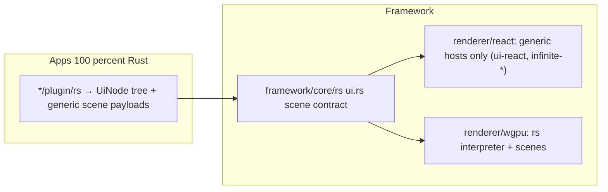

# Rust-Only Apps, Framework-Provided Rendering

## Current State

Apps are already Rust WASM plugins (`*/plugin/rs/lib.rs`) emitting declarative `UiNode` trees, but three things violate "apps are 100% Rust / framework provides everything":

1. **App-specific component kind**: `flow-canvas` exists only for the `s` program and is backed by the app package `flow/react` (which pulls in `dag/react`) via [framework/renderer/react/components/flow-canvas-host.tsx](framework/renderer/react/components/flow-canvas-host.tsx).
2. **App packages on the renderer runtime path**: [framework/renderer/react/components/text-editor-host.tsx](framework/renderer/react/components/text-editor-host.tsx) imports `@semio-tech/writer-react` and `@semio-tech/writer-core`; aliases live in [framework/product/os/dev/js/vite.config.ts](framework/product/os/dev/js/vite.config.ts) (lines 24-26, 33) and deps in [framework/renderer/react/package.json](framework/renderer/react/package.json).
3. **~25 orphaned app JS packages**: legacy `*/core/js` playground shells (draw, flow, writer, s, dag, note, forms, vcs, layout, imperative, sequence, raster, shooting, lowpoly, gis/2d, procedural/2d+3d, puzzle/2d+3d+5d, trinity/rewrite, reasoning/mindmap/wires, cad/renderer) plus app React packages (`flow/react`, `writer/react`, `dag/react`, `trinity/rewrite/react`, `reasoning/mindmap/react`). None are on the OS dev boot path (fixtures are `include_str!` in Rust; boot loads only plugin WASM via `loadPluginModule`).

Decisions confirmed: keep both renderers; generalize flow/writer functionality into the generic hosts; delete all app-level JS.

## Target Architecture

Generic shared render libs stay (not app code): `@semio-tech/ui-react` ([ui/js/react](ui/js/react)), `infinite/canvas/react-renderer`, `infinite/world/r3f`, `ui/wgpu/rs`.

## Phase 1: Generalize the Scene Contract (framework/core/rs/ui.rs)

- **Remove `flow-canvas`**: delete `FlowCanvasScene`, `build_flow_canvas_scene`, and the `"flow-canvas"` kind (line 817). Extend `NodeGraphScene` (line 586) with the capabilities flow-canvas provided, all declarative: `editable`, `operators_json` (catalogue/extension contributions), `context_menu_json`, `find_items_json`, plus open/edit intents expressed as `CommandDescriptor`s so structural edits round-trip through the program.
- **Enrich `TextEditorScene`** (line 604) so the writer app needs no JS intelligence: plugin-provided `tokens_json` (syntax highlighting spans), `diagnostics_json`, `completions_json`, `overlays_json`. The Rust writer program computes these (Jack AST/grammar logic lives in or moves to `writer/rs`).

## Phase 2: App-Agnostic React Renderer

- **Fold flow-canvas-host into node-graph-host** ([framework/renderer/react/components/node-graph-host.tsx](framework/renderer/react/components/node-graph-host.tsx)): editable graph, context menu, find registration, double-click open, catalogue drag-drop — implemented against the generic `ui-react` `Diagram`, driven purely by the scene payload. Delete `flow-canvas-host.tsx`; remove the `componentScene` dispatch entry in `ui-interpreter.tsx`.
- **Rewrite text-editor-host** as a fully generic editor (buffer + tokens + diagnostics + selection from the payload, edits dispatched as commands). Drop `writer-react`/`writer-core` imports.
- **Cleanup**: remove `flow-react`, `dag-react`, `writer-react`, `writer-core` deps from `framework/renderer/react/package.json`, aliases from `vite.config.ts`, and the stubs in `framework/renderer/react/vitest.config.ts`.

## Phase 3: Wgpu Renderer Parity

- [framework/renderer/wgpu/rs/interpreter.rs](framework/renderer/wgpu/rs/interpreter.rs) and [framework/renderer/wgpu/rs/scenes.rs](framework/renderer/wgpu/rs/scenes.rs): remove the `flow-canvas` host, extend the `node-graph` host with the merged capabilities, extend the `text-editor` host to render tokens/diagnostics from the payload.

## Phase 4: Update Plugins (Rust)

- [s/plugin/rs/lib.rs](s/plugin/rs/lib.rs) (line ~1155): emit the extended `node-graph` scene instead of `flow-canvas`, moving operator/contribution data into the payload.
- [writer/plugin/rs/lib.rs](writer/plugin/rs/lib.rs): compute tokens/diagnostics in Rust and emit them in `TextEditorScene`. Other text-editor emitters (flow, sequence, dag, vcs, imperative, trinity) keep working with the optional new fields.

## Phase 5: Delete All App-Level JS

- Delete every `*/core/js` playground package listed above, plus `flow/react`, `writer/react`, `mathematical/graph/port/directed/dag/react`, `trinity/rewrite/react`, `reasoning/mindmap/react`, `cad/renderer/core/js`, and `cad/core/js` (verify no runtime dependents first; port any still-needed model-runtime logic to `cad/rs`).
- Port anything still referenced: `writer/core/js/internal.ts` intelligence into `writer/rs`; confirm the `@semio-tech/vcs-core` deps in [framework/product/os/core/package.json](framework/product/os/core/package.json) and `framework/product/presentation/core/package.json` are stale (no imports found) and remove them, deleting `vcs/core/js` too.
- Cleanup: workspace/package manifests, nx `project.json`s, `script.ts` targets, vite `optimizeDeps`, `launch.json` entries, lockfile (`bun install`), stale `@semio-tech/*-react` refs in surviving `package.json`s.

## Phase 6: Verification

- Build all plugin WASM + both renderers via `framework/product/os/dev/script.ts`.
- Run the existing e2e suites for all 25 playgrounds on both renderers (`.repo/🎫️/26/07/04/WGPU-PLAYGROUND-E2E/verify-wgpu-playgrounds-e2e.ts` and the React twin in the `SUPPORT-REACT-AND-WGPU-RENDERERS-IN-PLAYGROUNDS` ticket), asserting real paint for the merged node-graph (s program) and enriched text-editor (writer).
- Run Rust tests and the surviving JS test suites; extend existing test files for the new scene payload fields.

## Ticket

Reopen ticket `26/07/05/SUPPORT-REACT-AND-WGPU-RENDERERS-IN-PLAYGROUNDS` or open a new one (e.g. "Apps Emit Only Generic Framework Components") after listing `repo://goals`; keep temp scripts/logs in the ticket folder.
