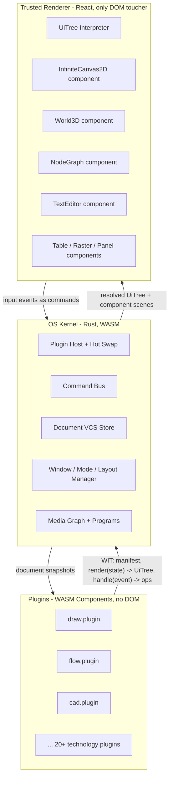

# Rust Plugin Framework Migration

## Target Architecture

The TypeScript meta-framework (`framework/core`, `framework/product/{platform,playground,os,presentation}`) is replaced by a Rust kernel plus a WASM Component Model plugin system. Apps stop being TS packages with React contributions; each technology ships one Rust plugin component that bundles its apps and emits declarative UI. One trusted React renderer interprets that UI. Plugins never see the DOM.

Key design decisions (from your answers):

- Renderer-independent core: the kernel and all plugins are pure Rust with zero renderer knowledge; exactly one React renderer is implemented now, others can follow.
- Plugin mechanism: WASM Component Model. WIT interfaces define the plugin world; `cargo component` builds plugins; `jco` transpiles them for the browser host. Hot-swap = re-instantiate the component; all durable state (VCS op logs) lives in the kernel, so plugins are logic-only and swap losslessly.
- Compile-time UI vocabulary: the per-app surface nodes (`UiDrawHostSurfaceNode`, `UiNoteHostSurfaceNode`, … 25+ kinds in `framework/product/platform/core/js/index.ts` lines 305–560) are replaced by a small set of general components any app can use: `infinite-canvas-2d`, `world-3d`, `node-graph`, `text-editor`, `table`, `raster-viewport`, `code-editor`, plus primitives (stack, text, button, tree, inspector, field, slider, …). Apps describe _scenes_ for these components declaratively; they never contribute React code.

## New Structure

- `framework/wit/` — WIT package `semio:framework`
  - `ui.wit`: `ui-node` variant (all primitives + component-scene nodes), `component-scene` types per compile-time component (canvas-2d scene: paths, images, text runs; world-3d scene: meshes, instances, camera; node-graph scene: nodes, ports, edges; editor scene: text buffer ops; table scene: columns/rows)
  - `plugin.wit`: world `plugin` — exports `manifest() -> plugin-manifest` (apps, modes, window kinds, keybindings, programs, examples), `create-app(app-id) -> instance`, `handle-command(instance, command, doc-snapshot) -> list<edit-op>`, `render(instance, doc-snapshot, view-state) -> ui-tree`; imports `host` (log, clock, asset fetch)
- `framework/core/rs` — kernel crate `semio-framework-core`: `Platform`, `CommandBus`, window layouts, mode/window/panel model, UiTree types (shared with WIT bindings), ported 1:1 from `framework/core/js/index.ts` and the runtime parts of `framework/product/platform/core/js/index.ts`
- `framework/product/os/core/rs` — crate `semio-framework-os`: plugin host (load/instantiate/hot-swap components), app instance lifecycle, media graph + program registry (port of `framework/product/os/core/js/index.ts`), document store on top of existing `vcs/rs`
- `framework/plugin/rs` — plugin SDK crate `semio-framework-plugin`: declarative app builder (`App::new(id).mode(...).window(...).panel(...)`), typed edit-op/document traits, `export_plugin!` macro wrapping wit-bindgen so a plugin is one `lib.rs` with pure functions
- `framework/renderer/react/` — the single trusted renderer package `@semio-tech/framework-renderer-react`: boots the kernel WASM, runs the jco-loaded plugin components, interprets `UiTree`, and owns the compile-time component implementations by wrapping the existing engines: `infinite/cavas` (wgpu/Vello 2D), `infinite/world/r3f` (3D), the flow/dag graph canvas, editor, table. Shell chrome (navbar, panels, golden layout) ported from `framework/product/platform/renderer/react/index.tsx` + `framework/product/playground/renderer/react/index.tsx` but reduced to pure UiTree interpretation.
- `framework/product/os/dev/` — dev host: builds all plugin components (`cargo component build`), transpiles with `jco`, serves via Vite, watches plugin crates and hot-swaps over WebSocket without page reload.

Playground product collapses into the OS dev host booted with a single plugin (`PLUGIN=draw`); presentation becomes an ordinary plugin. `framework/product/platform` and `framework/product/playground` TS packages are deleted after migration.

## App Migration

Every technology gets a plugin crate `<tech>/plugin/rs` (extending its existing `<tech>/rs` domain crate where present — most already have Rust document/engine code). The plugin declares its apps fully in Rust:

- document model + edit ops (port from `<tech>/core/js/internal.ts` where still TS-only, e.g. draw, note; reuse existing Rust for flow, puzzle, layout, …)
- controller logic (port `*PlayController` command handling)
- declarative windows/panels/inspectors as UiTree builders (port `windowBodies` / `sidePanelBodies` factories)
- scenes for the general components instead of custom React canvases (e.g. `DrawCanvas` SVG rendering becomes a `canvas-2d` scene emitted by the draw plugin; `NoteCanvas` likewise; cad/puzzle3d/shooting/lowpoly emit `world-3d` scenes; flow/dag/imperative/sequence emit `node-graph` scenes; writer emits `text-editor` scenes)

Then delete per-app TS: all `<tech>/core/js` app-shell/controller/play-id code, all `<tech>/react` packages, all `semio.app` manifests in `package.json` (replaced by WIT `manifest()`), `repo/lib/js/playground-manifest.ts`, and the `virtual:semio-playground-apps` plugin in `ui/styling/vite-elements-assets.ts`.

Migration order (each app boots and is verified in the new OS before the next): draw → note → writer → raster → forms → vcs → flow → dag → imperative → sequence → layout → puzzle2d → gis2d → procedural2d → reasoning-wires → cad → puzzle3d → puzzle5d → shooting → lowpoly → procedural3d → trinity → trinity-rewrite → mathematical-dag → s (OS studio itself) → presentation.

## Hot Swap Mechanism

1. Kernel owns all state: per-instance `DocumentVcs` op logs (via `vcs/rs`), window layout, selection/view state as serialized data.
2. Plugins are stateless between calls (pure `render`/`handle-command` over snapshots), so swapping is: unload component → instantiate new artifact → replay `manifest()` → re-render.
3. Dev host watches `<tech>/plugin/rs`, rebuilds the component, pushes the new artifact over WebSocket; renderer swaps it in place. Manifest diffs (added/removed apps) update the OS app registry live.

## Toolchain & Repo Integration

- Add `wit-bindgen`, `wasm-tools`/`cargo-component` to the Rust workspace (`Cargo.toml`); add `@bytecodealliance/jco` as dev dependency for transpilation.
- All build/dev commands go through the respective `script.ts` (`framework/product/os/dev/script.ts` gains `plugin build`, `plugin watch`) and `project.json` stays a thin `script.ts` dispatcher; register run configs in `.vscode/launch.json` following existing grouping.
- Extend existing test files: kernel unit tests in Rust (`framework/core/rs`), plugin conformance tests (every plugin's `manifest()`/`render()` golden-checked), renderer interpretation tests in the existing vitest setup.
- Work happens inside a repo ticket (open via `ticket_open` after reading `repo://goals`); temporary verification logs go into the ticket folder.

## Deletions at the End

- `framework/core/js`, `framework/product/platform/**` (TS), `framework/product/playground/**` (TS), `framework/product/os/core/js`, `framework/product/os/renderer/react`, `framework/product/presentation/{core,renderer}` (TS)
- every `<tech>/react` package and the app-shell portions of every `<tech>/core/js`
- `repo/lib/js/playground-manifest.ts`, playground virtual-module plugin in `ui/styling/vite-elements-assets.ts`, all `semio.app` blocks

## Risks / Notes

- This is a very large migration (25+ apps, ~10 framework packages). The phased per-app order keeps the repo bootable throughout: old TS framework and new Rust OS coexist until the last app is migrated, then TS is deleted in one final sweep.
- The generic `component-scene` types must cover today's bespoke canvases (e.g. draw's SVG features, note's math rendering, flow's WASM modules). Where a canvas already runs Rust/WASM (infinite/cavas, flow), the scene protocol routes data Rust-to-Rust and the React wrapper stays thin.
- Browser Component Model support relies on jco transpilation (stable, used in production by Bytecode Alliance); native `wasmtime` hosting stays possible later because the kernel is renderer- and host-independent.
