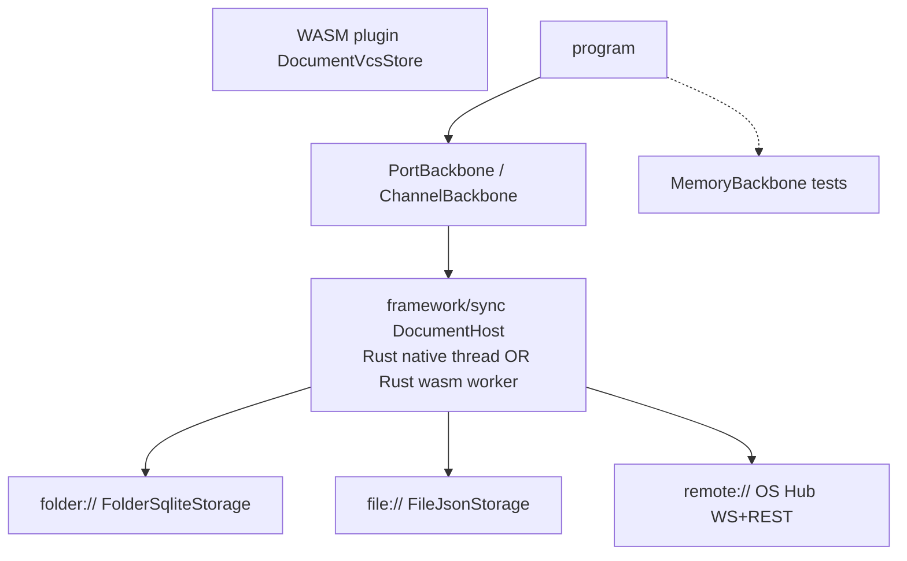

# Rust-Only VCS with Complete Backbones

## Locked decisions

- **Source of truth:** [`vcs/rs/lib.rs`](vcs/rs/lib.rs) only. Delete [`vcs/core/`](vcs/core/) (TS mirror + vitest). No dual runtime.
- **IO boundary stays:** `vcs` remains a non-blocking queue + storage format helpers; hub/file/folder IO stays in [`framework/sync/rs/lib.rs`](framework/sync/rs/lib.rs) and [`framework/product/os/hub/`](framework/product/os/hub/). Do not pull HTTP/fs into `vcs`.
- **Browser sync becomes Rust:** replace [`backbone-worker.ts`](framework/product/os/core/js/backbone-worker.ts) by shipping `framework/sync`'s existing wasm `DocumentHost` path as the browser actor (no TS twin). Thin JS only hosts the worker entrypoint.
- **Ticket:** reopen [`26/07/12/OS-VCS-HUB-CQRS-EVENT-SOURCING-REFACTOR`](.repo/🎫/26/07/12/OS-VCS-HUB-CQRS-EVENT-SOURCING-REFACTOR/ticket.json) (goal `🎯r2602🎯runningsketchpad` / issue #1956) — same task, not a new ticket.
- **Out of scope for this pass:** WS-F mass program `setDocument` migration (~20 plugins). Hub/backbone must work for already-migrated typed-operation apps (shooting, vcs-play, architect, etc.).

## Architecture (target)

## Workstreams

### 1. Retire TypeScript VCS

- Remove `vcs/core` package (project.json, package.json, js/, script.ts) and nx/workspace wiring.
- Migrate sole consumer [`animate/present/core/js/internal.ts`](animate/present/core/js/internal.ts) off `@semio-tech/vcs-core`: move presentation deck VCS usage into Rust (`animate/present` rs or existing animate program path) so TS only sees serialized envelopes if needed.
- Update [`vcs/AGENTS.md`](vcs/AGENTS.md) bundles to `vcs/rs` + `vcs/plugin` only (no `vcs/core`, drop stale `vcs/react`/`vcs/play` claims or point at program).

### 2. Finish VCS engine gaps in Rust

In [`vcs/rs/lib.rs`](vcs/rs/lib.rs):

- Remove dead `VcsError::RemoteSyncNotImplemented`.
- Implement or delete stub semantic/compensating undo (`UndoPolicy::SemanticUndo` / `CompensatingAction`) — implement real compensating path via `Operation::backwards` + optional `semantic_command`, no half-stub.
- Keep `FileJsonStorage` / `FolderSqliteStorage` / `BlobStore` as format primitives; add round-trip tests for all four sync surfaces: memory peer, file, folder, hub (hub tests live in sync + hub crates).
- Align URI docs with reality: `temp://` (memory), `file://`, `folder://`, `remote://` (via sync actor), drop stale `dev://`/`local://`/`sqlite://` from trait docs.

### 3. Backbone + hub flawlessness

**Native (already mostly done — harden):**

- [`framework/sync`](framework/sync/rs/lib.rs): `PersistenceBinding::{Folder, Hub}` + existing multi-client hub convergence tests — extend with file-binding, reconnect/backoff, envelope CAS conflict, presence.
- [`os-hub`](framework/product/os/hub/rs/bin.rs): keep SQLite as default; wire postgres backend selection if crate already implements `HubStorage` (neo4j only if trait-complete — otherwise delete unwired dead backend rather than leave stubs).
- Add hub `BlobStore` HTTP routes only if `vcs::BlobStore` is required by folder/hub parity; otherwise keep blobs folder-local and document that.

**Browser (replace TS twin):**

- Compile/use `semio-framework-sync` wasm actor as the worker body; delete or shrink `backbone-worker.ts` to a loader that posts messages to the wasm actor.
- Finish WS-E relay: program WIT `backbone-send`/`backbone-poll` → plugin host → sync actor (React shell + wgpu wasm).
- Confirm Sync attach cards (temp/file/folder/remote) open documents through this path only.

### 4. Verification

- `cargo test -p vcs`, `-p semio-framework-sync`, `-p os-hub` (and storage backends that remain).
- Runtime `[DEBUG]` confirmation: playground default temp → attach file → folder → remote hub round-trip across two clients; remove logs after.
- No remaining imports of `@semio-tech/vcs-core`.
- Close ticket with summary of files touched.

## Explicit non-goals (this session)

- Migrating all remaining plugins off `setDocument` (WS-F waves 2–4).
- Unifying Compose hub (`compose/server/hub`) with OS hub.
- Building a separate `vcs/react` HistoryTable package (history UI stays in plugin/framework surfaces).
