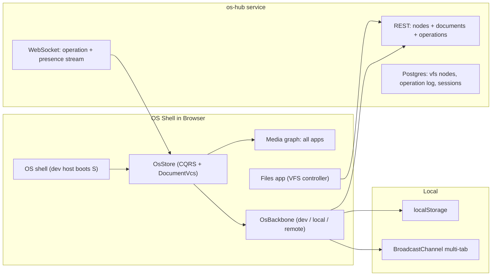

# S as the OS: Full Media Graph, Unified VCS, Collaborative Storage

## Current state (research findings)

- `dev:s` boots S through the generic playground harness ([framework/product/playground/dev/script.ts](framework/product/playground/dev/script.ts) + [framework/product/playground/core/app-registry.ts](framework/product/playground/core/app-registry.ts)); `bootstrapSPlayExtensions()` is only called in tests, so the launcher/program catalog is incomplete in dev.
- `SAppHostRouter` in [framework/product/playground/renderer/react/index.tsx](framework/product/playground/renderer/react/index.tsx) misses `note` (falls to JSON dump), `layout` is read-only, `reasoning.wires`/`reasoning.mindmap` are seed stubs without program definitions.
- Studio VCS (`OsVcs` in [framework/product/os/core/index.ts](framework/product/os/core/index.ts)) is weaker than the document VCS in [vcs/core/internal.ts](vcs/core/internal.ts): no checkpoint parents, authors, or checkout.
- Persistence is localStorage-only (`DevJsonBackbone`); `RemoteJsonBackbone.sync()` throws. compose-hub ([compose/server/hub/bin.rs](compose/server/hub/bin.rs)) has a reusable session/token/WebSocket/command shell but is ~90% kit-domain-specific. No CRDT/BroadcastChannel anywhere.
- Platform VFS ([framework/product/platform/core/index.ts](framework/product/platform/core/index.ts), `VirtualFileSystemController`) already supports lazy async children plus create/rename/delete/move hooks — ideal surface for an OS file manager.

## Target architecture

## Phase 1 — S boots as the OS (own dev host)

- Create `framework/product/os/dev/` mirroring [framework/product/playground/dev](framework/product/playground/dev): `index.html`, `index.ts`, `globals.css`, `vite.config.ts`, `script.ts`, `package.json` (`@semio-tech/framework-os-dev`), `project.json` (dev/build/test targets).
- Boot sequence in `os/dev/index.ts`: `await bootstrapSPlayExtensions()` (fixes the missing program catalog in dev), resolve backbone document (storage-first, fixture as seed), create `StudioStore`, boot OS shell renderer (current `bootSPlay` path, hosted from the os dev entry).
- Root [script.ts](script.ts) dev router: `dev s` → `nx run @semio-tech/framework-os-dev:dev` (no `--app` arg). Keep port 6066 via existing `PLAYGROUND_PORTS` slot in [repo/lib/js/index.ts](repo/lib/js/index.ts) (rename env to `S_OS_PORT`).
- Remove `s` from `ALL_PLAY_ENTRY_KINDS` and `importPlaygroundAppDefinition` in [framework/product/playground/core/app-registry.ts](framework/product/playground/core/app-registry.ts); drop the playground-harness bits of `sPlayAppDefinition` from [s/core/index.ts](s/core/index.ts) (S keeps its OS app/controller, loses `PlaygroundAppDefinition`). Clean the stale `./playground` export in [s/core/package.json](s/core/package.json).
- Update `.vscode/launch.json` entry for `dev:s`, add os-hub dev entry (Phase 4), following existing grouping/naming.

## Phase 2 — Media graph combines all apps

- Add missing `SAppHostRouter` cases in [framework/product/playground/renderer/react/index.tsx](framework/product/playground/renderer/react/index.tsx): `note` (NoteCanvas embed with `patchAppSource`), make `layout` editable (change handler → `applyAppOperation`), eliminate JSON-dump fallbacks for every registered resource kind.
- Complete stub programs: register `buildReasoningWiresWorkflowDefinition` in [s/core/program-extensions.ts](s/core/program-extensions.ts); add a mindmap program definition + VCS handler (or fold mindmap under `reasoning.wires` if it has no standalone document format — decide by inspecting reasoning/mindmap core).
- Audit every program in `TECHNOLOGY_APP_RESOURCE_BY_PROGRAM` ([s/core/internal.ts](s/core/internal.ts)) so each has: program definition merged, `AppVcsHandler` registered, componentKind routed, and correct in/out ports. Add output `projectOutput` hooks where apps should feed downstream (e.g. procedural → puzzle, flow dag → dag).
- Extend the existing os-core/s-core test files with a registry-completeness test: for every registered app, assert handler + componentKind + ports resolve (no fallback).

## Phase 3 — Unified rich VCS at studio level

- Upgrade `OsVcs`/`OsStore` in [framework/product/os/core/index.ts](framework/product/os/core/index.ts) to the document-VCS model from [vcs/core/internal.ts](vcs/core/internal.ts): checkpoints gain `parentId` + `authors`, add `checkoutCheckpoint` command, keep alternatives. Reuse `DocumentVcsStore` semantics rather than duplicating (os-core already depends on vcs-core).
- Wire the OS History window to `buildHistoryColumns` + vcs/react `HistoryTable` (branch lanes, checkout, alternatives) instead of the current slider stub in `SPlayController`.
- Per-app VCS (envelope in `sourceDocument.vcsJson`) stays; space checkpoints snapshot both structural operations and app-operation change ids (already the case via `applyAppOperation`).

## Phase 4 — Generic hub extracted as VFS storage layer

- New Rust service `framework/product/os/hub/` (axum + sqlx-postgres, modeled on [compose/server/hub/bin.rs](compose/server/hub/bin.rs)): extract the generic shell — sessions, owner/share tokens, command envelope + idempotency, actor directory, WebSocket broadcast — with a **document/VFS domain** instead of the kit domain:
  - Tables: `node` (folder/file tree: id, parent_id, name, kind), `document` (node_id, schema, snapshot json, version), `document_operation` (operation log of `OsChange` json, version, author), `session`, `share_token`.
  - REST: node CRUD (`/nodes`), document read (`/documents/{id}` snapshot + version), operation append (`/documents/{id}/operations` with optimistic version check), history read.
  - WS: `/documents/{id}/ws` streaming accepted operations + presence events to other clients.
  - `script.ts` + `project.json` (setup/build/test), port constant `OS_HUB_PORT` in [repo/lib/js/index.ts](repo/lib/js/index.ts). compose-hub stays untouched for now.
- TS storage layer in os-core: replace the three backbone classes with one `OsBackbone` interface + implementations:
  - `DevJsonBackbone` (localStorage, kept) gains a `BroadcastChannel` port so multiple tabs on the same document converge (operation re-dispatch on message).
  - `RemoteOsBackbone` (implements the stub): attach `remote://host/path`, initial load = snapshot + version, `sync` = push local `OsChange` operations with version, subscribe WS → dispatch inbound operations into `OsStore` as remote changes (new internal `applyRemoteChange` that bypasses the undo stack). Version-conflict rejections surface as `OsConflict` in the shell (toast/banner + rebase-by-replay of local pending operations).
- `OsStore` changes: distinguish local vs remote changes, pending-operation queue with ack, generation bump on remote apply. Extend os-core tests with a fake transport covering push/pull/conflict.

## Phase 5 — OS Files app + presence

- New `OsStorageVirtualFileSystemController` (in os-core, following `OsMediaGraphVirtualFileSystemController`): browses the storage tree (hub nodes or local namespace), implements the existing `createNode`/`renameNode`/`deleteNode`/`moveNodePersisted` hooks against the hub REST API; `navigateUri: os://document/{id}` opens a studio document into the shell.
- Register a `files` app under the `s.system` program so storage is browsable inside the media-graph OS shell.
- Presence: generalize the hub's presence events (cursor/selection per document session) into `PresenceUpdate`; small presence store on `OsStore`; media-graph canvas shows connected peers and their selections.

## Phase 6 — Verification and wrap-up

- Run all touched package tests (os-core, s-core, vcs-core, playground renderer, hub cargo tests).
- End-to-end check: `bun run dev:s` boots the OS (not playground harness), full launcher catalog, spawn/connect every app kind, checkpoint/undo/checkout, two browser tabs converge via BroadcastChannel, and with `os-hub` running two clients converge via WebSocket.
- Open/close a repo ticket per workspace rules; register new launch.json commands (os dev, os hub) following existing order/grouping.

## Explicit non-goals

- No CRDT merge (operation-log + optimistic versioning with replay-rebase is the concurrency model).
- compose-hub is not ported onto the new generic shell in this pass; compose kits keep their own path.
- No AGENTS.md edits (workspace rule).
