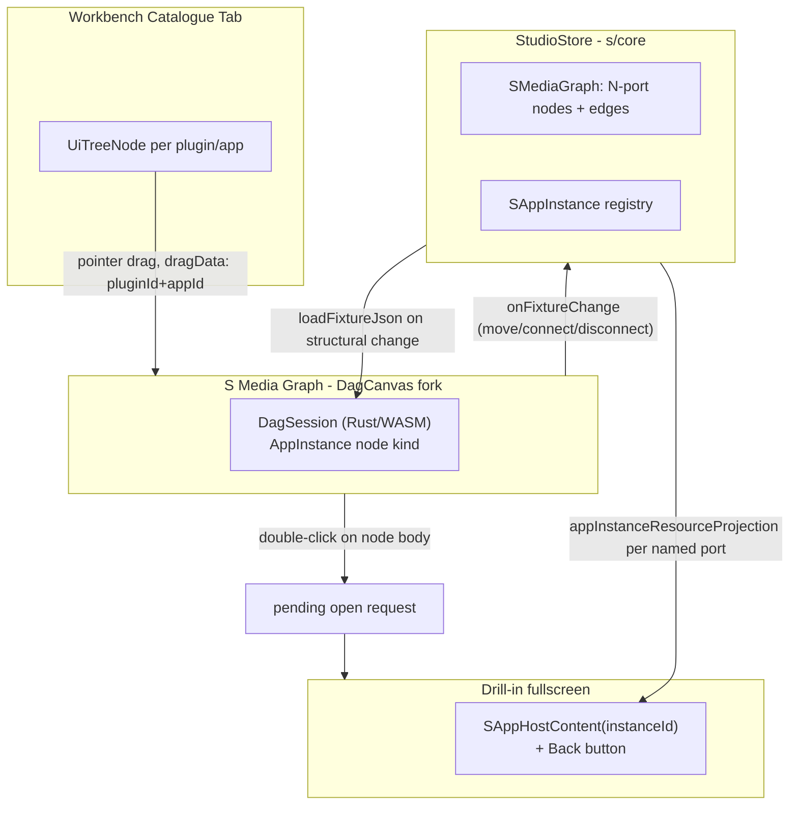

# S Master Platform Media Graph

## Current state (verified by exploration)

- `s/core/index.ts` already has typed `SMediaPort{id, resourceKind, direction}` and port-to-port `SMediaGraphEdge`, but `mediaGraphNodeForInstance` (`s/core/index.ts:734`) always synthesizes exactly **one** input + **one** output, mirrored from a single `SAppRegistration.yields: SArtifactKindId` field (`s/core/index.ts:150`). There is no `accepts`/inputs declaration anywhere.
- `SMediaGraphCanvas` (`s/react/index.tsx:65`) is a hand-rolled SVG (`<rect>`/`<line>`/`<circle>`), not a real graph engine.
- Spawning an app is a text box (`"pluginId appId"`) or a static button list (`SProgramLauncherPanel`, `s/react/index.tsx:195`). No catalogue tab, no drag-and-drop exists for S.
- There is no "open"/drill-in concept — a single docked "App Host" window always shows whichever instance is `activeInstanceId` (`s/play/index.ts:162`).
- The DAG Rust/WASM engine (`mathematical/graph/port/directed/dag/lib.rs`) is a closed, document-in/document-out GPU renderer: no `add_node`/`remove_node`/hit-test/click hooks, and its node-kind enum (`DagNodeKind`, `lib.rs:539`) is closed + manifest-validated. Multi-port even-spacing layout (`proportional_port_center_y`, `lib.rs:200`) already exists for free once a node returns >1 port.
- Puzzle 5d's `Model` already unifies 2D+3D (`project2d`/`project3d` derive views from one document, `puzzle/5d/react/index.tsx:707,772`), and its `KindCatalogBundle` (`puzzle/5d/react/index.tsx:3465`) is currently always inline/fixture-sourced.
- Shooting's fixture already references external GLB mesh URLs per asset (`ShootingAsset.url`, `shooting/react/index.tsx:30`); puzzle3d/5d parts also carry `meshUrl` (`puzzle/5d/react/index.tsx:206`).
- The S resource-manifest stubs for shooting/puzzle5d/cad/procedural in `s/core/index.ts` (e.g. `ShootingScene{entities}` at `s/core/index.ts:450`) do **not** match the real technology document shapes — this is pre-existing rot to fix along the way.

## Target architecture

## Phase 1 — Port model foundation (TypeScript, `s/core`)

- [s/core/index.ts](s/core/index.ts): replace `SAppRegistration.yields: SArtifactKindId` with `outputs: readonly SPortSpec[]` and add `inputs: readonly SPortSpec[]`, where `SPortSpec = { id: string; label: string; resourceKind: SArtifactKindId; required?: boolean }`.
- Generalize `mediaGraphNodeForInstance` to synthesize N ports from the registration's `inputs`/`outputs` instead of hardcoded 1/1.
- Generalize `resolveUpstreamResourceHandle`/`appInstanceResourceProjection` to resolve **per named input port** (an instance can have multiple inbound edges into different input ports) and to materialize **per named output port** (one instance can expose different projections per output, e.g. puzzle 5d's `graph2d` vs `mesh3d`). Introduce a small `outputProjectors` map alongside `AppVcsHandler` so a single underlying document can fan out into named output projections.
- Add two new resource kinds to [s/manifest/artifacts.manifest.json](s/manifest/artifacts.manifest.json) (and regenerate the mirrored `mathematical/graph/manifest/generated/s_resources.*`): `3d.mesh` (`{ url: string }`, componentKind `mesh`) and `catalogue.kinds` (the existing `KindCatalogBundle` shape, componentKind `catalogue`).
- Mechanically migrate every existing `SAppRegistration` entry (`s/core/index.ts:213` `TECHNOLOGY_PLAY_PROGRAMS`) to the new shape: baseline `outputs: [{id:"out", resourceKind: <old yields>}], inputs: []` for all apps not in the representative slice (draw, writer, raster, forms, flow, dag, procedural2d/3d, trinity, gis map, presentation, compose.sketchpad) — no behavior change for these, just reshaped.
- Fix the pre-existing stub/real mismatch for shooting (`ShootingScene{entities}` stub → real `ShootingFixture` materialization) as part of touching that handler.

## Phase 2 — Representative technology wiring (draw, writer, shooting, puzzle 5d)

- **Draw / Writer**: `outputs: [{id:"out", resourceKind:"2d.drawing"|"text.document"}]`, `inputs: []` (baseline, already correct behavior).
- **Puzzle 5d** ([puzzle/5d/react/index.tsx](puzzle/5d/react/index.tsx)): declare `outputs: [{id:"graph2d", resourceKind:"2d.puzzle"}, {id:"mesh3d", resourceKind:"3d.mesh"}]` and `inputs: [{id:"catalogue", resourceKind:"catalogue.kinds", required:false}]`. Wire materialization so `graph2d` = `project2d(model)`, `mesh3d` = `{url: <first part's meshUrl>}` derived from `project3d(model)`, and — when the `catalogue` input is connected — override `model.kindCatalogs` with the upstream `KindCatalogBundle` before projecting (falls back to today's inline-fixture behavior when disconnected, so no regression).
- **Shooting** ([shooting/react/index.tsx](shooting/react/index.tsx)): declare `inputs: [{id:"mesh", resourceKind:"3d.mesh"}]`, `outputs: [{id:"out", resourceKind:"2d.shooting"}]`. When the `mesh` input is connected, override the active `ShootingAsset.url` with the upstream mesh's `url`.
- Add a small "Kit Catalogue" system app (new `SAppRegistration` yielding `catalogue.kinds`, backed by `puzzle5dDefaultManifestCatalogBundle()`/similar aggregation) so the puzzle-5d catalogue input is actually demoable end-to-end, not just declared.
- This produces one concrete, demoable pipeline matching your examples directly: **Kit Catalogue → Puzzle 5d (mesh3d) → Shooting (mesh) → 2D output**.

## Phase 3 — Fork the DAG Rust engine for a generic `AppInstance` node kind

Scoped against `mathematical/graph/port/directed/dag/lib.rs`:

- Add `AppInstance { instance_id, plugin_id, app_id, icon, inputs: Vec<IoPortSpec>, outputs: Vec<IoPortSpec> }` to `DagNodeKind` (`lib.rs:539`). Add a `artifact_kind: Option<String>` field to `IoPortSpec` (`lib.rs:232`) for port coloring.
- Add compiler-forced match arms at the 7 exhaustive sites found: `dag_node_kind_tag` (`:597`), `DagNodeSpec::inputs`/`outputs` (`:699`,`:708`), `computation_io_side_row_counts` (`:857`), `computation_channel_row_count` (`:915`), `fit_node_size` (`:923`), `paint_node_visual` (`:3909`). `AppInstance` is _not_ added to `uses_computation_layout` so it gets the existing `proportional_port_center_y` (`:200`) even-spacing for free.
- Paint: reuse the already-shared box/stroke drawing (before the kind match, `:3876`), `paint_node_lod_icon` (`:3720`) for the icon, a title + "pluginId/appId" subtitle line, and thread `artifact_kind` into `paint_snap_handle`/`paint_node_handles_for_spec` (`:4118`, `:3149`) for port coloring (deterministic hash-based palette).
- Register the new kind in [flow/manifest/dag.manifest.json](flow/manifest/dag.manifest.json) and regenerate `mathematical/graph/manifest/generated/flow_dag.rs`.
- Build double-click detection from scratch (confirmed absent everywhere): add last-pointerdown timestamp + position fields to `DagHost`, threshold check in `pointer_down_screen` (`:2966`); on double-click over an `AppInstance` body (not a port), set `pending_open_instance_id` instead of starting a drag. Add a new `DagSession.takePendingOpenInstanceId() -> Option<String>` wasm export, polled by React after each `pointerUp`.
- Add a `DagSession.screenToWorld(x, y) -> {x, y}` wasm export (does not exist today) so the TS layer can place a dropped catalogue item at the correct world position.
- Keep the integration pattern already used elsewhere in this codebase: `DagSession` stays document-in/document-out for _structural_ changes (spawn/remove/connect: `StudioStore` mutates → `session.loadFixtureJson(new)`), and only live pointer gestures (drag/box-select/edge-draw) are read back out via `onFixtureChange` once they settle — no `add_node`/`remove_node` WASM methods needed.

## Phase 4 — New S media graph canvas on the forked engine

- Rewrite [s/react/index.tsx](s/react/index.tsx)'s `SMediaGraphCanvas` to wrap `DagCanvas` from `mathematical/graph/port/directed/dag/react/index.tsx`, translating `SMediaGraph`+`SAppInstance[]` ⇄ `DagFixture` with `AppInstance` nodes (bridge functions `sMediaGraphToDagFixture`/`dagFixtureToSMediaGraphPatch`, diffing before/after fixture JSON to emit `moveMediaNode`/`connectMediaPorts`/`disconnectMediaEdge` commands).
- Wire the polled "open request" to a new `SPlayController` command (`openInstance`).

## Phase 5 — Drill-in fullscreen "open app" UX

- [s/play/index.ts](s/play/index.ts): add `focusedInstanceId: string | null` to `SPlayController`, plus `run("openInstance", {instanceId})` / `run("closeFocusedInstance")`.
- [framework/product/playground/renderer/react/index.tsx](framework/product/playground/renderer/react/index.tsx): extract `SAppHostRouter`'s switch body into a reusable `SAppHostContent` component (also fixes the pre-existing dead-code duplicate `case "forms"/"raster"` at `:11881`). `SPlayInner` conditionally renders either the tiled 4-window `PlaygroundView`, or (when `focusedInstanceId` is set) a full-viewport `SAppHostContent` with a "← Back to Media Graph · {label}" header that dispatches `closeFocusedInstance`.

## Phase 6 — Workbench catalogue tab + drag-and-drop spawning

- Register a new "Catalogue" workbench tab for S play following the exact existing pattern (`FRAMEWORK_PANEL_TAB_CATALOGUE_ICON_ID/LABEL`, `UiTreeNode`/`UiTreeSectionNode`/`UiTreeItemNode`, `panel: "workbench"` — same convention as `puzzle/3d/play/index.ts:3473`).
- Build `buildSPlayCatalogueTree()`: one section per plugin, one draggable row per app, `dragData` via `CATALOGUE_DRAG_MIME`/`catalogueTreeDragController` (already generic in `ui/react/index.tsx:10134`).
- Implement a pointer-based drag controller mirroring `puzzle2dFixturePaletteTreeDragController` (`puzzle/2d/react/index.tsx:2820`) for Electron/scroll-panel compatibility.
- Wire the media-graph canvas to accept the drop: decode `{pluginId, appId}`, convert screen→world via the new `DagSession.screenToWorld`, dispatch `spawnApp({pluginId, appId, position})`.
- Remove the now-redundant text-input spawn UI (`mediaGraphEngagement`/`launcherEngagement` free-text fields) per the no-legacy-support rule, keeping Launcher as a thin fallback list or retiring it in favor of the catalogue tab.

## Phase 7 — Tests

- Extend existing vitest blocks (no new test files, per repo convention): `s/play/index.ts` for multi-port spawn/connect/catalogue-drag/openInstance/closeFocusedInstance and the puzzle5d→shooting mesh pipeline; `mathematical/graph/port/directed/dag/lib.rs` `mod tests` for `AppInstance` serialization, N-port layout, double-click timing, port color lookup.
- Manual Playwright verification of the full loop: drag from catalogue → spawn puzzle-5d + shooting nodes → connect `mesh3d`→`mesh` → double-click drills into puzzle 5d → back → double-click drills into shooting and shows the connected mesh.

## Scope note

Every other technology (raster, forms, flow, dag, procedural 2d/3d, trinity, gis map, presentation, compose.sketchpad) gets the mechanical baseline reshape in Phase 1 (so nothing breaks) but is **not** given rich multi-port/upstream-catalogue wiring in this pass — that follows the exact pattern established by Phase 2 and is left as documented follow-up work per technology.
