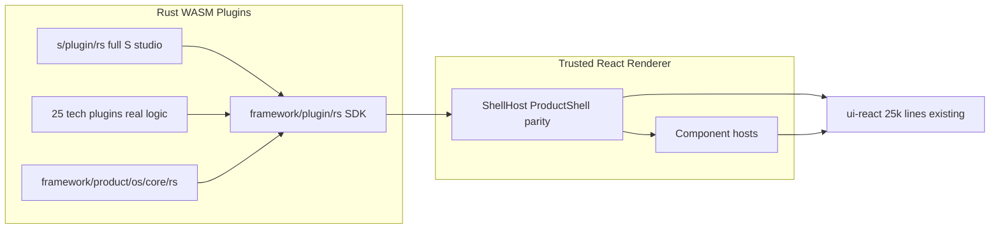

# S Studio Full Parity Port (Pure Rust)

## Problem

The migration commit `5ecbe3dbf` deleted the TS meta-framework (110k lines) and replaced the S studio with a stub: raw HTML buttons, `<pre>`-dumped JSON instead of the real node graph, no window manager, no panels, no home app, no VCS. The old look and behavior are fully recoverable as reference from git commit `f8376e848` (readonly `git show`, no checkout). Crucially, **[ui/react/index.tsx](ui/react/index.tsx) (25k lines) still exists** — it contains every visual component the old shell used (navbar, Tree panels, xyflow node graph, panel chrome, theme system). Exact look is achievable by making the trusted renderer use these same components; exact behavior requires porting the deleted platform/playground/os logic into Rust.

## Reference material (git, readonly)

- `f8376e848:framework/product/platform/renderer/react/index.tsx` (5,880 lines) — ProductShell, window canvas, declarative UI renderer, surface bindings
- `f8376e848:framework/product/platform/core/js/index.ts` (3,804 lines) — UiNode vocabulary, window bodies, VFS, WindowKind/Mode runtimes
- `f8376e848:framework/product/playground/renderer/react/index.tsx` (2,207 lines) — PlaygroundView: navbar, tree panels, footers, engagement
- `f8376e848:framework/product/playground/core/js/index.ts` (1,566 lines) — layouts, side panel bodies, app registry
- `f8376e848:framework/product/os/core/js/index.ts` (3,115 lines) — OS document/store/programs/media export/backbones
- [s/core/js/index.ts](s/core/js/index.ts) (still on disk, 2,051 lines) — the authoritative S behavior spec
- `f8376e848:<tech>/react/**` (93k lines) — per-technology surface renderers

## Architecture

## Phase 1 — UiTree schema parity (Rust core + WIT)

Extend [framework/core/rs/ui.rs](framework/core/rs/ui.rs) and [framework/wit/world.wit](framework/wit/world.wit) to the full old `UiNode` vocabulary from platform core: sections, fields, inspector groups (`uiInspectorAllEqual` mixed-value semantics), trees with drag data, toolbars/tools (`toolCollection`), controls, VFS surfaces, and component scenes with `paneId`/`bindingId`. Extend `AppDefinition`/`PluginManifest` in the same file with: window layouts (`createDefaultLayout`, `createTabStackLayout`, golden measures), side-panel tab groups (workbench/details), engagement specs, examples catalog, navigation levels, and parameter field specs. Mirror the additions in the SDK builder [framework/plugin/rs/app.rs](framework/plugin/rs/app.rs).

## Phase 2 — Renderer shell parity (React)

Rewrite [framework/renderer/react/os-shell.tsx](framework/renderer/react/os-shell.tsx) as a ProductShell-parity shell built on ui-react, porting from `f8376e848` platform/playground renderers:

- Navbar: SemioLogo, app/example selects, mode toggle, `PanelToggleGroup`, theme/compact/expertise controls, `bootstrapElementsSurfaceChromeDocument`
- Window canvas: golden-ratio layout (`windowMeasuresToGolden`), tab stacks, split panes, window engagement/focus, chrome-aware scroll surfaces
- Side panels: left document tree panel, right tab panel (Catalogue/Parameters/Inspection with the `FRAMEWORK_PANEL_TAB_*` ids/icons/labels), `Tree` component with drag-and-drop
- Footer chrome rows, keybinding dispatch (`useCommandHotkey`), URI history (`useUIHistory` port)
- Declarative renderer: `renderUiControl` / `uiTreeNodeToTreePanelConfig` equivalents interpreting the extended UiTree

## Phase 3 — Real component hosts

Replace the stub hosts in [framework/renderer/react/components/](framework/renderer/react/components/) (e.g. `node-graph-host.tsx` currently renders `<pre>{json}</pre>`):

- node-graph: xyflow via ui-react graph components (media graph nodes with typed ports, edges, viewport)
- canvas-2d: `@semio-tech/infinite-cavas-react-renderer`
- world-3d: `@semio-tech/infinite-world-r3f`
- text-editor, table, raster, virtual-file-system tree hosts — ported from the old platform renderer surface bindings

## Phase 4 — OS core port to Rust

Complete [framework/product/os/core/rs](framework/product/os/core/rs) with everything left in `f8376e848` os-core JS: plugin registry + resource descriptors, parameter types/bindings/compatibility, media export handlers + coverage assertion, dev/local/remote backbones, studio catalog (create/delete/import/list studios), media-graph VFS controller, `OsStore` projection/checkpoint/alternative materialization (leveraging existing [s/rs/lib.rs](s/rs/lib.rs) and vcs crates).

## Phase 5 — Full S program port

Rewrite [s/plugin/rs/lib.rs](s/plugin/rs/lib.rs) porting every behavior from [s/core/js/index.ts](s/core/js/index.ts):

- Home app: studios-catalog VFS window (`Studios` tab-stack layout), create/open/delete/import studio
- Studio app: media-graph window (node-graph scene with app-instance nodes, typed in/out ports, cross-instance edges), media VFS window, compiled DAG window; default layout identical to `S_PLAY_LAYOUT`
- Right panel tabs: Catalogue (programs from all plugins, spawn), Parameters (numeric sliders / categorical selects with instance bindings), Inspector
- Commands: spawn/select/move nodes, connect edges, `commitCheckpoint`, parameter set + binding propagation, media export download, S OS URI routing (`applySOsUri`)
- Demo fixture [s/example/demo.s.json](s/example/demo.s.json) renders exactly as before (5 instances, edge, 2 parameters)

## Phase 6 — Host composition for spawned apps

In the renderer host: spawning a plugin from the catalogue creates an instance in that plugin's WASM module and mounts its window body inside the studio window layout (old behavior: app windows open within S), with document flow across the media graph edges.

## Phase 7 — Technology program parity

Port real document logic and scene rendering for each tech program (currently `register_standard_app` stubs), prioritized by demo studio: draw, writer, raster first; then flow/dag/sequence/imperative, cad/puzzle/3d family, remaining. Reference each `f8376e848:<tech>/react` package for exact surface behavior.

## Phase 8 — Verification

- Behavior checklist derived from [s/core/js/index.ts](s/core/js/index.ts) tests (demo projection, checkpoint round-trip, media edge, catalogue programs) reproduced as Rust tests in `s/plugin/rs`
- Browser run via `SEMIO_PLUGIN=s` on port 6066 (launch config `🛠️dev🖥️s`): verify navbar, panels, media graph rendering, spawn, parameters, checkpoint, export against old-S screenshots/spec
- All work inside reopened ticket `26/07/04/RUST-PLUGIN-FRAMEWORK-MIGRATION`; temp comparison notes in the ticket folder

## Constraints

- No modifying git commands; old code is read via `git show f8376e848:<path>` only
- No new files outside existing package structure and the ticket folder; extend existing files with regions
- `bun` + `nx`, scripts only in `script.ts`, all commands already registered in launch.json
