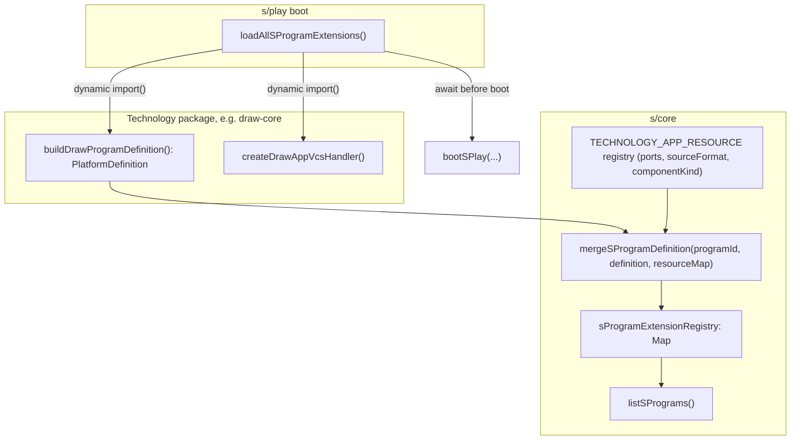

# S Technology Extension Loading

## Current state

Today `s/core/index.ts` hardcodes 17 technologies as a static `TECHNOLOGY_PLAY_PROGRAMS` array of full `SProgramDefinition` objects (id, name, apps with inputs/outputs/sourceFormat/componentKind baked in as string literals). Only `compose.sketchpad` uses a real "extension" pattern:

```416:461:s/core/index.ts
let composeSketchpadProgramOverride: SProgramDefinition | null = null;
export function mergeComposeSketchpadProgramDefinition(definition: PlatformDefinition): void {
	composeSketchpadProgramOverride = { /* enrich definition.apps with SKETCHPAD_APP_RESOURCE ports/format/kind */ };
}
export function listSPrograms(): readonly SProgramDefinition[] {
	return [S_SYSTEM_PROGRAM, composeSketchpadProgram(), ...TECHNOLOGY_PLAY_PROGRAMS];
}
```

Sketchpad's own package (`compose/client/lib/sketchpad/js/index.ts`) owns only the generic shape (`buildSketchpadProgramDefinition(): PlatformDefinition` — id/name/apps/modes), while S enriches it with S-specific port/resource metadata. `s/play/index.ts` loads it via a fire-and-forget `void import("@semio-tech/compose-sketchpad").then(...)`.

Separately, 9 technologies with working standalone playgrounds are **not** registered in S at all: `lowpoly`, `sequence`, `layout`, `imperative`, `vcs`, `trinity/jack`, `trinity/rewrite`, `reasoning/mindmap` (base), and `gis/3d` (a stub folder with no implementation — excluded from this pass, there is nothing to wire).

Finally, `SAppHostRouter` in `framework/product/playground/renderer/react/index.tsx` — the switch that renders a spawned app instance inside S — has real read+write wiring only for `draw`/`writer`/`forms`. Most others (`raster`, `cad`, `flow`, `dag`, `trinity`, `gismap`, `puzzle2d`, `puzzle3d`, `shooting`, `presentation`) are display-only or stubbed, and `puzzle5d` is a real bug (routed through the 3D fixture parser instead of the 5D `Model` schema).

## Target architecture



Every technology (baseline and rich) goes through the same `mergeSProgramDefinition` call; the difference is only how rich the `resourceMap` is (single output port vs. multi-port catalogue/mesh wiring like puzzle.5d/shooting today).

---

## Phase 1 — Generalize the S program registry (`s/core`)

In `[s/core/index.ts](s/core/index.ts)`:

- Replace `TECHNOLOGY_PLAY_PROGRAMS` (static array) and `composeSketchpadProgramOverride` (single-slot override) with one `Map<string, SProgramDefinition>` extension registry.
- Add `mergeSProgramDefinition(programId: string, definition: PlatformDefinition, resourceByAppId: Record<string, Omit<SAppRegistration, "id" | "label">>): void` — a generalized version of today's `mergeComposeSketchpadProgramDefinition`, which becomes a thin wrapper calling this with `SKETCHPAD_APP_RESOURCE`.
- Add `registerSProgramDefinition(program: SProgramDefinition): void` for cases that already produce a full definition.
- Introduce `TECHNOLOGY_APP_RESOURCE_BY_PROGRAM`: a table keyed by programId → per-app resource spec (ports/sourceFormat/componentKind), replacing the inline `sBaselineApp(...)` calls currently baked into the static array. This is the only place S-specific port topology continues to live (mirrors `SKETCHPAD_APP_RESOURCE` today).
- `listSPrograms()` becomes `[S_SYSTEM_PROGRAM, ...sProgramExtensionRegistry.values()]` (stable insertion order).
- Export `sExtensionRegistrySize()` / similar so tests and `SPlayController` can assert the catalog is fully loaded.

In `[framework/product/platform/core/index.ts](framework/product/platform/core/index.ts)`:

- Add a tiny shared helper `baselineSingleAppPlatformDefinition(id, name, appId, label, modes?)` returning a minimal `PlatformDefinition`, so ~20 technology packages don't each hand-roll boilerplate.
- Add missing `ComponentKind` values: `"lowpoly"`, `"trinityRewrite"` (jack reuses existing `"trinity"`; `vcs`, `sequence`, `layout`, `imperative` already exist in the enum).

## Phase 2 — Migrate the 14 baseline single-port technologies

`draw`, `writer`, `raster`, `flow`, `forms`, `puzzle.2d`, `puzzle.3d`, `trinity` (base), `gis.map`, `cad`, `dag`, `procedural.2d`, `procedural.3d`, `presentation`.

For each: add `build<X>ProgramDefinition(): PlatformDefinition` next to its existing VCS-handler factory (in `*-core` where one exists — draw, writer, raster, forms, flow, presentation — else in the `*-play` package: puzzle 2d/3d, trinity, gis.map, cad, dag, procedural 2d/3d), using `baselineSingleAppPlatformDefinition`. Move the corresponding entry out of the old static array into `TECHNOLOGY_APP_RESOURCE_BY_PROGRAM` in `s/core`.

## Phase 3 — Migrate the 2 rich-topology technologies + sketchpad

`puzzle.5d` (catalogue input, graph2d+mesh3d outputs), `shooting` (mesh input), `compose.sketchpad` (6 apps, per-app resource map). Same `mergeSProgramDefinition` call, richer `resourceByAppId`. `mergeComposeSketchpadProgramDefinition` is removed in favor of the generic call.

## Phase 4 — Wire up the 8 net-new technologies

| Technology                 | Work needed                                                                                                                                                                     |
| -------------------------- | ------------------------------------------------------------------------------------------------------------------------------------------------------------------------------- |
| `lowpoly`                  | New `ComponentKind`; add `createLowpolyAppVcsHandler` in `lowpoly/core`; `build<X>ProgramDefinition`; resource map entry                                                        |
| `sequence`                 | Add `createSequenceAppVcsHandler` in `sequence/core`; resource map entry (componentKind/`SAppHostRouter` case already exist)                                                    |
| `layout`                   | Add `createLayoutAppVcsHandler` wrapping existing `applyLayoutCommand`; resource map entry; new `SAppHostRouter` case using `LayoutCanvas`                                      |
| `imperative`               | Add `createImperativeAppVcsHandler`; resource map entry (host case already exists)                                                                                              |
| `vcs`                      | Add `createVcsAppVcsHandler` around `applyVcsDemoOp`/`VcsDemoProjection`; resource map entry; new `SAppHostRouter` case                                                         |
| `trinity/jack`             | Register as an **additional app** on the existing `trinity` program (reuses `trinity.graph` handler + componentKind); host renders `TrinityCanvas` in jack-query mode           |
| `trinity/rewrite`          | Additional app on `trinity` program with new `trinityRewrite` componentKind; composite host (before/after `TrinityCanvas`, LHS/RHS `Puzzle2dCanvas`, Writer for the jack query) |
| `reasoning/mindmap` (base) | Register like `reasoning.wires`: reuse `puzzle.2d` handler + `puzzle2d` componentKind, `Puzzle2dCanvas` with `graphPortMode="normal"`                                           |

`gis/3d` is excluded — it is an empty stub (`gis/3d/AGENTS.md` only, no schema/renderer/core), so there is nothing to translate into an extension yet.

Each new technology's package.json gets added as a dependency of `s/play` (dynamic import target) and `registerSTechnologyAppVcsHandlers()`/`loadAllSProgramExtensions()` picks it up.

## Phase 5 — Load extensions at S boot (`s/play`)

In `[s/play/index.ts](s/play/index.ts)`:

- Add `async function loadAllSProgramExtensions(): Promise<void>` that `Promise.all`s a dynamic `import()` + `mergeSProgramDefinition(...)`/`registerAppVcsHandler(...)` call for every technology from Phases 2–4 (replacing today's single fire-and-forget sketchpad import).
- Browser boot IIFE: `await loadAllSProgramExtensions()` before `bootSPlay(new PlaygroundS())`.
- Vitest setup: `await loadAllSProgramExtensions()` in a `beforeAll`, so existing tests that call `listSPrograms()` see the full catalog (mirrors the existing sketchpad-alignment test).

## Phase 6 — Fix `SAppHostRouter` embedding gaps

In `[framework/product/playground/renderer/react/index.tsx](framework/product/playground/renderer/react/index.tsx)`, using the working `draw`/`writer`/`forms` pattern (`store.dispatch({ kind: "patchAppSource" | "applyAppOperation", ... })`) as the template:

- **raster**: wire real `onSelect`/`onHover` (local state) + `onDocumentChange` → dispatch (currently no-ops).
- **flow**, **dag**, **trinity**: wire `onFixtureChange` → dispatch (component prop already exists, just unused — same fix `SMediaGraphCanvas` already applies for the S media graph's own DAG canvas).
- **map**: bind `materialized` fixture to `<Position>`/`<Route>` children + `onSelect`/`onHoverChange` → dispatch (currently renders a blank map).
- **puzzle2d**: build `declarativeSceneDescriptor` from the fixture and wire drag/delete/connect callbacks → dispatch (currently renders an empty default scene).
- **puzzle3d**: replace the local-selection-only `SPuzzle3dHost` with a host that dispatches the full edit-op suite (brush place, delete, relocate, connect) like the standalone `Puzzle3dPlayViewportHost`.
- **puzzle5d** (bug fix): stop routing through `SPuzzle3dHost`/`parsePuzzle3dFixture`; add a dedicated `SPuzzle5dHost` using `parseModel`/`FiveD` from `puzzle-5d-react`, dispatching `applyAppOperation` with puzzle5d ops.
- **cad**: extend `CadPlayRoot` to optionally accept an external model + `onModelChange` (it currently self-boots with no props), wire to dispatch.
- **shooting**: wire `onCamera` → dispatch; extend with a fixture write-back bridge mirroring the standalone shooting host bridge.
- **presentation**: give it its own explicit `case "presentation"` (currently only reached by accident via `panel` fallthrough) with an editable host instead of the bare `PresentationDeck` viewer.
- **catalogue**: add `case "catalogue"` rendering the `KindCatalogBundle` (kit-catalogue app currently falls through to a blank default).
- **default fallback**: show the raw `fixtureJson` like the `s`/`virtualFileSystem` cases already do, instead of just a name/kind label.
- **cleanup**: delete the unreachable dead `case "forms":` / `case "raster":` labels that fall through to the `panel` block (lines ~11906-11907).

## Phase 7 — Add hosts for the newly-registered technologies

Add `SAppHostRouter` cases (and small host components where needed, following the `SPuzzle3dHost`/`SSketchpadHost` pattern) for: `lowpoly` (`LowpolyCanvas`), `layout` (`LayoutCanvas`), `vcs` (op-log/editor host over `VcsDemoProjection`), `trinityRewrite` (composite host), plus confirm `sequence`/`imperative` (already have cases) get real write-back once their VCS handlers exist.

## Phase 8 — Tests

- Extend `s/play`'s existing Vitest suite: registry completeness (every technology from Phases 2-4 resolvable via `listSPrograms()`/`sProgramById`), VCS handler round-trip for each newly added format, extension-loading `beforeAll` hook.
- Extend each newly-touched technology core's existing test file with its new `AppVcsHandler` tests (lowpoly, sequence, layout, imperative, vcs).
- Manual verification: spawn a representative sample across all phases (one baseline, one rich, one net-new, one bug-fixed) from the workbench catalogue, edit in the drill-in view, confirm persistence back to the media graph.

## Todo tracking

To-dos are pre-created for this plan; mark them `in_progress` as you start each phase (starting with Phase 1) and don't stop until all are complete.
