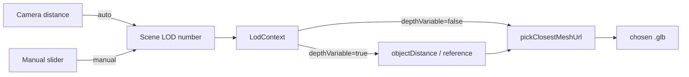

## Scope

All work lives in [elements/lib/react/scene/index.tsx](elements/lib/react/scene/index.tsx), [elements/lib/react/scene/play/index.ts](elements/lib/react/scene/play/index.ts), and a small extension to [elements/lib/framework/core/index.ts](elements/lib/framework/core/index.ts) + the renderer bridge in [elements/lib/framework/renderer/react/index.tsx](elements/lib/framework/renderer/react/index.tsx) so the play window can expose a slider/toggle. E2E expectations in [elements/lib/react/scene/play/e2e/scene.spec.ts](elements/lib/react/scene/play/e2e/scene.spec.ts) are updated to the numeric model. No backwards compatibility, no legacy tier names retained.

## Numeric LOD model

- A LOD is a positive `number` equal to `denominator / numerator` of a scale ratio.
  - `1:50000 -> 50000`, `1:200 -> 200`, `1:1 -> 1`, `2:1 -> 0.5`, `50:1 -> 0.02`.
  - Higher value = coarser (further out). Lower = more detailed.
- `pseudoZoomFromOrbitDistance` is replaced by `lodFromCameraDistance(distance, reference) = distance / reference`. The orbit-derived scene LOD is just the camera→target distance divided by `lodDistanceReference` (default `DEFAULT_SCALE_REFERENCE = 100`).
- The 6 named tiers (`minimap`/`overview`/.../`micro`), `LodKind`, `LodZoomThresholds`, `DOMAIN_LOD_SCALES`, `lodScaleKindsForDomain`, `lodZoomThresholdsForDomain`, `resolveLodLabelFromThresholds`, `LOD_MODE_AUTOMATIC`, `LodModeKind`, `isLodKind`, `lodCanvasProps`, `lodAutomaticSelectLabel`, `handlePrimaryVisualVisibleAtLod`, `handlePickProxyAtLod` are all deleted. `ScaleKind`/`SCALE_RATIOS`/`DomainKind` stay for non-LOD concerns.

## Representation lookup

```ts
export interface LodMeshEntry { readonly lod: number; readonly url: string; }
export function pickClosestLod(available: readonly number[], desired: number): number | null;
```

`pickClosestLod` ranks by `Math.abs(Math.log(rep) - Math.log(desired))` and on ties picks the **smaller** rep (more detail per the user spec). Returns `null` when `available` is empty. A helper `pickClosestMeshUrl(entries, desired, fallback?)` is added for `MeshBody`/`VortexHandle`.

`ObjectProps` gains `meshByLod?: readonly LodMeshEntry[]`; `meshUrl` becomes the fallback when no entry matches. `VortexProps.handleMeshByLod` changes from `Partial<Record<LodKind,string>>` to `readonly LodMeshEntry[]`. Fixture parsing in `parseFixture` / `parseHandleMeshByLod` is rewritten to accept the new list shape.

## Canvas props & context

`CanvasProps` becomes:

```ts
automaticLod?: boolean;      // default true, drives LOD from camera distance
depthVariableLod?: boolean;  // default false, picks LOD per object using its world distance
lod?: number;                // manual LOD value used when both flags are false (forces scene-wide)
lodDistanceReference?: number;
availableLodRange?: { min: number; max: number }; // for slider clamping; default { 0.01, 100000 }
gridFactor?, showLodGrid?, gridSnapEnabled?         // unchanged
onLodChange?: (lod: number) => void;
```

`LodContextValue` becomes:

```ts
readonly lod: number;                                         // scene-level effective LOD this frame
readonly depthVariable: boolean;
readonly lodForWorldPosition: (p: Vector3) => number;         // = distance(camera, p) / reference when depthVariable, else lod
readonly gridStepWorld: number | null;
readonly gridFactor: number;
readonly gridSnapEnabled: boolean;
```

`LodFrameRunner` computes the scene LOD each frame from `automaticLod`/`depthVariableLod`/`lod`, exposes a stable `lodForWorldPosition` closure capturing the live camera, and signals `onLodChange` only when the scene-level number changes by more than a small epsilon (to avoid flooding). `LodGridHelper` is driven by `lodGridStepWorld(lod, gridFactor)`, a continuous version of the old switch:

```ts
export function lodGridStepWorld(lod: number, gridFactor: number): number | null {
  if (!Number.isFinite(lod) || lod <= 0) return null;
  // Round to nearest power-of-10 step scaled by gridFactor; null when step > some cap (replaces minimap "no grid").
  const raw = lod * 0.05 * gridFactor; // tuned so old 1:100 normal => ~5*gridFactor
  return raw > 50 * gridFactor ? null : raw;
}
```

(Exact constant tuned to keep current architecture-domain visuals roughly identical at normal/detail/micro.)

`data-scene-lod` on the canvas shell stringifies the live numeric LOD (e.g. `"187.42"` rounded to 2 decimals). The `LOD_KINDS` constant and `parseHandleMeshByLod`'s record-form parsing are removed.

## Handle visibility & pick proxy

Continuous replacements:

```ts
export function lodHandlePrimaryVisible(lod: number): boolean { return lod <= 200; }
export function lodHandlePickProxy(lod: number): boolean { return lod > 200 && lod <= 1000; }
```

Thresholds chosen so the architecture defaults map: normal/detail/micro (lod <= ~200) keep handle visuals; compact/overview (200..1000) use pick proxies; minimap (>1000) shows nothing — matching prior behavior.

## Mesh consumers

`MeshBody` (objects) and `VortexHandle` consume `useLod()`:

- When `depthVariable`, compute the per-object LOD via `lodForWorldPosition(originVec)` each render (memoize on origin + camera move using a `useFrame` tick + ref). When scene-wide, use `lodCtx.lod` directly.
- Pick the URL with `pickClosestMeshUrl(entries, effectiveLod, fallbackUrl)`.

## Play window UI

Extend [elements/lib/framework/core/index.ts](elements/lib/framework/core/index.ts) `WindowMeasure` union with `WindowMeasureSlider` and `WindowMeasureToggle`:

```ts
export interface WindowMeasureSlider { kind: "slider"; id: string; label?: string; value: number; min: number; max: number; step?: number; onChange: CommandDescriptor; }
export interface WindowMeasureToggle { kind: "toggle"; id: string; label?: string; pressed: boolean; text?: string; onChange: CommandDescriptor; }
export type WindowMeasure = WindowMeasureSelect | WindowMeasureSlider | WindowMeasureToggle;
```

Extend `windowMeasuresToGolden` in [elements/lib/framework/renderer/react/index.tsx](elements/lib/framework/renderer/react/index.tsx) with branches that map both new kinds to the existing `UIWindowMeasure` `slider` / `toggle` variants and dispatch the command bus with `{ value }` or `{ pressed }`.

[elements/lib/react/scene/play/index.ts](elements/lib/react/scene/play/index.ts) is rewritten to publish three measures:

- `scene-main-auto` — toggle, "Auto zoom" (default on).
- `scene-main-depth` — toggle, "Depth-variable" (default off).
- `scene-main-lod` — slider, log-scaled. Internally the slider stores `t in [0,1]` mapped to `lod = exp(lerp(log(min), log(max), t))` with `min=0.01, max=100000`. Active even when auto/depth on (shows live value); takes effect only when both flags are off. Commands: `setAutoLod`, `setDepthLod`, `setManualLod`. `setEffectiveLod` keeps receiving the numeric live LOD from the canvas and updates the slider's displayed value.
- `PLAY_LOD_TIERS` and `playLodTierMenuLabel` are removed.

## Tests

In [elements/lib/react/scene/index.tsx](elements/lib/react/scene/index.tsx) the in-file `describe(...)` test blocks for `lodCanvasProps`, `lodAutomaticSelectLabel`, `resolveLodLabelFromThresholds`, `lodZoomThresholdsForDomain`, `lodVisibleGridSnapStepWorld`, and the `handleMeshByLod` parser are rewritten to cover:

- `lodFromCameraDistance` (`d=100, ref=100 -> 1`, `d=20000, ref=100 -> 200`, `d=50, ref=100 -> 0.5`).
- `pickClosestLod`: `[50, 200, 1000]` with desired `100` → `50` (log-equidistant tie → smaller), with desired `500` → `200`, with desired `5000` → `1000`.
- `lodGridStepWorld` continuity (returns null for very-coarse LOD, returns ~5 at lod=100 with gridFactor=10).
- `lodHandlePrimaryVisible` / `lodHandlePickProxy` boundaries.
- `parseFixture` accepts the new `meshByLod` / `handleMeshByLod` list shape and rejects malformed entries.

In [elements/lib/react/scene/play/e2e/scene.spec.ts](elements/lib/react/scene/play/e2e/scene.spec.ts) `SCENE_LOD_TIERS` becomes a positive-number regex `^\d+(\.\d+)?$`, and the "pins tier on canvas" test is rewritten to toggle the "Auto zoom" toggle off and drive the slider, asserting `data-scene-lod` changes to the manual numeric value.

## Order of work

1. Numeric LOD core + helpers + context + frame runner + grid helper + handle visibility.
2. `MeshBody` / `VortexHandle` integration with `pickClosestMeshUrl` and depth-variable path.
3. Fixture parser + `ObjectProps.meshByLod`.
4. Framework `WindowMeasure` slider/toggle + renderer bridge.
5. Play controller rewrite (auto/depth toggles + log slider).
6. In-file unit tests + E2E spec update.
7. Manual verification: `nx run elements:scene-play` and the existing playwright check.

## Flow




