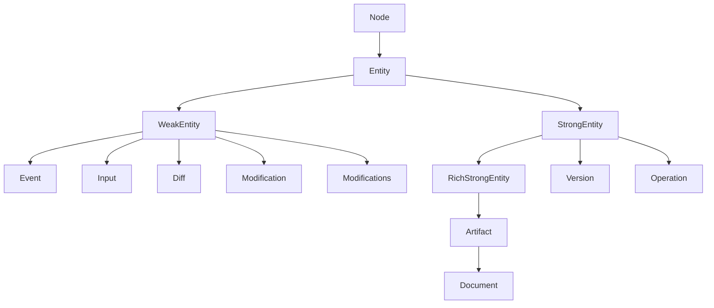

# Schema Inconsistency Cleanup

All edits land in [compose/graphql/target.schema.graphql](compose/graphql/target.schema.graphql). Out of scope: regenerating resolvers / non-target schema / language bindings.

## 0. Banner taxonomy (ground truth for sections 1, 2, 7, 8)

Every field on a `type` MUST sit under the `# <InterfaceName>` banner that introduces it. The full taxonomy, in canonical declaration order, is:

| Banner                            | Fields it covers                                                                                 |
| --------------------------------- | ------------------------------------------------------------------------------------------------ |
| `# Node`                          | `id`                                                                                             |
| `# Entity`                        | `hash`, `owner`, `owns`                                                                          |
| `# WeakEntity` / `# StrongEntity` | (no extra fields; banner only when the next group is a sibling block)                            |
| `# RichStrongEntity`              | `name`, `description`, `icon`, `createdAt`, `createdBy`                                          |
| `# Artifact`                      | `authoredBy`, `changedIn`, `lastChangedAt`, `lastChangedBy`, `lastChangedIn`, `changes`, `edits` |
| `# Document`                      | `previewImage`                                                                                   |
| `# Event`                         | `timestamp`, `involves`                                                                          |
| `# Version`                       | `checkpoint`, `latestWipCheckpointAncestor`, `savedChanges`, `unsavedChanges`, `kit`             |
| `# Input` (then `# Arguments`)    | input argument fields                                                                            |
| `# Diff`                          | per-diff fields                                                                                  |
| `# Modification`                  | `before`, `diff`, `after`                                                                        |
| `# Modifications`                 | `removed`, `modifications`, `added`                                                              |
| `# Operation`                     | `scope`, `input`, `modification`                                                                 |
| `# Operation Output`              | per-op output fields (`piece`, `pieces`, `quality`, `tag`, ...)                                  |
| `# <ConcreteName>`                | type-specific fields not covered above                                                           |
| `# EntityEdge`                    | `cursor`                                                                                         |
| `# <X>Edge`                       | `node`                                                                                           |
| `# EntityConnection`              | `edges`, `pageInfo`, `hash`                                                                      |

The user-supplied counter-example shows the bug clearly:

```graphql
type CreatedTags implements Operation {
 # Operation                                              <- WRONG: this is the Node block
 id: ID! # data // uuidv7
 hash: String! # cached                                   <- this is # Entity
 owner: Entity # reference // Edit
 owns: EntityConnection # reference // CreatedTagsInput | Tag
 scope: Entity! # reference // Entity                     <- now we are actually in # Operation
 input: CreatedTagsInput! # data
 modification: Modification! # computed
 tags: TagConnection! # data                              <- this is # Operation Output
}
```

Canonical form:

```graphql
type CreatedTags implements Operation {
 # Node
 id: ID! # data // uuidv7
 # Entity
 hash: String! # cached
 owner: Entity # reference // Edit
 owns: EntityConnection # reference // CreatedTagsInput | Tag
 # Operation
 scope: Entity! # reference // KitModifications
 input: CreatedTagsInput! # data
 modification: Modification! # computed
 # Operation Output
 tags: TagConnection! # data
}
```

This rule is enforced everywhere in section 8 (banner normalization).

## 1. Wrong `implements` clauses

Six concrete types declare the wrong interface. Their bodies already use the WeakEntity id contract (`# computed // hash`), so the fix is just the `implements` clause and pruning the inherited Artifact fields they should not have.

Example — before, [compose/graphql/target.schema.graphql](compose/graphql/target.schema.graphql) line 4843 onwards:

```graphql
type PieceDiff implements Artifact {
  # Node
  id: ID! # computed // hash
  # Entity
  hash: String! # cached
  owner: Entity # reference
  owns: EntityConnection # reference
  # RichStrongEntity
  name: String! # computed
  description: String! # computed
  icon: String! # data
  createdAt: Timestamp # computed
  createdBy: Author # computed
  # Artifact
  authoredBy: AuthorConnection # computed
  changedIn: CheckpointConnection # computed
  lastChangedAt: Timestamp # computed
  lastChangedBy: Author # computed
  lastChangedIn: Checkpoint # computed
  changes: ChangeConnection # computed
  edits: EditConnection # computed
  # PieceDiff
  removeName: Boolean # computed
  removeDescription: Boolean # computed
  position: Position # computed
  ...
}
```

After:

```graphql
type PieceDiff implements Diff {
  # Node
  id: ID! # computed // hash
  # Entity
  hash: String! # cached
  owner: Entity # reference // PieceModification
  owns: EntityConnection # reference
  # PieceDiff
  removeName: Boolean # computed
  removeDescription: Boolean # computed
  position: Position # computed
  ...
}
```

Apply the same pattern to:

- `GroupDiff implements Artifact` (4657) -> `implements Diff`. Drop `RichStrongEntity`/`Artifact` blocks. Keep diff-specific (`removeDescription`, `color`, `removeColor`, `removeIcon`, `pieces`).
- `PieceDiff implements Artifact` (4843) -> `implements Diff`. Same.
- `DesignDiff implements Artifact` (5738) -> `implements Diff`. Same.
- `GroupModifications implements Artifact` (4727) -> `implements Entity`. Drop `RichStrongEntity`/`Artifact` blocks. Keep only `# Modifications` block (`removed`, `modifications`, `added`).
- `PieceModifications implements Artifact` (4917) -> `implements Entity`. Same.
- `DesignModifications implements Artifact` (5816) -> `implements Entity`. Same.

Plus interface alignment:

- `interface Operation implements Entity { # implements StrongEntity` (276) -> `interface Operation implements StrongEntity {`. Drop the trailing reminder comment; the `id: ID! # data // uuidv7` field already matches the StrongEntity contract.
- `type Modifications implements WeakEntity` (245): every concrete `XModifications` sibling currently uses `implements Entity`. Normalize all `XModifications` -> `implements WeakEntity` so the abstract `Modifications` and the concrete ones share the same interface (their `id` is already `# computed // hash`).

## 2. Missing required `Artifact` fields and wrong tags on File / Type / Design

The `Artifact` interface (82-103) requires `changes: ChangeConnection # computed`. Three concrete artifacts omit it. They also wrongly tag five provenance fields as `# data` instead of `# computed`.

Example — `File` (1636) before:

```graphql
type File implements Artifact {
  # Node
  id: ID! # data // uuidv7
  # Entity
  hash: String! # cached
  owner: Entity # reference
  owns: EntityConnection # reference
  # RichStrongEntity
  name: String! # data
  description: String! # data
  icon: String! # data
  createdAt: Timestamp # computed
  createdBy: Author # data            <- WRONG
  # Artifact
  authoredBy: AuthorConnection # data <- WRONG
  changedIn: CheckpointConnection # data <- WRONG
  lastChangedAt: Timestamp # computed
  lastChangedBy: Author # data        <- WRONG
  lastChangedIn: Checkpoint # data    <- WRONG
  edits: EditConnection # computed
                                       <- MISSING `changes`
  # File
  ...
}
```

After:

```graphql
type File implements Artifact {
  # Node
  id: ID! # data // uuidv7
  # Entity
  hash: String! # cached
  owner: Entity # reference
  owns: EntityConnection # reference
  # RichStrongEntity
  name: String! # data
  description: String! # data
  icon: String! # data
  createdAt: Timestamp # computed
  createdBy: Author # computed
  # Artifact
  authoredBy: AuthorConnection # computed
  changedIn: CheckpointConnection # computed
  lastChangedAt: Timestamp # computed
  lastChangedBy: Author # computed
  lastChangedIn: Checkpoint # computed
  changes: ChangeConnection # computed
  edits: EditConnection # computed
  # File
  ...
}
```

Apply the same fix to `Type` (3959) and `Design` (5685).

## 3. Missing `Edge` / `Connection` types

- `Clump` (5670) — add `ClumpEdge implements EntityEdge` and `ClumpConnection implements EntityConnection` immediately after the type, inside `#region Clump`.
- `TheKit` (6341) — add `TheKitEdge implements EntityEdge` and `TheKitConnection implements EntityConnection` parallel to `AlternativeEdge`/`AlternativeConnection` (6377-6390).

Example skeleton:

```graphql
type ClumpEdge implements EntityEdge {
 # EntityEdge
 cursor: String! # computed
 # ClumpEdge
 node: Clump! # reference
}

type ClumpConnection implements EntityConnection {
 # EntityConnection
 edges: [ClumpEdge!]! # computed
 pageInfo: PageInfo! # computed
 hash: String! # cached
}
```

Polymorphic Edge already documented and intentional (no fix needed): `BlueprintEdge`/`BlueprintConnection` (4777-4788) page `Entity!` (Type | Design); leave as-is and add a one-line `# Polymorphic edge over Type | Design (no Blueprint type)` comment to `BlueprintEdge`.

`ModificationAttributesConnection` (1215) reuses `AttributeEdge` and is functionally a duplicate of `AttributeConnection`. Replace its single use site with `AttributeConnection` and delete the type. (Verify the use site by grepping the schema; if it has none, just delete.)

## 4. Per-`<Op>Edge` / `<Op>Connection` for every concrete Operation

For every concrete `type X implements Operation` (~85 types: `CreatedQuality`, `CreatedQualities`, `RenamedQuality`, ..., `RenamedKit`, `ChangedDescription`), append immediately after the type:

```graphql
type CreatedQualityEdge implements EntityEdge {
 # EntityEdge
 cursor: String! # computed
 # CreatedQualityEdge
 node: CreatedQuality! # reference
}

type CreatedQualityConnection implements EntityConnection {
 # EntityConnection
 edges: [CreatedQualityEdge!]! # computed
 pageInfo: PageInfo! # computed
 hash: String! # cached
}
```

This mirrors the existing pattern for every `<X>Modification` and `<X>Diff`. Implement via the same one-off Python script approach that drove the Input refactor (`.repo/.../transform-operation-inputs.py`); add a sibling script `add-operation-edges-connections.py` in the existing ticket folder.

## 5. Owner / owns union comments

### 5a. Remove ghost tokens

Five tokens appear in `owns` unions but are not defined anywhere in the schema:

- `AlternativeModification`, `EditModification`, `CheckpointModification`, `ConflictModification`, `SessionModification`

Remove from every `owns: EntityConnection # reference // ...` line where they appear (32 lines total: `interface Modification` 224, `type Modifications` 251, every `XModification` and `XModifications` block).

### 5b. Dedupe duplicate token

`AlternativeModification` is listed twice on the same broad `owns` line (32 occurrences). After the ghost-removal in 5a it disappears anyway, so this is folded in.

### 5c. Remove wrong-direction `Edit`

`Edit` is listed as a possible `owner` of every `Modification` and `Modifications`, but `Operation.owner # reference // Edit` (281) makes the actual document `Edit -> Operation -> Modification(s)`. Remove `Edit` from every `owner: Entity # reference // ...` line on `Modification` interface (223), `type Modifications` (250), and every `XModification`/`XModifications` block.

### 5d. Narrow per-type owner unions

Replace the copy-pasted operation union on every concrete `XModification.owner` and `XModifications.owner` with the actual operations that produce that modification kind. Mapping (modification kind <- operations that produce it):

- `PositionModification.owner` <- `MovedPiece`, `MovedPieces`, `DraggedPiece`, `DraggedPieces`, `CreatedFixedPiece`, `AddedHangingChildPieceWithParentConnection`, `AddedHangingChildPiecesWithParentConnections`, `FlattenedDesign`, `PieceModifications`
- `AttributeModification.owner` <- every `AddedAttributeTo*`, `AddedAttributesTo*`, `RemovedAttributeFrom*`, `RemovedAttributesFrom*`, plus the corresponding `XModifications` containers
- `QualityModification.owner` <- `CreatedQuality`, `CreatedQualities`, `RenamedQuality`, `UpdatedQualityDescription`, `UpdatedQualityIcon`, `DeletedQuality`, `DeletedQualities`, `KitModifications`
- `TagModification.owner` <- `CreatedTag`, `CreatedTags`, `RenamedTag`, `UpdatedTagDescription`, `UpdatedTagIcon`, `DeletedTag`, `DeletedTags`, `KitModifications`
- `ConceptModification.owner` <- analogous Concept ops + `KitModifications`
- `PortModification.owner` <- Port ops + `TypeModifications`
- `ConnectorModification.owner` <- Connector ops + `TypeModifications`
- `TypeModification.owner` <- Type ops + `KitModifications`
- `PieceModification.owner` <- piece ops (`CreatedFixedPiece`, `Dragged*`, `Moved*`, `Renamed*`, `UpdatedPieceDescription`, `Fixed*`, `ChangedPieceTo*`, `Added*WithParentConnection*`, `Deleted*`) + `DesignModifications`
- `ConnectionModification.owner` <- `Added*WithParentConnection*`, `DeletedPiecesAndConnections` + `DesignModifications`
- `DesignModification.owner` <- `CreatedDesign`, `CreatedDesigns`, `DeletedDesign`, `DeletedDesigns`, `FlattenedDesign`, `RenamedKit`, `ChangedDescription` + `KitModifications`
- `KitModification.owner` <- `RenamedKit`, `ChangedDescription`
- `LayerModification.owner` <- `DesignModifications` (placeholder until layer ops exist)
- `GroupModification.owner` <- `DesignModifications` (placeholder until group ops exist)
- `RepresentationModification.owner` <- `TypeModifications` (placeholder until representation ops exist)
- `StatModification.owner` <- (placeholder until stat ops exist)
- `BenchmarkModification.owner`, `PropModification.owner`, `AuthorModification.owner`, `FamilyModification.owner`, `FolderModification.owner`, `FileModification.owner`, `PlaceModification.owner` <- their containing `XModifications`
- `SideModification.owner` <- `ConnectionModifications`
- Geometry primitives (`VectorModification`, `PointModification`, `CoordinateModification`, `OffsetModification`, `PlaneModification`, `LocationModification`) <- their immediate parent `XModifications`

Same exercise for each `XModifications.owner` (replace giant union with the operations that produce that batched modification root, plus parent `KitModifications` / `DesignModifications` / `Modifications`).

Example — before:

```graphql
type QualityModification implements Modification {
 # ...
 owner: Entity # reference // AddedAttributeToConcept | AddedAttributeToDesign | ... | UpdatedTypeIcon
 owns: EntityConnection # reference // AlternativeModification | AttributeModification | ... | VectorModification
 # ...
}
```

After:

```graphql
type QualityModification implements Modification {
 # Node
 id: ID! # computed // hash
 # Entity
 hash: String! # cached
 owner: Entity # reference // CreatedQuality | CreatedQualities | RenamedQuality | UpdatedQualityDescription | UpdatedQualityIcon | DeletedQuality | DeletedQualities | KitModifications
 owns: EntityConnection # reference
 # Modification
 before: Entity! # reference // Quality
 diff: Diff! # reference // QualityDiff
 after: Entity! # reference // Quality
}
```

Note the also-narrowed `before`/`diff`/`after` comment refinements (Entity -> Quality, Diff -> QualityDiff). Apply the same refinement to every `XModification.before/diff/after` so they document the concrete subtype.

### 5e. Narrow per-type owns unions

`Modification.owns` (224) and every `XModification.owns` is currently the giant copy-paste of all modification kinds. A `Modification` does not actually own sub-modifications — `before`/`diff`/`after` are references. Replace `owns: EntityConnection # reference // <giant>` with `owns: EntityConnection # reference` (no union comment) on `interface Modification` and every `XModification`.

Fix drift in `XModifications.owns`:

- `TagModifications.owns` (2628) — add missing `TagModification` to the union.
- `PositionModifications.owns` (990), `LocationModifications.owns` (1109), `PlaceModifications.owns` (1355) — reorder to canonical `{Container} | {Item} | PlaneModification | PositionModification | AttributeModification | LocationModification | PlaceModification` to match the rest.

## 6. Field tag fixes

Single-field nits:

- `RenamedKitInput.name` (6183): add `# data`.
- `ChangedDescriptionInput.description` (6207): add `# data`.
- `Event.involves: EntityConnection` interface field (139): add `# reference`.
- `PieceDiff.icon: String!` (4853): change `# data` -> `# computed` (Diff field rule).
- `type Modifications` (253-255): change `removed`/`modifications`/`added` from `# data` -> `# computed` (every `XModifications` already uses `# computed`).
- `Node` interface `id: ID!` (17) and `Entity` interface `id: ID!` (22): leave bare `# data` (abstract roots; concrete subtypes specialize via `// uuidv7` or `// hash`).

The Commands region (`TagOperationInput`, `KitOperationInput`, ..., `Query`, `Mutation`, `Subscription`) intentionally has no per-field tags. Out of scope.

## 7. Reference-comment narrowing

Every `# reference` and `# data` and `# computed` comment that points to an entity should name the concrete type(s), not just `Entity`. Examples:

- `before: Entity! # reference // modification` -> `before: Entity! # reference // <ConcreteType>` (e.g. `Quality`, `Position`, `Piece`).
- `after: Entity! # reference // modification` -> same.
- `diff: Diff! # reference // modification` -> `diff: Diff! # reference // <ConcreteDiff>` (e.g. `QualityDiff`).
- `scope: Entity! # reference // Entity` on operations -> name the actual scope (e.g. `// KitModifications` for `CreatedTag`, `// Design` for `CreatedFixedPiece`, `// Quality` for `RenamedQuality`).
- `replaceableBlueprints: BlueprintConnection! # computed` and similar polymorphic fields -> add `// Type | Design`.

This is mechanical: walk every `*Modification` / `*Operation` block and replace the placeholder unions in `before`/`diff`/`after`/`scope`/`owner`/`owns` with the concrete narrow union. Same script as 5d.

## 8. Banner normalization (every type, not just Operation)

Today many types collapse the section banners or place them wrong (the user-supplied `CreatedTags` example is one of dozens). Insert / correct the `# <InterfaceName>` banner before every group of inherited fields per the taxonomy in section 0. This is a comment-only change — no field reorder, no field addition.

Concrete sub-cases:

- **Operation types (~85)**: `CreatedFixedPiece` (5101) is currently the only one in canonical four-banner form. Apply the four-banner form (`# Node`, `# Entity`, `# Operation`, `# Operation Output`) to every other Operation. This is the case the user called out.
- **Modification types (~32)**: Most use single `# Modification` banner. Insert `# Node`, `# Entity`, `# Modification`.
- **Modifications types (~32)**: Same — insert `# Node`, `# Entity`, `# Modifications`.
- **Diff types (~30)**: Most use `# Node` + `# Entity` + `# <X>Diff`. After section 1 trimming, also normalize the six previously-broken Artifact-shaped Diffs.
- **Edge types**: ensure `# EntityEdge` then `# <X>Edge` are both present (some skip the second banner).
- **Connection types**: ensure `# EntityConnection` is the only banner needed.
- **Input types**: ensure `# Node`, `# Entity`, `# Input`, `# Arguments` all appear.
- **Artifact / Document / Event / Version**: ensure full banner ladder (`# Node`, `# Entity`, `# RichStrongEntity`, `# Artifact`, `# Document` / `# Event` / `# Version`, `# <ConcreteName>`).

Implementation: a single helper script `normalize-banners.py` in the existing ticket folder. For each type, parse its `implements <X>` chain, derive the expected banner sequence from the taxonomy in section 0, and insert/move banners so that every inherited field sits under its introducing interface's banner (and concrete-type-specific fields under `# <ConcreteName>`). Idempotent.

Validation: after the script runs, every `type X implements Y` block whose first non-banner line is a `id: ID!` MUST be preceded by exactly `# Node` (not `# Y`).

## 9. Region structure

- `#region VCS` (6228) currently sits OUTSIDE `#region Entities` (which closes at 6226). Move `#endregion Entities` to AFTER `#endregion VCS` (around 6473), so all entity types (including `Edit`, `Change`, `Checkpoint`, `Graph`, `Session`, `Conflict`) live under `#region Entities`. The `#region Commands` block (6488+) stays outside as it is mutation API, not entities.
- `#region Kit` (1251) wraps Place, Family, Folder, ..., Concept, Stat, ..., Design, Kit — the name is misleading. Rename to `#region Kit Entities` to make clear it is a grouping of entities that compose a Kit, not just `Kit` itself.
- `type Design` (5685) sits AFTER `#endregion Clump` (5683) inside the outer `#region Design`. Reorder so `Design` and its `Edge`/`Connection`/`Diff`/`Modification`/`Modifications` come BEFORE the nested `#region Clump`. Cosmetic but matches the convention used for every other region.

## Resulting interface lattice



(Dropping the legacy `XDiff/XModifications implements Artifact` mistakes makes the lattice clean.)

## Implementation order

1. Drop ghost tokens, dedupe `AlternativeModification`, drop wrong-direction `Edit`.
2. Fix six wrong `implements` clauses + prune inherited Artifact bodies.
3. `interface Operation implements StrongEntity`; normalize `XModifications -> implements WeakEntity`.
4. Add missing `changes` field and retag `File`/`Type`/`Design` provenance fields.
5. Add `ClumpEdge`/`ClumpConnection`, `TheKitEdge`/`TheKitConnection`; delete `ModificationAttributesConnection`; comment `BlueprintEdge`.
6. Generate per-Op `<Op>Edge`/`<Op>Connection` via script.
7. Narrow per-type `owner` unions; clear `XModification.owns` unions; fix the four `XModifications.owns` drifts; narrow `before`/`diff`/`after`/`scope` reference comments.
8. Add the six field-tag fixes; retag `Modifications` aggregate.
9. Run `normalize-banners.py` to insert correct `# <InterfaceName>` banners before every group of inherited fields on EVERY type.
10. Move `#endregion Entities` after `#endregion VCS`; rename `#region Kit -> Kit Entities`; reorder `Design` block.

## Out of scope

- Regenerating resolvers / Rust / TS / Python types.
- Touching [compose/graphql/schema.graphql](compose/graphql/schema.graphql) (current schema, not target).
- Defining the missing modification kinds (`AlternativeModification`, etc.) — they are removed, not added.
- Adding actual ops for `Layer`/`Group`/`Stat`/`Representation`/`Benchmark` (only their `owner` placeholders are noted).
