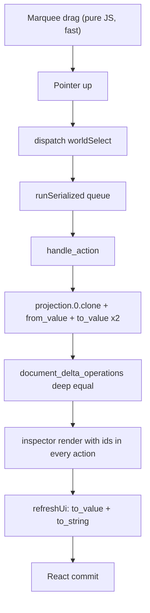

# Puzzle 3D selection commit latency

## Why the previous fix did not land

The earlier pass correctly split geometry from selection chrome, so the composite window is no longer re-rendered on selection. But the stall is not in the render path at all, and it is not proportional to selection size — which is why ~200 selected objects still takes ~30s.

## Root cause: every action pays a full-document round trip

`handle_action` snapshots and diffs the entire document on **every** action, including pure view actions that provably cannot mutate it:

```688:701:✏️s/🔌️plugin/🧩️puzzle/🎛️app/🧊️3d/🔨️module/🖱️ui/⚡️implementation/🦀️rust/📦️lib.rs
fn scene_from_projection(projection: &Value, runtime: Puzzle3dRuntime, active_utility: &str) -> Puzzle3dScene {
    let fixture = serde_json::from_value::<Puzzle3dFixture>(projection.clone()).unwrap_or_else(|_| empty_fixture());
    ...
fn puzzle3d_operations_from_fixture_change(before: &Value, after_fixture: &Puzzle3dFixture) -> Vec<Puzzle3dOperation> {
    let before_normalized = serde_json::to_value(serde_json::from_value::<Puzzle3dFixture>(before.clone()).unwrap_or_else(|_| empty_fixture())).unwrap_or_else(|_| before.clone());
    let after = serde_json::to_value(after_fixture).unwrap_or_else(|_| before_normalized.clone());
    puzzle3d_document_delta_operations(&before_normalized, &after)
}
```

Combined with `let before = doc.projection.0.clone();` at line 3894, a single `worldSelect` performs roughly three deep clones of the document `Value`, two typed deserializations, two re-serializations, and a full structural deep-equality — all in WASM, all O(document size), all to conclude "nothing changed".

That explains every observed symptom: the drag preview is pure JS and never enters WASM (fast), the commit crosses into WASM (slow), and the cost tracks document size rather than selection size.

Two amplifiers confirmed alongside it:

- All WASM entry points are funneled through `runSerialized` in [📜️script.ts](🧰️framework/🛍️product/💻️os/🔨️module/🧑️‍💻️dev/⚡️implementation/🟦️typescript/📜️script.ts), so a 120ms `fillBuildTick` / `suggestionsTick` already in flight delays the selection commit behind it.
- Selection ids are `Vec<String>`, so `build_inspector_tree` (line 2860) and `gumball_target_world` (line 1398) scan O(scene x selection), and the inspector embeds the full id array into ~25 action descriptors.




## Step 0: measure before changing anything

Per repo rules, attribution must be validated, not assumed. Add `[DEBUG]` timers first and capture one marquee commit:

- Rust `handle_action`: separate timings for the `before` clone, `scene_from_projection`, the action arm, `puzzle3d_operations_from_fixture_change`, and `puzzle3d_patch_chrome_effect`; log document JSON byte size.
- Rust `ui_refresh_section`: payload bytes and serialize time per body key.
- JS: wall time for `handleAction`, `applyHostEffects`, `refreshUi`, and the React commit; log whether a background tick was in flight.

This confirms the split before the refactor and proves the result after. Remove the `[DEBUG]` logs at the end.

## Mechanism 1: actions declare document intent (the class fix)

An action is either a document action or a view action, declared once and enforced by the type system rather than by remembering to add a string to a list. Today the intent is implicit and rediscovered by diffing.

In [📦️lib.rs](✏️s/🔌️plugin/🧩️puzzle/🎛️app/🧊️3d/🔨️module/🖱️ui/⚡️implementation/🦀️rust/📦️lib.rs):

- Add `puzzle3d_action_intent(action) -> ActionIntent` (`View` | `Document`), covering every arm of the `match`.
- For `View`: never clone `doc.projection.0`, never call `puzzle3d_operations_from_fixture_change`, and emit `operations: vec![]` directly. The existing "must not emit operations" guard becomes a debug assertion instead of the thing we pay a document diff to satisfy.
- For `Document`: keep the existing snapshot and delta path unchanged.

Generalize in [🔌️plugin/📦️lib.rs](🧰️framework/🛍️product/💻️os/🔨️module/🔌️plugin/⚡️implementation/🦀️rust/📦️lib.rs) so `VcsDocumentApp::dispatch_action` skips `refresh_cache()`'s history rebuild work for view actions too, keeping the invariant framework-wide rather than puzzle-specific.

## Mechanism 2: selection is a set, not a list

Add a `SelectionSet` type to the framework plugin crate: ordered `Vec<String>` plus a `HashSet` index, serde-transparent as a JSON array so the wire format is unchanged. Replace every id field on `Puzzle3dSelection` (lines 243-254). This makes `contains` O(1) and turns `merge_world_selection_ids` add/toggle/remove from O(N^2) into O(N). Because the type exposes no linear `contains`, the O(scene x selection) pattern cannot be reintroduced.

## Mechanism 3: action descriptors never restate owned state

`patch_cmd` currently clones the whole selected-id array into every field action, and `ui_inspector_stepper_field` clones the descriptor twice more (~25 copies for the object branch). Drop `ids` from the args entirely; `patchInspector` (line 4326) resolves the target ids from `envelope.runtime.selection` at dispatch time, exactly as `deleteSelection` already does. Inspector payload becomes O(fields) instead of O(fields x selection).

## Mechanism 4: hash the wire format, serialize once

`ui_refresh_section` builds a `Value` and then stringifies it purely to hash. Serialize once to `String`, hash that, and ship the string for the host to parse — removing one full serialization and the intermediate `Value` graph per refreshed body.

## Mechanism 5: per-item chrome subscribes, never a prop

Mirror the existing `TreeSelectionStore` pattern from [🖱️ui react index.tsx](🧰️framework/🔨️module/🖱️ui/⚛️react/⚡️implementation/🟦️typescript/📦️index.tsx) (lines 16507-16566) in the 3D layer of [renderer index.tsx](🧰️framework/🛍️product/💻️os/🔨️module/📺️renderer/🧑️‍🎨️engine/⚛️react/⚡️implementation/🟦️typescript/📦️index.tsx):

- Add a `WorldSelectionStore` holding `selectedIds` / `hoveredId` / `hoveredKindId` / preview ids; `WorldInstanceNode` becomes `memo` and reads its own flags via `useSyncExternalStore`, so `WorldInstancesLayer` no longer depends on `selection.ids` and a selection change re-renders only the instances whose flags flipped.
- Hoist `buildVertexPickData` / `buildEdgeGeometry` out of `instances.map` (lines 14039-14040) into per-`meshId` `useMemo` maps beside the existing `borderGeometries`, and dispose geometries on eviction — today a fresh `BufferGeometry` is allocated per instance per render and never disposed.
- Stabilize the remaining per-render values feeding the memo: `targets`, `selectedComponentIds`, `previewComponentIds`, and the per-instance `Quaternion`.

## Mechanism 6: background ticks yield to interaction

`fillBuildTick` / `suggestionsTick` share the serialized WASM tail with interactive actions. Gate them so they do not start while an interactive action is pending, keeping commit latency independent of background planning.

## Verification

- `nx` Rust tests for the puzzle 3D plugin and framework crates, extending the existing test files (no new files): assert view actions emit zero operations without invoking the delta path, assert `SelectionSet` merge semantics for all merge modes, and assert inspector field actions carry no `ids`.
- Re-run the `[DEBUG]` capture on the same marquee commit and compare against the Step 0 baseline before removing the logs.
- Close the ticket with the summary and touched files.

