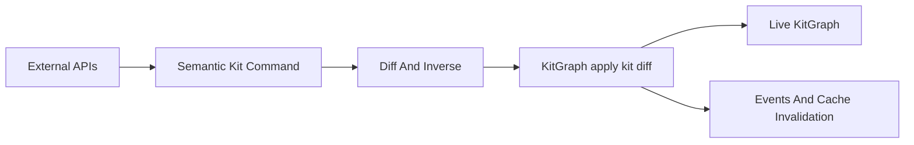

# Semantic Kit Diff Refactor

## Goal

Make [semio/rs/lib.rs](semio/rs/lib.rs) match the intended architecture:

- External mutation APIs accept semantic kit commands only.
- Semantic commands compute a `KitDiff` plus inverse metadata, but do not mutate the live graph directly.
- One central `KitGraph::apply_kit_diff` path mutates in-memory state, rewires references, emits events, and invalidates hash / validation / flatten caches.

## Implementation Plan

1. Establish the central diff writer in [semio/rs/lib.rs](semio/rs/lib.rs):
   - Add `KitGraph::apply_kit_diff(&KitGraphRef, &KitDiff) -> Result<()>` as the only live-kit mutation mechanism for kit content.
   - Reuse existing `DesignStore::apply_diff`, type diff helpers, file/folder diff helpers, and collection merge logic instead of adding parallel mutation code.
   - Apply diffs in deterministic remove, update, add order for each collection, then run one graph rewiring / event bus / cache invalidation pass.

2. Convert command execution from “apply mutates” to “compile diff”:
   - Change `ChangeKitCommand::apply` into a compatibility-internal wrapper around a new planner such as `ChangeKitCommand::to_kit_diff` / `plan` that returns `KitDiff` and inverse commands.
   - Update `ChangeKitCommand::apply_many` to merge command diffs with `KitDiff::merge`, apply once through `KitGraph::apply_kit_diff`, and return inverses in the existing undo order.
   - Update nested `ChangeTypeCommand` / `ChangeDesignCommand` paths to produce `TypeDiff` / `DesignDiff` fragments lifted into `KitDiff`, rather than directly calling setters or editing child vectors.

3. Remove external bypasses:
   - Replace `kit_graphql::GraphWork::Custom` / `CustomSetResult` mutation closures for `cluster_pieces`, `drag_pieces`, `move_pieces`, `fix_pieces`, `flatten_design`, `expand_design`, `delete_connection`, `change_piece_type`, and paste flows with semantic command variants that compile to `KitDiff`.
   - Keep read-only GraphQL queries and VCS/control-plane commands separate; only kit content mutations are forced through semantic commands.
   - Keep backbone attach/detach/conflict commands as control-plane operations, but route snapshot materialization (`apply_snap_to_graph`) through the central replacement diff path before updating history/session metadata.

4. Align transaction and VCS flows:
   - Update `TransactionCommand::ChangeKitCommands`, `KitChange::apply_forward`, `apply_backward`, and GraphQL `change_kit_with_inverse` to consume the planner result and persist existing forward/inverse command history while applying only central diffs.
   - Preserve current undo/redo behavior and `KitChangeKind` semantics while making diffs ephemeral application products.

5. Extend existing tests in [semio/rs/lib.rs](semio/rs/lib.rs):
   - Add focused tests for `KitDiff::between`, `merge`, and central apply across kit metadata, type/design add-remove-update, and nested design piece/connection changes.
   - Extend existing change-command tests to assert commands do not directly mutate outside `apply_kit_diff` behavior by comparing final DTOs and invalidation/event effects.
   - Extend GraphQL/VCS tests so former direct custom mutations work through semantic commands and still return expected results.

## Verification

Run targeted Rust tests first, then the full crate test suite:

- `cargo test --manifest-path c:\git\semio\semio\rs\Cargo.toml change_command_rt`
- `cargo test --manifest-path c:\git\semio\semio\rs\Cargo.toml events::diff_apply`
- `cargo test --manifest-path c:\git\semio\semio\rs\Cargo.toml vcs_command_tests`
- `cargo test --manifest-path c:\git\semio\semio\rs\Cargo.toml`
