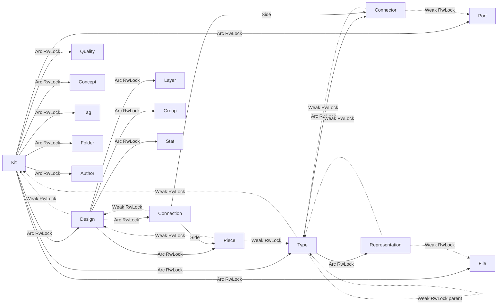

## Goals (from user)

1. Purely object-oriented: every operation is a method on the entity that owns it.
2. Lazy: derived data (hashes, flatten planes/centers, resolved connectors, validation results) computed on first access, invalidated by the owner.
3. No free pure functions (except `Default`, `From` / `Serialize` / `Deserialize` impls at the DTO boundary, and one-liner inlines forced by trait mechanics).
4. No GUIDs tracked in the in-memory graph. GUIDs remain only as stable identity on entities for (de)serialization and for the one-shot DTO→graph resolver.
5. Parents hold mutable pointers to children; children hold immutable pointers to their parent. Mutation happens at the lowest scope; it bubbles up to the parent only when it would invalidate siblings/derived data.

## Target ownership graph



Invariants:

- Only the parent ever writes the children vec (adds/removes).
- A child writes its own locked state (via `self.inner.write()`); a local edit (e.g. `Piece::set_color`) does not touch the parent.
- Any edit that would stale sibling-derived data (e.g. `Piece::set_type`, `Piece::set_plane`) takes `self.design().upgrade()` and calls `design.invalidate_flatten()`; the design in turn calls `kit.invalidate_kit_hash()`.
- `Weak<RwLock<T>>` back-refs are the _only_ way a child finds its parent; no `kit.find_by_guid`.

## High-level shape of new code

```rust
pub struct Piece {
    pub guid: Guid,
    design: Weak<RwLock<Design>>,
    type_ref: Weak<RwLock<Type>>,
    state: RwLock<PieceState>,
    hash: OnceLock<String>,
}

pub struct PieceState {
    name: Option<String>,
    plane: Option<Plane>,
    center: Option<Coord>,
    scale: Option<f64>,
    mirror_plane: Option<Plane>,
    is_hidden: Option<bool>,
    is_locked: Option<bool>,
    color: Option<String>,
    description: Option<String>,
    props: Vec<Prop>,
    attributes: Vec<Attribute>,
}

impl Piece {
    pub fn set_color(&self, color: Option<String>) { /* local-only */ }
    pub fn set_type(&self, new_type: Arc<RwLock<Type>>) { /* bubbles up */ }
    pub fn flatten_plane(&self) -> Plane { /* reads via self.design */ }
}
```

Each domain entity (`Kit`, `Type`, `Design`, `Piece`, `Connection`, `Connector`, `Representation`, `Port`, `Layer`, `Group`, `Stat`, `Quality`, `Benchmark`, `Concept`, `Tag`, `File`, `Folder`, `Author`, `Prop`, `Attribute`, `Location`, `Side`) follows the same split: immutable identity + `Weak` parent(s) + `RwLock<State>` + per-entity `OnceLock` caches.

## What gets deleted

From [`semio/rs/lib.rs`](semio/rs/lib.rs), the following is deleted outright (no deprecated wrappers):

- `mod guid_ref` + `dto_id_struct!` macro (`TypeId`, `PieceId`, `DesignId`, `ConnectorId`, `LayerId`, ...) — only DTO-level `{ guid }` shapes remain, defined inline on each DTO.
- `mod has_guid_trait` (`HasGuid`, `DiffHasGuid`) and all `impl HasGuid for X` / `impl DiffHasGuid for X` blocks.
- `mod meta_and_shallow_types` (`IdDto`, `InputDto`, `MetadataRecord`, `ShallowRecord`, `FullRecord`, `KitIdDto`, `AttributeIdDto`, ... ~25 `*IdDto` / `*InputDto` / `*MetadataDto` / `*ShallowDto` / `*FullDto` structs), `Store`/`AnyStore` trait family, and the free helpers `json_input_from`, `store_metadata_from_serializable`, `store_shallow_from_serializable`, `store_full_from_serializable`.
- `mod apply_diff`, `mod filter`, `mod find_replaceable_types_in_designs`, `mod copy_paste_design`, `mod kit_representation_export`, `mod geometric_insights`, `mod validation_types`, `mod kit_workflow`, `mod kit_kind_types`, `mod kit_diff_validation` — logic folds onto the owning entity.
- All `pub fn *_by_guid*` / `pub fn *_by_guid_mut*` on `Kit` / `Design` / `Type` (≈15 lookups). Replaced by direct pointer traversal.
- Free functions `kit_graph_change_from_diffs`, `extract_granular_events`, `commit_kit_graph_change`, `kit_diff_remove_concept`, `resolve_types_from_dto`, `merge_type_dtos`, `format_number_for_hash`, `is_supported_representation_extension`, etc.
- `mod flatten` family as free helpers: `FlattenAffine`, `FlattenGraphInner`, `FlattenPieceState`, `FlattenDesign`, `FlattenPiece` become methods/private state on `Design`.
- `Kit::content_hash`, `Design::content_hash`, `Type::content_hash` forwarding to `crate::hash_kit` / `crate::hash_design` / etc. — the `mod hash` free functions are merged into `impl Entity { fn hash() }` methods. `HashWriter` stays (tool, not pure entity logic), but becomes `Kit::hasher()` / `Design::hasher()` helpers.
- `SemioUtil` class with static free-style helpers — methods move onto the natural owner (`Kit::new_guid()`, `Quality::round`, etc.) except `generate_guid`, which becomes `Guid::new()` on a new `Guid` newtype.
- `dev_dependencies` `proptest` tests and module-internal test helpers that reach into private state via free helpers — rewritten against the OO API.

## What stays / what becomes thin

- `*Dto` structs (`KitDto`, `DesignDto`, `TypeDto`, `PieceDto`, `ConnectionDto`, ...) remain, **only** as `Serialize`/`Deserialize` shapes. They gain exactly two methods each: `impl KitDto { fn into_kit(self) -> Result<Arc<RwLock<Kit>>> }` and `impl Kit { fn to_dto(&self) -> KitDto }`. No DTO helpers, no `From<&X>` chain for domain types (those collapse into a single private resolver inside `Kit::from_dto`).
- `KitDiff` / `DesignDiff` / `PieceDiff` / ... keep their shape (they are the serialized change wire), but `apply_diff`, `validate_diff`, `inverse_forward_diff`, `diff_from` become methods on `Kit` (or on the sub-entity when a diff is local).
- `KitGraphSession` stays as the mutation transaction boundary, but its inner is `Arc<RwLock<Kit>>` instead of `Mutex<KitGraphSessionInner { kit, ... }>`. History/backbone hooks move to `impl Kit`.
- WASM bindings (`mod wasm_bindings`) stay, rewritten to call the new OO API: `Kit::from_json_str(json)?.flatten_design(guid)` etc.

## Lazy derived caches (per entity)

- `Kit`: `hash: OnceLock<String>`, `types_by_guid: OnceLock<HashMap<Guid, Weak<RwLock<Type>>>>` (internal lookup index used ONLY by the DTO resolver and diff engine, not part of the public API).
- `Design`: `hash: OnceLock<String>`, `flatten: OnceLock<FlattenSnapshot>`, `validation: OnceLock<ValidationResult>`.
- `Type`: `hash: OnceLock<String>`, `resolved_connectors: OnceLock<Vec<Weak<RwLock<Connector>>>>` (includes inherited from `parent`/`families`).
- `Piece`: `hash: OnceLock<String>`, `flat_plane: OnceLock<Plane>`, `flat_center: OnceLock<Coord>`.
- `Connection`: `hash: OnceLock<String>`, `child_plane_matrix: OnceLock<Matrix4<f64>>`.

Invalidation rule is uniform: any setter that mutates semantic state calls `self.invalidate_hash()` and `if let Some(parent) = self.parent_mut() { parent.invalidate_derived() }`. `Cell<stale>` pattern is replaced with `OnceLock` + explicit `take()` in setters (simpler, no double-check).

## Physical layout

Move from `semio/rs/lib.rs` (1 file, 27K lines) to `semio/rs/src/` with one file per concept (update `Cargo.toml` `path = "src/lib.rs"`):

- `src/lib.rs` — re-exports + `mod` declarations only.
- `src/guid.rs` — `Guid` newtype.
- `src/geom.rs` — `Coord`, `Vector`, `Plane`, `Camera`, `Location`.
- `src/attribute.rs`, `src/prop.rs`, `src/quality.rs`, `src/benchmark.rs`, `src/stat.rs`, `src/tag.rs`, `src/concept.rs`, `src/author.rs`, `src/file.rs`, `src/folder.rs` — leaf value objects.
- `src/port.rs`, `src/connector.rs`, `src/representation.rs`.
- `src/type.rs`, `src/piece.rs`, `src/connection.rs`, `src/layer.rs`, `src/group.rs`, `src/side.rs`.
- `src/design.rs`, `src/kit.rs`.
- `src/diff.rs` — `*Diff` DTOs, `KitGraphChange`, `KitGranularEvent`, all diff/validate/apply methods on entities via `impl Kit { fn apply_diff ... }` blocks in this file.
- `src/session.rs` — `KitGraphSession`, `KitBackbone`, `KitCommitOptions`.
- `src/io/json.rs`, `src/io/sqlite.rs`, `src/io/zip.rs` — persistence, each exposing `impl Kit { fn from_json_str, fn to_json_pretty, fn save_sqlite, fn load_zip }`.
- `src/hash.rs` — `HashWriter` tool (the only non-entity helper that survives).
- `src/wasm.rs` — `#[wasm_bindgen]` surface, gated on `target_arch = "wasm32"`.
- `src/tests/` — integration tests split by concern (was a single 4440-line `mod tests` block).

## Downstream impact

- [`semio/algorithms/native-bridges/rs/src/main.rs`](semio/algorithms/native-bridges/rs/src/main.rs) updated in the same commit: `req.kit.design_by_guid(&g)` → `req.kit.design(&g)` returning `Arc<RwLock<Design>>`; `design.flatten(&req.kit)` becomes `design.flatten()` (parent is reachable via `Weak`); piece/connection lookups become `design.piece(guid)` / `design.connection(guid)` which are the internal index helpers (kept for DTO-shaped input but not for graph traversal).
- [`semio/hub`](semio/hub/Cargo.toml) — does not `use semio::*` despite the dep; left untouched, builds unchanged.
- WASM surface (`generateGuid`, `serializeKit`, `deserializeKit`, `validateKit`, `areKitsEqual`, `flattenDesign`, `normalize`, `round`, `isSupportedRepresentationExtension`, `generateUniqueName`, `findTypeInKit`, `findDesignInKit`) keeps identical JS-visible names; the Rust bodies become one-liners delegating to the OO API.

## Verification

- `cargo build -p semio` and `cargo build -p semio --target wasm32-unknown-unknown`.
- `cargo test --lib -p semio` — the ~84 existing tests are ported to the new API in the same PR; red tests fail the plan.
- `cargo build -p semio-algorithms-native-bridges-rs` (name per `Cargo.toml`).
- Spot-check determinism: `Kit::from_json_str(s)?.to_json_pretty()? == s` for the bundled kit fixtures, and `kit.content_hash()` stable across reload.

## Out of scope (explicit non-goals)

- No change to JSON schema, GraphQL schema, SQLite schema, or WASM JS-visible function names.
- No change to `semio/hub`, `semio/py`, `semio/ts`, `semio/gh`, `semio/3dm`, or any non-Rust bundle.
- No switch to `tokio::sync::RwLock` — stdlib `RwLock` is enough; no code path holds a lock across `.await`.
