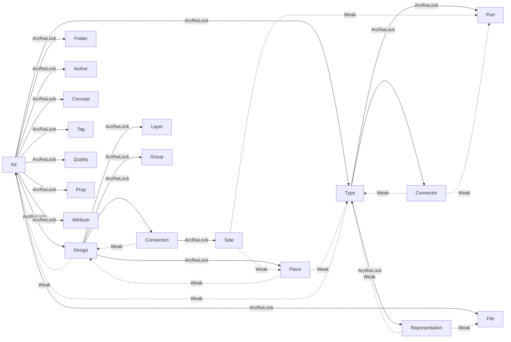

# semio-rs OO refactor

## Guiding rules (enforced across every file)

1. Per-entity surface is strictly `XStore`, `XIdDto`, `XMetadataDto`, `XShallowDto`, `XFullDto`. No `FlatPiece`, `FlattenedDesign`, `PieceState`, `KitGraphChange` side-structs, `delete_pieces_and_connections_ref`, etc.
2. Every entity lives behind `Arc<RwLock<XStore>>` with `type XStoreRef = Arc<RwLock<XStore>>` / `type XStoreWeak = Weak<RwLock<XStore>>`. No plain `Vec<XStore>` anywhere — including `Vec<AuthorStore>`, `Vec<AttributeStore>`, `Vec<PropStore>`, `Vec<StatStore>`, `Vec<TagStore>`, `Vec<ConceptStore>`, `Vec<BenchmarkStore>`. `side.rs` becomes a real entity with full DTO quintet.
3. Parents mutate children (`Arc<RwLock<Child>>` → `.write()`). Children read from parents (`Weak<RwLock<Parent>>` → upgrade + `.read()`) and call `&self` methods on them — never `.write()` a parent.
4. No free pure functions. `_keep_arc`, `DesignStore::delete_pieces_and_connections_ref(design: &DesignStoreRef, ...)`, static `hydrate_from_full_dto(..., ctx)` helpers are deleted. Only `Default`/`Serialize`/`Deserialize` trait impls and `#[wasm_bindgen]` shims may remain non-method.
5. All derived state is lazy: computed on first `&self` access, invalidated by an `invalidate_*(&self)` method that mutates through interior mutability only.

## Cache primitive (new, replaces `OnceLock`)

Add to [`semio/rs/src/hash.rs`](semio/rs/src/hash.rs) (or new `cache.rs`):

```rust
#[derive(Debug, Default)]
pub struct Cache<T: Clone> { inner: std::sync::Mutex<Option<T>> }

impl<T: Clone> Cache<T> {
    pub fn get_or_init<F: FnOnce() -> T>(&self, f: F) -> T {
        let mut g = self.inner.lock().expect("cache poisoned");
        if g.is_none() { *g = Some(f()); }
        g.clone().unwrap()
    }
    pub fn invalidate(&self) { *self.inner.lock().expect("cache poisoned") = None; }
}
```

Every entity replaces `hash_cache: OnceLock<String>` / `flat_plane: OnceLock<Plane>` with `Cache<T>`. Now `invalidate_hash(&self)` and `invalidate_flatten(&self)` take `&self`, so a child holding `Weak<RwLock<Parent>>` can do `parent.read().ok()?.invalidate_hash()` without ever acquiring a write lock on the parent.

## Uniform entity shape

```rust
pub struct XStore {
    pub guid: Guid,
    // ... fields ...
    pub children_a: Vec<ChildAStoreRef>,        // parent owns mutable
    pub child_b: Option<ChildBStoreWeak>,       // sibling pointer, read-only
    pub parent_y: Weak<RwLock<YStore>>,         // readonly back-ref
    hash_cache: Cache<String>,
    // optional entity-specific caches
}
```

Setters follow a single template:

```rust
pub fn set_color(&mut self, color: Option<String>) {
    self.color = color;
    self.invalidate_hash();
    if let Some(p) = self.parent_y.upgrade() {
        if let Ok(p) = p.read() { p.invalidate_hash(); }
    }
}
```

No setter ever calls `.write()` on a parent. Every entity gets one setter per mutable field.

## Deleted code

- [`semio/rs/src/diff.rs`](semio/rs/src/diff.rs): `_keep_arc`, `DesignStore::delete_pieces_and_connections_ref(&DesignStoreRef, ...)`.
- [`semio/rs/src/kit.rs`](semio/rs/src/kit.rs): `semio_type_mut`, `design_mut` (aliases of the read getter).
- `DesignStore::invalidate_piece_pose_caches(&mut self)` and `PieceStore::bubble_pose_invalidation_to_design(&self)` — the child-writes-parent escape hatch.
- `TypeStore::hydrate_from_full_dto(d, &Arc<RwLock<KitStore>>, &[FileStoreRef])` and `DesignStore::hydrate_from_full_dto(d, &HashMap<Guid, TypeStoreRef>)` — replaced by the OO factory described below.
- All `pub fn from_id_dto(...) -> Self` / `from_metadata_dto(...) -> Self` / `from_shallow_dto(...) -> Self` / `from_full_dto(...) -> Self` static constructors **on non-root entities**. They are replaced by `&mut self` methods on the parent (see next section). The only surviving static constructor is `KitStore::from_full_dto(d: KitFullDto) -> KitStoreRef`.

## Parent-creates-children OO factory

Every parent gets one method per child collection, returning a new `Arc<RwLock<Child>>` that is already wired (back-ref installed, pushed into the parent vec, parent hash invalidated):

```rust
impl KitStore {
    pub fn add_type(self_ref: &KitStoreRef, dto: TypeFullDto) -> TypeStoreRef { ... }
    pub fn add_design(self_ref: &KitStoreRef, dto: DesignFullDto) -> DesignStoreRef { ... }
    pub fn add_file(self_ref: &KitStoreRef, dto: FileFullDto) -> FileStoreRef { ... }
    pub fn add_folder(self_ref: &KitStoreRef, dto: FolderFullDto) -> FolderStoreRef { ... }
    pub fn add_author(self_ref: &KitStoreRef, dto: AuthorFullDto) -> AuthorStoreRef { ... }
    pub fn add_concept(...) -> ConceptStoreRef { ... }
    pub fn add_tag(...) -> TagStoreRef { ... }
    pub fn add_quality(...) -> QualityStoreRef { ... }
    pub fn add_prop(...) -> PropStoreRef { ... }
    pub fn add_attribute(...) -> AttributeStoreRef { ... }
}
```

Same pattern for `TypeStore::add_port/add_connector/add_representation/...`, `DesignStore::add_piece/add_connection/add_layer/add_group/...`, `PortStore::add_quality/add_attribute`, `ConnectionStore::add_attribute`, etc.

`KitStore::from_full_dto` is rewritten as a two-line driver that constructs an empty kit and walks the DTO tree calling `add_*`:

```rust
pub fn from_full_dto(d: KitFullDto) -> KitStoreRef {
    let kit = Arc::new(RwLock::new(KitStore::new(&d.name)));
    KitStore::populate_from_full_dto(&kit, d);
    kit
}
```

`populate_from_full_dto` is a `&KitStoreRef` method (no free function) that does two passes internally: (1) create all `TypeStore` + `FileStore` children via `add_*`, (2) create all `DesignStore` children, resolving `Weak<Type>` / `Weak<Piece>` / `Weak<Port>` by walking `kit.read().types` / `design.pieces` by GUID exactly once at hydration. Inside the graph nothing ever looks up by GUID again.

## Cache/Invalidation topology

| Entity                                                                                                        | Cache(s)                                                                                             | Invalidated when                                                             |
| ------------------------------------------------------------------------------------------------------------- | ---------------------------------------------------------------------------------------------------- | ---------------------------------------------------------------------------- |
| `AttributeStore` / `AuthorStore` / `TagStore` / `ConceptStore` / `PropStore` / `StatStore` / `BenchmarkStore` | `hash_cache`                                                                                         | any setter                                                                   |
| `QualityStore`                                                                                                | `hash_cache`                                                                                         | any setter, any `benchmarks` mutation                                        |
| `PortStore` / `ConnectorStore` / `RepresentationStore`                                                        | `hash_cache`                                                                                         | any setter, any child mutation                                               |
| `PieceStore`                                                                                                  | `hash_cache`, `flat_plane`, `flat_center`                                                            | any setter; `flat_*` invalidated when parent design's flatten is invalidated |
| `ConnectionStore`                                                                                             | `hash_cache`, `child_plane_matrix: Cache<nalgebra::Matrix4<f64>>`                                    | any setter; bubbles to design.flatten                                        |
| `TypeStore`                                                                                                   | `hash_cache`                                                                                         | any setter or child add/set                                                  |
| `DesignStore`                                                                                                 | `hash_cache`, `flatten: Cache<HashMap<Guid, (Plane, Coord)>>`, `validation: Cache<ValidationResult>` | piece/connection mutation                                                    |
| `KitStore`                                                                                                    | `hash_cache`, `validation: Cache<ValidationResult>`                                                  | anything below                                                               |

Invalidation rule: `invalidate_hash(&self)` also calls `self.parent_*.upgrade().read().invalidate_hash()` and, for pose/topology changes, `self.parent_*.upgrade().read().invalidate_flatten()`. Children only call `&self` methods on parents.

## Complete flatten (`complete_flatten` todo)

Replace the stub in [`semio/rs/src/piece.rs`](semio/rs/src/piece.rs) (`flat_plane` / `flat_center` copying the neighbour) with a proper design-level BFS cache:

- `DesignStore::flatten()` computes `HashMap<Guid, (Plane, Coord)>` by BFS over pieces, resolving parent/child connector via `Connection.connected/connecting`, then calling a private `ConnectionStore::compute_child_plane(&self, parent_plane: &Plane, parent_connector: &ConnectorStore, child_connector: &ConnectorStore) -> (Plane, Coord)` that mirrors [`semio/py/main.py`](semio/py/main.py) `computeChildPlaneDict` (gap / shift / rise / rotation / turn / tilt, port-anchored frame using `nalgebra`).
- `PieceStore::flat_plane()` and `PieceStore::flat_center()` delegate: `self.parent_design.upgrade()?.read()?.flatten().get(&self.guid)` with a small `Cache<Plane>` on the piece to avoid re-hashing the map per call.
- No `FlattenedDesign` / `FlatPiece` struct exists.

## Complete diff / apply / inverse

Move all change logic onto entities (it already lives in [`semio/rs/src/diff.rs`](semio/rs/src/diff.rs) as `impl DesignStore`, but it is incomplete). Each method takes `&mut self` on the owning entity:

```rust
impl DesignStore {
    pub fn diff_from(&self, other: &DesignStore) -> DesignDiff;
    pub fn apply_diff(&mut self, diff: &DesignDiff) -> Result<DesignChange>;
    pub fn invert_change(&self, change: &DesignChange) -> DesignChange;
    pub fn validate_change(&self, change: &DesignChange) -> ValidationResult;
}
impl KitStore {
    pub fn apply_design_diff(&mut self, design_guid: &Guid, diff: &DesignDiff) -> Result<DesignChange>;
}
```

`DesignDiff` / `DesignChange` structs stay (they are the serialized change wire, kept per question 2).

## Complete SQLite / ZIP backends

- [`semio/rs/src/io/sqlite.rs`](semio/rs/src/io/sqlite.rs): `impl KitStore { pub fn save_sqlite(&self, path: &Path) -> Result<()>; pub fn load_sqlite(path: &Path) -> Result<KitStoreRef>; }` with a normalized schema, one table per entity (guid PK, JSON payload column + FK columns for graph relations). Uses `rusqlite` (already in `Cargo.toml`).
- [`semio/rs/src/io/zip.rs`](semio/rs/src/io/zip.rs): `impl KitStore { pub fn save_zip(&self, path: &Path) -> Result<()>; pub fn load_zip(path: &Path) -> Result<KitStoreRef>; }`. Bundle = `kit.json` + `assets/<file.guid>.<ext>` for representation payloads.
- No free I/O functions; everything is `impl KitStore`.

## Complete validation

`KitStore::validate(&self) -> ValidationResult` covers:

- unique GUIDs across all entity collections,
- every `PieceStore.type_ref` and `Connection.*.port` / `.piece` is non-null after upgrade,
- every `Connection` piece pair is distinct and both pieces belong to the same design,
- every `Port.family` has matching `compatible_families` transitive closure,
- no cycles in design piece graph (BFS visited check),
- required fields non-empty (`kit.name`, `type.name`, `design.name`, `file.url`, `representation.url`).

Stored in `Cache<ValidationResult>` on `KitStore`. Invalidated by any descendant setter via the bubble chain.

## Setters per entity (complete)

Every `*Store` gets one `set_<field>(&mut self, value)` per mutable field, all following the template above. Existing partial coverage on `PieceStore` is extended to `DesignStore`, `TypeStore`, `KitStore`, `PortStore`, `ConnectorStore`, `ConnectionStore`, `RepresentationStore`, `FileStore`, `FolderStore`, `LayerStore`, `GroupStore`, `QualityStore`, `BenchmarkStore`, `AuthorStore`, `ConceptStore`, `TagStore`, `PropStore`, `StatStore`, `AttributeStore`, `SideStore`.

## WASM surface

[`semio/rs/src/wasm.rs`](semio/rs/src/wasm.rs) keeps identical JS-visible names (`generateGuid`, `kitFromJson`, `kitToJson`, `kitValidate`, `kitsAreEqual`, `flattenDesign`, `semioRound`, `semioNormalizeName`) — bodies become one-liner delegations to the new OO API.

## Tests

Move inline tests into [`semio/rs/src/tests/`](semio/rs/src/tests/) (currently empty). New integration tests, one file per concern:

- `tests/entities.rs` — round-trip each entity's `set_*` setters + hash stability.
- `tests/flatten.rs` — BFS flatten against the Python reference expectations.
- `tests/diff.rs` — `apply_diff` / `invert_change` / `diff_from` round-trip.
- `tests/validation.rs` — happy + every failure class.
- `tests/io_json.rs`, `tests/io_sqlite.rs`, `tests/io_zip.rs` — round-trip of a fixture kit.
- `tests/invalidation.rs` — child setter bubbles through to `kit.hash()` change.

## Ownership graph (unchanged shape, made uniform)



Solid = `Arc<RwLock<T>>` (parent-owned mutable); dashed = `Weak<RwLock<T>>` (child-held read-only).

## Out of scope

- No JSON / GraphQL / SQLite schema changes visible to other bundles (the new SQLite backend picks its own schema because it is new).
- No changes to `semio/py`, `semio/js`, `semio/hub`, or the WASM JS-visible names.
- No swap to `tokio::sync::RwLock` — stdlib `RwLock` remains; no locks held across `.await`.
