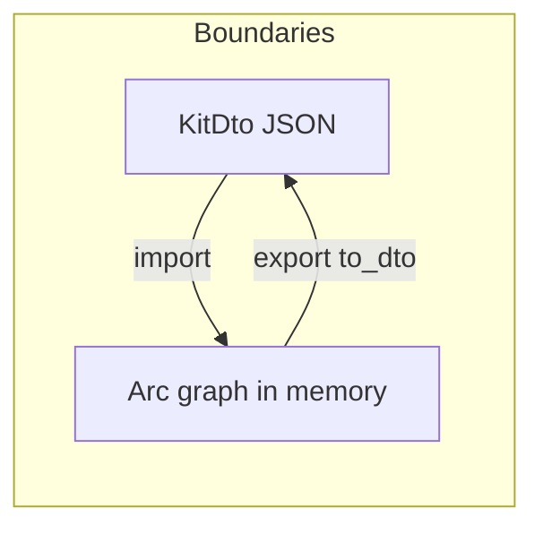

# semio/rs object-oriented refactor plan

## Current state

- Domain logic still lives primarily in a single file: [`semio/rs/lib.rs`](c:\git\semio\semio\rs\lib.rs) (~27k lines), with nested `mod` regions rather than separate `.rs` files.
- Recent work already moved delete-report logic onto [`Design`](c:\git\semio\semio\rs\lib.rs) (`delete_pieces_and_connections_report`, pointer-aware `delete_pieces_and_connections`), with [`Kit::delete_pieces_and_connections_in_design`](c:\git\semio\semio\rs\lib.rs) delegating for compatibility.
- Lazy derived geometry for flatten is already implemented in `FlattenPieceState` (`matrix_memo`, `center_memo`, `flat_center` path) inside the same file.

## Strategic goals (multi-PR / not one shot)

1. **Physical modules**: Split `lib.rs` into `semio/rs/src/` (or `semio/rs/`) modules by domain: `piece`, `design`, `kit`, `flatten`, `diff`, `hash`, `session`, backbone — each `mod foo;` + focused files. Keeps binary layout stable via crate-root `lib.rs` re-exports.
2. **Ownership rules**: Parents (`Design`, `Kit`) own mutable collections (`Arc<Piece>`, etc.); children keep `Weak<Design>` / resolved side pointers as today; expand this pattern wherever code still indexes by GUID alone.
3. **IDs vs pointers**: Keep GUIDs at **serialization / diff / GraphQL** boundaries; prefer `Arc` identity + `Weak` inside in-memory mutation paths after module split makes call sites manageable.
4. **Free functions**: Progressively fold `pub fn` helpers into `impl Type` or small **non-pure** modules (e.g. `serde` adapters only), replacing crate-root convenience fns with inherent methods + thin deprecated wrappers during transition.

## Executable batch (Phase 1 — recommended next implementation)

**Goal:** Move graph-change helpers from standalone `pub fn` to inherent methods on [`KitGraphChange`](c:\git\semio\semio\rs\lib.rs), align call sites with OO style, preserve public API.

| Item                          | Action                                                                                                                                                                                                                                                                                  |
| ----------------------------- | --------------------------------------------------------------------------------------------------------------------------------------------------------------------------------------------------------------------------------------------------------------------------------------- |
| `kit_graph_change_from_diffs` | Add `KitGraphChange::from_diffs(forward: KitDiff, backward: KitDiff) -> Self` with the same body as today’s function (~20529). Keep `pub fn kit_graph_change_from_diffs(...)` as a one-line forward (optionally `#[deprecated(note = "...")]`) so external callers do not break.        |
| `extract_granular_events`     | Move implementation to `KitGraphChange::granular_events(&self) -> Vec<KitGranularEvent>`. Replace internal uses (e.g. backbone section ~26699, tests ~27538, test harness ~25555) with `.granular_events()`. Keep `pub fn extract_granular_events` as a thin wrapper for compatibility. |
| `commit_kit_graph_change`     | Today it only forwards to [`KitGraphSession::commit`](c:\git\semio\semio\rs\lib.rs) (~21354–21360). Either document “use `session.commit`” or add an inherent alias on `KitGraphSession` (e.g. `commit_graph_change`) and deprecate the free function — avoid duplicate semantics.      |

**Verification:** `cargo test --lib -p semio` (all ~84 tests including backbone and delete tests).

## Out of scope for Phase 1 (explicitly deferred)

- Splitting the monolith into multiple files (large diff, deserves its own PR with rustfmt + mechanical moves).
- Replacing all GUID maps in flatten/validation with pointer-only structures.
- WASM / JS bindings audit (ensure any `#[wasm_bindgen]` exports still resolve if signatures change — Phase 1 keeps free-function names as wrappers to minimize risk).

## Risk notes

- **Public API:** Rust downstream crates using `semio::extract_granular_events` / `kit_graph_change_from_diffs` keep working via wrappers; new code should prefer methods.
- **Merge conflicts:** Touching `lib.rs` is high-churn; keep Phase 1 edits localized to the `KitGraphChange` block and call-site grep results.
