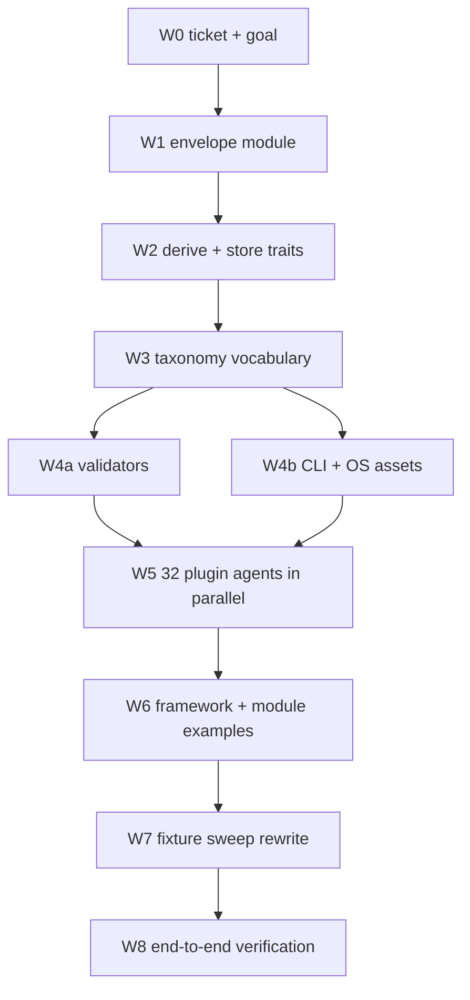

723 words

# Universal .semio Format and Artifact-Owned Examples

## Problem

Three independent defects, one root cause: format identity lives in the *filename*, and examples live at the *plugin root* instead of under the thing they exemplify.

- 116 `#[dsl(extension = "...")]` declarations mint 30+ bespoke extensions (`.gismap`, `.puzzle3d`, `.en1990`, `.spk`, `.dsl`, `.ops`). Dispatch happens by extension string in [dsl/📦️glue.rs](🧰️framework/🛍️products/💻️os/🔨️modules/🗣️dsl/⚡️implementations/🦀️rust/📦️lib.rs) (`language_for_extension`) and in the fixture sweep's hand-maintained 55-row registry.
- All ~70 example files sit at plugin root, e.g. `✏️s/🔌️plugins/🌍️gis/📚️examples/🌍️reuse.map.gismap` — not under `🗿️artifacts/🗺️gismap/`. Only `🏭️process` nests correctly. 7 plugins have no examples; **no** plugin has a pack, op, spr or cmd example anywhere.
- No `.semio` format, no content sniffing, no OS file association exist. The only content-derived identity today is the SPK magic `[0x89 S P K 0x0D 0x0A 0x1A 0x0A]` in [pack/📐️format](🧰️framework/🛍️products/💻️os/🔨️modules/🎒️pack/📐️format/⚡️implementations/🦀️rust/📦️lib.rs).

## Target Shape

```
✏️s/🔌️plugins/🌍️gis/
  🗿️artifacts/🗺️gismap/
    🦀️component.rs                       # domain model, #[dsl(id = "gis.gismap")]
    🗣️dsl/ 🎒️pack/ 🔧️op/ 📡️spr/ 🔺️diff/ ⚙️engine/   # each 🦀️component.rs (unchanged)
    📚️examples/♻️reuse/
      🗣️dsls/♻️reuse/  🦀️component.rs + 🧬️component.gis.gismap.dsl.semio
      🎒️packs/♻️reuse/ 🦀️component.rs + 🧬️component.gis.gismap.pack.semio
      🔧️ops/♻️reuse/   🦀️component.rs + 🧬️component.gis.gismap.op.semio
      📡️sprs/♻️reuse/  🦀️component.rs + 🧬️component.gis.gismap.spr.semio
  🎛️apps/◻2d/⚙️engine/📚️examples/♻️reuse/
      🦀️component.rs + 🧬️component.gis.gis2d.cmd.semio
```

The filename hierarchy is decoration. Identity comes only from content:

- **Text** (`dsl`, `op`, `cmd`) — mandatory first line `semio gis.gismap.dsl v1`.
- **Binary** (`pack`, `spr`) — generalized magic `[0x89 S E M 0x0D 0x0A 0x1A 0x0A]` then a length-prefixed envelope string `gis.gismap.pack v1`. The leading `0x89` is invalid UTF-8, so one byte discriminates binary from text.

## Mechanism Changes

- **New OS module** `🧰️framework/🛍️products/💻️os/🔨️modules/🧬️semio/` owning `SemioEnvelope { plugin, artifact, component, version }`, `Component::{Dsl,Pack,Op,Spr,Cmd}`, the text-preamble grammar, the generalized binary header, `sniff(&[u8]) -> Result<SemioEnvelope>`, a plugin-populated `FormatRegistry` keyed by envelope, and the `semio` CLI (`open`, `inspect`, `convert`, `verify`).
- **Derive + traits**: `#[dsl(extension = "gismap")]` becomes `#[dsl(id = "gis.gismap")]` in [dsl/✨️derive](🧰️framework/🛍️products/💻️os/🔨️modules/🗣️dsl/✨️derive/⚡️implementations/🦀️rust/📦️lib.rs); `DocumentDsl::EXTENSION` is replaced by `DocumentDsl::ENVELOPE`, and generated `print_dsl`/`parse_dsl` emit and consume the preamble. `DocumentPack` writes the binary envelope. `language_for_extension` is deleted in favour of `FormatRegistry::resolve`.
- **Persistence**: [🏪️store/🔄️sync](🧰️framework/🛍️products/💻️os/🔨️modules/🏪️store/🔄️sync/⚡️implementations/🦀️rust/📦️lib.rs) `FolderTextStorage` writes `<id>.<plugin>.<artifact>.{dsl,pack,op,spr}.semio`.
- **Taxonomy vocabulary** in [🔣️taxonomy.json](🧰️framework/🛍️products/🦑️repo/🔨️modules/📚️lib/⚡️implementations/🟦️typescript/🔣️taxonomy.json): add `📚️examples` to `artifactChildDirs`, new `exampleComponentDirs: ["🎒️packs","🗣️dsls","🔧️ops","📡️sprs"]`, new `appChildDirs` including `⚙️engine`, new `semioDataLeafPrefix: "🧬️component."`, and drop `📚️examples` from `rootDataDirNames`.
- **Three validators** must move in lockstep: `validateTaxonomyTree` in [registry 📜️script.ts](🧰️framework/🛍️products/💻️os/🔨️modules/🔌️plugin/⚡️implementations/🟦️typescript/📇️registry/📜️script.ts), `policyTaxonomyDirsBreaches` in the root [📜️script.ts](📜️script.ts), and `assert_taxonomy_components` in [🔌️plugin testkit](🧰️framework/🛍️products/💻️os/🔨️modules/🔌️plugin/⚡️implementations/🦀️rust/📦️lib.rs). Each gains: every artifact carries `📚️examples` with ≥1 example holding all four component collections; every app carries `⚙️engine/📚️examples`; a plugin-root `📚️examples` is a breach.
- **Fixture sweep** ([🧪️fixture-sweep](🧰️framework/🛍️products/💻️os/🔨️modules/🗣️dsl/🧪️fixture-sweep/⚡️implementations/🦀️rust/📦️lib.rs)) drops the extension registry entirely and dispatches on the sniffed envelope, so a new artifact is covered the moment its example lands.
- `Cargo.toml` workspace member, `📋️project.json`, `📜️script.ts` verb, `launch.json` entries, `.gitattributes` binary rule for `*.pack.semio`/`*.spr.semio`, and OS association assets (macOS UTType plist, Linux `shared-mime-info` XML + `.desktop`, Windows registry script) wired zero-touch and cross-platform.

## Workforce Decomposition

Waves 1–4 are serial and blocking because they rewrite shared mechanism files. Wave 5 fans out because each agent owns a disjoint plugin subtree.




Wave 5 partition — 52 artifacts and 53 apps across 32 plugins, each agent moving existing examples, authoring the missing pack/op/spr/cmd ones, wiring `#[path]` modules in the plugin's `📦️packages/🦀️rust/📦️glue.rs`, and running that plugin's `cargo test`:

- `📕️norm` (15 artifacts) splits into 3 agents by norm family.
- `🧩️puzzle`, `🧱️block`, `🌀️procedural`, `🏗️fem`, `🌍️gis`, `🔱️trinity`, `🪐️space` — one agent each (2–3 artifacts).
- Remaining single-artifact plugins batch 3–4 per agent.
- `🎪️demonstrator` and `🔋️energy` have **no artifacts at all** — one dedicated agent designs a first artifact for each with the full component set, since "every plugin defines artifacts" cannot hold otherwise.

Wave 6 covers the non-plugin corpora: `💻️os/📚️examples`, the `🌊️flow`/`🪐️space`/`🕸️dag` module examples, the `🔄️sync` `🧫️fixtures` (`.dsl`/`.ops`/`.spk` pairs), and `📐️cad`/`🧩️puzzle` fixtures.

Wave 8 confirms runtime behaviour rather than asserting it: `semio open` / `inspect` on one example of each of the five component kinds with `[DEBUG]` logs proving the envelope was derived from content with the filename ignored, then `bun script.ts verify`, `test dsl`, and `lint`.