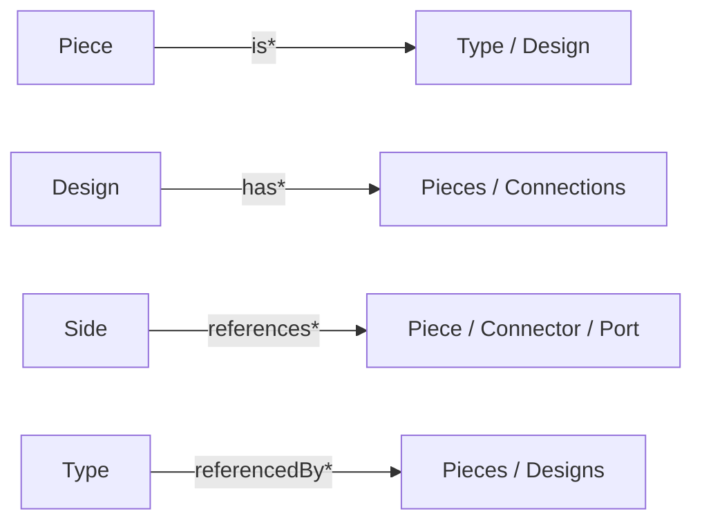

## Goal

Give every semio entity a consistent set of relationship projections, replacing the inconsistent prior attempts (`types`/`allTypes`/`referencedBy`/`allReferencedByDesigns`, Rust `direct_blueprint_*` / `transitive_reference_closure` / `referenced_by_*`).

Three forward verbs plus the existing inverse, each with a default (direct, one hop) form and a `Transitive` suffix form (follows design-piece nesting recursively):

- `is*` — a Piece's blueprint identity (Type vs Design).
- `has*` — composition / containment (entities an entity directly owns).
- `references*` — outgoing lateral references (by id) to entities elsewhere.
- `referencedBy*` — the inverse of `references*` (kept, normalized to the `Transitive` suffix convention).

Scope: `semio/client/lib/rs/lib.rs` (canonical model + GraphQL resolvers) and `semio/client/lib/js/index.ts` (client accessors). `schema.graphql` is regenerated, not hand-edited. No backward compatibility kept.

## Mechanism

- Rust is the source of truth. Each projection is an `async-graphql` resolver method on the entity object impl, backed by an in-memory accessor (`impl` method). Many accessors already exist (`direct_blueprint_types`, `transitive_reference_closure`, `referenced_by_designs_*`, `pieces_with_blueprint_*` around `lib.rs:4313-4621`, `5624-5772`) and get renamed/extended.
- `schema.graphql` regenerates via `cargo test export_semio_graphql_schema_file` (driven by [script.ts](semio/client/schema/graphql/script.ts)). Never hand-edit it.
- TypeScript mirrors each new field with a spec entry (`{ method, selection }`) consumed by `installEntityKitMethods`/`installEntityNodeMethods` ([index.ts](semio/client/lib/js/index.ts) around `1059`, `1070`); the existing `referencedBy`/`allReferencedByDesigns`/`types`/`allTypes` specs on `Design`/`Type`/`Representation` are renamed.

## Projection matrix (default = direct, plus `*Transitive`)

- Piece (`is_`/`is*`, `has_`/`has*`)
  - `isType: Type`, `isDesign: Design` (direct blueprint, nullable per XOR)
  - `isTypesTransitive: [Type]`, `isDesignsTransitive: [Design]` (expand nested design-pieces recursively)
  - `hasPieces`, `hasConnections` (direct children in the piece tree = current `childPieces`/`childConnections`)
  - `hasPiecesTransitive`, `hasConnectionsTransitive`
- Side (`references*`)
  - `referencesPiece`, `referencesConnector`, `referencesPort`, `referencesDesignPiece` (direct; current `piece`/`connector`/`port`/`designPiece`)
  - `referencesTypesTransitive` (types reachable over the referenced piece, expanding nested design-pieces), `referencesConnectorsTransitive`
- Connection (`has*`, `references*`)
  - `hasSides` (parent + child)
  - `referencesPieces`, `referencesConnectors` (direct, from the two sides)
  - `referencesPiecesTransitive`, `referencesConnectorsTransitive`
- Design (`has*`, `references*`, `referencedBy*`)
  - `hasPieces`, `hasConnections`, `hasLayers`, `hasGroups` (direct)
  - `hasPiecesTransitive`, `hasConnectionsTransitive` (expand nested designs)
  - `referencesTypes`, `referencesDesigns`, `referencesFiles`, `referencesRepresentations` (direct; replace `types`/`designs`/`files`/`representations`)
  - `referencesTypesTransitive`, `referencesDesignsTransitive`, `referencesFilesTransitive`, `referencesRepresentationsTransitive` (replace `allTypes`/`allDesigns`/`allFiles`/`allRepresentations`)
  - `referencedBy` (pieces), `referencedByDesigns`, `referencedByDesignsTransitive` (replace `allReferencedByDesigns`)
- Type (`has*`, `references*`, `referencedBy*`)
  - `hasConnectors`, `hasPorts`, `hasRepresentations` (direct; replace `connectors`/`ports`/`representations`)
  - `referencesFiles` (via representations; replace `files`)
  - `referencedBy`, `referencedByDesigns`, `referencedByDesignsTransitive`
- Representation (`referencedBy*`)
  - `referencedBy`, `referencedByDesigns`, `referencedByDesignsTransitive`
- Kit (`has*`)
  - `hasTypes`, `hasDesigns`, `hasFiles`, `hasFolders`, `hasFamilies`, `hasTypologies` (direct; rename of the plural `types`/`designs`/… connections; keep singular `type(id:)`/`design(id:)` lookups)
  - `hasPiecesTransitive`, `hasConnectionsTransitive`, `hasTypesTransitive`, `hasDesignsTransitive` (rollups across all designs, expanding nested design-pieces)

Naming follows repo rules: `kind` not `type` in code identifiers; GraphQL field names use the domain words (`Type`, `Design`) as they are first-class entity names, not the reserved generic term.

## Decisions (opinionated)

- `is*` is reserved for the Piece blueprint relation only (the one true "is-a"). A Piece's blueprint is therefore not duplicated under `references*`.
- For non-nesting entities (Type connectors/ports/representations) there is no Transitive variant (direct == transitive); we do not add redundant fields.
- The inverse family keeps the `referencedBy` name (it is genuinely distinct from the three forward verbs) but adopts the `Transitive` suffix for consistency.
- Connections returned by transitive piece/connection rollups are de-duplicated and exclude the root to avoid self-cycles (matching existing `collect_transitive_references_from_design` at `lib.rs:4388`).

## Files

- [semio/client/lib/rs/lib.rs](semio/client/lib/rs/lib.rs): rename/extend in-memory accessors and GraphQL resolvers in the `🏠 type`, `🏘 design`, `⭕ piece`, `🔗 connection`/`⛓️ side`, `📦 kit`, `💾 representation` regions; add `is_*` Piece accessors and `has_*` containment + transitive rollups. Extend the in-file Rust tests.
- [semio/client/schema/graphql/schema.graphql](semio/client/schema/graphql/schema.graphql): regenerated only.
- [semio/client/lib/js/index.ts](semio/client/lib/js/index.ts): rename/add accessor specs on `Kit`, `Design`, `Type`, `Piece`, `Side`, `Connection`, `Representation`; extend the existing "derived reference accessors" prototype tests (around `index.ts:4851`).

## Verification

- `cargo test` for `lib.rs` (model + resolver + schema-export tests) must pass.
- Regenerate `schema.graphql` and confirm the new fields/no stale `allX` names.
- TS test suite (vitest) for `index.ts` must pass, including the prototype-accessor existence tests updated to the new names.
- Open a repo ticket and associate it with the structural-consistency goal before starting; close it with the file list when done.

