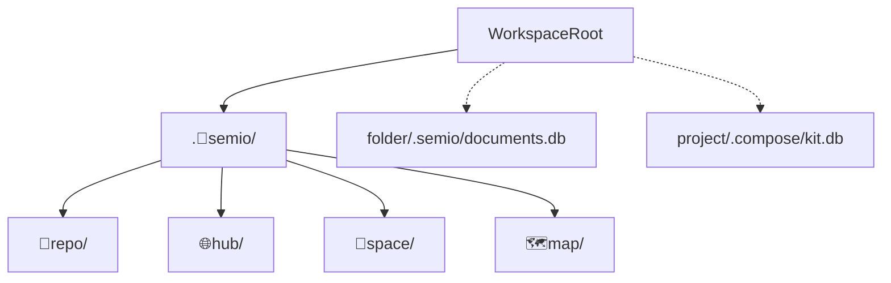

# Nest All Workspace Local Data Under `.🧬semio/`

## Goal

All **workspace-wide** local data must live under a single root:

```text
.🧬semio/
  🦑️repo/          # tickets, goals, cache, metrics, manifest, config
  🌐hub/            # hub db, directory, extension-modules
  🔗space/          # OS instance data (S_DATA_DIR)
  🗺️map/            # map/tile caches (replaces root `.repo-cache/`)
```

**Out of scope (stay co-located):**

- Per-folder VCS stores: `<folder>/.semio/documents.db`
- Per-kit compose stores: `<project>/.compose/kit.db`
- Print build artifacts: `.semio-dark`, `.semio-panel-glass`
- Tooling dirs: `.nx/`, `.venv/`, `.cargo/`, etc.

## Current State


| Store        | Today                                | Used by                                                                                                                                                               |
| ------------ | ------------------------------------ | --------------------------------------------------------------------------------------------------------------------------------------------------------------------- |
| Repo meta    | `[.🦑️repo/](.🦑️repo/)`             | Go CLI (`GetRepoMetaDir`), repo-lib TS, root `[📜️script.ts](📜️script.ts)`, VS Code extension                                                                        |
| Hub data     | `[.semio/hub-dev/](.semio/hub-dev/)` | `OS_HUB_DATA` in `[.vscode/launch.json](.vscode/launch.json)`, `[🌎️hub/📦️packages/🦀️rust/📦️bin.rs](🌎️hub/📦️packages/🦀️rust/📦️bin.rs)` default `./.semio/hub/` |
| OS instances | `[.semio/s-user1/](.semio/s-user1/)` | `S_DATA_DIR` in launch configs, OS identity/store                                                                                                                     |
| Map caches   | `[.repo-cache/](.repo-cache/)`       | openfreemap, osm-tiles                                                                                                                                                |


No walk-up discovery exists for these folders today — code finds monorepo root first, then hardcodes sibling paths. Migration is a **path-prefix change + physical move**, not a discovery redesign.

## Target Path Contract

Introduce one SSOT constant in each language:


| Constant                             | Value                                                                  |
| ------------------------------------ | ---------------------------------------------------------------------- |
| `SEMIO_ROOT` / `GetSemioRootDir()`   | `{workspaceRoot}/.🧬semio`                                             |
| `REPO_META_DIR` / `GetRepoMetaDir()` | `{SEMIO_ROOT}/🦑️repo`                                                 |
| `HUB_DATA_DIR` default               | `{SEMIO_ROOT}/🌐hub`                                                   |
| `SPACE_DATA_DIR` default             | `{SEMIO_ROOT}/🔗space/{instance}`                                      |
| Map cache base                       | `{SEMIO_ROOT}/🗺️map/{provider}/` (e.g. `openfreemap-vt`, `osm-tiles`) |


Env vars keep working but resolve under the new tree:

- `OS_HUB_DATA` → default `{SEMIO_ROOT}/🌐hub/` (launch configs use `{SEMIO_ROOT}/🌐hub/hub-dev/` for dev instances)
- `S_DATA_DIR` → default `{SEMIO_ROOT}/🔗space/s-user1` etc.
- `REPO_ROOT` unchanged (still monorepo root; only meta dir moves)




## Implementation Phases

### 1. Add path SSOT (repo product)

**Go** — `[🧰️framework/🛍️products/🦑️repo/🔨️modules/💻️client/⌨️cli/🐹️component.go](🧰️framework/🛍️products/🦑️repo/🔨️modules/💻️client/⌨️cli/🐹️component.go)`:

- Add `GetSemioRootDir() string` → `filepath.Join(GetRootDir(), ".🧬semio")`
- Change `GetRepoMetaDir()` from `".🦑️repo"` to `filepath.Join(GetSemioRootDir(), "🦑️repo")`
- All `GetRepoMetaPath`, ticket/goal/draft helpers inherit automatically

**TypeScript** — `[🧰️framework/🛍️products/🦑️repo/🔨️modules/📚️library/📦️packages/🟦️typescript/📦️index.ts](🧰️framework/🛍️products/🦑️repo/🔨️modules/📚️library/📦️packages/🟦️typescript/📦️index.ts)`:

- Export `getSemioRoot(repoRoot)` and `getRepoMetaDir(repoRoot)`
- Replace all inline `join(root, ".🦑️repo", ...)` with helpers

**Root script** — `[📜️script.ts](📜️script.ts)`:

- Import/use the same helpers for policy skips, ticket resolution, coverage, neo4j manifest paths

**Rust** — `[🧰️framework/🛍️products/🦑️repo/🔨️modules/⌨️cli/📦️packages/🦀️rust/📦️glue.rs](🧰️framework/🛍️products/🦑️repo/🔨️modules/⌨️cli/📦️packages/🦀️rust/📦️glue.rs)`:

- Update `dashboard_cache_dir` and any other `.🦑️repo` joins

### 2. Update hub and OS defaults

**Hub** — `[🌎️hub/📦️packages/🦀️rust/📦️bin.rs](🌎️hub/📦️packages/🦀️rust/📦️bin.rs)` line ~1551:

- Default `OS_HUB_DATA` from `./.semio/hub/` → `./.🧬semio/🌐hub/`

**Hub TS harness** — `[🌎️hub/📦️packages/🟦️typescript/📦️index.ts](🌎️hub/📦️packages/🟦️typescript/📦️index.ts)`: no default change needed (caller passes `dataDir`)

**OS dev** — `[🧰️framework/🛍️products/💻️os/🔨️modules/🧑️‍💻️dev/📦️packages/🟦️typescript/📜️script.ts](🧰️framework/🛍️products/💻️os/🔨️modules/🧑️‍💻️dev/📦️packages/🟦️typescript/📜️script.ts)`:

- Update `{repoRoot}/.semio/blobs.db` dev blob store → `{repoRoot}/.🧬semio/🔗space/blobs.db` (or under instance dir)

**Compose legacy hub** — `[compose/server/hub/rs/bin.rs](compose/server/hub/rs/bin.rs)`:

- Default `COMPOSE_HUB_DATA` from `./.semio/semio_compose_rs-semio_hub` → `./.🧬semio/🌐hub/compose-rs`

### 3. Update skip lists and allowlists

Replace `.🦑️repo` with `.🧬semio` (and descendants) in discovery/policy skip sets:

- `[🔍️discovery/🟦️.ts](🧰️framework/🛍️products/🦑️repo/🔨️modules/📚️library/🔍️discovery/🟦️.ts)` — `DISCOVERY_SKIP_DIRS`
- `[🗂️workspaces/🟦️.ts](🧰️framework/🛍️products/🦑️repo/🔨️modules/📚️library/🗂️workspaces/🟦️.ts)` — `WORKSPACE_SCAN_SKIP_DIR_NAMES`
- `[📦️index.ts](🧰️framework/🛍️products/🦑️repo/🔨️modules/📚️library/📦️packages/🟦️typescript/📦️index.ts)` — `ULOC_EXCLUDE_DIRS`, loc skip predicates
- `[🔌️nx-plugin.mjs](🧰️framework/🛍️products/🦑️repo/🔨️modules/📚️library/🔌️nx-plugin.mjs)`
- `[📜️script.ts](📜️script.ts)` — `POLICY_SKIP_DIRS`
- `[.dependency-cruiser.cjs](.dependency-cruiser.cjs)`
- VS Code extension `[🟦️extension.ts](🧰️framework/🛍️products/🦑️repo/🔨️modules/💻️client/🧩️vscode/📦️packages/🟦️typescript/🟦️extension.ts)` — `allowedDotDirectories`: add `.🧬semio`, remove bare `.🦑️repo`

### 4. Update configs and launch


| File                                                                 | Change                                                                                                            |
| -------------------------------------------------------------------- | ----------------------------------------------------------------------------------------------------------------- |
| `[.gitignore](.gitignore)`                                           | Ignore `.🧬semio/`; remove legacy `.repo`, `.🦑repo`, `.🦑️repo` entries; move `.repo-cache` → `.🧬semio/🗺️map/` |
| `[.vscode/settings.json](.vscode/settings.json)`                     | `cmake.buildDirectory` → `${workspaceFolder}/.🧬semio/🦑️repo/⚡️cache/cmake/${presetName}`                        |
| `[.vscode/launch.json](.vscode/launch.json)`                         | `OS_HUB_DATA` → `.🧬semio/🌐hub/hub-dev/`; `S_DATA_DIR` → `.🧬semio/🔗space/s-user{N}`                            |
| `[.vscode/🧩️launch.seed.jsonc](.vscode/🧩️launch.seed.jsonc)`       | Same path updates                                                                                                 |
| `[CMakePresets.json](CMakePresets.json)`                             | `binaryDir` prefix update                                                                                         |
| `[.devcontainer/devcontainer.json](.devcontainer/devcontainer.json)` | cmake + SQLTools paths                                                                                            |
| `[.devcontainer/post-start.sh](.devcontainer/post-start.sh)`         | manifest path under new repo meta dir                                                                             |
| `[🧪️vitest.config.ts](🧪️vitest.config.ts)`                         | exclude `.🧬semio/`                                                                                               |
| `[AGENTS.md](AGENTS.md)` / ticket path docs                          | `.🧬semio/🦑️repo/🎫️tickets/...`                                                                                 |


### 5. Map cache relocation

Find all `.repo-cache` references (likely in map/tile loading code and `[📜️script.ts](📜️script.ts)`) and point each provider to its own subtree:

```text
.🧬semio/🗺️map/openfreemap-vt/
.🧬semio/🗺️map/osm-tiles/
```

No single global cache root — each provider owns its directory under `🗺️map/`.

### 6. Physical data migration (one-time, manual)

Since this is greenfield with no backwards-compat requirement, move existing data atomically:

```bash
mkdir -p .🧬semio
mv .🦑️repo .🧬semio/🦑️repo          # if exists
mv .semio/hub-dev* .🧬semio/🌐hub/    # if exists
mv .semio/s-user* .🧬semio/🔗space/   # if exists
mv .repo-cache/* .🧬semio/🗺️map/     # provider subdirs
rmdir .semio .repo-cache              # when empty
```

Also remove the stray root stub `[🦑️repo/](🦑️repo/)` (tickets-only duplicate) after confirming contents are merged.

### 7. Sweep remaining hardcoded paths

Run targeted searches (excluding `node_modules` and ticket scratch dirs) for:

- `.🦑️repo`
- `.🦑repo`
- `.repo/`
- `.semio/hub`
- `.semio/s-user`
- `.repo-cache`

Update every hit in: bootstrap scripts, native bootstrap (`[⌨️script.sh](🧰️framework/🛍️products/🦑️repo/🔨️modules/🔩️native/🥾️bootstrap/⌨️script.sh)`), coordinator, VS Code extension, tests, READMEs.

**Do not change** `FolderSqliteStorage` paths in `[🏪️store/🔄️sync/🦀️.rs](🧰️framework/🛍️products/💻️os/🔨️modules/🏪️store/🔄️sync/🦀️.rs)` — per-folder `.semio/documents.db` stays co-located per your decision.

### 8. Verification

1. `bun ./📜️script.ts` policy/lint passes with new skip dirs
2. Repo MCP / `ticket_open` creates tickets under `.🧬semio/🦑️repo/🎫️tickets/`
3. Hub launch (`OS_HUB_DATA`) writes db under `.🧬semio/🌐hub/`
4. OS dev launch (`S_DATA_DIR`) writes identity under `.🧬semio/🔗space/s-user1/os/`
5. CMake preset builds into `.🧬semio/🦑️repo/⚡️cache/cmake/`
6. Map features write/read from `.🧬semio/🗺️map/{provider}/`
7. Discovery/workspace scans skip `.🧬semio` entirely

## Risk Notes

- **Emoji normalization**: canonical local folder names use VS16 (`🦑️repo`, `🌐hub`, `🔗space`, `🧬semio`). Do not introduce bare-emoji variants.
- **Launch config drift**: both `[launch.json](.vscode/launch.json)` and `[🧩️launch.seed.jsonc](.vscode/🧩️launch.seed.jsonc)` must stay in sync.
- **Broken symlinks under old ticket dirs**: use `find`/shell with exclusions rather than workspace Grep when validating.
- **No migration scripts**: per repo rules, hand-move data once; code only knows the new paths.

