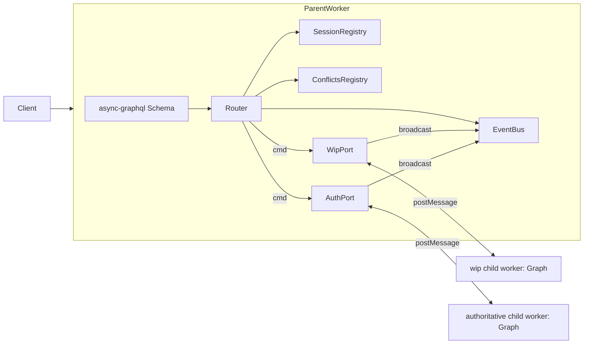

# semio/rs new architecture (greenfield skeleton + 1 end-to-end op)

All edits land inside [semio/rs/lib.rs](semio/rs/lib.rs). Nothing else (matches workspace rule: edit existing files, no new files outside ticket folders). [semio/rs/lib.old.rs](semio/rs/lib.old.rs) is left untouched as historical reference. Cargo deps (`async-graphql`, `async-broadcast`, `async-channel`, `async-executor`, `async-lock`, `futures-util`, `wasm-bindgen-futures`, `web-sys`) are already present in [semio/rs/Cargo.toml](semio/rs/Cargo.toml); add `web-sys` features `Worker`, `MessageEvent`, `DedicatedWorkerGlobalScope` (wasm32-only) — no new crates.

## 1. Module / region layout in `lib.rs`

Hierarchical `pub mod` regions (matches AGENTS.md region rule). One Rust file, but readable as a tree:

- `mod id` — `Id` (uuid v7 wrapper, `Hash`, `Display`, async `new`).
- `mod geom` — `Vector`, `Point`, `Coordinate`, `Offset`, `Plane`, `Position` (+ matching `*Input`).
- `mod meta` — `Location`, `File`, `Folder`, `Author`, `Attribute`, `Prop`, `Benchmark`, `Quality`, `Tag`, `Concept`, `Stat`, `Layer`, `Group`.
- `mod kit`
  - `mod r#type` — `Connector`, `Representation`, `Type`
  - `mod design`
    - `mod piece` — `Piece`
    - `mod connection` — `Connection`, `Side`
    - `Design`
  - `Kit`
- `mod vcs` — `Change`, `Transaction`, `Draft`, `Checkpoint`, `Alternative`, `Graph`, `Session`, `Conflict`.
- `mod op` — operation structs (`CreatedFixedPiece`, `FixedPiece`, `DraggedPiece`, `RenamedKit`, `ChangedDescription`) + their `*Input` types and the `Operation`/`OperationInput` GraphQL union/interface glue.
- `mod event` — single `KitEvent` enum + `EventBus` (the **only** `emit_event` in the codebase).
- `mod worker` — actor runtime (executor + inbound work queue + outbound event channel + parent/child wiring).
- `mod gql` — `Query`, `Mutation`, `Subscription`, schema build, parent-router routing of `wip`/`authoritative`.
- `#[cfg(target_arch = "wasm32")] mod wasm_bridge` — `wasm_bindgen` exports for parent worker and child worker entrypoints (`spawn_child`, `post_message`, `on_message`).

## 2. Entity pattern (the rule)

Every entity in `target.schema.graphql` becomes one struct named exactly like the GraphQL type (no `Store` suffix), with **two impl blocks**:

```rust
pub struct Piece {
    id: Id,
    owner: Weak<RwLock<dyn Blueprint>>,
    name: Option<String>,
    pose: Option<Position>,
    scale: Option<f64>,
    blueprint: BlueprintRef,
    parent_connection: Option<Weak<RwLock<Connection>>>,
    parent_piece: Option<Weak<RwLock<Piece>>>,
    bus: Weak<EventBus>,
    flat_pose_cache: Cache<Position>,
    hash_cache: Cache<String>,
}

impl Piece {
    pub async fn new(owner: Weak<RwLock<dyn Blueprint>>, bus: Weak<EventBus>) -> Self { ... }
    pub async fn set_pose(&mut self, pose: Position) -> Result<()> { ... }
    pub async fn flat_position(&self) -> Position { ... }
    pub async fn child_pieces(&self) -> Vec<Arc<RwLock<Piece>>> { ... }
}

#[Object]
impl Piece {
    async fn id(&self) -> Id { self.id.clone() }
    async fn hash(&self) -> String { self.compute_hash().await }
    async fn name(&self) -> Option<String> { self.name.clone() }
    async fn pose(&self) -> Option<Position> { self.pose.clone() }
    async fn flat_position(&self) -> Position { Piece::flat_position(self).await }
    async fn blueprint(&self) -> Blueprint { ... }
    async fn parent_connection(&self) -> Option<Connection> { ... }
    async fn child_pieces(&self) -> Vec<Piece> { ... }
    // ... rest of fields from `type Piece` in target.schema.graphql
}
```

Rules applied uniformly:

- All `pub fn` are `async`. Sync helpers stay private (`fn`/`pub(crate) fn`).
- The main `impl` is the Rust API (used by commands and by other entities).
- The `#[Object] impl` is **only** GraphQL resolvers; it delegates to the main impl. No business logic in `#[Object]`.
- No struct in the new code is named `*Store`.

## 3. Single `emit_event`

```rust
mod event {
    pub enum KitEvent {
        CreatedFixedPiece(op::CreatedFixedPiece),
        FixedPiece(op::FixedPiece),
        DraggedPiece(op::DraggedPiece),
        RenamedKit(op::RenamedKit),
        ChangedDescription(op::ChangedDescription),
        OperationFailed(Error),
    }

    pub struct EventBus {
        tx: async_broadcast::Sender<KitEvent>,
        rx_factory: async_broadcast::InactiveReceiver<KitEvent>,
    }

    impl EventBus {
        pub async fn emit(&self, ev: KitEvent) { let _ = self.tx.broadcast(ev).await; }
        pub fn subscribe(&self) -> async_broadcast::Receiver<KitEvent> { self.rx_factory.activate_cloned() }
    }
}
```

This is the **only** `emit*` function in the crate. Every entity that needs to fire an event holds a `Weak<EventBus>` and calls `bus.upgrade()?.emit(...).await`. A grep guard test (`#[test] fn only_one_emit_event()`) parses `lib.rs` and asserts there is exactly one `pub async fn emit` definition.

## 4. Worker topology (parent router → wip + authoritative children)



`mod worker`:

```rust
pub struct ChildPort {
    inbound: async_channel::Sender<Command>,
    outbound: async_broadcast::Receiver<KitEvent>,
}

pub struct ParentRuntime {
    bus: Arc<EventBus>,
    wip: ChildPort,
    auth: ChildPort,
    sessions: Arc<RwLock<SessionRegistry>>,
    conflicts: Arc<RwLock<ConflictsRegistry>>,
}

impl ParentRuntime {
    pub async fn spawn() -> Arc<Self> { /* spawn 2 child workers, pipe events */ }
    pub async fn dispatch_wip(&self, cmd: Command) -> Id { ... }
    pub async fn dispatch_auth(&self, cmd: Command) -> Id { ... }
}

pub struct ChildRuntime {
    graph: Arc<RwLock<Graph>>,
    bus: Arc<EventBus>,
    inbox: async_channel::Receiver<Command>,
}

impl ChildRuntime {
    pub async fn run() -> ! { /* loop: pop cmd, apply, emit */ }
}
```

`mod wasm_bridge` (wasm32 only) wires `ChildPort` ↔ `web_sys::Worker` (`postMessage`/`onmessage`), and inside each child it wires `web_sys::DedicatedWorkerGlobalScope` ↔ `ChildRuntime::inbox`. On native targets, both child runtimes are spawned on the same `async_executor::Executor` so tests run without workers.

## 5. GraphQL roots (mirror `target.schema.graphql`)

```rust
pub struct Query;
#[Object]
impl Query {
    async fn session(&self, ctx: &Context<'_>) -> Session { ... }
    async fn wip(&self, ctx: &Context<'_>) -> Graph { ctx.data::<Arc<ParentRuntime>>()?.wip_graph().await }
    async fn authoritative(&self, ctx: &Context<'_>) -> Option<Graph> { ... }
    async fn conflicts(&self, ctx: &Context<'_>) -> Vec<Conflict> { ... }
}

pub struct Mutation;
#[Object]
impl Mutation {
    async fn create_fixed_piece(&self, ctx: &Context<'_>,
        draft_id: Id, transaction_id: Id, design_id: Id,
        pose: PositionInput, name: Option<String>, description: Option<String>) -> Id {
        let rt = ctx.data::<Arc<ParentRuntime>>()?;
        rt.dispatch_wip(Command::CreateFixedPiece { draft_id, transaction_id, design_id, pose: pose.into(), name, description }).await
    }
    async fn rename_kit(&self, ...) -> Id { ... }       // stub: enqueue + return id
    async fn change_description(&self, ...) -> Id { ... }
    async fn fix_piece(&self, ...) -> Id { ... }
}

pub struct Subscription;
#[Subscription]
impl Subscription {
    async fn created_fixed_piece(&self, ctx: &Context<'_>) -> impl Stream<Item = CreatedFixedPiece> {
        let bus = ctx.data::<Arc<EventBus>>().unwrap().clone();
        async_stream::stream! {
            let mut rx = bus.subscribe();
            while let Ok(ev) = rx.recv().await {
                if let KitEvent::CreatedFixedPiece(op) = ev { yield op; }
            }
        }
    }
    async fn command_succeeded(...) -> impl Stream<Item = ...>; // similar pattern
    async fn operation_succeeded(...) -> impl Stream<Item = ...>;
    async fn operation_failed(...) -> impl Stream<Item = Error>;
    async fn fixed_piece(...) -> impl Stream<Item = FixedPiece>; // stub: same pattern, only created_fixed_piece is end-to-end wired
    async fn dragged_piece(...) -> impl Stream<Item = DraggedPiece>;
    async fn description_changed(...) -> impl Stream<Item = ChangedDescription>;
    async fn kit_renamed(...) -> impl Stream<Item = RenamedKit>;
    async fn error(...) -> impl Stream<Item = Error>;
}
```

`Operation` interface and `OperationInput`/`Blueprint`/`ChangeOwner` unions use `#[derive(Interface)]` / `#[derive(Union)]` from `async-graphql`.

## 6. End-to-end reference flow: `createFixedPiece`

Other ops (`fixPiece`, `draggedPiece`, `renameKit`, `changeDescription`) are **stubs only** in this round (struct + Object impl + subscription + mutation that enqueues, but no diff/apply yet). `createFixedPiece` is fully wired:

1. **Mutation entrypoint** ([Query/Mutation root above]) takes args, builds `Command::CreateFixedPiece`, calls `ParentRuntime::dispatch_wip`. Returns the new `Operation` `Id` immediately.
2. **Parent router** pushes the command onto the wip child's `async_channel::Sender<Command>`.
3. **Child runtime loop** in `ChildRuntime::run`:

```rust
while let Ok(cmd) = self.inbox.recv().await {
    match cmd {
        Command::CreateFixedPiece { draft_id, transaction_id, design_id, pose, name, description, request_id } => {
            let op = self.graph.write().await
                .apply_create_fixed_piece(draft_id, transaction_id, design_id, pose, name, description, request_id).await?;
            self.bus.emit(KitEvent::CreatedFixedPiece(op)).await;
        }
        // other commands ...
    }
}
```

4. **`Graph::apply_create_fixed_piece`** (in `mod vcs`):
   - Locates draft + open transaction.
   - Calls the pure forward fn `op::CreatedFixedPiece::forward(input) -> (KitDiff, Piece)`.
   - Applies the diff to `the_kit` clone (centralised `apply_diff`, the only path that mutates `Kit` graph state).
   - Records inverse diff into the transaction.
   - Returns the constructed `CreatedFixedPiece` operation entity.
5. **EventBus.emit** (single emit point) broadcasts.
6. **Parent worker** is already subscribed to the child outbound and re-broadcasts on its own `EventBus`; subscriptions in the schema are fed from the parent bus.
7. **Subscriber** receives `CreatedFixedPiece` GraphQL object; resolves `piece`, `diff`, `input`, `owner` via the normal `#[Object] impl`.

## 7. Tests (extend, don't add files — per AGENTS.md)

In-file `#[cfg(test)] mod tests`:

- `parses_target_schema()` — builds the schema and `assert!(schema.sdl()` contains the key types from [target.schema.graphql](semio/graphql/target.schema.graphql)).
- `single_emit_event_in_codebase()` — text-scan guard.
- `create_fixed_piece_end_to_end()` — spawn `ParentRuntime` (native path, in-process executor), open session+draft+transaction, run the GraphQL mutation, await the `createdFixedPiece` subscription, assert `Piece` exists in `wip` graph.
- `wip_and_authoritative_are_isolated()` — applying a command on wip does not surface on authoritative.

## 8. Out of scope (explicitly deferred)

- Porting change-commands, diff merge, flatten algorithm, hash computation, VCS persistence, backbone (dev/local/remote), conflict resolution from [semio/rs/lib.old.rs](semio/rs/lib.old.rs). These remain in `lib.old.rs` and will be ported in follow-up tickets onto this skeleton.
- All `Operation` types other than `CreatedFixedPiece` are skeleton-only.
- No JS bridge changes ([semio/js](semio/js)) — that follows the strict layering rule once the GraphQL surface stabilises.
